# Technical Design: LLM Gateway


<!-- toc -->

- [1. Architecture Overview](#1-architecture-overview)
  - [1.1 Architectural Vision](#11-architectural-vision)
  - [1.2 Architecture Drivers](#12-architecture-drivers)
  - [1.3 Architecture Layers](#13-architecture-layers)
- [2. Principles & Constraints](#2-principles--constraints)
  - [2.1 Design Principles](#21-design-principles)
  - [2.2 Constraints](#22-constraints)
- [3. Technical Architecture](#3-technical-architecture)
  - [3.1 Domain Model](#31-domain-model)
  - [3.2 Component Model](#32-component-model)
  - [3.3 API Contracts](#33-api-contracts)
  - [3.4 Interactions & Sequences](#34-interactions--sequences)
  - [3.5 Database schemas & tables](#35-database-schemas--tables)
  - [3.6: Topology (optional)](#36-topology-optional)
  - [3.7: Tech stack (optional)](#37-tech-stack-optional)
- [4. Additional Context](#4-additional-context)
- [5. Traceability](#5-traceability)

<!-- /toc -->

## 1. Architecture Overview

### 1.1 Architectural Vision

LLM Gateway provides unified access to multiple LLM providers. Consumers interact with a single interface regardless of underlying provider.

The external API follows the [Open Responses](https://www.openresponses.org/) protocol — an open specification based on the OpenAI Responses API. Open Responses uses an items-based response model where each response contains typed output items (message, function_call, reasoning) that are extensible via provider-specific item types. See [ADR-0005](./ADR/0005-cpt-cf-llm-gateway-adr-open-responses-protocol.md) for the protocol selection rationale.

The architecture follows a pass-through design: Gateway normalizes requests and responses but does not interpret content or execute tools. Provider-specific adapters handle translation to/from each provider's native API format into the Open Responses protocol. All external calls route through Outbound API Gateway for credential injection and circuit breaking. Gateway also performs health-based routing using Model Registry metrics — see [ADR-0004](./ADR/0004-cpt-cf-llm-gateway-adr-circuit-breaking.md) for the distinction between infrastructure-level circuit breaking (OAGW) and business-level health routing (Gateway).

The system is horizontally scalable and stateless. No conversation history is stored; consumers provide full context with each request (or reference a previous response via `previous_response_id` for context chaining). The only state is temporary async job tracking, which can be stored in distributed cache.

### 1.2 Architecture Drivers

#### Product requirements

See [PRD.md](./PRD.md) section 1 "Overview" — Key Problems Solved:
- Provider fragmentation
- Governance
- Security

#### Functional requirements

| Cypilot ID | Solution short description |
|--------|----------------------------|
| `cpt-cf-llm-gateway-fr-chat-completion-v1` | Provider adapters + Outbound API GW |
| `cpt-cf-llm-gateway-fr-streaming-v1` | SSE pass-through via adapters |
| `cpt-cf-llm-gateway-fr-embeddings-v1` | Provider adapters + Outbound API GW |
| `cpt-cf-llm-gateway-fr-vision-v1` | FileStorage fetch + provider adapters |
| `cpt-cf-llm-gateway-fr-image-generation-v1` | Provider adapters + FileStorage store |
| `cpt-cf-llm-gateway-fr-speech-to-text-v1` | FileStorage fetch + provider adapters |
| `cpt-cf-llm-gateway-fr-text-to-speech-v1` | Provider adapters + FileStorage store |
| `cpt-cf-llm-gateway-fr-video-understanding-v1` | FileStorage fetch + provider adapters |
| `cpt-cf-llm-gateway-fr-video-generation-v1` | Provider adapters + FileStorage store |
| `cpt-cf-llm-gateway-fr-tool-calling-v1` | Type Registry resolution + format conversion |
| `cpt-cf-llm-gateway-fr-structured-output-v1` | Schema validation |
| `cpt-cf-llm-gateway-fr-document-understanding-v1` | FileStorage fetch + provider adapters |
| `cpt-cf-llm-gateway-fr-async-jobs-v1` | Distributed cache for job state, polling abstraction |
| `cpt-cf-llm-gateway-fr-realtime-audio-v1` | WebSocket proxy via Outbound API GW |
| `cpt-cf-llm-gateway-fr-usage-tracking-v1` | Usage Tracker module integration |
| `cpt-cf-llm-gateway-fr-provider-fallback-v1` | Fallback chain from request config |
| `cpt-cf-llm-gateway-fr-timeout-v1` | TTFT + total timeout tracking |
| `cpt-cf-llm-gateway-fr-pre-call-interceptor-v1` | Hook Plugin pre_call invocation |
| `cpt-cf-llm-gateway-fr-post-response-interceptor-v1` | Hook Plugin post_response invocation |
| `cpt-cf-llm-gateway-fr-budget-enforcement-v1` | Usage Tracker check_budget / report_usage |
| `cpt-cf-llm-gateway-fr-rate-limiting-v1` | Distributed rate limiter |
| `cpt-cf-llm-gateway-fr-batch-processing-v1` | Provider batch API abstraction |
| `cpt-cf-llm-gateway-fr-audit-events-v1` | Audit Module event emission |

#### Non-functional requirements

| Cypilot ID | Solution short description |
|--------|----------------------------|
| `cpt-cf-llm-gateway-nfr-scalability-v1` | Stateless design, distributed cache for async jobs |

#### Key ADRs

| ADR ID | Decision Summary |
|--------|------------------|
| `cpt-cf-llm-gateway-adr-stateless` | Stateless gateway design for horizontal scalability |
| `cpt-cf-llm-gateway-adr-pass-through` | Pass-through content processing, no tool execution |
| `cpt-cf-llm-gateway-adr-file-storage` | FileStorage for all media handling |
| `cpt-cf-llm-gateway-adr-circuit-breaking` | Circuit breaking at OAGW + health-based routing at Gateway |
| `cpt-cf-llm-gateway-adr-open-responses-protocol` | Open Responses protocol for LLM completion requests |

### 1.3 Architecture Layers

| Layer | Responsibility | Technology |
|-------|---------------|------------|
| API | Request/response handling, validation | REST/OpenAPI |
| Application | Request orchestration, provider routing | Core services |
| Adapters | Provider-specific translation | Provider adapters |
| Infrastructure | External calls, caching | Outbound API GW, distributed cache |

## 2. Principles & Constraints

### 2.1 Design Principles

#### Stateless

**ID**: `cpt-cf-llm-gateway-principle-stateless`

**ADRs**: `cpt-cf-llm-gateway-adr-stateless`

Gateway does not store conversation history. Consumer provides full context with each request. Exception: temporary async job state.

#### Pass-through

**ID**: `cpt-cf-llm-gateway-principle-pass-through`

**ADRs**: `cpt-cf-llm-gateway-adr-pass-through`

Gateway normalizes but does not interpret content. Tool execution and response parsing are consumer responsibility.

### 2.2 Constraints

#### Provider Rate Limits

**ID**: `cpt-cf-llm-gateway-constraint-provider-rate-limits`

Gateway is subject to provider TPM/RPM quotas. Cannot exceed limits imposed by external providers.

#### Provider Context Windows

**ID**: `cpt-cf-llm-gateway-constraint-provider-context-windows`

Request size limited by provider context window. Gateway cannot send requests exceeding provider limits.

#### Outbound API Gateway Dependency

**ID**: `cpt-cf-llm-gateway-constraint-outbound-dependency`

All external API calls must route through Outbound API Gateway. Direct provider calls are not permitted.

#### No Credential Storage

**ID**: `cpt-cf-llm-gateway-constraint-no-credentials`

Gateway does not store provider credentials. Credential injection handled by Outbound API Gateway.

#### Content Logging Restrictions

**ID**: `cpt-cf-llm-gateway-constraint-content-logging`

Full request/response content is not logged due to PII concerns. Only metadata (tokens, latency, model, tenant) is logged.

## 3. Technical Architecture

### 3.1 Domain Model

**Technology**: GTS (JSON Schema), aligned with [Open Responses specification](https://www.openresponses.org/specification)

**Location**: [`llm-gateway-sdk/schemas/`](../llm-gateway-sdk/schemas/)

**ADRs**: `cpt-cf-llm-gateway-adr-open-responses-protocol`

The domain model follows the Open Responses protocol. All polymorphic types use GTS type inheritance with a single base type and concrete subtypes discriminated by the `type` field. The core abstraction is the **item** — an atomic unit of context representing messages, tool invocations, or reasoning state. A single `Item` base type is used for both input and output: output items produced by a response can be passed back as input items in subsequent requests.

**Core Entities**:

*Request/Response (`core/`):*
- CreateResponseBody — Request to create a response (model, input, instructions, previous_response_id, include, tools, tool_choice, parallel_tool_calls, text, reasoning, temperature, top_p, max_output_tokens, max_tool_calls, presence_penalty, frequency_penalty, top_logprobs, truncation, stream, stream_options, background, store, service_tier, metadata, safety_identifier, prompt_cache_key). additionalProperties: false
- ResponseResource — Response object (id, object: "response", created_at, completed_at, status, incomplete_details, model, previous_response_id, instructions, output, error, tools, tool_choice, truncation, parallel_tool_calls, text, top_p, presence_penalty, frequency_penalty, top_logprobs, temperature, reasoning, usage, max_output_tokens, max_tool_calls, store, background, service_tier, metadata, safety_identifier, prompt_cache_key). Status: queued | in_progress | completed | incomplete | failed. All fields required, additionalProperties: false
- EmbeddingRequest — Embedding request (model, input, dimensions, encoding_format). Not part of Open Responses — Gateway-specific endpoint
- EmbeddingResponse — Embedding response (model, data[], usage). Not part of Open Responses — Gateway-specific endpoint
- Usage — Token counts (input_tokens, output_tokens, total_tokens, input_tokens_details: {cached_tokens}, output_tokens_details: {reasoning_tokens})
- Error — Error object (message, type, param, code)

*Items (`items/`):*

All items share a single base type (`Item`) with GTS type inheritance, discriminated by `type` field. The base type defines common optional fields: `id` (string|null) and `status` (string|null, enum: in_progress | completed | incomplete). Output items produced by a response can be passed back as input items in subsequent requests.

Input-oriented items (consumer → model):
- MessageItem — Conversation message (type: "message", role: user | system | developer | assistant, content: string | ContentPart[])
- FunctionCallOutputItem — Tool result from consumer (type: "function_call_output", call_id, output: string | ContentPart[])
- ItemReference — Reference to item from previous response (type: "item_reference", id)
- ReasoningItem — Reasoning context to include (type: "reasoning", summary, encrypted_content, content: null)

Bidirectional items (used as both input context and output):
- FunctionCallItem — Tool invocation (type: "function_call", call_id, name, arguments). As output: id and status are required. As input: id and status are optional.

Output-oriented items (model → consumer):
- MessageOutput — Model message (type: "message", id, status, role: user | assistant | system | developer, content: OutputContentPart[])
- ReasoningOutput — Model reasoning (type: "reasoning", id, summary, content: ReasoningText[] | null, encrypted_content)

Provider-specific items use extension format: `{provider_slug}:{item_type}` (e.g., `openai:web_search_call`).

*Content Parts (`content/`):*

Content parts compose message items. Discriminated by `type` field.

Input content (consumer → model):
- InputText — (type: "input_text", text)
- InputImage — Image from FileStorage (type: "input_image", url | file_id, detail)
- InputFile — Document from FileStorage (type: "input_file", url | file_id, filename)
- InputAudio — Audio from FileStorage (type: "input_audio", url | data, format)
- InputVideo — Video from FileStorage (type: "input_video", url | file_id)

Output content (model → consumer):
- OutputText — Generated text (type: "output_text", text, annotations[], logprobs)
- Refusal — Model refusal (type: "refusal", refusal)

Annotations:
- UrlCitation — Citation in output text (type: "url_citation", url, title, start_index, end_index)

*Tools (`tools/`):*

Tool definitions share a single base type (`Tool`) with GTS type inheritance, discriminated by `type` field. The Open Responses `function` tool type is the standard. Gateway extends with CyberFabric-specific tool types for GTS Type Registry integration.

- FunctionTool — Function definition (type: "function", name, description, parameters: JSONSchema, strict: boolean). Open Responses standard.
- ToolReference — CyberFabric extension: reference to Type Registry (type: "reference", schema_id). Gateway resolves schema_id via Type Registry before forwarding to provider.
- ToolInlineGTS — CyberFabric extension: inline GTS schema (type: "inline_gts", schema). Gateway resolves GTS schema to JSON Schema before forwarding.

Tool control:
- tool_choice: "auto" (default) | "required" | "none" | {type: "function", name: string}
- parallel_tool_calls: boolean — whether model can issue multiple tool calls in parallel

*Text Format & Reasoning:*

- TextFormat — Response format control (format: text | json_object | json_schema)
  - text: plain text output (default)
  - json_object: JSON output
  - json_schema: structured output with schema (name, description, schema: JSONSchema, strict: boolean)
- ReasoningConfig — Reasoning control (effort: "none" | "low" | "medium" | "high" | "xhigh", summary: "concise" | "detailed" | "auto")

*Async (`async/`):*

Not part of the Open Responses specification. Gateway-specific endpoints for long-running operations.

- Job — Async job (id, status, request, result, error, created_at, expires_at)
- Batch — Batch request (id, status, requests[], created_at)
- BatchRequest — Individual batch item (custom_id, request, result, error)
- JobStatus — Enum: pending, running, completed, failed, cancelled
- BatchStatus — Enum: pending, in_progress, completed, failed, cancelled

**Relationships**:
- CreateResponseBody → Item: contains 0..* (input)
- CreateResponseBody → Tool: contains 0..* (tools)
- CreateResponseBody → TextFormat: optional (text)
- CreateResponseBody → ReasoningConfig: optional (reasoning)
- CreateResponseBody → ResponseResource: optional (previous_response_id)
- ResponseResource → Item: contains 0..* (output)
- ResponseResource → Tool: contains 0..* (tools, echoed back)
- ResponseResource → TextFormat: optional (text, echoed back)
- ResponseResource → ReasoningConfig: optional (reasoning, echoed back)
- ResponseResource → Usage: contains 0..1
- ResponseResource → Error: optional
- MessageItem → ContentPart: contains 1..*
- MessageOutput → OutputContentPart: contains 0..*
- OutputText → UrlCitation: contains 0..* (annotations)
- Item ← MessageItem, FunctionCallItem, FunctionCallOutputItem, ItemReference, ReasoningItem, MessageOutput, ReasoningOutput
- Tool ← FunctionTool, ToolReference, ToolInlineGTS
- ContentPart ← InputText, InputImage, InputFile, InputAudio, InputVideo
- OutputContentPart ← OutputText, Refusal
- EmbeddingRequest → Usage: returns
- EmbeddingResponse → Usage: contains
- Job → JobStatus: has
- Job → CreateResponseBody: references
- Job → ResponseResource: optional result
- Job → Error: optional
- Batch → BatchStatus: has
- Batch → BatchRequest: contains 1..*

### 3.2 Component Model

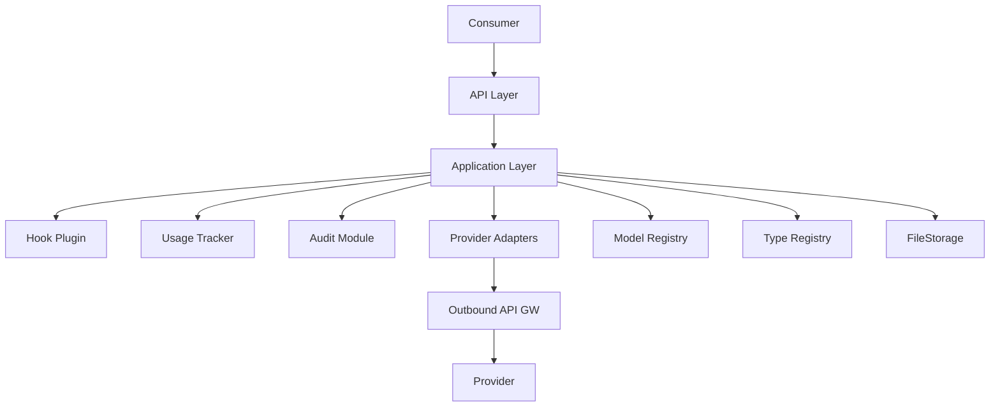

**Components**:
 - [ ] `p1` - **ID**: `cpt-cf-llm-gateway-component-api-layer`
   - API Layer
   - Request/response handling, validation, routing
 - [ ] `p1` - **ID**: `cpt-cf-llm-gateway-component-application-layer`
   - Application Layer
   - Request orchestration, provider selection, response normalization
 - [ ] `p1` - **ID**: `cpt-cf-llm-gateway-component-provider-adapters`
   - Provider Adapters
   - Provider-specific request/response translation
 - [ ] `p1` - **ID**: `cpt-cf-llm-gateway-component-hook-plugin`
   - Hook Plugin
   - Pre-call and post-response interception (moderation, PII, transformation)
 - [ ] `p1` - **ID**: `cpt-cf-llm-gateway-component-usage-tracker`
   - Usage Tracker
   - Budget checks and usage reporting
 - [ ] `p1` - **ID**: `cpt-cf-llm-gateway-component-audit-module`
   - Audit Module
   - Compliance event logging

**Interactions**:
- Consumer → API Layer: Normalized requests
- Application Layer → Model Registry: Model resolution and availability check
- Application Layer → Type Registry: Tool schema resolution
- Application Layer → FileStorage: Media fetch/store
- Provider Adapters → Outbound API GW: Provider API calls

**Dependencies**:

| Dependency | Role |
|------------|------|
| Model Registry | Model catalog, availability checks |
| Outbound API Gateway | External API calls to providers |
| FileStorage | Media storage and retrieval |
| Type Registry | Tool schema resolution |

### 3.3 API Contracts

**Technology**: REST/OpenAPI, [Open Responses protocol](https://www.openresponses.org/specification)

**ADRs**: `cpt-cf-llm-gateway-adr-open-responses-protocol`

**Endpoints Overview**:

*Open Responses endpoints:*
- `POST /responses` — Create a response (sync, streaming, or background)

*Gateway-specific endpoints (not part of Open Responses):*
- `POST /embeddings` — Embeddings generation
- `GET /jobs/{id}` — Get job status/result
- `DELETE /jobs/{id}` — Cancel job
- `POST /batches` — Create batch
- `GET /batches/{id}` — Get batch status/results
- `WS /realtime` — Realtime audio session

**Request Format** (`POST /responses`):

```json
{
  "model": "string | null",
  "input": "string | Item[] | null",
  "instructions": "string | null",
  "previous_response_id": "string | null",
  "include": ["reasoning.encrypted_content", "message.output_text.logprobs"],
  "tools": [{"type": "function", "name": "...", "parameters": {}}],
  "tool_choice": "auto | required | none | {type, name}",
  "parallel_tool_calls": true,
  "text": {"format": {"type": "text | json_object | json_schema"}},
  "reasoning": {"effort": "medium", "summary": "auto"},
  "temperature": 1.0,
  "top_p": 1.0,
  "max_output_tokens": null,
  "max_tool_calls": null,
  "presence_penalty": null,
  "frequency_penalty": null,
  "top_logprobs": null,
  "truncation": "disabled",
  "stream": false,
  "stream_options": {"include_usage": true},
  "background": false,
  "store": true,
  "service_tier": "auto",
  "metadata": {},
  "safety_identifier": "string | null",
  "prompt_cache_key": "string | null"
}
```

**Response Format** (`ResponseResource`):

```json
{
  "id": "resp_abc123",
  "object": "response",
  "created_at": 1234567890,
  "completed_at": 1234567891,
  "status": "completed",
  "incomplete_details": null,
  "model": "string",
  "previous_response_id": null,
  "instructions": null,
  "output": [
    {
      "type": "message",
      "id": "msg_abc123",
      "role": "assistant",
      "status": "completed",
      "content": [{"type": "output_text", "text": "Hello world"}]
    }
  ],
  "error": null,
  "tools": [],
  "tool_choice": "auto",
  "truncation": "disabled",
  "parallel_tool_calls": true,
  "text": {"format": {"type": "text"}},
  "top_p": 1.0,
  "presence_penalty": 0.0,
  "frequency_penalty": 0.0,
  "top_logprobs": 0,
  "temperature": 1.0,
  "reasoning": null,
  "usage": {
    "input_tokens": 10,
    "output_tokens": 5,
    "total_tokens": 15,
    "input_tokens_details": {"cached_tokens": 0},
    "output_tokens_details": {"reasoning_tokens": 0}
  },
  "max_output_tokens": null,
  "max_tool_calls": null,
  "store": true,
  "background": false,
  "service_tier": "auto",
  "metadata": {},
  "safety_identifier": null,
  "prompt_cache_key": null
}
```

**Error Format** (Open Responses):

```json
{
  "error": {
    "message": "string",
    "type": "invalid_request | not_found | server_error | model_error | too_many_requests",
    "param": "string | null",
    "code": "string"
  }
}
```

Gateway-specific error codes (mapped to Open Responses `code` field):

| Code | Type | Description |
|------|------|-------------|
| `model_not_found` | `not_found` | Model not in catalog |
| `model_not_approved` | `invalid_request` | Model not approved for tenant |
| `validation_error` | `invalid_request` | Invalid request format |
| `capability_not_supported` | `invalid_request` | Model lacks required capability |
| `budget_exceeded` | `invalid_request` | Tenant budget exhausted |
| `rate_limited` | `too_many_requests` | Rate limit exceeded |
| `request_blocked` | `invalid_request` | Blocked by pre-call hook |
| `response_blocked` | `server_error` | Blocked by post-response hook |
| `provider_error` | `model_error` | Provider returned error |
| `provider_timeout` | `server_error` | Provider request timed out |
| `job_not_found` | `not_found` | Job ID does not exist |
| `job_expired` | `not_found` | Job result TTL exceeded |

**Streaming Contract**:

Streaming responses use Server-Sent Events (SSE) format following the Open Responses protocol. Each event has a named `event` field and JSON `data` payload with a `sequence_number` for ordering. The stream terminates with a `data: [DONE]` event.

Event types:

| Event | Description |
|-------|-------------|
| `response.created` | Response object created |
| `response.queued` | Response queued for processing |
| `response.in_progress` | Model processing started |
| `response.completed` | All output items completed |
| `response.failed` | Response failed with error |
| `response.incomplete` | Response ended due to token budget |
| `response.output_item.added` | New output item started (message, function_call, reasoning) |
| `response.output_item.done` | Output item completed |
| `response.content_part.added` | New content part started within an item |
| `response.content_part.done` | Content part completed |
| `response.output_text.delta` | Text content delta (incremental text) |
| `response.function_call_arguments.delta` | Function call arguments delta (incremental JSON) |
| `response.reasoning_summary_part.added` | Reasoning summary part started |
| `response.reasoning_summary_part.done` | Reasoning summary part completed |

Format:

```text
event: response.created
data: {"type":"response.created","sequence_number":0,"response":{"id":"resp_abc","status":"in_progress","model":"gpt-4","output":[]}}

event: response.output_item.added
data: {"type":"response.output_item.added","sequence_number":1,"output_index":0,"item":{"type":"message","id":"msg_abc","role":"assistant","status":"in_progress","content":[]}}

event: response.content_part.added
data: {"type":"response.content_part.added","sequence_number":2,"output_index":0,"content_index":0,"part":{"type":"output_text","text":""}}

event: response.output_text.delta
data: {"type":"response.output_text.delta","sequence_number":3,"output_index":0,"content_index":0,"delta":"Hello"}

event: response.output_text.delta
data: {"type":"response.output_text.delta","sequence_number":4,"output_index":0,"content_index":0,"delta":" world"}

event: response.content_part.done
data: {"type":"response.content_part.done","sequence_number":5,"output_index":0,"content_index":0,"part":{"type":"output_text","text":"Hello world"}}

event: response.output_item.done
data: {"type":"response.output_item.done","sequence_number":6,"output_index":0,"item":{"type":"message","id":"msg_abc","role":"assistant","status":"completed","content":[{"type":"output_text","text":"Hello world"}]}}

event: response.completed
data: {"type":"response.completed","sequence_number":7,"response":{"id":"resp_abc","status":"completed","output":[...],"usage":{"input_tokens":10,"output_tokens":5,"total_tokens":15}}}

data: [DONE]
```

Key streaming semantics:
- `sequence_number` is monotonically increasing across all events in a stream
- `output_index` identifies which output item the event belongs to
- `content_index` identifies which content part within an item
- Item lifecycle: added → content deltas → done
- Response lifecycle: created → queued → in_progress → completed | failed | incomplete
- Provider-specific streaming events use extension format: `{provider_slug}:{event_type}`

### 3.4 Interactions & Sequences

> **Note**: In the sequence diagrams below, "LLM Gateway" (GW) represents the full gateway stack including Provider Adapters. In practice, the Application Layer delegates to provider-specific adapters, which then call Outbound API Gateway. This is simplified for diagram readability. See Component Model (section 3.2) for the detailed layer structure.

#### Provider Resolution

- [ ] `p1` - **ID**: `cpt-cf-llm-gateway-seq-provider-resolution-v1`

This sequence is used by all request flows to resolve the target provider. Other diagrams show "Resolve provider" as a simplified step — this is the detailed flow.

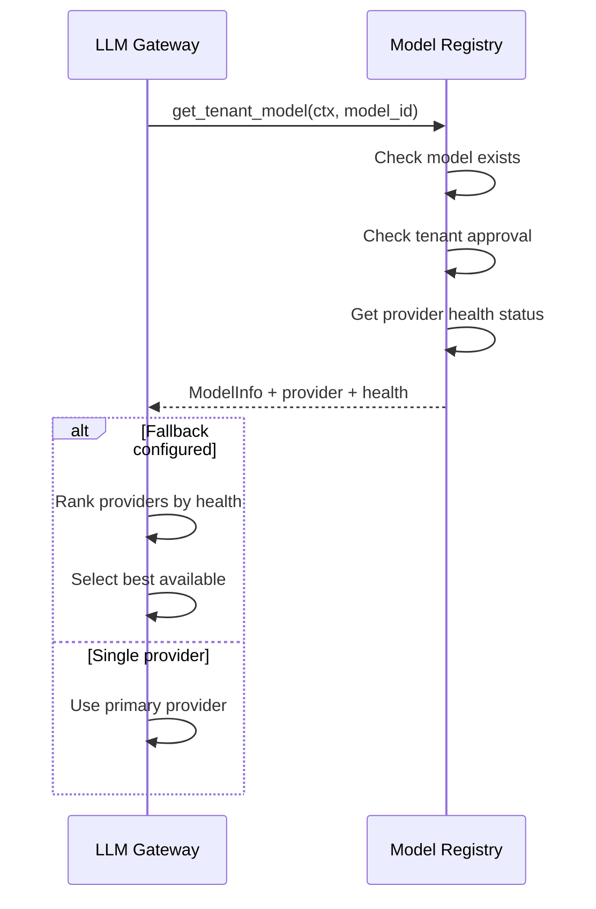

**Resolution outcomes**:
- `model_not_found` — model not in catalog
- `model_not_approved` — model not approved for tenant
- `model_deprecated` — model sunset by provider
- Success — returns provider endpoint + health metrics

#### Create Response (Sync)

**Use cases**: `cpt-cf-llm-gateway-usecase-chat-completion-v1`
**Actors**: `cpt-cf-llm-gateway-actor-consumer`

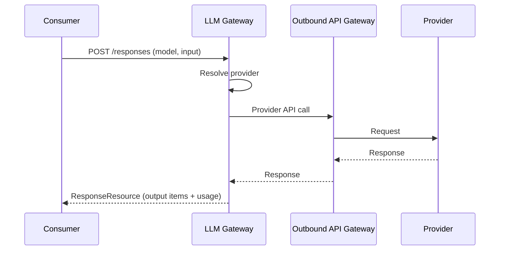

#### Create Response (Streaming)

**Use cases**: `cpt-cf-llm-gateway-usecase-streaming-v1`
**Actors**: `cpt-cf-llm-gateway-actor-consumer`

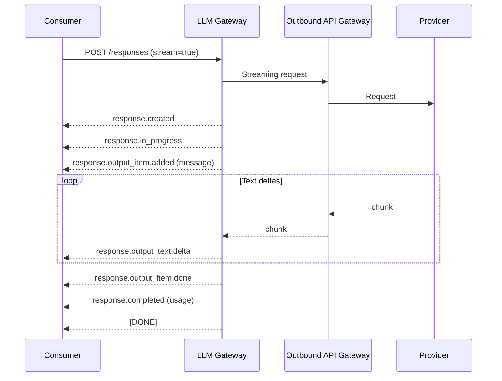

#### Embeddings Generation

**Use cases**: `cpt-cf-llm-gateway-usecase-embeddings-v1`
**Actors**: `cpt-cf-llm-gateway-actor-consumer`

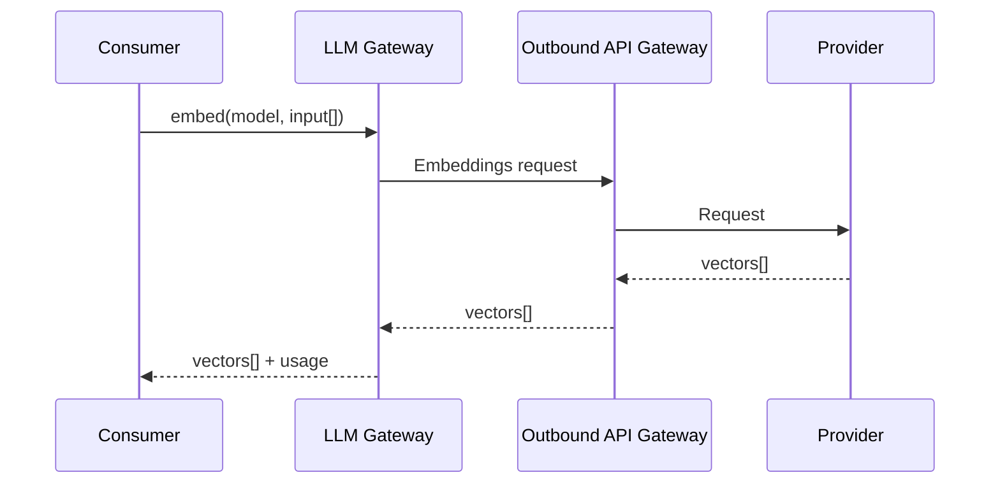

#### Vision (Image Analysis)

**Use cases**: `cpt-cf-llm-gateway-usecase-vision-v1`
**Actors**: `cpt-cf-llm-gateway-actor-consumer`


#### Image Generation

**Use cases**: `cpt-cf-llm-gateway-usecase-image-generation-v1`
**Actors**: `cpt-cf-llm-gateway-actor-consumer`

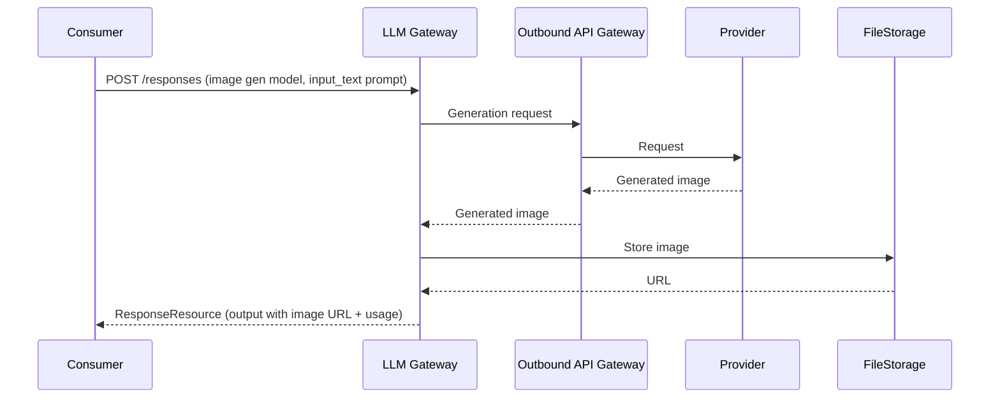

#### Speech-to-Text

**Use cases**: `cpt-cf-llm-gateway-usecase-speech-to-text-v1`
**Actors**: `cpt-cf-llm-gateway-actor-consumer`


#### Text-to-Speech

**Use cases**: `cpt-cf-llm-gateway-usecase-text-to-speech-v1`
**Actors**: `cpt-cf-llm-gateway-actor-consumer`

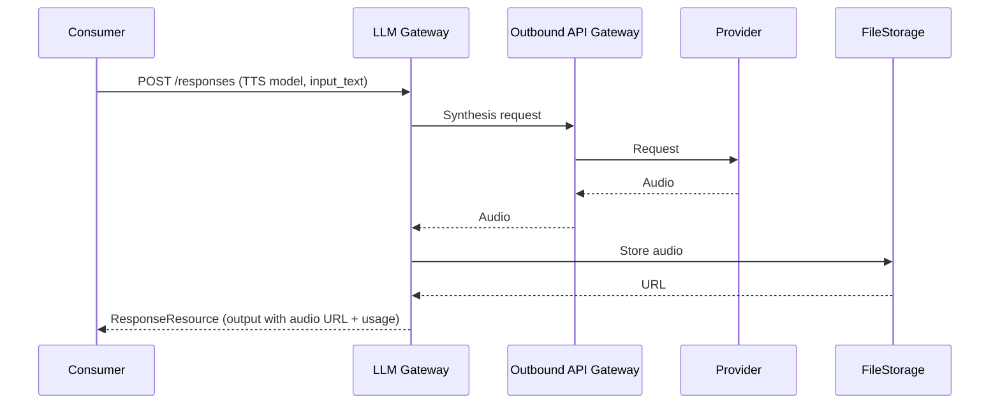

#### Video Understanding

**Use cases**: `cpt-cf-llm-gateway-usecase-video-understanding-v1`
**Actors**: `cpt-cf-llm-gateway-actor-consumer`


#### Video Generation

**Use cases**: `cpt-cf-llm-gateway-usecase-video-generation-v1`
**Actors**: `cpt-cf-llm-gateway-actor-consumer`

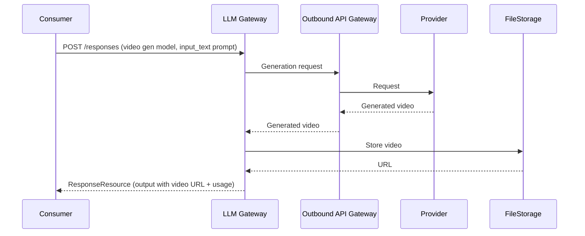

#### Tool/Function Calling

**Use cases**: `cpt-cf-llm-gateway-usecase-tool-calling-v1`
**Actors**: `cpt-cf-llm-gateway-actor-consumer`

In the Open Responses protocol, tool calls are represented as `function_call` output items. The consumer provides tool results as `function_call_output` input items in the follow-up request, referencing the previous response via `previous_response_id`.

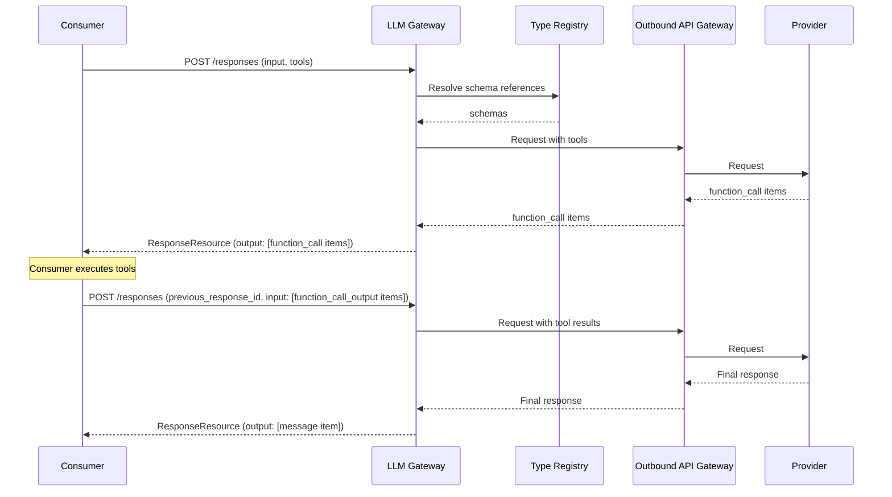

#### Structured Output

**Use cases**: `cpt-cf-llm-gateway-usecase-structured-output-v1`
**Actors**: `cpt-cf-llm-gateway-actor-consumer`

Structured output is controlled via the `text.format` parameter using `json_schema` type.

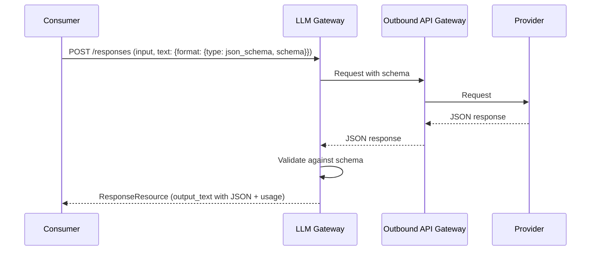

#### Document Understanding

**Use cases**: `cpt-cf-llm-gateway-usecase-document-understanding-v1`
**Actors**: `cpt-cf-llm-gateway-actor-consumer`

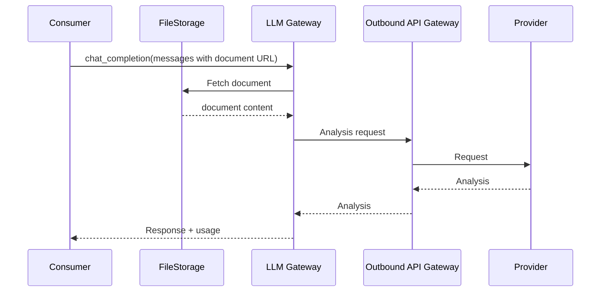

#### Async Jobs / Background Mode

**Use cases**: `cpt-cf-llm-gateway-usecase-async-jobs-v1`
**Actors**: `cpt-cf-llm-gateway-actor-consumer`

Open Responses supports `background: true` for async processing. The Gateway uses `POST /responses` with `background: true` to start a background job. Job status and results can be retrieved via `GET /jobs/{id}`, and jobs can be cancelled via `DELETE /jobs/{id}`.

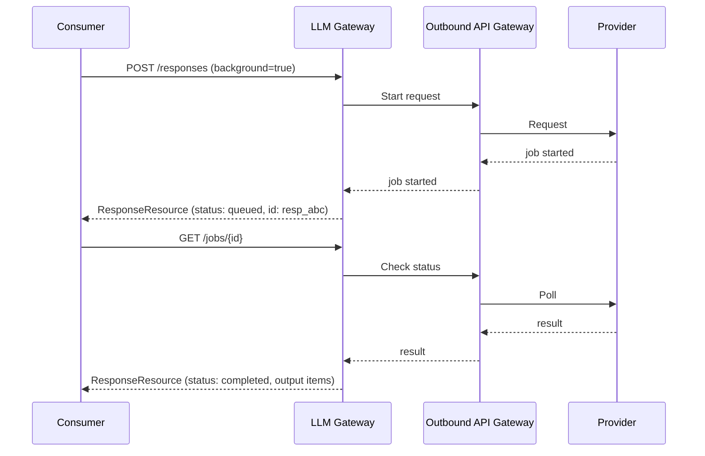

#### Realtime Audio

**Use cases**: `cpt-cf-llm-gateway-usecase-realtime-audio-v1`
**Actors**: `cpt-cf-llm-gateway-actor-consumer`

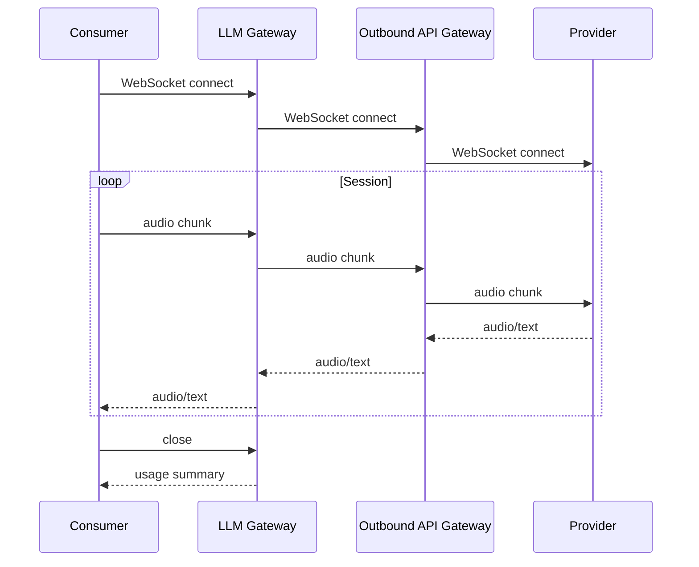

#### Provider Fallback

**Use cases**: `cpt-cf-llm-gateway-usecase-provider-fallback-v1`
**Actors**: `cpt-cf-llm-gateway-actor-consumer`

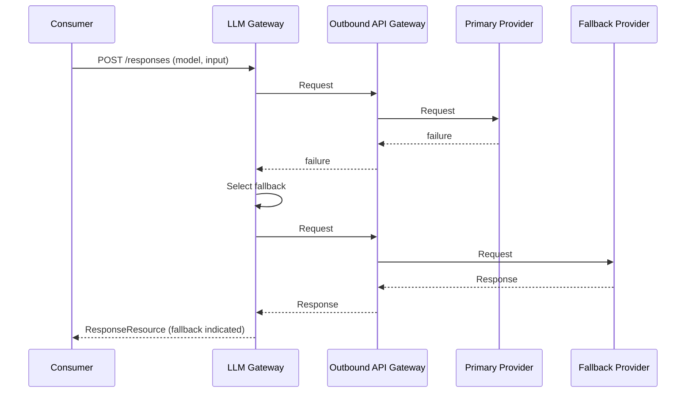

#### Timeout Enforcement

**Use cases**: `cpt-cf-llm-gateway-usecase-timeout-v1`
**Actors**: `cpt-cf-llm-gateway-actor-consumer`

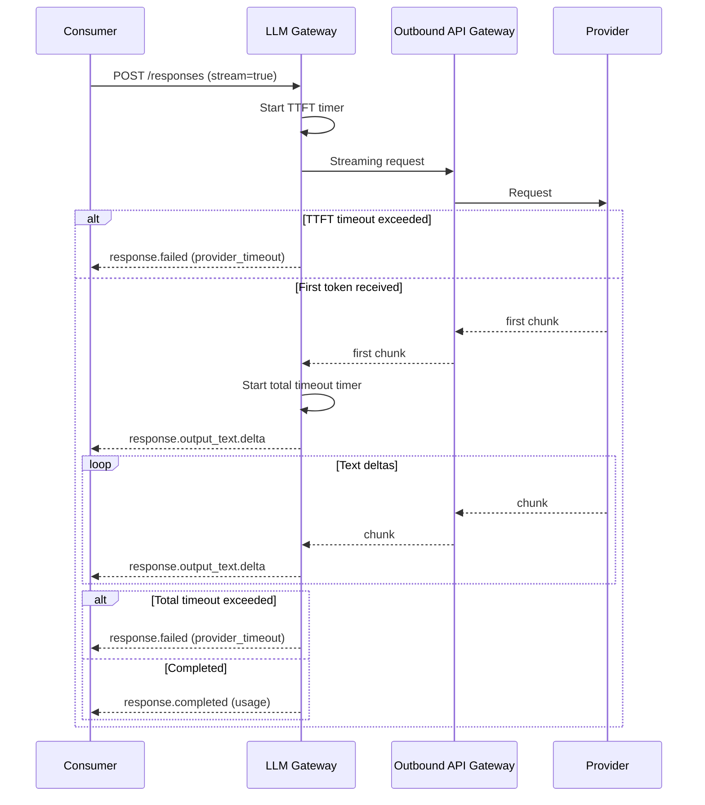

#### Pre-Call Interceptor

**Use cases**: `cpt-cf-llm-gateway-usecase-pre-call-interceptor-v1`
**Actors**: `cpt-cf-llm-gateway-actor-consumer`

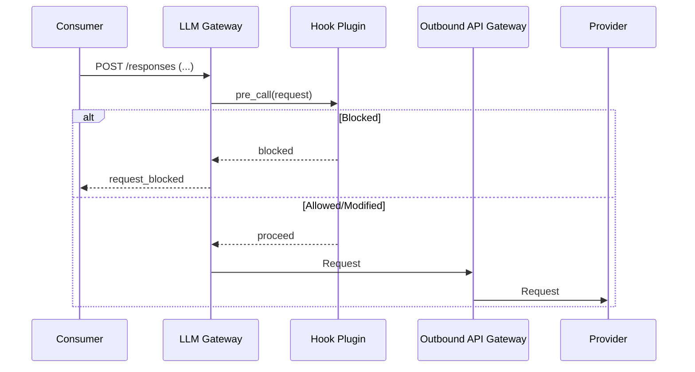

#### Post-Response Interceptor

**Use cases**: `cpt-cf-llm-gateway-usecase-post-response-interceptor-v1`
**Actors**: `cpt-cf-llm-gateway-actor-consumer`

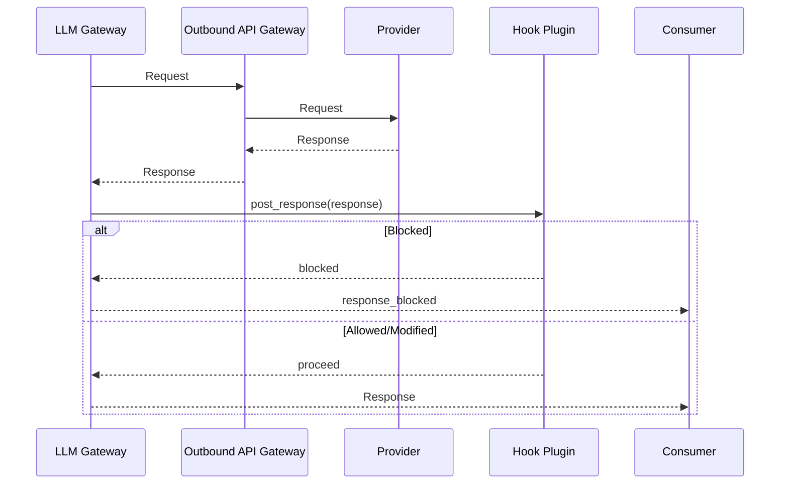

#### Rate Limiting

**Use cases**: `cpt-cf-llm-gateway-usecase-rate-limiting-v1`
**Actors**: `cpt-cf-llm-gateway-actor-consumer`

```mermaid
sequenceDiagram
    participant C as Consumer
    participant GW as LLM Gateway
    participant OB as Outbound API Gateway
    participant P as Provider

    C->>GW: POST /responses (...)
    GW->>GW: Check rate limits
    alt Limit exceeded
        GW-->>C: rate_limited
    else Within limits
        GW->>OB: Request
        OB->>P: Request
        P-->>OB: Response
        OB-->>GW: Response
        GW-->>C: Response
    end
```

#### Budget Enforcement

**Use cases**: `cpt-cf-llm-gateway-fr-budget-enforcement-v1`
**Actors**: `cpt-cf-llm-gateway-actor-consumer`, `cpt-cf-llm-gateway-actor-usage-tracker`

```mermaid
sequenceDiagram
    participant C as Consumer
    participant GW as LLM Gateway
    participant UT as Usage Tracker
    participant OB as Outbound API Gateway
    participant P as Provider

    C->>GW: POST /responses (...)
    GW->>UT: check_budget(tenant, model)
    alt Budget exceeded
        UT-->>GW: budget_exceeded
        GW-->>C: budget_exceeded
    else Budget available
        UT-->>GW: ok (remaining quota)
        GW->>OB: Request
        OB->>P: Request
        P-->>OB: Response
        OB-->>GW: Response
        GW->>UT: report_usage(tenant, model, tokens)
        UT-->>GW: ok
        GW-->>C: Response
    end
```

**Budget enforcement flow**:
1. **Pre-request check**: Gateway calls `check_budget()` before processing
2. **Reject if exceeded**: Returns `budget_exceeded` error immediately
3. **Process request**: If budget available, proceed with provider call
4. **Report usage**: After response, report actual token usage to Usage Tracker
5. **Usage Tracker**: Maintains running totals per tenant/model, enforces configured limits

#### Batch Processing

**Use cases**: `cpt-cf-llm-gateway-usecase-batch-processing-v1`
**Actors**: `cpt-cf-llm-gateway-actor-consumer`

```mermaid
sequenceDiagram
    participant C as Consumer
    participant GW as LLM Gateway
    participant OB as Outbound API Gateway
    participant P as Provider

    C->>GW: create_batch(requests[])
    GW->>OB: Submit batch
    OB->>P: Provider batch API
    P-->>OB: batch_id
    OB-->>GW: batch_id
    GW-->>C: batch_id

    C->>GW: get_batch(batch_id)
    GW->>OB: Check status
    OB->>P: Poll batch
    P-->>OB: status + results[]
    OB-->>GW: status + results[]
    GW-->>C: status + results[]
```

**Tenant isolation**: Gateway is stateless, but batch metadata is stored in distributed cache:
- On `create_batch`: Gateway stores `{batch_id → tenant_id, provider_batch_id, created_at}` in cache
- On `get_batch`: Gateway retrieves tenant_id from cache, validates caller has access
- Cache TTL matches batch expiration policy

This is the same pattern used for async jobs (see ADR-0001).

### 3.5 Database schemas & tables

<!-- Not applicable - Gateway is stateless except for temporary async job state -->

### 3.6: Topology (optional)

<!-- To be defined during implementation -->

### 3.7: Tech stack (optional)

<!-- To be defined during implementation -->

## 4. Additional Context

<!-- To be added as needed -->

## 5. Traceability
