# Technical Design: LLM Gateway


<!-- toc -->

- [1. Architecture Overview](#1-architecture-overview)
  - [1.1 Architectural Vision](#11-architectural-vision)
  - [1.2 Architecture Drivers](#12-architecture-drivers)
  - [1.3 Architecture Layers](#13-architecture-layers)
- [2. Principles & Constraints](#2-principles--constraints)
  - [2.1 Design Principles](#21-design-principles)
  - [2.2 Constraints](#22-constraints)
- [3. Technical Architecture](#3-technical-architecture)
  - [3.1 Domain Model](#31-domain-model)
  - [3.2 Component Model](#32-component-model)
  - [3.3 API Contracts](#33-api-contracts)
  - [3.4 Interactions & Sequences](#34-interactions--sequences)
  - [3.5 Database schemas & tables](#35-database-schemas--tables)
  - [3.6 Observability Metrics](#36-observability-metrics)
- [4. Additional Context](#4-additional-context)
  - [4.1 Quality Attribute Coverage](#41-quality-attribute-coverage)
- [5. Traceability](#5-traceability)

<!-- /toc -->

## 1. Architecture Overview

### 1.1 Architectural Vision

LLM Gateway provides unified access to multiple LLM providers. Consumers interact with a single interface regardless of underlying provider.

The external API follows the [Open Responses](https://www.openresponses.org/) protocol — an open specification based on the OpenAI Responses API. Open Responses uses an items-based response model where each response contains typed output items (message, function_call, reasoning) that are extensible via provider-specific item types. See [ADR-0005](./ADR/0005-cpt-cf-llm-gateway-adr-open-responses-protocol.md) for the protocol selection rationale.

Gateway normalizes requests and responses into the Open Responses protocol but does not interpret content or execute tools. Provider-specific adapters handle translation to/from each provider's native API format. All external calls route through Outbound API Gateway for credential injection and circuit breaking. Gateway also performs health-based routing using Model Registry metrics — see [ADR-0004](./ADR/0004-cpt-cf-llm-gateway-adr-circuit-breaking.md) for the distinction between infrastructure-level circuit breaking (OAGW) and business-level health routing (Gateway).

The system is horizontally scalable and stateless for request processing — no conversation history is stored; consumers provide full context with each request. Server-side response storage (`store`) and conversation continuation (`previous_response_id`) from the Open Responses protocol are not supported — see [ADR-0007](./ADR/0007-cpt-cf-llm-gateway-adr-no-stored-responses.md) for rationale. Gateway does persist operational state in a database: async/batch job records (ID mappings, status, results) retained until their TTL expires. Guaranteed at-least-once delivery of usage records is handled by the Usage Tracker SDK.

### 1.2 Architecture Drivers

#### Product requirements

See [PRD.md](./PRD.md) section 1 "Overview" — Key Problems Solved:
- Provider fragmentation
- Governance
- Security

#### Functional requirements

| Cypilot ID | Solution short description |
|--------|----------------------------|
| `cpt-cf-llm-gateway-fr-chat-completion-v1` | Provider adapters + Outbound API GW |
| `cpt-cf-llm-gateway-fr-streaming-v1` | SSE streaming forwarded by adapters |
| `cpt-cf-llm-gateway-fr-embeddings-v1` | Provider adapters + Outbound API GW |
| `cpt-cf-llm-gateway-fr-vision-v1` | FileStorage fetch + provider adapters |
| `cpt-cf-llm-gateway-fr-image-generation-v1` | Provider adapters + FileStorage store |
| `cpt-cf-llm-gateway-fr-speech-to-text-v1` | FileStorage fetch + provider adapters |
| `cpt-cf-llm-gateway-fr-text-to-speech-v1` | Provider adapters + FileStorage store |
| `cpt-cf-llm-gateway-fr-video-understanding-v1` | FileStorage fetch + provider adapters |
| `cpt-cf-llm-gateway-fr-video-generation-v1` | Provider adapters + FileStorage store |
| `cpt-cf-llm-gateway-fr-tool-calling-v1` | Type Registry resolution + format conversion |
| `cpt-cf-llm-gateway-fr-structured-output-v1` | Schema validation |
| `cpt-cf-llm-gateway-fr-document-understanding-v1` | FileStorage fetch + provider adapters |
| `cpt-cf-llm-gateway-fr-async-jobs-v1` | Persistent DB for job state, polling abstraction |
| `cpt-cf-llm-gateway-fr-realtime-audio-v1` | WebSocket proxy via Outbound API GW |
| `cpt-cf-llm-gateway-fr-usage-tracking-v1` | AI credit reporting via Usage Tracker (tokens→credits conversion using Model Registry prices) |
| `cpt-cf-llm-gateway-fr-model-capability-check-v1` | Model capability validation via Model Registry before provider dispatch |
| `cpt-cf-llm-gateway-fr-provider-fallback-v1` | Fallback chain from request config |
| `cpt-cf-llm-gateway-fr-timeout-v1` | TTFT + total timeout tracking |
| `cpt-cf-llm-gateway-fr-pre-call-interceptor-v1` | Hook Plugin pre_call invocation |
| `cpt-cf-llm-gateway-fr-post-response-interceptor-v1` | Hook Plugin post_response invocation |
| `cpt-cf-llm-gateway-fr-budget-enforcement-v1` | Quota Manager check_quota + Usage Tracker report_usage (AI credits) |
| `cpt-cf-llm-gateway-fr-rate-limiting-v1` | Distributed rate limiter |
| `cpt-cf-llm-gateway-fr-batch-processing-v1` | Provider batch API abstraction |
| `cpt-cf-llm-gateway-fr-audit-events-v1` | Audit Module event emission |

#### NFR Allocation

| NFR ID | NFR Summary | Allocated To | Design Response | Verification Approach |
|--------|-------------|--------------|-----------------|----------------------|
| `cpt-cf-llm-gateway-nfr-scalability-v1` | Horizontal scaling without per-instance coordination | `cpt-cf-llm-gateway-component-application-layer` | Stateless request processing; async/batch job state in shared DB accessible by any instance | Load test: N instances serve concurrent requests; job polling works cross-instance after restart |
| `cpt-cf-llm-gateway-nfr-data-retention-v1` | TTL-based lifecycle for job/batch records | `cpt-cf-llm-gateway-component-application-layer` (background purge task), `cpt-cf-llm-gateway-db-persistence` | `expires_at` column on `jobs` and `batches` tables; background purge task deletes rows where `expires_at < now()` | DB audit: no row older than max TTL after purge cycle; purge task execution observable via structured logs |
| `cpt-cf-llm-gateway-nfr-recovery-v1` | Restart survivability for in-flight async jobs | `cpt-cf-llm-gateway-component-application-layer`, `cpt-cf-llm-gateway-db-persistence` | Native async: `provider_job_id` persisted before returning to consumer; polling resumes after restart (RPO: 0). Simulated async: marked `failed` on restart to prevent unauthorized token spending | Restart test: native jobs resume polling; simulated jobs returned as `failed` with appropriate error |
| `cpt-cf-llm-gateway-nfr-compatibility-v1` | API backward compatibility within major version | `cpt-cf-llm-gateway-component-api-layer` | Additive-only changes within major version; inter-module communication via SDK traits only (no internal type coupling) | Regression test suite runs on each release; breaking changes require major version bump |
| `cpt-cf-llm-gateway-nfr-observability-v1` | OpenTelemetry operational metrics for request lifecycle | `cpt-cf-llm-gateway-component-application-layer` | Counters and histograms emitted at key processing points (request completion, fallback, stream abort, hook block, budget ops, schema validation, TTFT); labels bounded to enumerable dimensions | Metrics endpoint returns expected metric names; integration test triggers each metric and verifies counter increment / histogram observation |

#### Key ADRs

| ADR ID | Decision Summary |
|--------|------------------|
| `cpt-cf-llm-gateway-adr-stateless` | Stateless gateway design for horizontal scalability |
| `cpt-cf-llm-gateway-adr-pass-through` | Content normalization without interpretation; tool execution is consumer responsibility |
| `cpt-cf-llm-gateway-adr-file-storage` | FileStorage for all media handling |
| `cpt-cf-llm-gateway-adr-circuit-breaking` | Circuit breaking at OAGW + health-based routing at Gateway |
| `cpt-cf-llm-gateway-adr-open-responses-protocol` | Open Responses protocol for LLM completion requests |
| `cpt-cf-llm-gateway-adr-image-generation-api` | Responses API with custom CyberFabric extensions for image generation |
| `cpt-cf-llm-gateway-adr-no-stored-responses` | No support for `store=true` or `previous_response_id` — stateless design preserved |

### 1.3 Architecture Layers

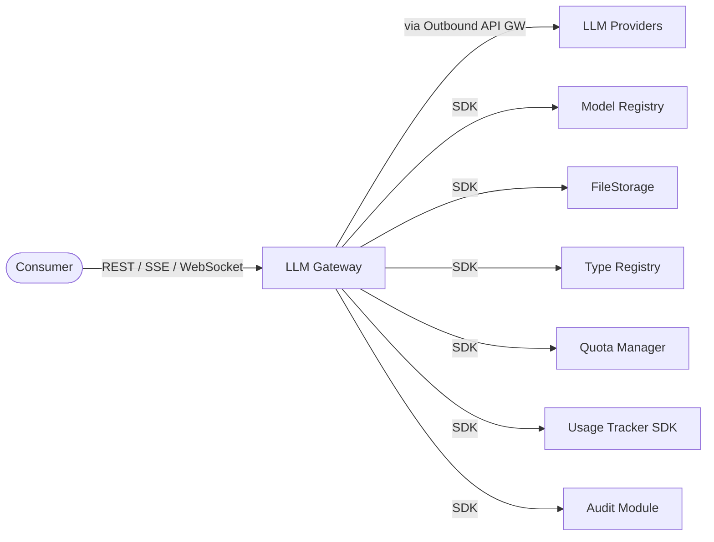

| Layer | Responsibility | Technology |
|-------|---------------|------------|
| API | Request/response handling, validation | REST/OpenAPI |
| Application | Request orchestration, provider routing | Core services |
| Adapters | Provider-specific translation | Provider adapters |
| Infrastructure | External calls, persistence | Outbound API GW, SeaORM/SecureConn |

## 2. Principles & Constraints

### 2.1 Design Principles

#### Stateless

**ID**: `cpt-cf-llm-gateway-principle-stateless`

**ADRs**: `cpt-cf-llm-gateway-adr-stateless`, `cpt-cf-llm-gateway-adr-no-stored-responses`

Gateway does not store conversation history. Consumer provides full context with each request. Open Responses `store` parameter is forced to `false`; `previous_response_id` is not supported. Gateway does persist operational state: async/batch job records (retained until TTL expires). Guaranteed at-least-once delivery of usage records is handled by the Usage Tracker SDK.

#### Content Non-Interpretation

**ID**: `cpt-cf-llm-gateway-principle-content-non-interpretation`

**ADRs**: `cpt-cf-llm-gateway-adr-pass-through`

Gateway translates request and response formats between consumers and providers but does not interpret content semantics. Tool execution and response parsing are consumer responsibility.

### 2.2 Constraints

#### Provider Rate Limits

**ID**: `cpt-cf-llm-gateway-constraint-provider-rate-limits`

Gateway is subject to provider TPM/RPM quotas. Cannot exceed limits imposed by external providers.

#### Provider Context Windows

**ID**: `cpt-cf-llm-gateway-constraint-provider-context-windows`

Request size limited by provider context window. Gateway cannot send requests exceeding provider limits.

#### Outbound API Gateway Dependency

**ID**: `cpt-cf-llm-gateway-constraint-outbound-dependency`

All external API calls must route through Outbound API Gateway. Direct provider calls are not permitted.

#### No Credential Storage

**ID**: `cpt-cf-llm-gateway-constraint-no-credentials`

Gateway does not store provider credentials. Credential injection handled by Outbound API Gateway.

#### Content Logging Restrictions

**ID**: `cpt-cf-llm-gateway-constraint-content-logging`

Full request/response content is not logged due to PII concerns. Only metadata (tokens, latency, model, tenant) is logged.

#### No Stored Responses

**ID**: `cpt-cf-llm-gateway-constraint-no-stored-responses`

**ADRs**: `cpt-cf-llm-gateway-adr-no-stored-responses`

Gateway does not support server-side response storage or conversation continuation. The `store` parameter is accepted but forced to `false`; requests with a non-null `previous_response_id` are rejected with `capability_not_supported`. Consumers must provide full conversation context (input items) with each request. Background job results (async mode) are not affected — they follow the data retention NFR.

## 3. Technical Architecture

### 3.1 Domain Model

**Technology**: GTS (JSON Schema), aligned with [Open Responses specification](https://www.openresponses.org/specification)

**Location**: [`llm-gateway-sdk/schemas/`](../llm-gateway-sdk/schemas/)

**ADRs**: `cpt-cf-llm-gateway-adr-open-responses-protocol`

The domain model follows the Open Responses protocol. All polymorphic types use GTS type inheritance with a single base type and concrete subtypes discriminated by the `type` field. The core abstraction is the **item** — an atomic unit of context representing messages, tool invocations, or reasoning state. A single `Item` base type is used for both input and output: output items produced by a response can be passed back as input items in subsequent requests.

**Core Entities**:

*Request/Response (`core/`):*
- CreateResponseBody — Request to create a response (model, input, instructions, previous_response_id, include, tools, tool_choice, parallel_tool_calls, text, reasoning, temperature, top_p, max_output_tokens, max_tool_calls, presence_penalty, frequency_penalty, top_logprobs, truncation, stream, stream_options, background, store, service_tier, metadata, safety_identifier, prompt_cache_key). additionalProperties: false. **Note**: `previous_response_id` is not supported (rejected with `capability_not_supported` if non-null); `store` is accepted but forced to `false` — see `cpt-cf-llm-gateway-adr-no-stored-responses`
- ResponseResource — Response object (id, object: "response", created_at, completed_at, status, incomplete_details, model, previous_response_id, instructions, output, error, tools, tool_choice, truncation, parallel_tool_calls, text, top_p, presence_penalty, frequency_penalty, top_logprobs, temperature, reasoning, usage, max_output_tokens, max_tool_calls, store, background, service_tier, metadata, safety_identifier, prompt_cache_key). Status: queued | in_progress | completed | incomplete | failed. All fields required, additionalProperties: false
- EmbeddingRequest — Embedding request (model, input, dimensions, encoding_format). Not part of Open Responses — Gateway-specific endpoint
- EmbeddingResponse — Embedding response (model, data[], usage). Not part of Open Responses — Gateway-specific endpoint
- Usage — Token counts (input_tokens, output_tokens, total_tokens, input_tokens_details: {cached_tokens}, output_tokens_details: {reasoning_tokens})
- Error — Error object (message, type, param, code)

*Items (`items/`):*

All items share a single base type (`Item`) with GTS type inheritance, discriminated by `type` field. The base type defines common optional fields: `id` (string|null) and `status` (string|null, enum: in_progress | completed | incomplete). Output items produced by a response can be passed back as input items in subsequent requests.

Input-oriented items (consumer → model):
- MessageItem — Conversation message (type: "message", role: user | system | developer | assistant, content: string | ContentPart[])
- FunctionCallOutputItem — Tool result from consumer (type: "function_call_output", call_id, output: string | ContentPart[])
- ItemReference — Reference to item from previous response (type: "item_reference", id)
- ReasoningItem — Reasoning context to include (type: "reasoning", summary, encrypted_content, content: null)

Bidirectional items (used as both input context and output):
- FunctionCallItem — Tool invocation (type: "function_call", call_id, name, arguments). As output: id and status are required. As input: id and status are optional.

Output-oriented items (model → consumer):
- MessageOutput — Model message (type: "message", id, status, role: user | assistant | system | developer, content: OutputContentPart[])
- ReasoningOutput — Model reasoning (type: "reasoning", id, summary, content: ReasoningText[] | null, encrypted_content)
- DataOutput — CyberFabric extension: binary data output (type: "cyberfabric:data", id, status: in_progress | completed, mime_type, base64: string | null, url: string | null). Generic binary output item used for image generation and extensible to audio/video. See [ADR-0006](./ADR/0006-cpt-cf-llm-gateway-adr-image-generation-api.md).

Provider-specific items use extension format: `{provider_slug}:{item_type}` (e.g., `openai:web_search_call`). CyberFabric extensions use the `cyberfabric:` prefix (e.g., `cyberfabric:data`).

*Content Parts (`content/`):*

Content parts compose message items. Discriminated by `type` field.

Input content (consumer → model):
- InputText — (type: "input_text", text)
- InputImage — Image from FileStorage (type: "input_image", url | file_id, detail)
- InputFile — Document from FileStorage (type: "input_file", url | file_id, filename)
- InputAudio — Audio from FileStorage (type: "input_audio", url | data, format)
- InputVideo — Video from FileStorage (type: "input_video", url | file_id)

Output content (model → consumer):
- OutputText — Generated text (type: "output_text", text, annotations[], logprobs)
- Refusal — Model refusal (type: "refusal", refusal)

Annotations:
- UrlCitation — Citation in output text (type: "url_citation", url, title, start_index, end_index)

*Tools (`tools/`):*

Tool definitions share a single base type (`Tool`) with GTS type inheritance, discriminated by `type` field. The Open Responses `function` tool type is the standard. Gateway extends with CyberFabric-specific tool types for GTS Type Registry integration.

- FunctionTool — Function definition (type: "function", name, description, parameters: JSONSchema, strict: boolean). Open Responses standard.
- ToolReference — CyberFabric extension: reference to Type Registry (type: "reference", schema_id). Gateway resolves schema_id via Type Registry before forwarding to provider.
- ToolInlineGTS — CyberFabric extension: inline GTS schema (type: "inline_gts", schema). Gateway resolves GTS schema to JSON Schema before forwarding.
- ImageGenerationTool — CyberFabric extension: built-in image generation tool (type: "cyberfabric:image_generation"). Follows the Open Responses hosted tool extension format. Parameters: aspect_ratio (1:1, 2:3, 3:2, 3:4, 4:3, 9:16, 16:9), resolution (megapixels: 0.5, 1, 2, 4), quality (low, medium, high, auto), output_format (png, jpeg, webp), output_compression (0–100, for jpeg), response_format (base64, url). See [ADR-0006](./ADR/0006-cpt-cf-llm-gateway-adr-image-generation-api.md).

Tool control:
- tool_choice: "auto" (default) | "required" | "none" | {type: "function", name: string}
- parallel_tool_calls: boolean — whether model can issue multiple tool calls in parallel

*Text Format & Reasoning:*

- TextFormat — Response format control (format: text | json_object | json_schema)
  - text: plain text output (default)
  - json_object: JSON output
  - json_schema: structured output with schema (name, description, schema: JSONSchema, strict: boolean)
- ReasoningConfig — Reasoning control (effort: "none" | "low" | "medium" | "high" | "xhigh", summary: "concise" | "detailed" | "auto")

*Async (`async/`):*

Not part of the Open Responses specification. Gateway-specific entities for long-running operations. Persisted in database (see section 3.5).

- Job — Async job (id, tenant_id, provider_job_id, status, request, result, error, created_at, completed_at, expires_at)
- Batch — Batch request (id, tenant_id, status, input_file_url: FileStorage URL from consumer, results_file_url: FileStorage URL generated by Gateway, created_at, expires_at)
- JobStatus — Enum: pending, running, completed, failed, cancelled
- BatchStatus — Enum: pending, in_progress, completed, failed, cancelled

**Relationships**:
- CreateResponseBody → Item: contains 0..* (input)
- CreateResponseBody → Tool: contains 0..* (tools)
- CreateResponseBody → TextFormat: optional (text)
- CreateResponseBody → ReasoningConfig: optional (reasoning)
- CreateResponseBody → ResponseResource: optional (previous_response_id)
- ResponseResource → Item: contains 0..* (output)
- ResponseResource → Tool: contains 0..* (tools, echoed back)
- ResponseResource → TextFormat: optional (text, echoed back)
- ResponseResource → ReasoningConfig: optional (reasoning, echoed back)
- ResponseResource → Usage: contains 0..1
- ResponseResource → Error: optional
- MessageItem → ContentPart: contains 1..*
- MessageOutput → OutputContentPart: contains 0..*
- OutputText → UrlCitation: contains 0..* (annotations)
- Item ← MessageItem, FunctionCallItem, FunctionCallOutputItem, ItemReference, ReasoningItem, MessageOutput, ReasoningOutput, DataOutput
- Tool ← FunctionTool, ToolReference, ToolInlineGTS, ImageGenerationTool
- ContentPart ← InputText, InputImage, InputFile, InputAudio, InputVideo
- OutputContentPart ← OutputText, Refusal
- EmbeddingRequest → Usage: returns
- EmbeddingResponse → Usage: contains
- Job → JobStatus: has
- Job → CreateResponseBody: references
- Job → ResponseResource: optional result
- Job → Error: optional
- Batch → BatchStatus: has

### 3.2 Component Model

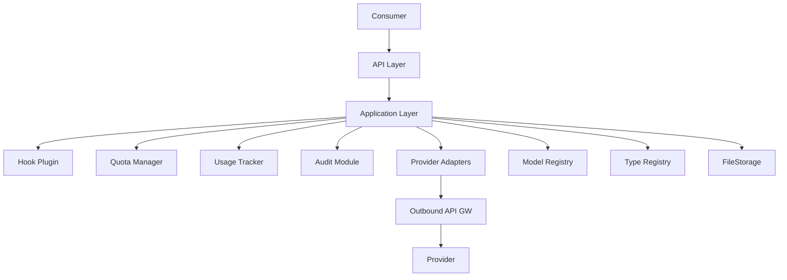

**Components**:
 - [ ] `p1` - **ID**: `cpt-cf-llm-gateway-component-api-layer`
   - API Layer
   - Request/response handling, validation, routing
 - [ ] `p1` - **ID**: `cpt-cf-llm-gateway-component-application-layer`
   - Application Layer
   - Request orchestration, provider selection, response normalization
 - [ ] `p1` - **ID**: `cpt-cf-llm-gateway-component-provider-adapters`
   - Provider Adapters
   - Provider-specific request/response translation
 - [ ] `p1` - **ID**: `cpt-cf-llm-gateway-component-hook-plugin`
   - Hook Plugin
   - Pre-call and post-response interception following CyberFabric plugin architecture. Multiple plugins can be enabled and are invoked in order. Pre-call plugins can modify or block requests before the provider adapter. Post-call plugins run after the full response is available (after streaming completes, or after async/batch job finishes) and are observe-only — the response has already been delivered or is delivered unconditionally, so plugin outcome has no effect on response delivery.
 - [ ] `p1` - **ID**: `cpt-cf-llm-gateway-component-quota-manager`
   - Quota Manager
   - Pre-request AI credit quota checks (pending: specific component to be determined — see PRD Open Questions)
 - [ ] `p1` - **ID**: `cpt-cf-llm-gateway-component-usage-tracker`
   - Usage Tracker
   - AI credit consumption reporting (tokens converted to credits via Model Registry prices). Usage Tracker SDK handles guaranteed at-least-once delivery
 - [ ] `p4` - **ID**: `cpt-cf-llm-gateway-component-audit-module`
   - Audit Module
   - Compliance event logging

**Interactions**:
- Consumer → API Layer: Normalized requests
- Application Layer → Model Registry: Model resolution, availability check, and per-model pricing for AI credit conversion; ModelInfo includes model capabilities used by Application Layer for pre-dispatch capability validation
- Application Layer → Quota Manager: Pre-request AI credit quota checks
- Application Layer → Usage Tracker: AI credit consumption reporting via Usage Tracker SDK (at-least-once delivery handled by SDK)
- Application Layer → Type Registry: Tool schema resolution
- Application Layer → FileStorage: Media fetch/store
- Provider Adapters → Outbound API GW: Provider API calls

**Dependencies**:

| Dependency | Role |
|------------|------|
| Model Registry | Model catalog, availability checks, per-model pricing for AI credit conversion; ModelInfo includes model capabilities |
| Outbound API Gateway | External API calls to providers |
| FileStorage | Media storage and retrieval |
| Type Registry | Tool schema resolution |
| Quota Manager | Pre-request AI credit quota checks (pending: specific component to be determined — see PRD Open Questions) |
| Usage Tracker | AI credit consumption reporting (at-least-once delivery handled by Usage Tracker SDK) |

### 3.3 API Contracts

**Technology**: REST/OpenAPI, [Open Responses protocol](https://www.openresponses.org/specification)

**ADRs**: `cpt-cf-llm-gateway-adr-open-responses-protocol`

**Endpoints Overview**:

*Open Responses endpoints:*
- `POST /responses` — Create a response (sync, streaming, or background)

*Gateway-specific endpoints (not part of Open Responses):*
- `POST /embeddings` — Embeddings generation
- `GET /jobs/{id}` — Get job status/result
- `DELETE /jobs/{id}` — Cancel job
- `POST /batches` — Create batch
- `GET /batches/{id}` — Get batch status/results
- `WS /realtime` — Realtime audio session

**Request Format** (`POST /responses`):

```json
{
  "model": "string | null",
  "input": "string | Item[] | null",
  "instructions": "string | null",
  "previous_response_id": "string | null ⛔ NOT SUPPORTED — rejected if non-null",
  "include": ["reasoning.encrypted_content", "message.output_text.logprobs"],
  "tools": [{"type": "function", "name": "...", "parameters": {}}],
  "tool_choice": "auto | required | none | {type, name}",
  "parallel_tool_calls": true,
  "text": {"format": {"type": "text | json_object | json_schema"}},
  "reasoning": {"effort": "medium", "summary": "auto"},
  "temperature": 1.0,
  "top_p": 1.0,
  "max_output_tokens": null,
  "max_tool_calls": null,
  "presence_penalty": null,
  "frequency_penalty": null,
  "top_logprobs": null,
  "truncation": "disabled",
  "stream": false,
  "stream_options": {"include_usage": true},
  "background": false,
  "store": "true ⛔ FORCED to false — stored responses not supported",
  "service_tier": "auto",
  "metadata": {},
  "safety_identifier": "string | null",
  "prompt_cache_key": "string | null"
}
```

**Response Format** (`ResponseResource`):

```json
{
  "id": "resp_abc123",
  "object": "response",
  "created_at": 1234567890,
  "completed_at": 1234567891,
  "status": "completed",
  "incomplete_details": null,
  "model": "string",
  "previous_response_id": null,
  "instructions": null,
  "output": [
    {
      "type": "message",
      "id": "msg_abc123",
      "role": "assistant",
      "status": "completed",
      "content": [{"type": "output_text", "text": "Hello world"}]
    }
  ],
  "error": null,
  "tools": [],
  "tool_choice": "auto",
  "truncation": "disabled",
  "parallel_tool_calls": true,
  "text": {"format": {"type": "text"}},
  "top_p": 1.0,
  "presence_penalty": 0.0,
  "frequency_penalty": 0.0,
  "top_logprobs": 0,
  "temperature": 1.0,
  "reasoning": null,
  "usage": {
    "input_tokens": 10,
    "output_tokens": 5,
    "total_tokens": 15,
    "input_tokens_details": {"cached_tokens": 0},
    "output_tokens_details": {"reasoning_tokens": 0}
  },
  "max_output_tokens": null,
  "max_tool_calls": null,
  "store": false,
  "background": false,
  "service_tier": "auto",
  "metadata": {},
  "safety_identifier": null,
  "prompt_cache_key": null
}
```

**Error Format** (Open Responses):

```json
{
  "error": {
    "message": "string",
    "type": "invalid_request | not_found | server_error | model_error | too_many_requests",
    "param": "string | null",
    "code": "string"
  }
}
```

Gateway-specific error codes (mapped to Open Responses `code` field):

| Code | Type | Description |
|------|------|-------------|
| `model_not_found` | `not_found` | Model not in catalog |
| `model_not_approved` | `invalid_request` | Model not approved for tenant |
| `validation_error` | `invalid_request` | Invalid request format |
| `capability_not_supported` | `invalid_request` | Model lacks required capability |
| `budget_exceeded` | `invalid_request` | Tenant budget exhausted |
| `rate_limited` | `too_many_requests` | Rate limit exceeded |
| `request_blocked` | `invalid_request` | Blocked by pre-call hook |
| `output_validation_error` | `model_error` | Provider output does not conform to requested JSON schema |
| `provider_error` | `model_error` | Provider returned error |
| `provider_timeout` | `server_error` | Provider request timed out |
| `job_not_found` | `not_found` | Job ID does not exist |
| `job_expired` | `not_found` | Job result TTL exceeded |

**Streaming Contract**:

Streaming responses use Server-Sent Events (SSE) format following the Open Responses protocol. Each event has a named `event` field and JSON `data` payload with a `sequence_number` for ordering. The stream terminates with a `data: [DONE]` event.

Event types:

| Event | Description |
|-------|-------------|
| `response.created` | Response object created |
| `response.queued` | Response queued for processing |
| `response.in_progress` | Model processing started |
| `response.completed` | All output items completed |
| `response.failed` | Response failed with error |
| `response.incomplete` | Response ended due to token budget |
| `response.output_item.added` | New output item started (message, function_call, reasoning) |
| `response.output_item.done` | Output item completed |
| `response.content_part.added` | New content part started within an item |
| `response.content_part.done` | Content part completed |
| `response.output_text.delta` | Text content delta (incremental text) |
| `response.function_call_arguments.delta` | Function call arguments delta (incremental JSON) |
| `response.reasoning_summary_part.added` | Reasoning summary part started |
| `response.reasoning_summary_part.done` | Reasoning summary part completed |
| `cyberfabric:response.data.in_progress` | CyberFabric extension: binary data output item started processing (e.g., image generation in progress) |
| `cyberfabric:response.data.done` | CyberFabric extension: binary data output item completed with final data (base64 or URL) |

Format:

```text
event: response.created
data: {"type":"response.created","sequence_number":0,"response":{"id":"resp_abc","status":"in_progress","model":"gpt-4","output":[]}}

event: response.output_item.added
data: {"type":"response.output_item.added","sequence_number":1,"output_index":0,"item":{"type":"message","id":"msg_abc","role":"assistant","status":"in_progress","content":[]}}

event: response.content_part.added
data: {"type":"response.content_part.added","sequence_number":2,"output_index":0,"content_index":0,"part":{"type":"output_text","text":""}}

event: response.output_text.delta
data: {"type":"response.output_text.delta","sequence_number":3,"output_index":0,"content_index":0,"delta":"Hello"}

event: response.output_text.delta
data: {"type":"response.output_text.delta","sequence_number":4,"output_index":0,"content_index":0,"delta":" world"}

event: response.content_part.done
data: {"type":"response.content_part.done","sequence_number":5,"output_index":0,"content_index":0,"part":{"type":"output_text","text":"Hello world"}}

event: response.output_item.done
data: {"type":"response.output_item.done","sequence_number":6,"output_index":0,"item":{"type":"message","id":"msg_abc","role":"assistant","status":"completed","content":[{"type":"output_text","text":"Hello world"}]}}

event: response.completed
data: {"type":"response.completed","sequence_number":7,"response":{"id":"resp_abc","status":"completed","output":[...],"usage":{"input_tokens":10,"output_tokens":5,"total_tokens":15}}}

data: [DONE]
```

Key streaming semantics:
- `sequence_number` is monotonically increasing across all events in a stream
- `output_index` identifies which output item the event belongs to
- `content_index` identifies which content part within an item
- Item lifecycle: added → content deltas → done
- Response lifecycle: created → queued → in_progress → completed | failed | incomplete
- Provider-specific streaming events use extension format: `{provider_slug}:{event_type}`
- CyberFabric extension events use `cyberfabric:` prefix: `cyberfabric:response.data.in_progress` (binary output started), `cyberfabric:response.data.done` (binary output completed with data)

**Streaming-specific constraints**:
- **No provider fallback after first delta**: Provider fallback (see `cpt-cf-llm-gateway-seq-provider-fallback-v1`) is only attempted before streaming begins. Once any delta event has been sent to the consumer, the stream is committed to the current provider — switching providers mid-stream is not possible.
- **Consumer disconnect does not abort the provider request**: If the consumer disconnects, Gateway continues reading the provider stream to completion. This ensures token usage is fully reported to the Usage Tracker. The provider response is discarded after the stream closes. If the provider stream itself terminates before delivering usage data (network error, provider error mid-stream), the handling policy is an open question — see PRD section 13 "Budget enforcement edge cases".
- **Usage is always requested from providers**: Gateway always sets `stream_options: {include_usage: true}` on provider requests regardless of the consumer's `stream_options` value. Token usage is required for billing. The consumer's `stream_options.include_usage` controls only whether the `response.completed` event exposes usage to the consumer — it does not affect what Gateway requests from the provider.

#### Hook Plugin SDK Interface

**ID**: `cpt-cf-llm-gateway-interface-hook-plugin-sdk-v1`

**Technology**: ModKit SDK trait (`LlmGatewayHookPluginClient`), resolved via ClientHub scoped clients following CyberFabric plugin architecture (see `docs/MODKIT_PLUGINS.md`)

**GTS Schema ID**: `gts.x.core.modkit.plugin.v1~x.llmgw.hook_plugin.v1~`

The Hook Plugin interface is defined in `llm-gateway-sdk` as a plugin client trait. The LLM Gateway registers the plugin schema in the types-registry; each hook plugin implementation registers its own instance and scoped client. The gateway resolves the active plugin via `choose_plugin_instance` using the configured vendor and lowest priority value.

**Plugin trait methods** (`LlmGatewayHookPluginClient`):

| Method | Invoked | Inputs | Output |
|--------|---------|--------|--------|
| `pre_request` | Before provider adapter, on every `/responses` request | `SecurityContext`, `gts.x.llmgw.core.create_response_body.v1~` | `Ok(gts.x.llmgw.core.create_response_body.v1~)` — allow, request unchanged or modified; or `Err(HookRejection)` — block, returns `request_blocked` to consumer |
| `post_response` | After full response assembled — after stream closes; after async/batch job completes | `SecurityContext`, `gts.x.llmgw.core.create_response_body.v1~`, `gts.x.llmgw.core.response_resource.v1~` | `()` — observe-only; plugin errors are logged but do not affect response delivery |

**`HookRejection`**: `{ reason: String }` — returned by `pre_request` to block a request. Maps to the `request_blocked` error code in the API error response.

**Semantics**:

- `pre_request` receives the normalized `gts.x.llmgw.core.create_response_body.v1~` before the provider adapter formats it for the specific provider. The returned value (possibly modified) is what the provider adapter receives.
- `post_response` receives both the original request and the fully assembled `gts.x.llmgw.core.response_resource.v1~` (including `status: failed` responses — error state is carried in the response object, so no separate error hook is needed).
- For streaming responses, `post_response` is invoked after the stream closes and the full response is assembled from chunks. The response has already been delivered to the consumer by this point.
- Batch requests are treated as individual calls: `pre_request` and `post_response` are invoked once per individual request within the batch.
- Hook plugin scope: applies to `/responses` endpoint requests (chat completion, streaming, image generation, async background jobs). The `/embeddings` endpoint is out of scope for hook interception in this version.

**Plugin discovery and selection**:

- LLM Gateway registers the GTS plugin schema (`gts.x.core.modkit.plugin.v1~x.llmgw.hook_plugin.v1~`) during module `init()`.
- Each hook plugin registers a GTS instance and scoped client under a stable instance ID of the form `gts.x.core.modkit.plugin.v1~x.llmgw.hook_plugin.v1~<vendor>.<pkg>.hook_plugin.v1`.
- Gateway uses `choose_plugin_instance` to select the plugin matching the configured vendor with the lowest priority value.
- Plugin unavailability (client not found after resolution) causes the request to fail with a `hook_unavailable` error — hooks are not bypassed silently.

### 3.4 Interactions & Sequences

> **Note**: In the sequence diagrams below, "LLM Gateway" (GW) represents the full gateway stack including Provider Adapters. In practice, the Application Layer delegates to provider-specific adapters, which then call Outbound API Gateway. This is simplified for diagram readability. See Component Model (section 3.2) for the detailed layer structure.

#### Provider Resolution

- [ ] `p1` - **ID**: `cpt-cf-llm-gateway-seq-provider-resolution-v1`

This sequence is used by all request flows to resolve the target provider. Other diagrams show "Resolve provider" as a simplified step — this is the detailed flow.

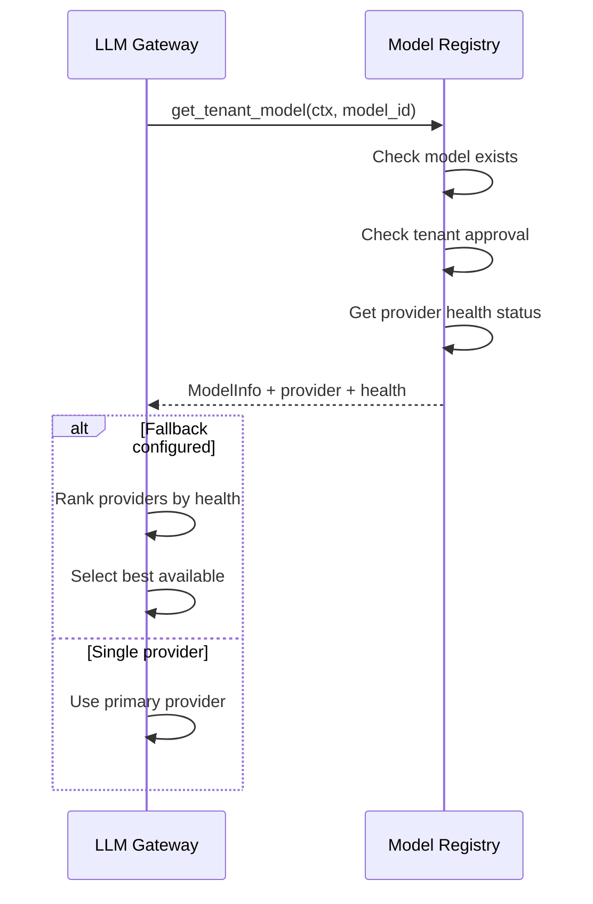

**Resolution outcomes**:
- `model_not_found` — model not in catalog
- `model_not_approved` — model not approved for tenant
- `model_deprecated` — model sunset by provider
- Success — returns provider endpoint + health metrics

#### Create Response (Sync)

- [ ] `p1` - **ID**: `cpt-cf-llm-gateway-seq-create-response-sync-v1`

**Use cases**: `cpt-cf-llm-gateway-usecase-chat-completion-v1`
**Actors**: `cpt-cf-llm-gateway-actor-consumer`

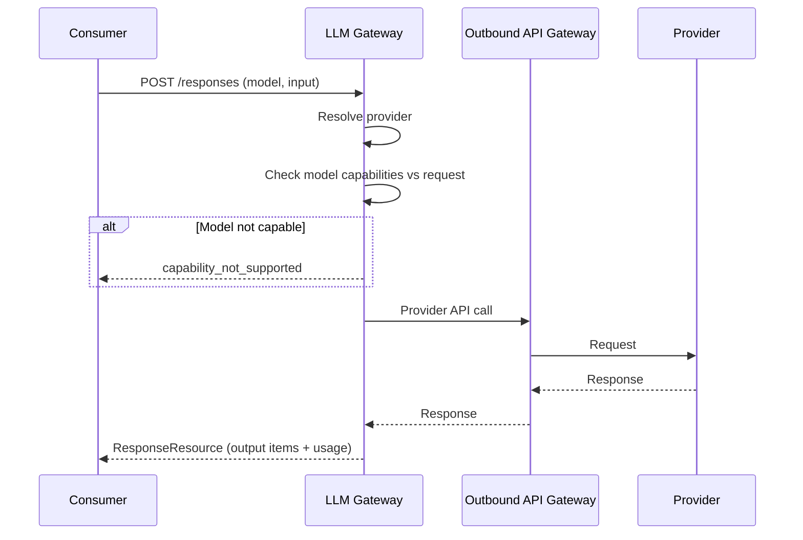

#### Create Response (Streaming)

- [ ] `p1` - **ID**: `cpt-cf-llm-gateway-seq-streaming-v1`

**Use cases**: `cpt-cf-llm-gateway-usecase-streaming-v1`
**Actors**: `cpt-cf-llm-gateway-actor-consumer`

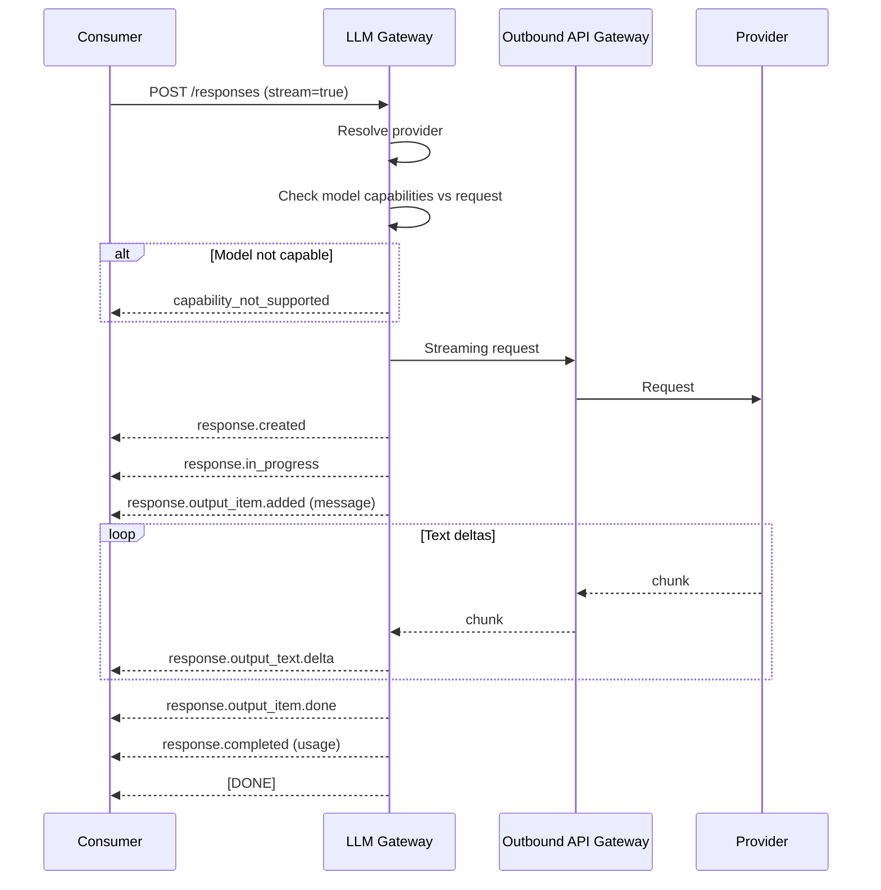

#### Embeddings Generation

- [ ] `p1` - **ID**: `cpt-cf-llm-gateway-seq-embeddings-v1`

**Use cases**: `cpt-cf-llm-gateway-usecase-embeddings-v1`
**Actors**: `cpt-cf-llm-gateway-actor-consumer`

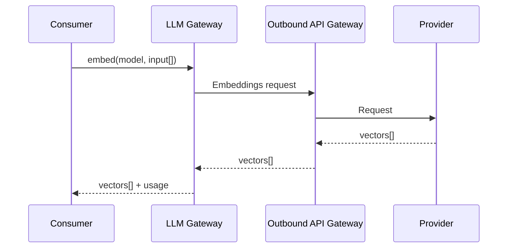

#### Vision (Image Analysis)

- [ ] `p1` - **ID**: `cpt-cf-llm-gateway-seq-vision-v1`

**Use cases**: `cpt-cf-llm-gateway-usecase-vision-v1`
**Actors**: `cpt-cf-llm-gateway-actor-consumer`


#### Image Generation

- [ ] `p1` - **ID**: `cpt-cf-llm-gateway-seq-image-generation-v1`

**Use cases**: `cpt-cf-llm-gateway-usecase-image-generation-v1`
**Actors**: `cpt-cf-llm-gateway-actor-consumer`

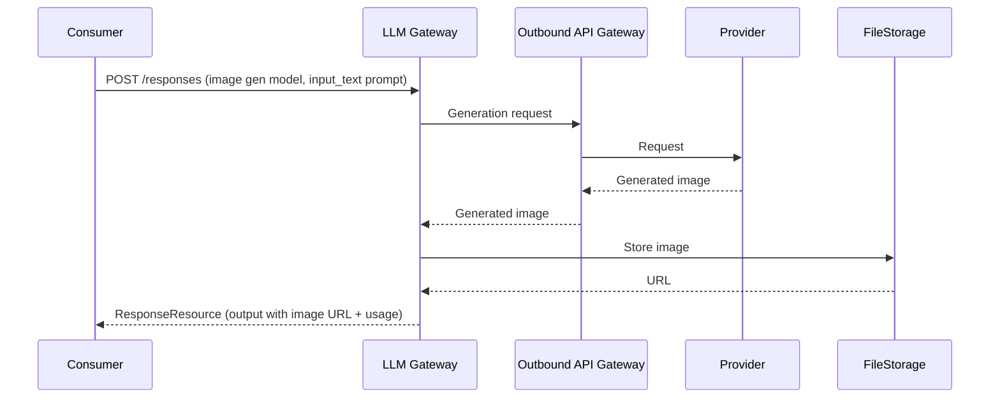

#### Speech-to-Text

- [ ] `p3` - **ID**: `cpt-cf-llm-gateway-seq-speech-to-text-v1`

**Use cases**: `cpt-cf-llm-gateway-usecase-speech-to-text-v1`
**Actors**: `cpt-cf-llm-gateway-actor-consumer`


#### Text-to-Speech

- [ ] `p1` - **ID**: `cpt-cf-llm-gateway-seq-text-to-speech-v1`

**Use cases**: `cpt-cf-llm-gateway-usecase-text-to-speech-v1`
**Actors**: `cpt-cf-llm-gateway-actor-consumer`

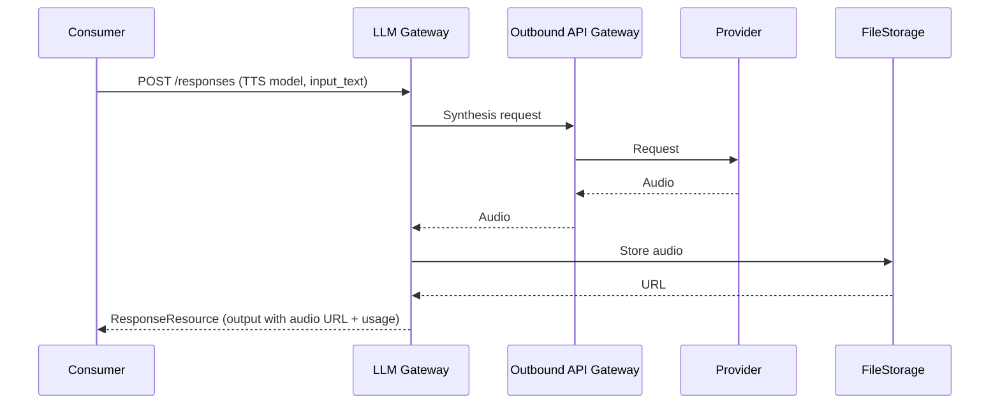

#### Video Understanding

- [ ] `p1` - **ID**: `cpt-cf-llm-gateway-seq-video-understanding-v1`

**Use cases**: `cpt-cf-llm-gateway-usecase-video-understanding-v1`
**Actors**: `cpt-cf-llm-gateway-actor-consumer`


#### Video Generation

- [ ] `p3` - **ID**: `cpt-cf-llm-gateway-seq-video-generation-v1`

**Use cases**: `cpt-cf-llm-gateway-usecase-video-generation-v1`
**Actors**: `cpt-cf-llm-gateway-actor-consumer`

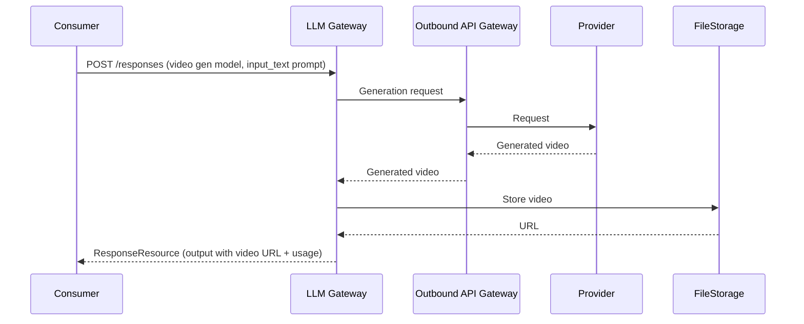

#### Tool/Function Calling

- [ ] `p1` - **ID**: `cpt-cf-llm-gateway-seq-tool-calling-v1`

**Use cases**: `cpt-cf-llm-gateway-usecase-tool-calling-v1`
**Actors**: `cpt-cf-llm-gateway-actor-consumer`

In the Open Responses protocol, tool calls are represented as `function_call` output items. The consumer provides tool results as `function_call_output` input items in the follow-up request. Since `previous_response_id` is not supported (see `cpt-cf-llm-gateway-adr-no-stored-responses`), the consumer must include the full conversation context — both the original input items and the function call output items — in the follow-up request.

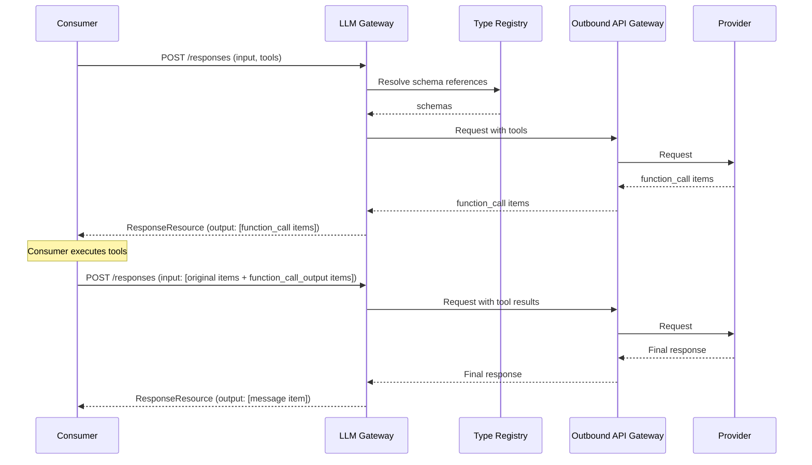

#### Structured Output

- [ ] `p1` - **ID**: `cpt-cf-llm-gateway-seq-structured-output-v1`

**Use cases**: `cpt-cf-llm-gateway-usecase-structured-output-v1`
**Actors**: `cpt-cf-llm-gateway-actor-consumer`

Structured output is controlled via the `text.format` parameter using `json_schema` type.

**Validation semantics**:
- Gateway validates the provider's JSON output against the requested schema before returning the response.
- On failure, `output_validation_error` is returned immediately — no retries.
- For streaming requests (`stream: true`), schema validation is not enforced by Gateway — the schema is forwarded to the provider but the streamed output is not buffered and re-validated. Consumers must validate streamed output themselves.

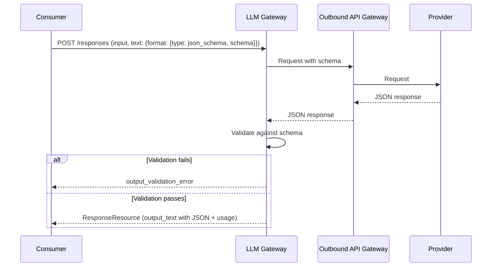

#### Document Understanding

- [ ] `p1` - **ID**: `cpt-cf-llm-gateway-seq-document-understanding-v1`

**Use cases**: `cpt-cf-llm-gateway-usecase-document-understanding-v1`
**Actors**: `cpt-cf-llm-gateway-actor-consumer`

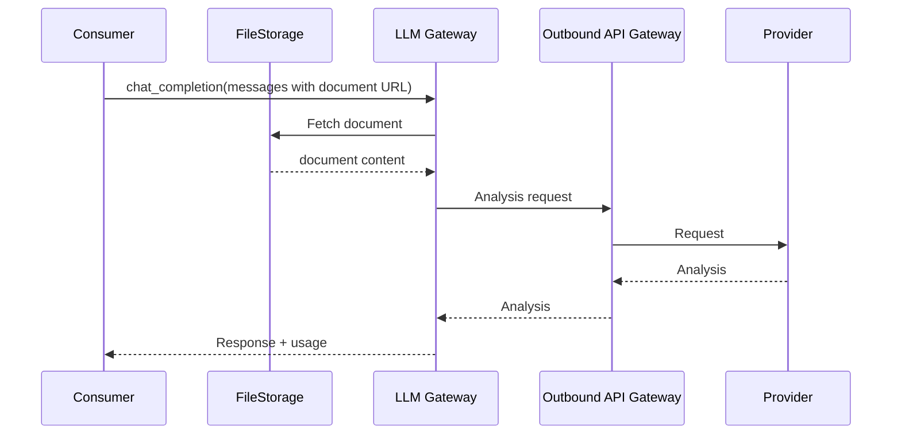

#### Async Jobs / Background Mode

- [ ] `p1` - **ID**: `cpt-cf-llm-gateway-seq-async-jobs-v1`

**Use cases**: `cpt-cf-llm-gateway-usecase-async-jobs-v1`
**Actors**: `cpt-cf-llm-gateway-actor-consumer`

Open Responses supports `background: true` for async processing. The Gateway uses `POST /responses` with `background: true` to start a background job. Job status and results can be retrieved via `GET /jobs/{id}`, and jobs can be cancelled via `DELETE /jobs/{id}`.

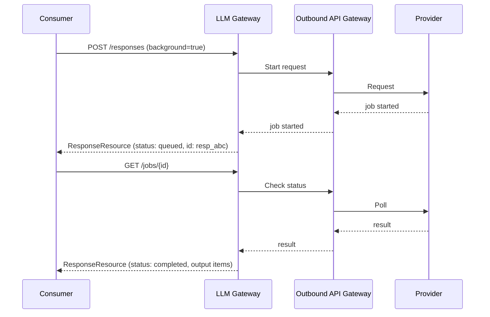

#### Realtime Audio

- [ ] `p3` - **ID**: `cpt-cf-llm-gateway-seq-realtime-audio-v1`

**Use cases**: `cpt-cf-llm-gateway-usecase-realtime-audio-v1`
**Actors**: `cpt-cf-llm-gateway-actor-consumer`

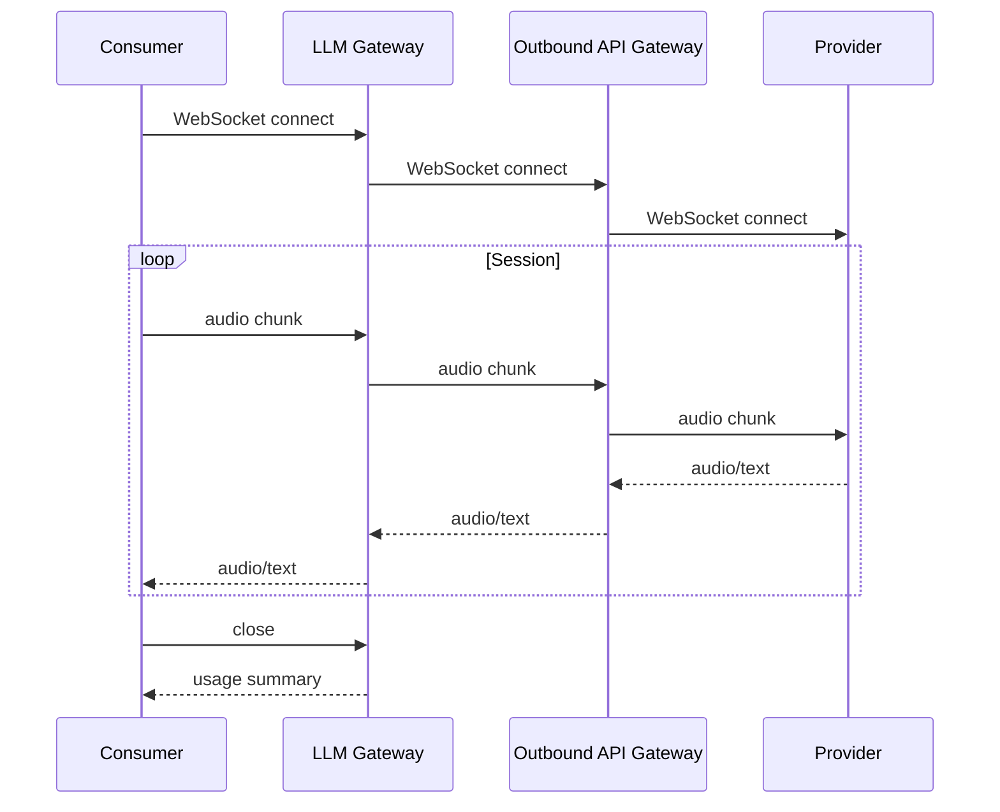

#### Provider Fallback

- [ ] `p2` - **ID**: `cpt-cf-llm-gateway-seq-provider-fallback-v1`

**Use cases**: `cpt-cf-llm-gateway-usecase-provider-fallback-v1`
**Actors**: `cpt-cf-llm-gateway-actor-consumer`

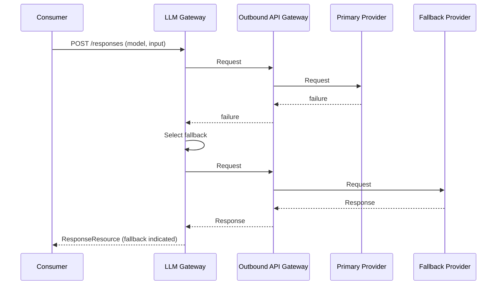

#### Timeout Enforcement

- [ ] `p2` - **ID**: `cpt-cf-llm-gateway-seq-timeout-v1`

**Use cases**: `cpt-cf-llm-gateway-usecase-timeout-v1`
**Actors**: `cpt-cf-llm-gateway-actor-consumer`

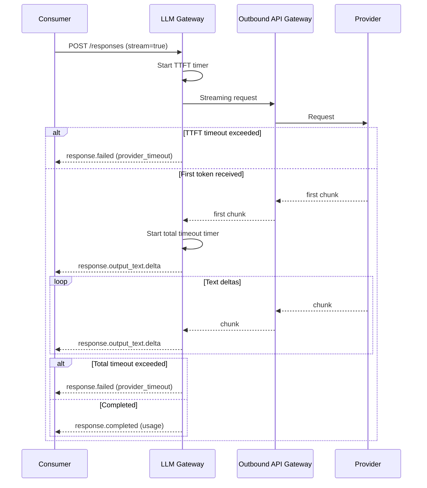

#### Pre-Call Interceptor

- [ ] `p2` - **ID**: `cpt-cf-llm-gateway-seq-pre-call-interceptor-v1`

**Use cases**: `cpt-cf-llm-gateway-usecase-pre-call-interceptor-v1`
**Actors**: `cpt-cf-llm-gateway-actor-consumer`

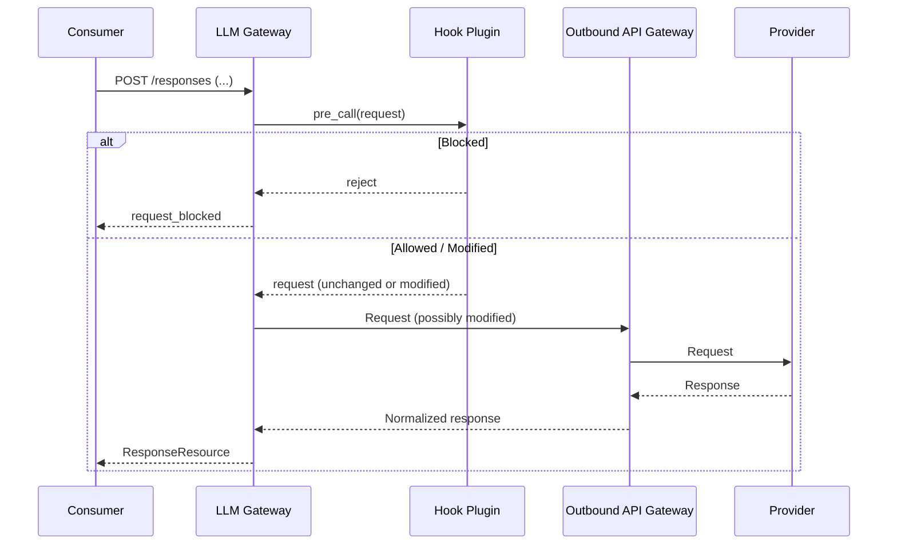

#### Post-Response Interceptor

- [ ] `p2` - **ID**: `cpt-cf-llm-gateway-seq-post-response-interceptor-v1`

**Use cases**: `cpt-cf-llm-gateway-usecase-post-response-interceptor-v1`
**Actors**: `cpt-cf-llm-gateway-actor-consumer`

```mermaid
sequenceDiagram
    participant C as Consumer
    participant GW as LLM Gateway
    participant OB as Outbound API Gateway
    participant P as Provider
    participant HP as Hook Plugin

    C->>GW: POST /responses (...)
    GW->>OB: Request
    OB->>P: Request
    P-->>OB: Response
    OB-->>GW: Normalized response
    GW-->>C: Response
    GW->>HP: post_response(response)
    HP->>HP: process response
    HP-->>GW: ok
```

#### Hook Plugin — Streaming

- [ ] `p2` - **ID**: `cpt-cf-llm-gateway-seq-hook-plugin-streaming-v1`

**Use cases**: `cpt-cf-llm-gateway-usecase-pre-call-interceptor-v1`, `cpt-cf-llm-gateway-usecase-post-response-interceptor-v1`
**Actors**: `cpt-cf-llm-gateway-actor-consumer`, `cpt-cf-llm-gateway-actor-hook-plugin`

For streaming responses, the pre-call hook runs before the stream starts. Chunks are forwarded to the consumer immediately as they arrive. The gateway accumulates a full response in parallel. The post-call hook is invoked with the fully assembled response after the stream closes — at this point the response has already been delivered to the consumer, so the post-call hook cannot modify it.

```mermaid
sequenceDiagram
    participant C as Consumer
    participant GW as LLM Gateway
    participant HP as Hook Plugin
    participant OB as Outbound API Gateway
    participant P as Provider

    C->>GW: POST /responses (stream=true)
    GW->>HP: pre_call(request)
    HP-->>GW: request (unchanged or modified)
    GW->>OB: Streaming request
    OB->>P: Request
    GW-->>C: response.created
    GW-->>C: response.in_progress
    loop Stream chunks
        P-->>OB: chunk
        OB-->>GW: chunk
        GW-->>C: response.output_text.delta
        GW->>GW: Accumulate full response
    end
    GW-->>C: response.completed
    GW-->>C: [DONE]
    GW->>HP: post_response(full_assembled_response)
    HP->>HP: process response
    HP-->>GW: ok
```

#### Rate Limiting

- [ ] `p2` - **ID**: `cpt-cf-llm-gateway-seq-rate-limiting-v1`

**Use cases**: `cpt-cf-llm-gateway-usecase-rate-limiting-v1`
**Actors**: `cpt-cf-llm-gateway-actor-consumer`

```mermaid
sequenceDiagram
    participant C as Consumer
    participant GW as LLM Gateway
    participant OB as Outbound API Gateway
    participant P as Provider

    C->>GW: POST /responses (...)
    GW->>GW: Check rate limits
    alt Limit exceeded
        GW-->>C: rate_limited
    else Within limits
        GW->>OB: Request
        OB->>P: Request
        P-->>OB: Response
        OB-->>GW: Response
        GW-->>C: Response
    end
```

#### Budget Enforcement

- [ ] `p2` - **ID**: `cpt-cf-llm-gateway-seq-budget-enforcement-v1`

**Use cases**: `cpt-cf-llm-gateway-fr-budget-enforcement-v1`
**Actors**: `cpt-cf-llm-gateway-actor-consumer`, `cpt-cf-llm-gateway-actor-quota-manager`, `cpt-cf-llm-gateway-actor-usage-tracker`

```mermaid
sequenceDiagram
    participant C as Consumer
    participant GW as LLM Gateway
    participant QM as Quota Manager
    participant MR as Model Registry
    participant OB as Outbound API Gateway
    participant P as Provider
    participant UT as Usage Tracker SDK

    C->>GW: POST /responses (...)
    GW->>QM: check_quota(tenant)
    alt Quota exceeded
        QM-->>GW: quota_exceeded
        GW-->>C: budget_exceeded
    else Quota available
        QM-->>GW: ok
        GW->>OB: Request
        OB->>P: Request
        P-->>OB: Response (with token usage)
        OB-->>GW: Response
        GW->>MR: get_model_pricing(model)
        MR-->>GW: price_per_token
        GW->>GW: Convert tokens → AI credits
        GW->>UT: report_usage(tenant, model, ai_credits)
        UT-->>GW: ok (accepted for delivery)
        GW-->>C: Response
    end
```

**Budget enforcement flow**:
1. **Pre-request quota check**: Gateway calls Quota Manager `check_quota()` before processing
2. **Reject if exceeded**: Returns `budget_exceeded` error immediately
3. **Process request**: If quota available, proceed with provider call
4. **Convert to AI credits**: After response, Gateway obtains per-model pricing from Model Registry and converts consumed tokens to AI credits
5. **Report usage**: Call Usage Tracker SDK `report_usage()` — the SDK handles guaranteed at-least-once delivery internally (transactional outbox, retries)

**Known limitation — best-effort gate**: The `check_quota()` → proceed → `report_usage()` sequence is non-atomic. Under concurrent load, multiple requests may pass `check_quota()` before any `report_usage()` completes, allowing a tenant to exceed their limit by N×budget (where N = concurrent in-flight requests). Whether Gateway should own enforcement (atomic reserve + settle) or metering only is an open question — see PRD section 13 "Quota enforcement ownership and component". Usage Tracker unavailability does not block request processing — the SDK buffers records and delivers them when the tracker becomes available.

#### Batch Processing

- [ ] `p3` - **ID**: `cpt-cf-llm-gateway-seq-batch-processing-v1`

**Use cases**: `cpt-cf-llm-gateway-usecase-batch-processing-v1`
**Actors**: `cpt-cf-llm-gateway-actor-consumer`

```mermaid
sequenceDiagram
    participant C as Consumer
    participant GW as LLM Gateway
    participant OB as Outbound API Gateway
    participant P as Provider

    C->>GW: create_batch(input_file_url)
    GW->>OB: Submit batch (fetch input from FileStorage, upload to provider)
    OB->>P: Provider batch API
    P-->>OB: batch_id
    OB-->>GW: batch_id
    GW-->>C: batch_id

    C->>GW: get_batch(batch_id)
    GW->>OB: Check status
    OB->>P: Poll batch
    P-->>OB: status + results
    OB->>GW: store results to FileStorage
    GW-->>C: status + results_file_url
```

**Tenant isolation**: Batch metadata is persisted in the database (see section 3.5):
- On `create_batch`: consumer provides a FileStorage URL for the input file; Gateway stores `{batch_id, tenant_id, provider_batch_id, input_file_url, created_at, expires_at}` in the `batches` table
- On `get_batch`: Gateway queries by batch_id with SecureConn tenant filtering, ensuring callers can only access their own batches; when the provider signals completion, Gateway writes results to FileStorage and stores the generated `results_file_url` in the `batches` row
- Expired records are cleaned up by the background purge task (NFR `cpt-cf-llm-gateway-nfr-data-retention-v1`)

This is the same persistence pattern used for async jobs (see ADR-0001).

### 3.5 Database schemas & tables

Gateway uses persistent database storage for async/batch job state. All tables use SecureConn with tenant-scoped access.

**ID**: `cpt-cf-llm-gateway-db-persistence`

#### Jobs table

- [ ] `p1` - **ID**: `cpt-cf-llm-gateway-dbtable-jobs`

Stores async job state and results. Rows are created when a `background: true` request is received and retained until TTL expires (10 minutes for LLM completions, 48 hours for batch jobs per NFR `cpt-cf-llm-gateway-nfr-data-retention-v1`).

| Column | Type | Description |
|--------|------|-------------|
| id | UUID (PK) | Gateway-generated job ID |
| tenant_id | UUID | Tenant owning the job (SecureConn filter) |
| provider_job_id | String (nullable) | Provider's internal job ID (for providers with native async) |
| status | Enum | pending, running, completed, failed, cancelled |
| request | JSONB | Serialized CreateResponseBody |
| result | JSONB (nullable) | Serialized ResponseResource (populated on completion) |
| error | JSONB (nullable) | Serialized Error (populated on failure) |
| model_id | String | Resolved model identifier |
| created_at | Timestamp | Job creation time |
| completed_at | Timestamp (nullable) | Job completion time |
| expires_at | Timestamp | TTL expiration (created_at + retention period) |

Indexes: `(tenant_id, id)`, `(expires_at)` for purge task.

#### Batches table

- [ ] `p3` - **ID**: `cpt-cf-llm-gateway-dbtable-batches`

Stores batch job metadata and individual request results. Same retention policy as jobs.

| Column | Type | Description |
|--------|------|-------------|
| id | UUID (PK) | Gateway-generated batch ID |
| tenant_id | UUID | Tenant owning the batch (SecureConn filter) |
| provider_batch_id | String (nullable) | Provider's internal batch ID |
| status | Enum | pending, in_progress, completed, failed, cancelled |
| input_file_url | String | FileStorage URL of the input file provided by the consumer |
| results_file_url | String (nullable) | FileStorage URL generated by Gateway for the consumer to retrieve results; populated when provider signals completion |
| created_at | Timestamp | Batch creation time |
| expires_at | Timestamp | TTL expiration |

**Background tasks**:
- **Job purge task**: Periodically deletes rows from `jobs` and `batches` where `expires_at < now()`.

### 3.6 Observability Metrics

Gateway emits the following OpenTelemetry metrics (NFR `cpt-cf-llm-gateway-nfr-observability-v1`). All metrics use the `llm_gateway_` prefix and are registered via the platform's metrics infrastructure at module startup.

#### Counters

| Metric | Labels | Emitted when |
|--------|--------|--------------|
| `llm_gateway_requests_total` | `model`, `provider`, `status` | Request completes (success or error) |
| `llm_gateway_fallback_total` | `from_provider`, `to_provider`, `reason` | Primary provider fails and fallback is activated (`cpt-cf-llm-gateway-seq-provider-fallback-v1`) |
| `llm_gateway_stream_abort_total` | `reason` (`client_disconnect`, `timeout`, `error`) | SSE stream terminates before completion |
| `llm_gateway_hook_block_total` | `hook_type` (`pre_call`, `post_response`) | Hook plugin blocks a request (`cpt-cf-llm-gateway-fr-pre-call-interceptor-v1`) |
| `llm_gateway_budget_reserve_total` | — | Quota Manager `check_quota` is called before execution |
| `llm_gateway_budget_settle_total` | — | Usage Tracker `report_usage` is called after execution |
| `llm_gateway_schema_validation_fail_total` | `model`, `provider` | Structured output fails JSON Schema validation (`cpt-cf-llm-gateway-fr-structured-output-v1`) |
| `llm_gateway_job_cache_miss_total` | — | Consumer polls for an async job ID that is not found in DB |

#### Histograms

| Metric | Labels | Buckets | Emitted when |
|--------|--------|---------|--------------|
| `llm_gateway_ttft_seconds` | `model`, `provider` | 0.1, 0.25, 0.5, 1.0, 2.5, 5.0, 10.0 | First token received from provider (streaming and non-streaming) |

#### Label cardinality

All labels are bounded to enumerable values:

- `model` — resolved model identifier from Model Registry (finite set per tenant configuration)
- `provider` / `from_provider` / `to_provider` — provider name from Model Registry (finite set of configured providers)
- `status` — HTTP-level status category (`ok`, `client_error`, `server_error`, `timeout`, `provider_error`)
- `reason` — fixed enum per metric (documented above)
- `hook_type` — fixed enum: `pre_call`, `post_response`

Unbounded identifiers (tenant ID, request ID, user ID) **MUST NOT** be used as metric labels — they belong in structured logs and distributed traces, not in metric dimensions.

## 4. Additional Context

### 4.1 Quality Attribute Coverage

The following quality attribute domains are addressed at the platform level or explicitly scoped out for this module.

#### Performance

Stateless request processing enables horizontal scaling — any instance can serve any request. Provider responses are not cached — each request is a fresh provider call. Async job polling avoids long-held connections. Streaming (SSE) reduces time-to-first-token perceived latency. Database storage for job/batch records uses TTL-based retention and background purge to bound row growth (up to 50,000 rows/day across all tenants, per PRD capacity planning).

#### Security

Authentication and authorization are handled by the ModKit platform (SecureConn, AccessScope). Provider credentials are never stored or accessed by Gateway — credential injection is performed by Outbound API Gateway (constraint `cpt-cf-llm-gateway-constraint-no-credentials`). Full request/response content is not logged due to PII concerns (constraint `cpt-cf-llm-gateway-constraint-content-logging`). Tenant isolation is enforced at the platform level via SecurityContext. Pre-call and post-response hook plugins (`cpt-cf-llm-gateway-component-hook-plugin`) provide content moderation and PII filtering extension points.

#### Reliability

Circuit breaking is handled at the infrastructure level by Outbound API Gateway — see `cpt-cf-llm-gateway-adr-circuit-breaking`. Business-level health routing uses Model Registry health metrics to avoid unhealthy providers (`cpt-cf-llm-gateway-seq-provider-resolution-v1`). Provider fallback chains provide redundancy for critical models (`cpt-cf-llm-gateway-seq-provider-fallback-v1`). Timeout enforcement (TTFT + total) prevents hung requests (`cpt-cf-llm-gateway-seq-timeout-v1`). Retry logic is delegated to Outbound API Gateway. Usage record delivery is guaranteed at-least-once by the Usage Tracker SDK (transactional outbox handled internally by the SDK) — Usage Tracker unavailability does not block request processing. Native async job state (provider_job_id stored in DB) survives Gateway instance restarts with zero data loss — polling resumes after restart (NFR `cpt-cf-llm-gateway-nfr-recovery-v1`). Simulated async jobs (in-flight sync provider calls) are not recovered on restart and are marked failed to prevent unauthorized token spending.

#### Data Architecture

Gateway owns persistent database tables for async/batch job records (see section 3.5). Job records are retained with TTL-based expiration: 10 minutes for LLM completion jobs, 48 hours for batch jobs (NFR `cpt-cf-llm-gateway-nfr-data-retention-v1`). A background purge task cleans up expired rows. Usage record delivery (transactional outbox) is owned by the Usage Tracker SDK. All media storage is delegated to FileStorage (ADR `cpt-cf-llm-gateway-adr-file-storage`). Domain model entities are defined in section 3.1.

#### Integration

Gateway integrates with external LLM providers exclusively through Outbound API Gateway (constraint `cpt-cf-llm-gateway-constraint-outbound-dependency`). Integration patterns are synchronous (REST) for standard requests, SSE for streaming, and WebSocket for realtime audio. Internal module communication uses ModKit SDK traits via ClientHub (Model Registry, Type Registry, FileStorage, Quota Manager, Usage Tracker, Audit Module).

#### Operations

Infrastructure concerns (deployment, health checks, distributed tracing) are handled by the CyberFabric platform. Gateway defines module-level OpenTelemetry metrics (section 3.6) covering request lifecycle, provider interactions, fallback events, streaming state, hook actions, budget operations, schema validation outcomes, and time-to-first-token latency (NFR `cpt-cf-llm-gateway-nfr-observability-v1`). Structured audit events are emitted via the Audit Module (`cpt-cf-llm-gateway-fr-audit-events-v1`).

#### Maintainability

Gateway follows the standard ModKit module pattern (two-crate SDK pattern, DDD-light layers). Provider adapters are isolated behind a common trait, enabling addition of new providers without modifying core logic. Extension points: hook plugins for pre/post processing, tool type extensions via GTS Type Registry.

#### Testing

Not applicable at the DESIGN level — testing strategy will be defined in FEATURE artifacts. Unit tests will cover adapter translation logic, integration tests will verify end-to-end flows with mocked providers, and E2E tests will validate the full request/response cycle.

#### Compliance

Not applicable — Gateway does not handle compliance directly. Content logging restrictions (constraint `cpt-cf-llm-gateway-constraint-content-logging`) and audit event emission (`cpt-cf-llm-gateway-fr-audit-events-v1`) support downstream compliance requirements. Tenant-level data governance is enforced by the platform.

#### Usability

Not applicable — Gateway exposes a programmatic API (REST/WebSocket) consumed by other services, not a user-facing interface.

#### Business Alignment

All functional requirements (23 FRs) and non-functional requirements (4 NFRs) from the PRD are mapped to architecture drivers in section 1.2. Business capabilities (provider abstraction, governance, security) are realized through the component model in section 3.2.

## 5. Traceability

| Source | Direction | Target | Coverage |
|--------|-----------|--------|----------|
| PRD FRs (23) | → | DESIGN Architecture Drivers (section 1.2) | All covered |
| PRD NFRs (5) | → | DESIGN Architecture Drivers (section 1.2) | All covered |
| ADRs (7) | → | DESIGN Architecture Drivers + inline on principles/constraints | All covered |
| DESIGN Components (7) | → | DECOMPOSITION | Pending |
| DESIGN Sequences (23) | → | FEATURE | Pending |
