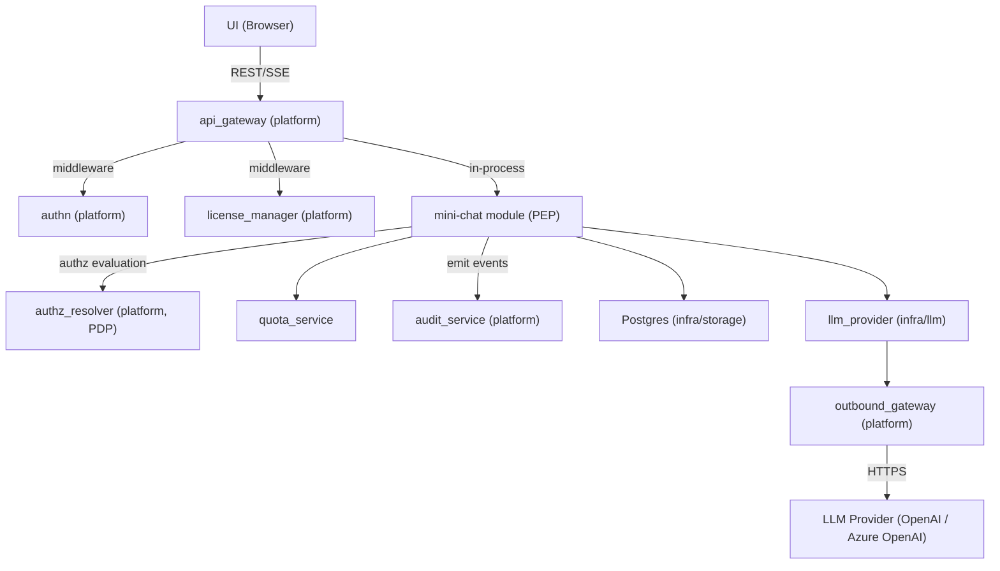
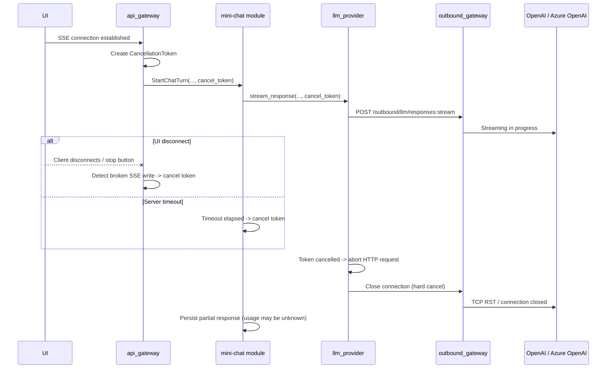
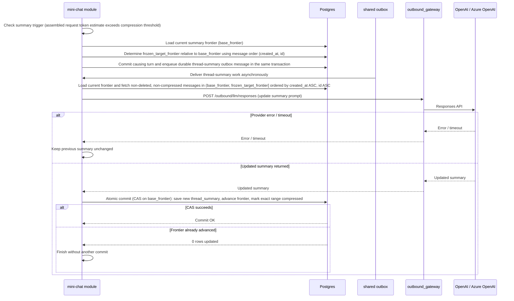
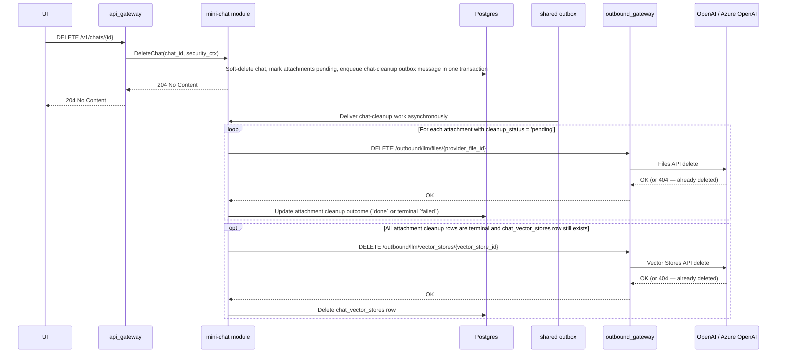
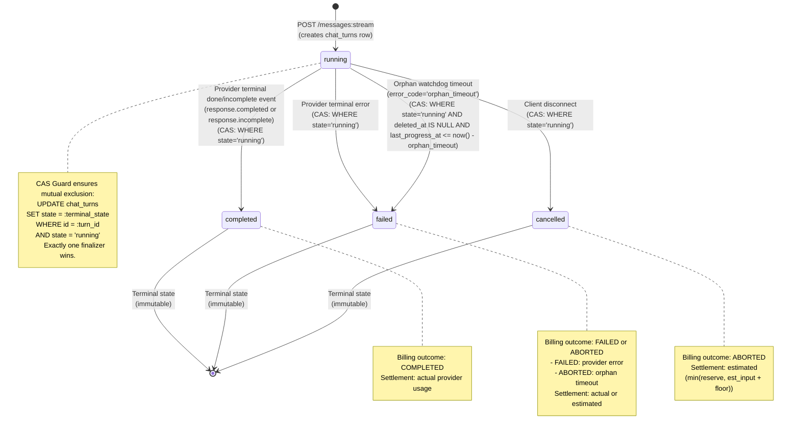
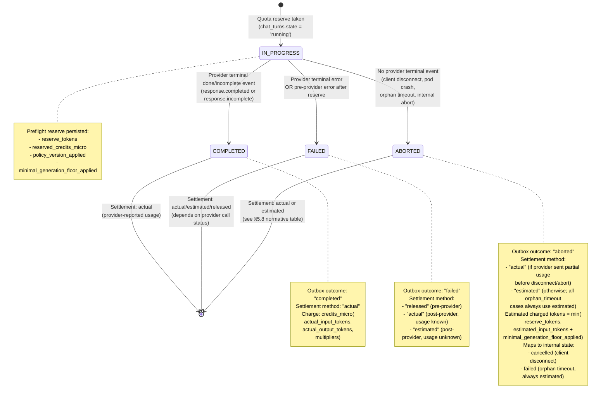

# Technical Design: Mini Chat

## 1. Architecture Overview

### 1.1 Architectural Vision

Mini Chat provides a multi-tenant AI chat experience with SSE streaming, conversation history, document-aware question answering, and web search. Users interact through a REST/SSE API backed by the Responses API with File Search (OpenAI or Azure OpenAI - see [Provider API Mapping](#provider-api-mapping)). The system maintains strict tenant isolation via per-chat vector stores and enforces cost control through token budgets, usage quotas, and file search limits. Authorization decisions are delegated to the platform's AuthZ Resolver (PDP), which returns query-level constraints compiled to `AccessScope` objects by the mini-chat module acting as the Policy Enforcement Point (PEP).

Mini Chat is implemented as a ModKit module (`mini-chat`) following the DDD-light pattern. The module's domain service layer orchestrates all request processing - context assembly, LLM invocation, streaming relay, and persistence. It owns the full request lifecycle from receiving a user message to persisting the assistant response and usage metrics. External LLM calls route exclusively through the platform's Outbound API Gateway (OAGW), which handles credential injection and egress control. Mini Chat calls the LLM provider directly via OAGW rather than through `cf-llm-gateway`, because it relies on provider-specific features (Responses API, Files API, File Search with vector stores) that the generic gateway does not abstract. Both OpenAI and Azure OpenAI expose a compatible Responses API surface; OAGW routes to the configured provider and injects the appropriate credentials (API key header for OpenAI, `api-key` header or Entra ID bearer token for Azure OpenAI).

Mini Chat supports multimodal Responses API input (text + image) using the provider Files API for image storage. Images are uploaded as attachments, referenced by file ID in the Responses API content array, and are not indexed in vector stores.

Long conversations are managed via thread summaries - a Level 1 compression strategy where older messages are periodically summarized by the LLM, and the summary replaces them in the context window. This keeps token costs bounded while preserving key facts, decisions, and document references.

### 1.2 Architecture Drivers

#### Functional Drivers

| Requirement | Phase | Design Response |
|-------------|-------|-----------------|
| `cpt-cf-mini-chat-fr-chat-streaming` | `p1` | SSE streaming via the mini-chat module's domain service -> OAGW -> Responses API (OpenAI: `POST /v1/responses`; Azure OpenAI: `POST /openai/v1/responses`) |
| `cpt-cf-mini-chat-fr-conversation-history` | `p1` | Postgres (infra/storage) persists all messages; `GET /v1/chats/{id}/messages` with cursor pagination + OData query for history retrieval |
| `cpt-cf-mini-chat-fr-file-upload` | `p1` | Upload via OAGW -> Files API (OpenAI: `POST /v1/files`; Azure OpenAI: `POST /openai/files`); metadata persisted via infra/storage repositories; file added to the chat's vector store. P1 uses `purpose="assistants"` for both providers (OpenAI also supports `purpose="user_data"`, but we use `assistants` to keep parity and because the files are used with Vector Stores / File Search). |
| `cpt-cf-mini-chat-fr-image-upload` | `p1` | Image upload via OAGW -> Files API; metadata persisted via infra/storage repositories; NOT added to vector store. Images referenced as multimodal input (file ID) in Responses API calls. Model capability checked before outbound call; defensive `unsupported_media` error if model lacks image support (unreachable under P1 catalog invariant where all models include `VISION_INPUT`). |
| `cpt-cf-mini-chat-fr-file-search` | `p1` | File Search tool call scoped to the chat's dedicated vector store (identical `file_search` tool on both OpenAI and Azure OpenAI Responses API) |
| `cpt-cf-mini-chat-fr-web-search` | `p1` | Web Search tool included in Responses API request when explicitly enabled via `web_search.enabled` parameter; provider decides invocation; per-turn and per-day call limits enforced; global `disable_web_search` kill switch |
| `cpt-cf-mini-chat-fr-doc-summary` | `p1` | See **File Upload** sequence ("Generate doc summary" background variant) and `attachments.doc_summary` schema field. `doc_summary` is server-generated asynchronously; never provided by the client. Status polled via `GET /v1/chats/{id}/attachments/{attachment_id}`. |
| `cpt-cf-mini-chat-fr-thread-summary` | `p1` | Periodic LLM-driven summarization of old messages; summary replaces history in context |
| `cpt-cf-mini-chat-fr-chat-crud` | `p1` | REST endpoints for create/list/get/update title/delete chats. Get returns metadata + message_count (no embedded messages). |
| `cpt-cf-mini-chat-fr-temporary-chat` | `p2` | Toggle temporary flag; scheduled cleanup after 24h |
| `cpt-cf-mini-chat-fr-chat-deletion-cleanup` | `p1` | See **Cleanup on Chat Deletion** |
| `cpt-cf-mini-chat-fr-streaming-cancellation` | `p1` | See **Streaming Cancellation** sequence and quota bounded best-effort debit rules in `quota_service` |
| `cpt-cf-mini-chat-fr-quota-enforcement` | `p1` | See `quota_service` component and `quota_usage` table |
| `cpt-cf-mini-chat-fr-token-budget` | `p1` | See constraint **Context Window Budget** and ContextPlan truncation rules |
| `cpt-cf-mini-chat-fr-license-gate` | `p1` | See constraint **License Gate** and dependency `license_manager (platform)` |
| `cpt-cf-mini-chat-fr-audit` | `p1` | Emit audit events to platform `audit_service` for completed chat turns and policy decisions (one structured event per completed turn) |
| `cpt-cf-mini-chat-fr-ux-recovery` | `p1` | See **Streaming Contract** (Idempotency + reconnect rule) and **Turn Status API** |
| `cpt-cf-mini-chat-fr-turn-mutations` | `p1` | Retry / edit / delete last turn via Turn Mutation API; see **Turn Mutation Rules (P1)** and turn mutation endpoints |
| `cpt-cf-mini-chat-fr-model-selection` | `p1` | User selects model per chat at creation; model locked for conversation lifetime; see constraint `cpt-cf-mini-chat-constraint-model-locked-per-chat` and Model Catalog Configuration |
| `cpt-cf-mini-chat-fr-models-api` | `p1` | Public read-only Models API (`GET /v1/models`, `GET /v1/models/{model_id}`). Returns only models visible to the authenticated user (globally enabled). Catalog sourced from `mini-chat-model-policy-plugin`. See Models API (section 3.3). |
| `cpt-cf-mini-chat-fr-message-reactions` | `p1` | Binary like/dislike on assistant messages; see `message_reactions` table |
| `cpt-cf-mini-chat-fr-group-chats` | `p2+` | Deferred — see `cpt-cf-mini-chat-adr-group-chat-usage-attribution` |

#### NFR Allocation

| NFR ID | NFR Summary | Allocated To | Design Response | Verification Approach |
|--------|-------------|--------------|-----------------|----------------------|
| `cpt-cf-mini-chat-nfr-tenant-isolation` | Tenant data must never leak across tenants | mini-chat module (domain + infra layers) | Per-chat vector store; all queries scoped via `AccessScope` (owner_col + tenant_col); no provider identifiers (`provider_file_id`, `vector_store_id`) exposed or accepted in API | Integration tests with multi-tenant scenarios |
| `cpt-cf-mini-chat-nfr-authz-alignment` | Authorization must follow platform PDP/PEP model | mini-chat module (PEP via PolicyEnforcer) | AuthZ Resolver evaluates every data-access operation; constraints compiled to `AccessScope` objects applied via secure ORM; fail-closed on PDP errors | Integration tests with mock PDP; fail-closed verification tests |
| `cpt-cf-mini-chat-nfr-cost-control` | Predictable and bounded LLM costs | mini-chat module (domain service + quota_service) | Credit-based rate limits per tier across multiple periods (daily, monthly) tracked in real-time; credits are computed from provider-reported tokens using model credit multipliers; premium models have stricter limits, standard-tier models have separate, higher limits; two-tier downgrade cascade (premium → standard); file search and web search call limits; token budget per request | Usage metrics dashboard; budget alert tests |
| `cpt-cf-mini-chat-nfr-streaming-latency` | Low time-to-first-token for chat responses | mini-chat module (domain service), OAGW | Direct SSE relay without buffering; cancellation propagation on disconnect | TTFT benchmarks under load; **Disconnect test**: open SSE -> receive 1-2 tokens -> disconnect -> assert provider request closed within 200 ms and active-generation counter decrements; **TTFT delta test**: measure `t_first_token_ui - t_first_byte_from_provider` -> assert platform overhead < 50 ms p99 |
| `cpt-cf-mini-chat-nfr-data-retention` | Deleted chats purged from provider; temporary chat cleanup (P2) | mini-chat module (domain + infra layers) | Scheduled cleanup job; cascade delete to provider files and chat vector stores (OpenAI Files API / Azure OpenAI Files API) | Retention policy compliance tests |
| `cpt-cf-mini-chat-nfr-observability-supportability` | Operational visibility for on-call, SRE, and cost governance | mini-chat module (domain service + quota_service) | `mini_chat_*` Prometheus metrics on all critical paths; stable `request_id` tracing per turn; structured audit events; turn state API (`GET /v1/chats/{chat_id}/turns/{request_id}`) | Metric series presence tests; request_id propagation tests; alert rule validation |
| `cpt-cf-mini-chat-nfr-rag-scalability` | Bounded RAG costs and stable retrieval quality | mini-chat module (domain service + infra/storage) | Per-chat document count, file size, and chunk limits; configurable retrieval-k and max retrieved tokens per turn; per-chat dedicated vector stores | Per-chat limit enforcement tests; retrieval latency p95 benchmarks; `mini_chat_retrieval_latency_ms` within threshold |

#### Key Decisions (ADRs)

| ADR | Decision | Rationale |
|-----|----------|-----------|
| `cpt-cf-mini-chat-adr-llm-provider-as-library` — [ADR-0001](./ADR/0001-cpt-cf-mini-chat-adr-llm-provider-as-library.md) | `llm_provider` as a library crate, not a standalone service | Eliminates network hop in streaming path; simplifies deployment |
| `cpt-cf-mini-chat-adr-internal-transport` — [ADR-0002](./ADR/0002-cpt-cf-mini-chat-adr-internal-transport.md) | HTTP/SSE for internal transport between `llm_provider` and OAGW | SSE passthrough minimizes protocol translation overhead |
| `cpt-cf-mini-chat-adr-group-chat-usage-attribution` — [ADR-0003](./ADR/0003-cpt-cf-mini-chat-adr-group-chat-usage-attribution.md) | Group chat usage attribution model | Ensures quota enforcement is predictable for shared contexts (P2+) |

### 1.3 Architecture Layers

```text
┌───────────────────────────────────────────────────────┐
│  Presentation (api_gateway - platform)                │
│  REST + SSE endpoints, AuthN middleware               │
├───────────────────────────────────────────────────────┤
│  mini-chat module  [#[modkit::module]]                │
│  ┌─────────────────────────────────────────────────┐  │
│  │ API Layer (api/rest/)                           │  │
│  │ Handlers, routes, DTOs, error→Problem mapping   │  │
│  ├─────────────────────────────────────────────────┤  │
│  │ Domain Layer (domain/)                          │  │
│  │ Service (orchestration, PEP, context planning,  │  │
│  │   streaming), repository traits (ports)         │  │
│  │ ┌───────────────┐  ┌──────────────────────────┐ │  │
│  │ │ quota_service │  │ authz (PolicyEnforcer)   │ │  │
│  │ └───────────────┘  └──────────────────────────┘ │  │
│  ├─────────────────────────────────────────────────┤  │
│  │ Infrastructure Layer (infra/)                   │  │
│  │ ┌──────────────────┐  ┌──────────────────────┐  │  │
│  │ │ storage/         │  │ llm/ (llm_provider)  │  │  │
│  │ │ SeaORM entities  │  │ -> OAGW -> OpenAI /  │  │  │
│  │ │ (Scopable)       │  │    Azure OpenAI      │  │  │
│  │ │ ORM repositories │  │                      │  │  │
│  │ │ migrations       │  │                      │  │  │
│  │ └──────────────────┘  └──────────────────────┘  │  │
│  └─────────────────────────────────────────────────┘  │
└───────────────────────────────────────────────────────┘
```

**Naming note**: "the domain service" in this document refers to the module's domain service layer (business logic and PEP orchestration). "infra/storage" refers to the persistence layer (SeaORM entities with `#[derive(Scopable)]` + ORM repository implementations).

**Terminology (normative)**:

- **Message** — a persisted chat record in the `messages` table with a `role` (`user`, `assistant`, or `system`). A message is a content artifact; it carries no lifecycle, billing, or finalization semantics of its own.
- **Execution turn** (aka "chat turn") — a lifecycle unit tracked in the `chat_turns` table that represents a single user-initiated provider invocation. An execution turn owns the full request lifecycle: quota reserve, provider call, SSE streaming, finalization (CAS guard), quota settlement, and outbox emission. Exactly one execution turn maps to one `(chat_id, request_id)` pair.
- **Turn** — unless otherwise qualified, "turn" in this document means "execution turn" (the `chat_turns` lifecycle unit), not a message pair.
- **Background/system task** — an internal server-initiated operation (thread summary update, document summary generation) that invokes the LLM provider but MUST NOT create a `chat_turns` record. System tasks are not execution turns and do not participate in `chat_turns` idempotency, finalization CAS, or per-user quota settlement (see System Task Isolation Invariant in section 3.2).

| Layer | Responsibility | Technology |
|-------|---------------|------------|
| Presentation | Public REST/SSE API, authentication, routing | Axum (platform api_gateway) |
| API | REST handlers, SSE adapters, routes, DTOs, error→Problem mapping (RFC 9457) | Axum handlers, utoipa |
| Domain | Business rules, orchestration, PEP (PolicyEnforcer), context assembly, streaming relay, quota checks; repository traits (ports) | Rust, `authz_resolver_sdk` |
| Infrastructure | Persistence (SeaORM entities with `#[derive(Scopable)]`, ORM repositories, migrations), LLM communication | SeaORM (Postgres), HTTP client (reqwest) via OAGW |

## 2. Principles & Constraints

### 2.1 Design Principles

#### Tenant-Scoped Everything

- [ ] `p1` - **ID**: `cpt-cf-mini-chat-principle-tenant-scoped`

Every data access is scoped by constraints issued by the AuthZ Resolver (PDP). At P1, chat content is owner-only: the PDP returns `eq` predicates on `owner_tenant_id` and `user_id` that the domain service (PEP, via PolicyEnforcer) compiles to `AccessScope` and applies as SQL WHERE clauses through Secure ORM (`#[derive(Scopable)]`). This replaces application-level tenant/user scoping with a formalized constraint model aligned with the platform's [Authorization Design](../../../docs/arch/authorization/DESIGN.md). Vector stores, file uploads, and quota checks all require tenant context. No API accepts or returns provider identifiers (`provider_file_id`, `vector_store_id`). Client-visible identifiers are internal UUIDs only (`attachment_id`, `chat_id`, etc.).

#### Owner-Only Chat Content

- [ ] `p1` - **ID**: `cpt-cf-mini-chat-principle-owner-only-content`

Chat content (messages, attachments, summaries, citations) is accessible only to the owning user within their tenant. Parent tenants / MSP administrators MUST NOT have access to chat content. Admin visibility is limited to aggregated usage and operational metrics.

#### Summary Over History

- [ ] `p1` - **ID**: `cpt-cf-mini-chat-principle-summary-over-history`

The system favors compressed summaries over unbounded message history. Old messages are summarized rather than paginated into the LLM context. This bounds token costs and keeps response quality stable for long conversations.

#### Streaming-First

- [ ] `p1` - **ID**: `cpt-cf-mini-chat-principle-streaming-first`

All LLM responses are streamed. The primary delivery path is SSE from LLM provider (OpenAI / Azure OpenAI) → OAGW → mini-chat module → api_gateway → UI. Non-streaming responses are not supported for chat completion. Both providers use an identical SSE event format for the Responses API.

#### Linear Conversation Model

- [ ] `p1` - **ID**: `cpt-cf-mini-chat-principle-linear-conversation`

Conversations are strictly linear sequences of turns. P1 does not support branching, history forks, or rewriting arbitrary historical messages. Only the most recent turn may be mutated (retry, edit, or delete). This constraint keeps the data model simple, avoids version-graph complexity, and ensures deterministic context assembly for the LLM.

### 2.2 Constraints

#### OpenAI-Compatible Provider (P1)

- [ ] `p1` - **ID**: `cpt-cf-mini-chat-constraint-openai-compatible`

P1 targets the OpenAI-compatible API surface - either **OpenAI** or **Azure OpenAI** as the LLM provider. The active provider is selected per deployment via OAGW configuration; any provider-specific differences are handled in the provider call path (OAGW + `llm_provider`). Multi-provider support (e.g., Anthropic, Google) is deferred.

**Provider parity notes** (Azure OpenAI known limitations at time of writing):
- Azure supports only **one vector store** per `file_search` tool call (sufficient for P1: one vector store per chat).
- `purpose="user_data"` for file uploads is not supported on Azure; use `purpose="assistants"`.
- `vector_stores.search` (client-side manual search) is not exposed on Azure - not used in this design.
- New OpenAI features may appear on Azure with a lag of weeks to months.

**Files API upload field mapping (P1)**: Mini Chat uploads documents and images via the provider Files API through OAGW. Provider-required upload fields (including `purpose`) are controlled by a static, per-provider mapping shipped with deployment configuration; OAGW applies this mapping and does not infer it dynamically.

**Multimodal input (P1)**: image-aware chat uses the Responses API with multimodal input content arrays, not a separate Vision API. Image bytes are stored via the provider Files API and referenced by file ID in the Responses API request. P1 does not use URL-based image inputs because internal S3 storage is not externally reachable by the provider.

**File storage (P1)**: All user files (documents and images) are stored in the LLM provider's storage (OpenAI / Azure OpenAI via Files API). Mini Chat does not operate first-party object storage (no S3 or equivalent). "No persistent file storage" in this context means Mini Chat does not run its own object store — files persist in provider storage until explicitly deleted via the cleanup flow.

#### Model Capability Constraint (Images)

- [ ] `p1` - **ID**: `cpt-cf-mini-chat-constraint-model-image-capability`

Image capability validation is performed during preflight in a strict two-step order:

1. **Resolve effective_model** via the quota downgrade cascade (premium → standard), applying kill switches (`disable_premium_tier`, `force_standard_tier`).
2. **Validate capabilities** of the resolved effective_model against the request content.

```text
effective_model = resolve_effective_model(selected_model, quotas, kill_switches)
if request.has_images && "VISION_INPUT" not in catalog[effective_model].capabilities:
    return HTTP 415 unsupported_media   # no outbound call
proceed with provider call
```

If the effective_model does not support image input, the domain service MUST reject with `unsupported_media` (HTTP 415) before any provider call. This applies even when the selected_model supports images but the effective_model does not (e.g. user selected a premium model with `VISION_INPUT` capability, but quota exhaustion downgraded to a standard model without it).

The system MUST NOT silently drop image attachments, strip images from the request, or auto-upgrade to a different model to satisfy the request. Image capability is determined by the presence of `VISION_INPUT` in the model's `capabilities` array (see Model Catalog Configuration).

#### Downgrade Decision Matrix

| selected_model has VISION_INPUT | effective_model has VISION_INPUT | Request has images | Result |
|------------------------------|-------------------------------|--------------------|--------|
| yes | yes | yes | Proceed |
| yes | yes | no  | Proceed |
| yes | no  | yes | Reject 415 `unsupported_media` |
| yes | no  | no  | Proceed (no images, no conflict) |
| no  | no  | yes | Reject 415 `unsupported_media` |
| no  | no  | no  | Proceed |

The matrix is evaluated after `resolve_effective_model()` and before any provider call.

**P1 note**: All models in the P1 catalog include `VISION_INPUT` capability (see Model Catalog Configuration). The `unsupported_media` rejection path exists as a safety net but is not expected to trigger in P1 deployments. If a future catalog introduces a model without `VISION_INPUT`, the rejection logic activates automatically.

#### No Credential Storage

- [ ] `p1` - **ID**: `cpt-cf-mini-chat-constraint-no-credentials`

Mini Chat never stores or handles API keys. All external calls go through OAGW, which injects credentials from CredStore.

#### Context Window Budget

- [ ] `p1` - **ID**: `cpt-cf-mini-chat-constraint-context-budget`

Every request must fit within the **effective_model's** context window. The input token budget is:

```text
token_budget = min(configured_max_input_tokens, effective_model_context_window − reserved_output_tokens)
```

Where:
- `configured_max_input_tokens` — deployment config hard cap
- `effective_model_context_window` — from model catalog entry for the resolved effective_model (see `context_window` field)
- `reserved_output_tokens` — `max_output_tokens` configured for the request (persisted as `chat_turns.max_output_tokens_applied`)

When context exceeds the budget, the system truncates in reverse priority: retrieval excerpts first, then document summaries, then old messages (not summary). Thread summary and system prompt are never truncated.

The budget MUST be computed after `resolve_effective_model()` (i.e., after quota downgrade), because a downgraded model may have a smaller context window than the selected_model.

#### License Gate

- [ ] `p1` - **ID**: `cpt-cf-mini-chat-constraint-license-gate`

Access requires the `ai_chat` feature on the tenant license, enforced by the platform's `license_manager` middleware. Requests from unlicensed tenants receive HTTP 403.

#### No Buffering

- [ ] `p1` - **ID**: `cpt-cf-mini-chat-constraint-no-buffering`

No layer in the streaming pipeline may collect the full LLM response before relaying it. Every component — `llm_provider`, the domain service, `api_gateway` — must read one SSE event and immediately forward it to the next layer. Middleware must not buffer response bodies. `.collect()` on the token stream is prohibited in the hot path.

#### Bounded Channels

- [ ] `p1` - **ID**: `cpt-cf-mini-chat-constraint-bounded-channels`

Internal mpsc channels between `llm_provider` → domain service → SSE writer must use bounded buffers (16–64 messages). This provides backpressure: if the consumer is slow, the producer blocks rather than accumulating unbounded memory. Channel capacity is configurable per deployment.

#### Model Locked Per Chat

- [ ] `p1` - **ID**: `cpt-cf-mini-chat-constraint-model-locked-per-chat`

Once a chat is created with a model (user-selected or resolved via the `is_default` premium model algorithm), that model becomes the **selected_model** (`chats.model`) and is locked for the lifetime of the conversation. The user MUST NOT be able to change the selected_model within an existing chat.

The **effective_model** is the model actually used for a specific turn. Invariants:

- `selected_model` never changes during chat lifetime.
- `effective_model` may differ from `selected_model` due to automatic downgrade (quota exhaustion), kill switches (`disable_premium_tier`, `force_standard_tier`), or per-model catalog disablement (`global_enabled=false` on the specific model).
- `effective_model` MUST be recorded in:
  - `messages.model` column (per assistant message)
  - SSE `event: done` payload (`effective_model` and `usage.model` fields)
  - audit event payload (`selected_model` + `effective_model`)

**Exception**: quota-driven automatic downgrade within the two-tier cascade IS permitted mid-conversation. This is a system-level decision enforced by `quota_service`, not a user-initiated model switch. The effective_model is recorded on the assistant message (`messages.model`), not on the chat itself.

If a user wants a different model, they create a new chat.

#### Quota Before Outbound

- [ ] `p1` - **ID**: `cpt-cf-mini-chat-constraint-quota-before-outbound`

All product-level quota decisions (block, downgrade, limit) MUST be made in the domain service before any request reaches OAGW. OAGW never makes user-level or tenant-level quota decisions — it is transport + credential broker only. Only the domain service has the business context needed for quota decisions: tenant, user, license tier, model tier, two-tier downgrade cascade, file_search call limits. OAGW sees an opaque HTTP request with no business semantics.

Model selection and lifecycle rules (P1) are defined in the model catalog (deployment configuration) and applied at the module boundary:

- The model catalog, downgrade cascade, and per-tier thresholds MUST be defined in deployment configuration (P1) and are expected to be owned by a platform Settings Service / License Manager layer as the long-term system of record.
- The domain service / `quota_service` is the enforcement point: it MUST deterministically choose the effective model before the outbound call using the two-tier downgrade cascade (premium → standard). All tiers have token-based rate limits across daily and monthly periods; premium models have stricter limits, standard-tier models have separate, higher limits. When any tier's period quota is exhausted, the system downgrades to the next available tier. When all tiers are exhausted, the system MUST reject with `quota_exceeded` (HTTP 429). The chosen model MUST be surfaced via metrics (`{model}` and `{tier}` labels) and audit.

Global emergency flags / kill switches (P1): operators MUST have a way to immediately reduce cost and risk at runtime via configuration-owned flags.

- `disable_premium_tier` — if enabled, premium-tier models MUST NOT be used; requests that would have used premium MUST begin the downgrade cascade from the standard tier.
- `force_standard_tier` — if enabled, all requests MUST use the standard-tier model regardless of quota state or user selection.
- `disable_file_search` — if enabled, `file_search` tool calls MUST be skipped; responses proceed without retrieval.
- `disable_web_search` — if enabled, requests with `web_search.enabled=true` MUST be rejected with HTTP 400 and error code `web_search_disabled` before opening an SSE stream. The system MUST NOT silently ignore the parameter.
- `disable_code_interpreter` — if enabled, two-phase enforcement applies: (1) **Upload phase**: attachments where `code_interpreter` would be the sole purpose (e.g. XLSX) are rejected with a validation error (422); attachments with additional purposes (e.g. file_search) have `for_code_interpreter` filtered out and proceed. (2) **Stream phase**: the `code_interpreter` tool is silently omitted from the Responses API request — the turn proceeds without code_interpreter capability. Unlike `disable_web_search`, the stream is NOT rejected with HTTP 400; the tool is simply excluded.
- `disable_images` — if enabled, image uploads and image attachments MUST be rejected; requests containing image content MUST be rejected with HTTP 400 and error code `images_disabled` before opening an SSE stream.

Ownership: these flags are owned and operated by platform configuration (P1: deployment config). Long-term, they are expected to be owned by Settings Service / License Manager with privileged operator access.

Hard caps: token budgets (`max_input_tokens`, `max_output_tokens`) MUST remain configurable and can serve as an emergency hard cap lever.

## 3. Technical Architecture

### 3.1 Domain Model

**Technology**: Rust structs

**Core Entities**:

| Entity | Description                                                                                                                                                                                                                                                                                                                                                                                                                                                                                                                                                                         |
|--------|-------------------------------------------------------------------------------------------------------------------------------------------------------------------------------------------------------------------------------------------------------------------------------------------------------------------------------------------------------------------------------------------------------------------------------------------------------------------------------------------------------------------------------------------------------------------------------------|
| Chat | A conversation belonging to a user within a tenant. Has title, **selected_model** (locked at creation from catalog; immutable), `message_count`, creation/update timestamps. Detail response returns metadata + message_count only; messages are loaded separately via `GET /v1/chats/{id}/messages`. Temporary flag reserved for P2.                                                                                                                                                                                                                                               |
| Message | A single turn in a chat (role: user/assistant/system). Stores content, token estimate, compression status. Always includes a required `attachments` field — an always-present array of `AttachmentSummary` objects (empty array when none), derived from the `message_attachments` join table (not stored on the `messages` row). Each `AttachmentSummary` contains `attachment_id`, `kind`, `filename`, `status`, and `img_thumbnail` (for images). Always includes a required `request_id` (UUID) — within a normal turn, user and assistant messages share the same value (turn correlation key); system/background messages use an independently server-generated UUID v4. Assistant messages record the **effective_model** (the model actually used after quota/policy evaluation). Includes a nullable `my_reaction` field (`"like"`, `"dislike"`, or `null`) representing the requesting user's reaction on the message. |
| Attachment | File uploaded to a chat (document or image). Identified by internal `attachment_id` (UUID). Stores `provider_file_id` internally (never exposed via API). Documents are linked to the chat's vector store; images are not. Has processing status and `attachment_kind (document|image)`. For image attachments, an optional `img_thumbnail` (server-generated preview, `image/webp`, fit inside configured WxH preserving aspect ratio; max decoded size 128 KiB by default, configurable via `thumbnail_max_bytes`) is produced on upload and stored in Mini Chat database only (never uploaded to provider); null for documents and when thumbnail generation is unavailable or failed. `doc_summary` is always null for images. |
| ThreadSummary | Compressed representation of older messages in a chat. Replaces old history in the context window.                                                                                                                                                                                                                                                                                                                                                                                                                                                                                  |
| ChatVectorStore | Mapping from `(tenant_id, chat_id)` to provider `vector_store_id` (OpenAI or Azure OpenAI Vector Stores API). One vector store per chat (created on first document upload). Physical and logical isolation are both per chat (see File Search Retrieval Scope).                                                                                                                                                                                                                                                                                                                 |
| AuditEvent | Structured event emitted to platform `audit_service`: prompt, response, user/tenant, timestamps, policy decisions, usage. Not stored locally.                                                                                                                                                                                                                                                                                                                                                                                                                                       |
| QuotaUsage | Per-user usage counters for rate limiting and budget enforcement. Tracks daily and monthly periods per tier in credits. Credits are computed from provider-reported token usage using the model credit multipliers in the policy snapshot. Premium models have stricter limits; standard-tier models have separate, higher limits.                                                                                                                                                                                                                                                  |
| MessageReaction | A binary like or dislike reaction on an assistant message. One reaction per user per message. Stored for analytics and feedback collection.                                                                                                                                                                                                                                                                                                                                                                                                                                         |
| ContextPlan | Transient object assembled per request: system prompt, summary, doc summaries, recent messages, user message, retrieval excerpts. Retrieval always operates over the entire chat vector store (see File Search Retrieval Scope). |

**Relationships**:
- Chat -> Message: 1..\*
- Chat -> Attachment: 0..\*
- Chat -> ThreadSummary: 0..1
- Message -> Attachment: 0..\* (M:N via `message_attachments` join table; user messages reference attachments from `attachment_ids`)
- Attachment -> ChatVectorStore: belongs to (via chat_id; documents only — images are not indexed)
- Message -> AuditEvent: 1..1 (each turn emits an audit event to platform `audit_service`)
- Message -> MessageReaction: 0..1 (per user)

### 3.2 Component Model



**Components**:

- [ ] `p1` - **ID**: `cpt-cf-mini-chat-component-chat-service`

- **mini-chat module** — A ModKit module (`#[modkit::module(name = "mini-chat", deps = ["authz-resolver"], capabilities = [db, rest])]`). The domain service layer is the core orchestrator and Policy Enforcement Point (PEP): receives user messages, evaluates authorization via AuthZ Resolver (PolicyEnforcer → AccessScope), builds context plan, invokes LLM via `llm_provider`, relays streaming tokens, persists messages and usage via infra/storage repositories, and evaluates the thread summary trigger during request processing using the assembled context/token estimate. When the trigger fires, thread-summary outbox work is transactionally enqueued in the transaction that durably persists or finalizes the causing turn; chat-deletion cleanup outbox work is transactionally enqueued in the transaction that durably applies chat soft-delete.

- [ ] `p1` - **ID**: `cpt-cf-mini-chat-component-chat-store`

- **infra/storage** — SeaORM persistence layer with `#[derive(Scopable)]` entities, ORM repositories, and migrations. All queries are scoped via `AccessScope` (compiled from PolicyEnforcer decisions). Source of truth for chats, messages, attachments, thread summaries, chat vector store mappings, cleanup outcome state, and quota usage. The shared outbox table is infrastructure-owned and is used as the durable execution substrate for Mini-Chat asynchronous work.

- [ ] `p1` - **ID**: `cpt-cf-mini-chat-component-llm-provider`

- **llm_provider** — Library residing in `infra/llm/` within the module (not a standalone service). Builds requests for the Responses API (OpenAI or Azure OpenAI — both expose a compatible surface), parses SSE streams, maps errors. Propagates tenant/user metadata via `user` and `metadata` fields on every request (see section 4: Provider Request Metadata). Handles both streaming chat and non-streaming calls (summary generation, doc summary). The library is provider-agnostic at the API contract level; OAGW handles endpoint routing and credential injection per configured provider.

- [ ] `p1` - **ID**: `cpt-cf-mini-chat-component-quota-service`

- **quota_service** — Enforces per-user credit-based rate limits per tier across multiple periods (daily, monthly), tracked in real-time via bucket rows in `quota_usage` (section 3.7). Credits are computed from provider-reported token usage using the model credit multipliers in the policy snapshot. Premium models have stricter limits (bucket `tier:premium`); standard-tier limits serve as the overall cap (bucket `total`). Tracks call counts, file search call counts, web search call counts, and image usage counters (image_inputs, image_upload_bytes) as telemetry on bucket rows. Uses **two-phase quota counting**:

  **Tier availability rule**: a tier is considered **available** only if it has remaining quota in **ALL** configured periods for that tier. If **ANY** period is exhausted, the tier is treated as exhausted and the downgrade cascade continues to the next tier. When all tiers are exhausted, the system rejects with `quota_exceeded`.

  - **Phase 1 - Preflight (reserve) estimate** (on request start, before any streaming begins and before outbound call): estimate token usage from `ContextPlan` size + `max_output_tokens` (persisted as `max_output_tokens_applied`), convert to reserved credits using model multipliers (section 5.4.1), and reserve credits for quota enforcement. Decision: allow at requested tier / downgrade to next tier / reject if all tiers exhausted.
    - Reserve MUST prevent parallel requests from overspending remaining tier quota.
    - Reserve SHOULD be keyed by `(user_id, period_type, period_start, bucket)` and reconciled on terminal outcome. Reserves MUST be checked across all configured period types (`daily`, `monthly`) and all required buckets for the current tier; if any period or bucket is exhausted, the tier is considered exhausted and the cascade proceeds to the next tier.
  - **Phase 2 - Commit actual** (on `event: done`): reconcile the reserve to actual provider usage (`response.usage.input_tokens` + `response.usage.output_tokens`), compute actual credits via model multipliers, and commit actual credits to `quota_usage`. If actual exceeds estimate (overshoot), the completed response is never retroactively cancelled, but guardrails apply:
    - Commit MUST be atomic per `(user_id, period_type, period_start, bucket)` row (avoid race conditions under parallel streams)
    - If the remaining quota for a tier is below a configured negative threshold, preflight MUST downgrade new requests to the next tier in the cascade. The negative threshold is a configurable absolute credit value defined in quota configuration.
    - `max_output_tokens` and an explicit input budget MUST bound the maximum cost per request
  - **Streaming constraint**: quota check is preflight-only. Mid-stream abort due to quota is NOT supported (would produce broken UX and partial content). Mid-stream abort is only triggered by: user cancel, provider error, or infrastructure limits.

Preflight failures MUST be returned as normal JSON HTTP errors and MUST NOT open an SSE stream.

Cancel/disconnect rule: if a stream ends without a terminal `done`/`error` event, `quota_service` MUST commit a bounded best-effort debit (default: the reserved estimate) so cancellations cannot evade quotas. The quota settlement and the corresponding Mini-Chat outbox message enqueue MUST happen in the same DB transaction (see section 5.7 turn finalization contract).

Reserve is an internal accounting concept (it may be implemented as held/pending fields or a row-level marker), but the observable external semantics MUST match the rules above.

#### Quota Period Reset Semantics

| Period | Reset Rule | Example |
|--------|-----------|---------|
| `daily` | Calendar-based: resets at midnight UTC. | Resets at 00:00 UTC |
| `monthly` | Calendar-based: resets 1st of each month at midnight UTC. | Resets on the 1st at 00:00 UTC |

All period boundaries use UTC. Per-tenant timezone configuration (`quota_timezone`) is deferred to P2+. Additional periods (4-hourly rolling windows, weekly) are deferred to P2+.

**Quota period boundary invariant (normative)**: All settlement operations (reserve release and commit) MUST target the same `(period_type, period_start)` bucket rows as the original reserve. The `period_start` values are computed at preflight time and MUST NOT be recomputed at settlement time using the current clock. Implementations MUST persist the preflight `period_start` values alongside the reserve (e.g., in the `chat_turns` row or in context passed to the settlement path) and use those persisted values for all subsequent settlement operations. This ensures that in-flight reserves straddling period boundaries (e.g., a turn started at 23:59:59 UTC and completed at 00:00:01 UTC) are settled against the correct day-1 bucket rows rather than incorrectly targeting day-2 — which would cause `reserved_credits_micro` in day-1 to remain permanently inflated while day-2 is double-reserved.

#### Quota Warning Thresholds (P1)

The SSE `done` event carries a `quota_warnings` array with per-tier, per-period remaining percentage, warning flag, and exhausted flag. A REST endpoint `GET /v1/quota/status` provides the same data plus credit breakdowns and next-reset timestamps for at-rest queries.

**Configuration:** `warning_threshold_pct` (integer, default 80, range 1-99). Warning fires when `remaining_percentage <= (100 - warning_threshold_pct)`. Exhausted fires when `remaining_percentage == 0`.

#### Quota Status Endpoint (P1)

`GET /v1/quota/status` returns per-tier, per-period quota breakdown for the authenticated user. No query parameters — returns all tiers and periods.

Response includes: `tier` (premium/total), `period` (daily/monthly), `limit_credits_micro`, `used_credits_micro` (spent + reserved, conservative), `remaining_credits_micro`, `remaining_percentage` (0-100), `next_reset` (RFC 3339 — midnight UTC tomorrow for daily, midnight UTC 1st of next month for monthly), `warning` (boolean), `exhausted` (boolean), and `warning_threshold_pct` (config value).

Authorization: authenticated + licensed. Scoped to tenant + user. Billing outcomes and settlement details are NOT exposed — only remaining quota data.

Background tasks (thread summary update, document summary generation) MUST run with `requester_type=system` and MUST NOT be charged to an arbitrary end user. Usage for these tasks is charged to a tenant operational bucket (implementation-defined) and still emitted to `audit_service`.

Background/system tasks MUST NOT create `chat_turns` records. `chat_turns` idempotency and replay semantics apply only to user-initiated streaming turns.

#### System Task Isolation Invariant (P1)

System tasks (thread summary update, document summary generation) MUST be isolated from user-turn billing and idempotency paths:

1. System tasks MUST NOT participate in `chat_turns` idempotency and finalization CAS. They MUST NOT write to the `chat_turns` table and MUST NOT use `chat_turns.state` transitions.
2. System tasks MUST NOT debit user quota tables (`quota_usage` rows keyed by `(user_id)`). They are not subject to per-user quota enforcement.
3. System tasks MUST enqueue Mini-Chat usage messages through the shared `modkit_db::outbox` subsystem. The serialized usage payload MUST carry `requester_type=system` (or equivalent field in the payload) so CyberChatManager can attribute cost to the tenant operational bucket, not to an individual user.
4. System tasks MUST follow the same provider-id sanitization rules as user turns (no provider identifiers in outbox payloads or audit events).
5. System tasks MUST still obey global cost controls (tenant-level token budgets, kill switches) as defined in PRD section 5.6.

**Implementation guard**: any code path that produces an outbox usage event for a user turn MUST require an existing `chat_turns` row and its CAS finalization winner token (`rows_affected = 1` from the `WHERE state = 'running'` guard, section 5.7). System tasks MUST have a separate code path that does not pass through this guard. A system task that attempts to use the user-turn finalization path MUST be rejected by the CAS precondition (no matching `chat_turns` row with `state = 'running'`).

#### System Task Attribution Rules (Normative)

**Scope:** Background/system tasks (thread summary update, document summary generation) that invoke LLM providers but do not participate in user-initiated turn lifecycle.

**Identity fields for system tasks:**

1. **`requester_type`**: Always `"system"` (vs `"user"` for normal turns)

2. **`tenant_id`**:
   - MUST be the UUID of the chat's owning tenant (from `chats.tenant_id`)
   - NEVER null (system tasks are always scoped to a tenant)
   - Rationale: Tenant is the billing entity; system work is attributed to the tenant that owns the resource

3. **`user_id`** / `requester_user_id`:
   - MUST be null for system tasks
   - Rationale: No specific user requested the work; attributing to an arbitrary user would skew per-user quotas

4. **`chat_id`**:
   - Present when the system task operates on a specific chat (e.g., thread summary update)
   - May be null for tenant-wide system operations (P2+)

5. **`request_id`**:
   - MUST be a server-generated UUID v4 (unique per system task invocation)
   - NOT derived from any user request_id
   - Rationale: System tasks are idempotent on their own identity, not correlated with user turns
   - For durable outbox-driven system work, this stable `system_request_id` MUST be persisted in the serialized outbox payload at enqueue time and reused unchanged across every later retry, replay, dead-letter handoff, and terminal emission for that same durable outbox message.

6. **Serialized usage-event `dedupe_key` format for system tasks:**

   Since system tasks do NOT create `chat_turns` rows, the dedupe_key format is:

   ```
   "{tenant_id}/{system_task_type}/{system_request_id}"
   ```

   Where:
   - `tenant_id` — normalized to 32-char hex (same as user turns)
   - `system_task_type` — enum string identifying the task type:
     - `"thread_summary_update"`
     - `"doc_summary_generation"`
     - (P2+: additional system task types)
   - `system_request_id` — server-generated UUID v4 for this system task invocation, normalized to 32-char hex

   **Example:**
   ```
   f47ac10b58cc4372a5670e02b2c3d479/thread_summary_update/c3d4e5f67890abcdef1234567890abc
   ```

   **Idempotency:** If a system task is retried (e.g., after failure), it MUST use the same `system_request_id` to prevent duplicate outbox events.
   The same stable `system_request_id` MUST also be propagated as the system task `request_id` in audit events so that outbox and audit records share one durable idempotency/correlation key for that task invocation.

**Quota enforcement:**

- System tasks MUST NOT debit `quota_usage` rows keyed by `(user_id)`
- System tasks MAY debit a tenant-level operational quota bucket (implementation-defined, P2+)
- P1: System tasks do not participate in per-user quota enforcement but DO emit usage events for tenant billing

**Outbox payload schema for system tasks:**

System-task usage messages are enqueued to the dedicated Mini-Chat usage outbox queue via `modkit_db::outbox`. The exact queue name is implementation-defined in P1. `payload_type` MUST identify the Mini-Chat usage schema/version and remain stable for all producers and consumers of that queue.

```json
{
  "event_type": "usage_snapshot",
  "dedupe_key": "{tenant_id}/{system_task_type}/{system_request_id}",
  "tenant_id": "<tenant_uuid>",
  "user_id": null,
  "requester_type": "system",
  "system_task_type": "thread_summary_update",
  "chat_id": "<chat_uuid>",
  "request_id": "<system_request_uuid>",
  "usage": { "input_tokens": 5000, "output_tokens": 200, "cache_read_input_tokens": 4000, "cache_write_input_tokens": 0, "reasoning_tokens": 0 },
  "actual_credits_micro": 125000,
  "effective_model": "claude-opus-4",
  "outcome": "completed",
  "settlement_method": "actual"
}
```

**Database schema:**

System tasks do NOT create:
- `chat_turns` rows (they are not execution turns)
- `messages` rows (unless the summary is persisted separately, P2+)

System tasks DO create:
- serialized outbox messages enqueued through `modkit_db::outbox` (for billing attribution)
- Metrics/audit events (for observability)

For automatic thread summary work, the serialized thread-summary outbox payload is the authoritative persisted carrier of that stable system-task identity. `system_request_id` is generated exactly once when the durable outbox message is inserted and MUST be reused unchanged by every later retry or replay of that same message rather than regenerated per handler attempt.

**Implementation guard:** Any code that assumes all LLM invocations have a corresponding `chat_turns` row is incorrect and will fail for system tasks.

- [ ] `p1` - **ID**: `cpt-cf-mini-chat-component-authz-integration`

- **authz_resolver (PDP)** — Platform AuthZ Resolver module. The mini-chat domain service calls it (via PolicyEnforcer) before every data-access operation to obtain authorization decisions and SQL-compilable constraints. See section 3.8.

- [ ] `p1` - **ID**: `cpt-cf-mini-chat-component-orphan-watchdog`

- **orphan_watchdog** — P1 mandatory. Periodic background job that detects and cleans up turns abandoned by crashed pods. Transitions stale `running` turns to `failed` after a configurable timeout (default: 5 min) measured from durable `last_progress_at`, commits bounded quota debit, and enqueues the corresponding Mini-Chat usage message through `modkit_db::outbox`. MUST use leader election to ensure exactly one active watchdog instance per environment. See section "Turn Lifecycle, Crash Recovery and Orphan Handling" for full specification.

### 3.3 API Contracts

- [ ] `p1` - **ID**: `cpt-cf-mini-chat-interface-public-api`
Covers public API from PRD: `cpt-cf-mini-chat-interface-public-api`

**Technology**: REST/OpenAPI, SSE

**Endpoints Overview**:

| Method | Path | Description | Stability |
|--------|------|-------------|-----------|
| `POST` | `/v1/chats` | Create a new chat | stable |
| `GET` | `/v1/chats` | List chats for current user | stable |
| `GET` | `/v1/chats/{id}` | Get chat metadata + message_count (no embedded messages) | stable |
| `DELETE` | `/v1/chats/{id}` | Delete chat (with retention cleanup) | stable |
| `PATCH` | `/v1/chats/{id}` | Update chat title | stable |
| `POST` | `/v1/chats/{id}:temporary` | Toggle temporary flag (24h TTL) | P2 |
| `GET` | `/v1/chats/{id}/messages` | List messages with cursor pagination + OData query | stable |
| `POST` | `/v1/chats/{id}/messages:stream` | Send message, receive SSE stream | stable |
| `POST` | `/v1/chats/{id}/attachments` | Upload file attachment | stable |
| `GET` | `/v1/chats/{id}/attachments/{attachment_id}` | Get attachment status and metadata (polling) | stable |
| `DELETE` | `/v1/chats/{id}/attachments/{attachment_id}` | Delete attachment from chat and retrieval corpus | stable |
| `GET` | `/v1/chats/{id}/turns/{request_id}` | Get authoritative turn status (read-only) | stable |
| `POST` | `/v1/chats/{id}/turns/{request_id}/retry` | Retry last turn (new generation) | stable |
| `PATCH` | `/v1/chats/{id}/turns/{request_id}` | Edit last turn (replace content + regenerate) | stable |
| `DELETE` | `/v1/chats/{id}/turns/{request_id}` | Delete last turn (soft-delete) | stable |
| `GET` | `/v1/models` | List models visible to the current user | stable |
| `GET` | `/v1/models/{model_id}` | Get a single model by ID (if visible) | stable |
| `PUT` | `/v1/chats/{id}/messages/{msg_id}/reaction` | Set like/dislike reaction on an assistant message | stable |
| `DELETE` | `/v1/chats/{id}/messages/{msg_id}/reaction` | Remove reaction from an assistant message | stable |
**Create Chat** (`POST /v1/chats`):

Request body:
```json
{
  "title": "string (optional)",
  "model": "string (optional, defaults to is_default premium model)"
}
```

- `model`: If provided, MUST reference a valid `model_id` in the model catalog with `status: enabled`. If absent, the system uses the `is_default` premium model (see Model Catalog Configuration). The model is stored on the chat and locked for all subsequent messages (see `cpt-cf-mini-chat-constraint-model-locked-per-chat`). Returns HTTP 400 if the model_id is not in the catalog or is disabled.

Response includes the resolved `model` in chat metadata. `user_id` is NOT included in API response bodies — identity is derived from the authentication context. These fields exist in the database schema for internal use only.

**List Chats** (`GET /v1/chats`):

Returns paginated chats using cursor-based pagination. Default ordering is `updated_at desc` (most recently active first) with `id` as tiebreaker.

Query parameters:
- `limit` (integer, optional, default 20, max 100) — page size
- `cursor` (string, optional) — opaque cursor for next/previous page

Response:
```json
{
  "items": [
    {
      "id": "uuid",
      "model": "gpt-5.2",
      "title": "Q3 Financial Analysis",
      "is_temporary": false,
      "message_count": 12,
      "created_at": "2025-06-15T10:30:00Z",
      "updated_at": "2025-06-15T10:36:30Z"
    }
  ],
  "page_info": {
    "limit": 20,
    "next_cursor": "opaque-cursor-string",
    "prev_cursor": null
  }
}
```

Each item has the same shape as `GET /v1/chats/{id}` (`ChatDetail`). Only non-deleted chats are returned. No `$filter`, `$orderby`, or `$select` support in P1 — sort is fixed to `updated_at DESC`.

**Get Chat** (`GET /v1/chats/{id}`):

Returns chat metadata and `message_count`. Does NOT embed messages. The UI MUST call `GET /v1/chats/{id}/messages` to load conversation history with cursor pagination.

Response:
```json
{
  "id": "uuid",
  "model": "gpt-5.2",
  "title": "Q3 Financial Analysis",
  "is_temporary": false,
  "message_count": 12,
  "created_at": "2025-06-15T10:30:00Z",
  "updated_at": "2025-06-15T10:36:30Z"
}
```

**Update Chat Title** (`PATCH /v1/chats/{id}`):

Partial update — P1 allows updating only the `title` field. The endpoint MUST NOT modify `model`, `is_temporary`, or any other field.

Request body:
```json
{
  "title": "string (required, 1–255 chars after trim)"
}
```

Validation rules:
- `title` MUST be present in the request body.
- `title` MUST be a non-null string.
- `title` is trimmed (leading/trailing whitespace removed); the trimmed value MUST have length ≥ 1 and ≤ 255.
- A string consisting entirely of whitespace is rejected (trimmed length = 0).
- Validation failure returns HTTP 400 with error code `invalid_request`.

On success the server sets `updated_at = now()` and returns HTTP 200 with the updated `ChatDetail` (same shape as `GET /v1/chats/{id}`):

Response:
```json
{
  "id": "uuid",
  "model": "gpt-5.2",
  "title": "Renamed Chat",
  "is_temporary": false,
  "message_count": 12,
  "created_at": "2025-06-15T10:30:00Z",
  "updated_at": "2025-06-15T11:00:00Z"
}
```

404 masking applies: if the chat does not exist or belongs to another user/tenant, the server returns 404 (same as `GET` and `DELETE`).

**List Messages** (`GET /v1/chats/{id}/messages`):

Returns paginated messages using cursor-based pagination with OData v4 query support. Default ordering is `created_at asc` (chronological).

Query parameters:
- `limit` (integer, optional, default 20, max 100)
- `cursor` (string, optional) — opaque cursor for next/previous page
- `$select` (string, optional) — OData v4 field projection (top-level fields including `attachments`)
- `$orderby` (string, optional) — allowed: `created_at asc|desc`, `id asc|desc`
- `$filter` (string, optional) — allowed fields and operators: `created_at` (eq, ne, gt, ge, lt, le), `role` (eq, ne, in), `id` (eq, ne, in)

Response follows the platform Page + PageInfo convention:
```json
{
  "items": [Message],
  "page_info": {
    "limit": 20,
    "next_cursor": "opaque-string-or-null",
    "prev_cursor": "opaque-string-or-null"
  }
}
```

Each `Message` includes: a required `request_id` (UUID, always present and non-null — within a normal turn, user and assistant messages share the same value; system/background messages use a server-generated UUID v4) and a required `attachments` field (always-present array of `AttachmentSummary` objects, empty array when none). Each `AttachmentSummary` contains `attachment_id`, `kind`, `filename`, `status`, and `img_thumbnail` (present only for images with `status=ready`). The `attachments` array is derived from the `message_attachments` join table via a lateral join in the `listMessages` query, joined with attachment metadata from the `attachments` table. Full attachment details (doc_summary, size_bytes, content_type, error_code) are available via `GET /v1/chats/{id}/attachments/{attachment_id}`.

Each `Message` also includes a nullable `my_reaction` field (`"like"`, `"dislike"`, or `null`) representing the requesting user's reaction on the message. For user and system messages, `my_reaction` is always `null` (only assistant messages support reactions). For assistant messages, `my_reaction` is `null` when no reaction exists. The field is populated via a batch lookup against `message_reactions` for the current `user_id` and the returned message IDs, following the same batch-enrichment pattern as `attachments`.

**Get Attachment** (`GET /v1/chats/{id}/attachments/{attachment_id}`):

Returns the current status and metadata of an attachment. The UI polls this endpoint after upload to track processing progress (`pending` → `ready` or `pending` → `failed`).

Response: the full `Attachment` object including `attachment_id`, `status`, `kind`, `filename`, `content_type`, `size_bytes`, `doc_summary`, `img_thumbnail`, `error_code`, and timestamps. `doc_summary` is server-generated asynchronously and null until background processing completes (always null for images). `img_thumbnail` is a server-generated preview thumbnail for image attachments (object with `content_type`, `width`, `height`, `data_base64`; max decoded size 128 KiB by default, configurable via `thumbnail_max_bytes`; stored in Mini Chat database only, never uploaded to provider; no provider identifiers); null for documents and when thumbnail is not available. `img_thumbnail` is present only when `status=ready` and `kind=image`. `error_code` is a stable internal code present only when `status=failed`; it never contains provider identifiers.

Standard errors: 403 (license/permissions), 404 (attachment not found or not accessible).

**Streaming Contract** (`POST /v1/chats/{id}/messages:stream`) — **ID**: `cpt-cf-mini-chat-contract-sse-streaming`:

The SSE protocol below is the **stable public contract** between the mini-chat module and UI clients. Provider-specific streaming events (OpenAI/Azure OpenAI Responses API) are translated internally by `llm_provider` / the domain service and are never exposed to clients. See [Provider Event Translation](#provider-event-translation).

**Error model (Option A)**: If request validation, authorization, or quota preflight fails before any streaming begins, the system MUST return a normal JSON error response with the appropriate HTTP status and MUST NOT open an SSE stream. If a failure occurs after streaming has started, the system MUST terminate the stream with a terminal `event: error`.

Request body:
```json
{
  "content": "string",
  "request_id": "uuid (optional — client MAY provide for idempotency; server generates UUID v4 if omitted)",
  "attachment_ids": ["uuid (optional)"],
  "web_search": { "enabled": false }
}
```

**`request_id` semantics (normative):**

1. **In client requests (POST /v1/chats/{id}/messages:stream):**
   - Optional field
   - If provided: MUST be a valid UUID v4; used for idempotency (replay detection)
   - If omitted: Server generates UUID v4 and uses it as the turn correlation key
   - Idempotency guarantee: duplicate requests with the same `(chat_id, request_id)` in COMPLETED state trigger SSE replay (side-effect-free, no quota reserve, no billing)

2. **In API responses (Message objects):**
   - Always present and non-null
   - Within a normal user-initiated turn: user message and assistant message share the same `request_id`
   - System/background messages (e.g., doc_summary generation): carry an independently server-generated UUID v4 (no user turn correlation)

3. **In database schema (internal only):**
   - `messages.request_id` column is NULLABLE in the database schema
   - Nullability exists for internal flexibility (e.g., legacy data migration, system messages not yet assigned a correlation key)
   - **API Contract Invariant:** All messages exposed through public APIs MUST have a non-null `request_id`
   - Any message with `request_id IS NULL` in the database MUST be filtered out or backfilled before API serialization

**Implementation guard:**
```rust
impl MessageEntity {
    pub fn to_api_message(&self) -> Result<ApiMessage, InternalError> {
        let request_id = self.request_id
            .ok_or_else(|| InternalError::NullRequestId {
                message_id: self.id,
                context: "API serialization requires non-null request_id",
            })?;

        Ok(ApiMessage {
            id: self.id,
            request_id,  // guaranteed non-null here
            role: self.role,
            content: self.content,
            // ... other fields
        })
    }
}
```

`web_search` is an optional object controlling web search for this turn. Defaults to `{ "enabled": false }` when omitted (backward compatible). When `web_search.enabled=true`, the backend includes the `web_search` tool in the provider Responses API request. The provider decides whether to invoke the tool. If the global `disable_web_search` kill switch is active, the request is rejected with HTTP 400 and error code `web_search_disabled` before opening an SSE stream.

`attachment_ids` is an optional list of **attachment IDs** (documents or images) explicitly attached/referenced on the current user message. When the user message is persisted, the association between the message and each referenced attachment is recorded in the `message_attachments` join table (see section 3.7). This is the **single source of truth** for the `attachments` array returned in `GET /v1/chats/{id}/messages` (each entry is an `AttachmentSummary` with `attachment_id`, `kind`, `filename`, `status`, `img_thumbnail`). Images from `attachment_ids` are included in multimodal model input for the current turn only. Previously uploaded image attachments MAY be re-attached on later turns via `attachment_ids`; only explicit re-attachment includes them in multimodal input — images from previous turns are never implicitly reused. `attachment_ids` records the association between messages and attachments for UI/audit/history purposes. In P1, `attachment_ids` does **not** scope or filter retrieval — retrieval always operates over the entire chat vector store when document attachments exist in the chat (see Retrieval Model below).

**Retrieval Model (normative)**:

Retrieval behavior depends on the attachment state of the chat and the current message:

1. **No attachments in the chat** — The backend does NOT include `file_search` in Responses API calls. No vector store exists for the chat, so retrieval is unavailable.

2. **Chat has ready document attachments** — The backend includes `file_search` referencing the chat vector store without metadata filtering. Retrieval always operates over all documents currently present in the chat vector store. The LLM decides whether to invoke `file_search`. The `attachment_ids` field on the message does not affect retrieval scope in P1.

> **P2 (deferred)**: Attachment-scoped retrieval — when `attachment_ids` includes document attachments, retrieval is restricted to those documents via metadata filtering on `attachment_id`.

**Image input scope invariant (P1)**: Image attachments affect model input only on the turn where they are explicitly included in `attachment_ids`. Uploading an image to the chat does not make it part of future model context by default. Previously uploaded images MAY be reused on later turns only via explicit re-attachment in `attachment_ids`. Images are never indexed into the vector store.

**P1 attachment scenarios**:

- **Scenario A — upload + attach on this turn**: User uploads a file via `POST /v1/chats/{id}/attachments`, then sends the attachment ID in `attachment_ids`. Result: `message_attachments` row created; file appears in the message `attachments` array; if image, included in multimodal input; if document, already indexed in the chat vector store and retrieval operates over the entire chat vector store (no per-document filtering in P1).
- **Scenario B — retrieval over the chat**: User sends a message (with or without document attachments in `attachment_ids`). If the chat has ready document attachments, the backend includes the `file_search` tool with the chat vector store. Retrieval covers all documents in the chat. If the chat has no document attachments at all, `file_search` is not included.

**P1 intentionally NOT supported** (out of scope):
- Resolving filename references from free-form user text (e.g., "that contract PDF")
- Fuzzy matching user text to a specific stored file
- Multilingual filename or entity resolution
- Hidden helper LLM call to infer intended file(s) from message text

Validation MUST ensure all of the following for each `attachment_id` in `attachment_ids`:

- `attachments.tenant_id` matches the request security context tenant
- `attachments.uploaded_by_user_id` matches the user who uploads attachment
- The owning chat's `user_id` matches the request security context user
- `attachments.chat_id` matches the requested `chat_id`
- `attachments.status == ready`

Additionally:
- Each array MUST contain unique attachment IDs. Duplicate IDs within `attachment_ids` MUST be rejected with HTTP 400 (`invalid_request`) before quota reserve and before any provider call.

##### Attachment Preflight Validation Invariant (P1)

Attachment validation MUST occur before any provider request is issued and before any quota reserve is taken. For each `attachment_id` in `attachment_ids`:

- It MUST belong to the same `tenant_id` as the request security context.
- It MUST belong to the same `user_id` as the request security context.
- It MUST belong to the same `chat_id` as the requested chat.
- `status` MUST equal `ready`.
- Each array MUST contain unique attachment IDs (no duplicates within a single array).

If any of the above validations fail, the request MUST be rejected with an appropriate error before any provider call or quota reserve. No `attachment_id` validation may rely on provider-side failure.

**Idempotency**: The idempotency key is `(chat_id, request_id)`. Behavior when `request_id` is provided:

| State | Server behavior |
|-------|----------------|
| Active generation exists for key | Return `409 Conflict` (JSON error response; no SSE stream is opened). (P2+: attach to existing stream.) |
| Completed generation exists for key | Return a fast replay SSE stream without triggering a new provider request: `stream_started` (with `is_new_turn: false`), one `delta` event containing the full persisted assistant text, then `citations` if available, then `done`. |
| No record for key | Start a new generation normally (subject to the Parallel Turn Policy below). |

If `request_id` is omitted in the request body, the server MUST generate a UUID v4 and assign it as the turn's `request_id`. The generated key participates in normal idempotency semantics: if the client persists the server-assigned value (e.g. from the SSE `done` event or Turn Status response), it can resubmit it for replay or recovery. In the public DTO, `request_id` is always present and non-null on every Message. Within a normal turn, the user message and assistant response always share the same `request_id` (turn correlation key). System/background messages (e.g. `doc_summary`, `thread_summary`) carry an independently server-generated UUID v4 and do not correspond to `chat_turns` rows.

**Parallel turn guard**: independently of idempotency, the server MUST reject with `409 Conflict` any request to a chat that already has a `running` turn — even if the new request carries a different (or no) `request_id`. P1 enforces at most one running turn per chat. See **Parallel Turn Policy (P1)** (section 3.7).

**Replay is side-effect-free invariant**: when a completed turn is replayed for the same `(chat_id, request_id)`, the server:
1. Fetches the stored assistant message content from the database.
2. Streams it back to the client as SSE without issuing a new provider request.
3. MUST NOT take a new quota reserve.
4. MUST NOT update `quota_usage` or debit tokens.
5. MUST NOT enqueue a new outbox message.
6. MUST NOT emit audit or billing events.
Replay is a pure read-and-relay operation — idempotent and side-effect-free with respect to settlement. Only the CAS-winning finalizer (during the original execution) writes settlement and outbox; replays and CAS-losers never do.

The UI MUST generate a new `request_id` per user send action. The UI MUST NOT auto-retry with the same `request_id` unless it intends to resume/retrieve the same generation.

Active generation detection and completed replay are based on a durable `chat_turns` record (see section 3.7). `messages.request_id` uniqueness alone is not sufficient to represent `running` state.

Reconnect rule (P1): if the SSE stream disconnects before a terminal `done`/`error`, the UI MUST NOT automatically retry `POST /messages:stream` with the same `request_id` (it will most likely hit `409 Conflict`). The UI should treat the send as indeterminate and require explicit user action (resend with a new `request_id`).

The service MUST expose a read API for turn state backed by `chat_turns` (`GET /v1/chats/{id}/turns/{request_id}`) so support and UI recovery flows can query authoritative turn state rather than inferring it from client retry outcomes. Required for P1 crash-recovery UX (see `cpt-cf-mini-chat-fr-ux-recovery`).

#### Turn Status API — **ID**: `cpt-cf-mini-chat-interface-turn-status`

To support reconnect UX and reduce support reliance on direct DB inspection, the service MUST expose a read-only turn status endpoint backed by `chat_turns`.

**Endpoint**: `GET /v1/chats/{id}/turns/{request_id}`

**Response** (`chat_id` is not included — it is already present in the URL path):

- `request_id`
- `state`: `running|done|error|cancelled`
- `error_code` (nullable string) — terminal error code when `state` is `error` (e.g. `provider_error`, `orphan_timeout`). Null for non-error states and while running. Mapped from `chat_turns.error_code`. Provider identifiers and billing outcome are not exposed.
- `assistant_message_id` (nullable UUID) — persisted assistant message ID. Present when `state` is `done`. Present when `state` is `cancelled` if partial content was persisted (non-empty accumulated text at cancellation point). Null while `running` or on `error`. Allows clients to fetch the assistant message directly without listing all messages.
- `updated_at`

Turn Status is authoritative for lifecycle state resolution after disconnect. `error_code` provides actionable terminal error categorization so clients can display an appropriate error message without further queries. `assistant_message_id` lets clients fetch the completed assistant message directly by ID without scanning full message history; retrieving the message content itself requires one follow-up request (`GET /v1/chats/{id}/messages?$filter=id eq '{assistant_message_id}'`). Billing outcome, internal settlement details, and provider internals are not exposed via this endpoint in P1.

**Internal-to-API state mapping**:

| Internal State (`chat_turns.state`) | Turn Status API | SSE Terminal Event |
|-------------------------------------|-----------------|-------------------|
| `running` | `running` | _(not terminal)_ |
| `completed` | `done` | `done` |
| `failed` | `error` | `error` |
| `cancelled` | `cancelled` | _(none; stream already disconnected)_ |

- API `done` corresponds to internal `chat_turns.state = completed` and terminal `event: done`
- API `error` corresponds to internal `chat_turns.state = failed` and terminal `event: error`
- API `cancelled` corresponds to internal `chat_turns.state = cancelled` and indicates cancellation was processed; the UI should treat it as terminal and allow resend with a new `request_id`

**CRITICAL: `error` state semantics for UX and support analytics (P1 normative)**

The Turn Status API `state: "error"` maps to internal `chat_turns.state = 'failed'`, but this does NOT always mean "provider failed". The `error_code` field disambiguates the failure cause:

- `error_code: "provider_error"` → LLM provider returned a terminal error (billing outcome: FAILED)
- `error_code: "provider_timeout"` → LLM provider request timed out (billing outcome: FAILED)
- `error_code: "orphan_timeout"` → Turn stuck in `running` state beyond watchdog timeout; **stream ended without provider terminal event** (billing outcome: **ABORTED**, not FAILED)
- `error_code: "context_length_exceeded"` → Context budget exceeded during preflight (billing outcome: FAILED, pre-provider)

**Support and analytics guidance:**
- **Do NOT assume `state: "error"` means "provider failure"**. Check `error_code`.
- `orphan_timeout` indicates a **system timeout** (pod crash, network partition, orphan watchdog cleanup), not a provider-side error. The billing outcome for orphan timeout is `ABORTED` (estimated settlement), not `FAILED` (actual or released).
- For UX error messages: `orphan_timeout` should display "Request timed out. Please try again." NOT "Provider error."
- For operational dashboards: orphan-watchdog metrics (`mini_chat_orphan_detected_total{reason="stale_progress"}`, `mini_chat_orphan_finalized_total{reason="stale_progress"}`, `mini_chat_orphan_scan_duration_seconds`) should be tracked separately from `provider_error` to distinguish infrastructure issues from LLM provider issues.

**Similarly, `state: "cancelled"` can map to billing outcome ABORTED:**
- Client disconnect → internal `cancelled` → billing outcome `ABORTED` (estimated settlement)

**IMPORTANT: Overshoot tolerance violations do NOT change turn state to error:**
- When actual usage exceeds overshoot tolerance (`quota_overshoot_exceeded` condition), the turn remains in `state: "done"` (internal `chat_turns.state = completed`)
- Billing is capped at reserved credits, but the completed response is delivered to the user
- The "completed remains completed" rule (see Reserve Overshoot Reconciliation Rule, section 5.8.1) is absolute: a COMPLETED turn MUST remain COMPLETED regardless of overshoot magnitude
- This is logged via the `mini_chat_quota_overshoot_exceeded_total` metric for operator investigation, but does NOT result in `state: "error"` or any error_code visible to the client

The Turn Status API deliberately hides billing outcomes to keep the client contract simple. Billing settlement details (outcome, settlement method, charged credits) are internal to the system and NOT exposed via this endpoint.

UI guidance: if the SSE stream disconnects before a terminal event, the UI SHOULD show a user-visible banner: "Message delivery uncertain due to connection loss. You can resend." Resend MUST use a new `request_id`.

#### SSE Event Definitions

Seven event types. The stream always begins with `stream_started` (carrying the resolved `request_id`, pre-generated `message_id`, and `is_new_turn` flag) and ends with exactly one terminal event: `done` or `error`. Image-bearing turns use the same event types; no new SSE events are required for image support. The `citations` event MAY include items from both `file_search` (`source="file"`) and `web_search` (`source="web"`). Image inputs do not produce citations by themselves.

##### `event: stream_started`

Emitted once at stream start, before any content events. Present on all SSE streams: new generations (`POST /messages:stream`, `POST /turns/{id}/retry`, `PATCH /turns/{id}`) and idempotent replays.

Carries the resolved `request_id` (client-provided when supplied, otherwise server-generated) and the assistant `message_id`. For new generations, `message_id` is a **pre-allocated UUID** — the assistant `messages` row does not yet exist in the database at this point; it will be persisted during finalization (see Content durability invariant, §5.8). For replays, `message_id` is the persisted assistant message ID. The `is_new_turn` flag distinguishes the two cases.

This allows clients to reference the assistant message before the stream completes (e.g., for optimistic rendering, scroll-to-message, or cancellation) in all scenarios, including recovery after network interruption.

```
event: stream_started
data: {"request_id": "550e8400-e29b-41d4-a716-446655440000", "message_id": "a1b2c3d4-e5f6-7890-abcd-ef1234567890", "is_new_turn": true}
```

##### `event: delta`

Streams incremental assistant output.

```
event: delta
data: {"type": "text", "content": "partial text"}

event: delta
data: {"type": "text", "content": " more text"}
```

| Field | Type | Description |
|-------|------|-------------|
| `type` | string | Output type. P1: always `"text"`. Reserved for future types (e.g., `"markdown"`, `"structured"`). |
| `content` | string | Incremental text fragment. |

##### `event: tool`

Reports tool activity (file_search and web_search at P1).

```
event: tool
data: {"phase": "start", "name": "file_search", "details": {}}

event: tool
data: {"phase": "done", "name": "file_search", "details": {"files_searched": 3}}
```

| Field | Type | Description |
|-------|------|-------------|
| `phase` | `"start"` \| `"progress"` \| `"done"` | Lifecycle phase of the tool call. |
| `name` | string | Tool identifier. P1: `"file_search"`, `"web_search"`, `"code_interpreter"`. |
| `details` | object | Tool-specific metadata. MUST be non-sensitive and tenant-safe. Content is minimal and stable at P1. |

##### `event: citations`

Delivers source references used in the answer.

```
event: citations
data: {"items": [{"source": "file", "title": "Q3 Report.pdf", "attachment_id": "b2f7c1a0-1234-4abc-9def-567890abcdef", "snippet": "Revenue grew 15%...", "score": 0.92}, {"source": "web", "title": "Market Analysis 2025", "url": "https://example.com/market-2025", "snippet": "Industry growth rate..."}]}
```

| Field | Type | Description |
|-------|------|-------------|
| `items[].source` | `"file"` \| `"web"` | Citation source type. |
| `items[].title` | string | Citation title. For file citations (`source="file"`), contains the original uploaded filename (e.g. `"Q3_Report.pdf"`). For web citations (`source="web"`), contains the page title. |
| `items[].url` | string (optional) | URL for web sources. |
| `items[].attachment_id` | UUID (optional) | Internal attachment identifier for file sources. This is the only file identifier exposed to clients. |
| `items[].span` | object (optional) | Reserved for mapping citations to the final assistant text. If provided: `{ "start": number, "end": number }` character offsets into the full assistant output. |
| `items[].snippet` | string | Relevant excerpt. |
| `items[].score` | number (optional) | Relevance score (0-1). |

**Provider identifier non-exposure invariant**: no provider-issued identifier — including `provider_file_id`, `provider_response_id`, `vector_store_id`, provider correlation IDs, or any other provider-scoped ID — MUST appear in any API response body, SSE event payload, or error message. This includes error message text: provider error messages that contain provider-scoped IDs MUST be sanitized or replaced with a generic message before being returned to clients. Internal systems (DB columns, structured logs, audit events, operator tooling) may store and reference these identifiers, but they MUST NOT be returned to public clients. All client-visible identifiers are internal UUIDs only (`chat_id`, `turn_id`, `request_id`, `attachment_id`, `message_id`).

P1: `citations` is sent once near stream completion, before `done`. The contract supports multiple `citations` events per stream for future use. When web search contributes to the response, citations with `source: "web"` include `url`, `title`, and `snippet`.

##### `event: done`

Finalizes the stream. Provides usage and model selection metadata.

```json
{
  "usage": {
    "input_tokens": 500,
    "output_tokens": 120,
    "model": "gpt-5.2"
  },
  "effective_model": "gpt-5.2",
  "selected_model": "gpt-5.2-premium",
  "quota_decision": "downgrade",
  "downgrade_from": "gpt-5.2-premium",
  "downgrade_reason": "premium_quota_exhausted"
}
```

| Field | Type | Description |
|-------|------|-------------|
| `usage.input_tokens` | number | Actual input tokens consumed. |
| `usage.output_tokens` | number | Actual output tokens consumed. |
| `usage.model` | string | Effective model used for generation (same value as top-level `effective_model`; kept for backward compatibility). |
| `effective_model` | string | Model actually used for this turn after quota and policy evaluation. Always present. |
| `selected_model` | string | Model chosen at chat creation (`chats.model`). Always present. Equals `effective_model` when no downgrade occurred. |
| `quota_decision` | `"allow"` \| `"downgrade"` (required) | Always present. `"allow"` when the turn used the selected model without override; `"downgrade"` when a quota-driven downgrade occurred. |
| `downgrade_from` | string (optional) | Always equals `selected_model` when present — the model from which the quota-driven downgrade occurred. Present only when `quota_decision="downgrade"`. |
| `downgrade_reason` | string (optional) | Why downgrade occurred. Present only when `quota_decision="downgrade"`. Values: `"premium_quota_exhausted"` (user's premium quota exhausted — quota-driven downgrade); `"force_standard_tier"` (operator kill switch: premium tier forcibly disabled for this tenant via `force_standard_tier=true`); `"disable_premium_tier"` (operator kill switch: premium tier globally disabled via `disable_premium_tier=true`); `"model_disabled"` (operator kill switch: the selected model's `global_enabled=false`). |
| `quota_warnings` | array of objects (optional) | Per-tier quota status. Each entry: `{ tier, period, remaining_percentage, warning, exhausted }`. Present on CAS-winning completed/incomplete turns. Absent on error, cancelled, replay, and CAS-loser paths. |

##### `event: error`

Terminates the stream with an application error. No further events follow. The SSE error payload uses the **same envelope** as JSON error responses (see Error Codes table below): `code` + `message`, with `quota_scope` required when `code = "quota_exceeded"`.

```
event: error
data: {"code": "quota_exceeded", "message": "Daily limit reached", "quota_scope": "tokens"}
```

| Field | Type | Description |
|-------|------|-------------|
| `code` | string | Canonical error code (see table below). |
| `message` | string | Human-readable description. |
| `quota_scope` | `"tokens"` \| `"uploads"` \| `"web_search"` \| `"code_interpreter"` \| `"image_inputs"` | **Required** when `code = "quota_exceeded"`; MUST be absent otherwise. Clients MUST use this field, not `message` parsing, to determine quota scope. |

##### `event: ping`

Keepalive to prevent idle-timeout disconnects by proxies and browsers (especially when the model is "thinking" before producing tokens). Clients MUST ignore `ping` events.

**P1 Emission Rule (normative)**:

The server MUST emit `event: ping` with the following cadence:

- **During active streaming** (when `delta` or `tool` events are being produced): ping is OPTIONAL (not required when content is actively flowing).
- **During idle periods** (no content events for N seconds): the server MUST emit a `ping` event every 15 seconds (±2 seconds jitter allowed for load balancing).
- **After terminal event**: NO `ping` events are permitted after the terminal `done` or `error` event. The server MUST close the connection immediately after the terminal event (section "SSE stream close rules").

**Configuration (P1)**:

- `sse_ping_interval_seconds`: configurable via MiniChat ConfigMap. Default: `15` seconds.
- Valid range: `5` (aggressive keepalive for strict proxies) to `60` (relaxed for stable networks). Values outside this range MUST be rejected at startup.
- Jitter: up to ±2 seconds jitter MAY be applied to ping intervals to avoid thundering herd effects across concurrent streams.

**Rationale**: A 15-second interval is aggressive enough to keep most HTTP/2 proxies and browsers from timing out idle streams (typical proxy idle timeouts: 30-60 seconds), while not overwhelming the network with unnecessary keepalive traffic.

```
event: ping
data: {}
```

#### SSE Event Ordering

A well-formed stream follows this ordering:

**P1 normative ordering**:

```text
stream_started  ping*  (delta | tool)*  citations?  (done | error)
```

- Zero or more `ping` events may appear at any point before terminal.
- `delta` and `tool` events may interleave in any order.
- At most one `citations` event, emitted after all `delta` events and before the terminal event.
- Exactly one terminal event (`done` or `error`) ends the stream.

**SSE stream close rules (normative)**:

1. **After terminal event**: the server MUST close the SSE connection (send EOF / drop the TCP stream) immediately after emitting the terminal `done` or `error` event. No further events (including `ping`) are permitted after the terminal event.
2. **Client disconnect before terminal**: if the client drops the connection before the server emits a terminal event, the server MUST NOT attempt to emit an SSE `event: error` on the broken stream. The turn transitions to `cancelled` internally via the CAS finalizer (section 5.7). Billing settlement follows ABORTED rules (section 5.7, usage accounting rule 3).
3. **Client disconnect after terminal**: if the client disconnects after the server has emitted the terminal event, the disconnect is a no-op — the terminal outcome from the provider stands and the disconnect does not alter the billing state or produce a second terminal event.
4. **Indeterminate delivery**: SSE does not guarantee the client received the terminal event. The terminal state is authoritative in the database (`chat_turns.state`), not in the SSE stream. After any disconnect, clients MUST use the Turn Status API (`GET /v1/chats/{chat_id}/turns/{request_id}`) to resolve uncertainty.

P2+ forward-compatible: broader interleaving (multiple `citations` events interleaved with `delta`/`tool`) may be supported in future versions. P1 clients MUST NOT depend on this.

<a id="provider-event-translation"></a>
#### Provider Event Translation

Provider-specific streaming events are internal to `llm_provider` and the domain service. They are never forwarded to clients. The translation layer maps provider events to the stable SSE protocol defined above.

| Provider Event | Stable SSE Event | Notes |
|----------------|-----------------|-------|
| `response.output_text.delta` | `event: delta` (`type: "text"`) | Text content mapped 1:1. |
| `response.file_search_call.searching` | `event: tool` (`phase: "start"`, `name: "file_search"`) | Emitted when file_search tool is invoked. |
| `response.file_search_call.completed` | `event: tool` (`phase: "done"`, `name: "file_search"`) | `details` populated from search results metadata. |
| `response.web_search_call.searching` | `event: tool` (`phase: "start"`, `name: "web_search"`) | Emitted when web_search tool is invoked by the provider. |
| `response.web_search_call.completed` | `event: tool` (`phase: "done"`, `name: "web_search"`) | `details` populated from search results metadata. |
| Web search annotations in response | `event: citations` | Extracted from provider annotations, mapped to `items[]` with `source: "web"`, `url`, `title`, `snippet`. |
| File search annotations in response | `event: citations` | Extracted from provider annotations, mapped to `items[]` schema. When provider annotations include ranges, `items[].span` SHOULD be populated as character offsets into the final assistant text. |
| `response.completed` | `event: done` | `usage` from `response.usage`. Provider `response.id` is persisted internally (`chat_turns.provider_response_id`) but MUST NOT be included in the SSE payload. |
| `response.incomplete` | `event: done` | A truncated but valid completion. `usage` is still taken from `response.usage`. The incomplete reason MUST be surfaced as a non-fatal completion signal (audit/outbox payload + metrics), and MUST NOT be written to `chat_turns.error_code`. Provider response ID may be absent depending on provider behavior. |
| Provider HTTP error / disconnect | `event: error` (`code: "provider_error"` or `"provider_timeout"`) | Error details sanitized; provider internals not exposed. |
| Provider 429 | `event: error` (`code: "rate_limited"`) | After OAGW retry exhaustion. |

This mapping is intentionally provider-agnostic in the stable contract. If the provider changes its event format or a new provider is added, only the translation layer in `llm_provider` is updated. The client contract remains unchanged.

**Provider Error Normative Mapping**:

The following table is the normative mapping from provider failure modes to the public error codes returned in JSON error responses and SSE `event: error` payloads:

| Error Code | HTTP Status | Trigger |
|------------|-------------|--------|
| `quota_exceeded` | 429 | User/tier quota exhaustion (preflight rejection). Always includes `quota_scope`. |
| `rate_limited` | 429 | Provider 429 (upstream throttling) after OAGW retry exhaustion. |
| `provider_error` | 502 | LLM provider returned a non-429 error or connection failure. |
| `provider_timeout` | 504 | LLM provider request exceeded the configured timeout. |

`rate_limited` is distinct from `quota_exceeded` and MUST be machine-detectable by clients. Clients distinguish the two by the `code` field: `quota_exceeded` always carries `quota_scope`; `rate_limited` never carries `quota_scope`.

`rate_limited` may appear as either a pre-stream JSON error (if the provider rejects before any SSE bytes are sent) or a terminal SSE `event: error` (if the provider returns 429 mid-stream after OAGW retries are exhausted).

**Error Codes**:

For streaming endpoints, failures before any streaming begins MUST be returned as normal JSON HTTP error responses. Once the stream has started, failures MUST be reported via a terminal `event: error`.

**HTTP status policy (P1)**: request validation errors use HTTP 400; payload size / byte-limit rejections use HTTP 413; unsupported file types or unsupported media use HTTP 415. **Exception:** upload-phase content rejections triggered by kill-switch filtering (e.g. `disable_code_interpreter` rejecting XLSX-only attachments) use HTTP 422 (Unprocessable Entity) — see line 279.

| Code | HTTP Status | Description |
|------|-------------|-------------|
| `invalid_request` | 400 | Request body fails validation (e.g. missing required field, value out of range, empty title after trim) |
| `feature_not_licensed` | 403 | Tenant lacks `ai_chat` feature |
| `insufficient_permissions` | 403 | Subject lacks permission for the requested action (AuthZ Resolver denied) |
| `chat_not_found` | 404 | Chat does not exist or not accessible under current authorization constraints |
| `generation_in_progress` | 409 | A generation is already running for this chat (one running turn per chat policy). Always pre-stream JSON. |
| `request_id_conflict` | 409 | The same `(chat_id, request_id)` is already in a non-replayable state (`running`, `failed`, or `cancelled`). Always pre-stream JSON. |
| `quota_exceeded` | 429 | Quota exhaustion. Always accompanied by a `quota_scope` field: `"tokens"` (token rate limits across all tiers exhausted, emergency flags, or all models disabled), `"uploads"` (daily upload quota exceeded for the attachment endpoint), `"web_search"` (per-user daily web search call quota exhausted), `"code_interpreter"` (per-user daily code interpreter call quota exhausted), or `"image_inputs"` (per-turn or per-day image input limit exceeded). |
| `web_search_disabled` | 400 | Request includes `web_search.enabled=true` but the global `disable_web_search` kill switch is active |
| `rate_limited` | 429 | Provider upstream throttling (provider 429 after OAGW retry exhaustion) |
| `file_too_large` | 413 | Uploaded file exceeds the effective per-file size limit (`min(ConfigMap, CCM per-model)`). Enforced mid-stream during multipart ingestion — the handler aborts after the byte counter crosses the limit without buffering the full body. |
| `unsupported_file_type` | 415 | File type not supported for upload |
| `too_many_images` | 400 | Request includes more than the configured maximum images for a single turn |
| `image_bytes_exceeded` | 413 | Request includes images whose total configured per-turn byte limit is exceeded |
| `unsupported_media` | 415 | Request includes image input but the effective model does not support multimodal input. Defensive under P1 catalog invariant (all enabled models include `VISION_INPUT`); expected only on catalog misconfiguration or future non-vision models. |
| `model_not_found` | 404 | Model does not exist in the catalog or is globally disabled. Used by `GET /v1/models/{model_id}`. |
| `provider_error` | 502 | LLM provider returned an error |
| `provider_timeout` | 504 | LLM provider request timed out |
| `web_search_calls_exceeded` | — (SSE only) | Per-turn web search tool call limit exceeded mid-turn. Emitted as terminal `event: error` payload only; no HTTP error status is used because the stream is already open. The turn is finalized as `failed` with `settlement_method="actual"\|"estimated"`. |
| `invalid_turn_state` | 400 | Retry, edit, or delete attempted on a turn that is not in a terminal state (turn is `running`). Always pre-stream JSON. |
| `not_latest_turn` | 409 | Retry, edit, or delete targeted a turn that is not the most recent non-deleted turn for the chat. Always pre-stream JSON. |
| `attachment_locked` | 409 | Attachment is referenced by a submitted message and cannot be deleted. Always pre-stream JSON. |
| `message_not_found` | 404 | Target message does not exist or is not accessible. Used by reaction endpoints. Always pre-stream JSON. |
| `invalid_reaction_target` | 400 | Reaction attempted on a message type that does not support reactions (e.g., system messages). Always pre-stream JSON. |

**Quota error disambiguation invariant**: token quota exhaustion, upload quota exhaustion, web search quota exhaustion, code interpreter quota exhaustion, and image input quota exhaustion MUST be distinguishable to clients via the stable, machine-readable `quota_scope` field on every `quota_exceeded` error response. Clients MUST NOT parse the `message` string to determine quota scope. The `quota_scope` field is REQUIRED when `code` is `quota_exceeded` and MUST be one of: `"tokens"` (token-based rate limit exhaustion), `"uploads"` (per-user daily upload limit exhaustion), `"web_search"` (per-user daily web search call limit exhaustion), `"code_interpreter"` (per-user daily code interpreter call limit exhaustion), or `"image_inputs"` (per-turn or per-day image input limit exhaustion).

#### Models API — **ID**: `cpt-cf-mini-chat-interface-models-api`

- [ ] `p1` - **ID**: `cpt-cf-mini-chat-interface-models-api`

Read-only endpoints for the model catalog visible to the authenticated user. The canonical model catalog is provided by `mini-chat-model-policy-plugin` (section 5.2); Mini Chat caches it in memory and filters by `global_enabled` to compute visibility.

##### List Models

**Endpoint**: `GET /v1/models`

Returns all models that are globally enabled in the policy catalog (see Visibility Algorithm below).

**Response** (success): `200 OK`
```json
{
  "items": [
    {
      "model_id": "gpt-5.2",
      "display_name": "GPT-5.2",
      "tier": "premium",
      "multiplier_display": "1x",
      "description": "Best for complex reasoning tasks",
      "multimodal_capabilities": ["VISION_INPUT", "RAG"],
      "context_window": 128000
    }
  ]
}
```

Response fields per item:

| Field | Type | Description |
|-------|------|-------------|
| `model_id` | string | Stable internal model identifier (e.g., a UUID or any opaque string). Same value used in `POST /v1/chats` and `chats.model`. Format is not prescribed — may be a UUID, slug, or any unique string. |
| `display_name` | string | User-facing name for the model selector UI. |
| `tier` | `"standard"` \| `"premium"` | Rate-limit tier. |
| `multiplier_display` | string | Human-readable credit multiplier (e.g., `"1x"`, `"2x"`). Informational only — MUST NOT expose `credits_micro` or numeric multiplier internals. |
| `description` | string (optional) | User-facing help text. May be absent if no description is configured for the model. |
| `multimodal_capabilities` | array of strings | Capability flags. P1 known values: `VISION_INPUT`, `RAG`. Future values may be added without a version bump; clients MUST ignore unknown values. |
| `context_window` | integer | Maximum context window in tokens. |

Standard errors: `401` (unauthenticated), `403` (license / permissions).

##### Get Model

**Endpoint**: `GET /v1/models/{model_id}`

Returns the same model projection as the list endpoint, but for a single model. The model MUST pass the same visibility rule (globally enabled). If the model is globally disabled or does not exist, the server MUST return `404` with error code `model_not_found` to avoid leaking catalog details.

**Response** (success): `200 OK` — single model object (same shape as an item in the list response).

Standard errors: `401` (unauthenticated), `403` (license / permissions), `404` (`model_not_found`).

##### Visibility Algorithm (Normative)

The domain service computes model visibility as follows:

1. Read the cached policy catalog (source: `mini-chat-model-policy-plugin`).
2. Filter to models where `global_enabled = true`.
3. `GET /v1/models` returns all globally enabled models.
4. `GET /v1/models/{model_id}` applies the same rule; returns `404` if disabled or not in the catalog.

**Invariant**: globally disabled models MUST NOT appear in `GET /v1/models` and MUST NOT be retrievable via `GET /v1/models/{model_id}`.

##### Non-Exposure Rules (Models API)

- Response MUST NOT include: `provider`, `provider_model_id`, provider deployment IDs, routing metadata, credit multipliers (`input_tokens_credit_multiplier`, `output_tokens_credit_multiplier`, `credits_micro`), `policy_version`, `max_output`, or `is_default`.
- `model_id` is the stable internal identifier used by the API (e.g., a UUID or opaque slug), never a provider model name or deployment handle.

#### Message Reaction API

- [ ] `p1` - **ID**: `cpt-cf-mini-chat-interface-message-reaction`

##### Set Reaction

**Endpoint**: `PUT /v1/chats/{id}/messages/{msg_id}/reaction`

**Request body**:
```json
{
  "reaction": "like|dislike"
}
```

**Response** (success): `200 OK` with:
```json
{
  "message_id": "uuid",
  "reaction": "like|dislike",
  "created_at": "timestamptz"
}
```

**Rules**:
- Only assistant messages may receive reactions. If `msg_id` refers to a user or system message, reject with `400 Bad Request`.
- The message MUST belong to a chat owned by the requesting user (standard chat-level PEP scoping).
- PUT is idempotent: if a reaction already exists for this `(message_id, user_id)`, it is replaced (upsert semantics).

**Errors**:

| Code | HTTP Status | Condition |
|------|-------------|-----------|
| `chat_not_found` | 404 | Chat does not exist or not accessible |
| `message_not_found` | 404 | Message does not exist in the chat |
| `invalid_reaction_target` | 400 | Target message is not an assistant message |

##### Remove Reaction

**Endpoint**: `DELETE /v1/chats/{id}/messages/{msg_id}/reaction`

**Request body**: none

**Response** (success): `204 No Content` (no body).

Idempotent: returns `204` whether or not a reaction existed.

**Errors**: same as Set Reaction (excluding `invalid_reaction_target`).

### 3.4 Internal Dependencies

| Dependency Module | Interface Used | Purpose |
|-------------------|----------------|---------|
| api_gateway (platform) | Axum router / middleware | HTTP request handling, SSE transport |
| authn (platform) | Middleware (JWT/opaque token) | Extract `user_id` + `tenant_id` from request |
| license_manager (platform) | Middleware | Check tenant has `ai_chat` feature; reject with 403 if not |
| authz_resolver (platform) | Access evaluation API (`/access/v1/evaluation`) | Obtain authorization decisions + SQL-compilable constraints for chat operations |
| audit_service (platform) | Event emitter | Receive structured audit events (prompts, responses, usage, policy decisions, `selected_model`, `effective_model`) |
| outbound_gateway (platform) | Internal HTTP | Egress to LLM provider (OpenAI / Azure OpenAI) with credential injection |

**Dependency Rules**:
- The mini-chat module never calls the LLM provider (OpenAI / Azure OpenAI) directly; all external calls go through OAGW
- `SecurityContext` (user_id, tenant_id) propagated through all in-process calls
- `license_manager` runs as middleware before the module is invoked
- The domain service calls `authz_resolver` (via PolicyEnforcer) before every database query; on PDP denial or PDP unreachable, fail-closed (deny access)
- The domain service emits audit events to `audit_service` after each turn; mini-chat does not store audit data locally

### 3.5 External Dependencies

#### LLM Provider (OpenAI / Azure OpenAI)

Both providers expose a compatible API surface. OAGW routes requests to the configured provider and injects credentials accordingly.

| API | Purpose | OAGW Route | OpenAI Endpoint | Azure OpenAI Endpoint |
|-----|---------|------------|-----------------|----------------------|
| Responses API (streaming) | Chat completion with tool support | `POST /outbound/llm/responses:stream` | `POST https://api.openai.com/v1/responses` | `POST https://{resource}.openai.azure.com/openai/v1/responses` |
| Responses API (non-streaming) | Thread summary generation, doc summary | `POST /outbound/llm/responses` | `POST https://api.openai.com/v1/responses` | `POST https://{resource}.openai.azure.com/openai/v1/responses` |
| Files API | Upload user documents and images | `POST /outbound/llm/files` | `POST https://api.openai.com/v1/files` | `POST https://{resource}.openai.azure.com/openai/files` |
| Vector Stores API | Manage per-chat vector stores, add/remove files | `POST /outbound/llm/vector_stores/*` | `POST https://api.openai.com/v1/vector_stores/*` | `POST https://{resource}.openai.azure.com/openai/v1/vector_stores/*` |
| File Search (tool) | Retrieve document excerpts during chat | - (invoked as tool within Responses API call) | `file_search` tool | `file_search` tool (identical contract) |

Note: Azure OpenAI path variants differ by rollout; OAGW owns the exact path mapping for each API.

<a id="provider-api-mapping"></a>
**Provider API Mapping** - authentication and endpoint differences:

| Aspect | OpenAI | Azure OpenAI |
|--------|--------|--------------|
| **Base URL** | `https://api.openai.com/v1` | `https://{resource}.openai.azure.com/openai/v1` |
| **Authentication** | `Authorization: Bearer {api_key}` | `api-key: {key}` header or Entra ID bearer token |
| **API version** | Not required | Azure may require an `api-version` query parameter depending on feature/rollout; OAGW owns this provider-specific detail |
| **File upload `purpose` (documents)** | `assistants` (P1) | `assistants` only (`user_data` not supported) |
| **File upload `purpose` (images)** | `vision` (when required by the configured endpoint/model) | `assistants` |
| **Vector stores per `file_search`** | Multiple | **One** (sufficient for P1: one store per chat) |
| **SSE format** | `event:` + `data:` lines, structured events | Identical format |
| **`user` field** | Supported | Supported (feeds into Azure abuse monitoring) |
| **`metadata` object** | Supported | Supported |

OAGW MUST inject the required `api-version` query parameter when calling Azure OpenAI endpoints.

**OAGW throttling scope**: OAGW handles provider-side rate limiting only - retry on provider 429 (with `Retry-After` respect, max 1 retry), circuit breaker when provider error rate exceeds threshold, and global concurrency cap as an SRE safety valve. Product-level quota enforcement (per-user, per-tenant, model downgrade) is NOT an OAGW concern — it is handled entirely by the domain service / `quota_service` before any outbound call (see constraint `cpt-cf-mini-chat-constraint-quota-before-outbound`).

#### PostgreSQL

| Usage | Purpose |
|-------|---------|
| Primary datastore | Chats, messages, attachments, summaries, quota counters, chat vector store mappings |

### 3.6 Interactions & Sequences

#### Send Message with Streaming Response

- [ ] `p1` - **ID**: `cpt-cf-mini-chat-seq-send-message`

```mermaid
sequenceDiagram
    participant UI
    participant AG as api_gateway
    participant AuthZ as authz_resolver (PDP)
    participant CS as mini-chat module (PEP)
    participant DB as Postgres
    participant OG as outbound_gateway
    participant OAI as OpenAI / Azure OpenAI

    UI->>AG: POST /v1/chats/{id}/messages:stream
    AG->>AG: AuthN + license_manager
    AG->>CS: StartChatTurn(chat_id, user_msg, security_ctx)
    CS->>AuthZ: Evaluate(subject, action: "send_message", resource: {type: chat, id: chat_id})
    AuthZ-->>CS: decision + constraints

    alt PDP unreachable / timeout
        CS-->>AG: 403 Forbidden (JSON error response; no SSE stream is opened)
        AG-->>UI: 403
    else decision = false
        CS-->>AG: 404 Not Found (JSON error response; no SSE stream is opened)
        AG-->>UI: 404
    end

    CS->>DB: Load chat, recent messages, thread_summary, attachments, chat vector_store_id (with constraints in WHERE)

    alt 0 rows returned
        CS-->>AG: 404 Not Found (JSON error response; no SSE stream is opened)
        AG-->>UI: 404
    end

    CS->>CS: Build ContextPlan (system prompt + summary + doc summaries + recent msgs + user msg)
    CS->>CS: Preflight (reserve) quota check (resolve model from chat.model, check quota across all tiers daily/monthly -> allow at tier / downgrade / reject)

    alt all tiers exhausted or all models disabled (emergency flags)
        CS-->>AG: 429 quota_exceeded (JSON error response; no SSE stream is opened)
        AG-->>UI: 429
    end

    alt web_search.enabled=true AND disable_web_search kill switch active
        CS-->>AG: 400 web_search_disabled (JSON error response; no SSE stream is opened)
        AG-->>UI: 400
    end

    Note over CS: If disable_code_interpreter kill switch active: XLSX-only uploads rejected at upload time (422); at stream time, code_interpreter tool silently omitted from provider request.

    Note over CS, DB: Preflight transaction (must commit before provider call): validate attachment_ids, persist `messages` (role='user'), persist `message_attachments` (from attachment_ids), insert `chat_turns` (state='running') + quota reserve.

    Note over CS, OAI: Single provider call per user turn. file_search tool always included when chat has ready document attachments; retrieval scope = entire chat vector store. web_search included when web_search.enabled=true. code_interpreter included when code_interpreter.enabled=true and chat has ready code_interpreter attachments (unless disable_code_interpreter kill switch active).

    CS->>DB: Preflight commit: Persist user msg + message_attachments (attachment_ids only) + chat_turns(running) + quota reserve

    CS->>OG: POST /outbound/llm/responses:stream (tools: file_search if chat has ready docs + optionally web_search; retrieval scope = entire chat vector store)
    OG->>OAI: Responses API (streaming, tool calling enabled)
    OAI-->>OG: SSE tokens
    OG-->>CS: Token stream
    CS-->>AG: Token stream
    AG-->>UI: SSE tokens

    Note over CS, DB: Finalization after provider terminal: persist assistant `messages` row + usage, CAS-finalize `chat_turns`, settle quota/outbox (commit), then emit terminal SSE.
    CS->>DB: Finalize: Persist assistant msg + usage; update chat_turns terminal state; settle quota/outbox (commit)

    participant AS as audit_service
    CS->>AS: Emit audit event (selected_model, effective_model, usage, policy decisions)

    opt Thread summary update triggered (background)
        CS->>CS: Enqueue thread summary task (requester_type=system)
    end
```

**Description**: Full lifecycle of a user message - from authorization through streaming LLM response to persistence and optional thread compression. Authorization is evaluated before any database access. The PEP sends an evaluation request to the AuthZ Resolver with the chat's resource type and ID; the returned constraints are applied to the DB query's WHERE clause. If the PDP is unreachable, the request is rejected immediately (fail-closed, 403). If the PDP denies access for an operation with a concrete `chat_id`, the PEP returns 404 to avoid disclosing resource existence. If the constrained query returns 0 rows, the PEP returns 404.

#### File Upload

- [ ] `p1` - **ID**: `cpt-cf-mini-chat-seq-file-upload`

```mermaid
sequenceDiagram
    participant UI
    participant AG as api_gateway
    participant CS as mini-chat module
    participant DB as Postgres
    participant OG as outbound_gateway
    participant OAI as OpenAI / Azure OpenAI

    UI->>AG: POST /v1/chats/{id}/attachments (multipart, streaming)
    AG->>CS: UploadAttachment(chat_id, multipart_stream, security_ctx)

    Note over CS: Handler: resolve MIME from field headers (before body read)
    Note over CS: Handler: authz + model resolve → UploadLimits (min(ConfigMap, CCM per-model))
    Note over CS: Service: resolve purposes from MIME, apply kill switch / capability filtering
    Note over CS: Handler: stream chunks with byte counter; abort 413 if limit exceeded

    CS->>DB: Insert attachment metadata (status: pending, size_bytes=hint, for_file_search, for_code_interpreter)
    CS->>OG: POST /outbound/llm/files (streaming multipart via OAGW SDK)
    OG->>OAI: Files API upload
    OAI-->>OG: provider_file_id
    OG-->>CS: provider_file_id

    alt purposes contain file_search AND attachment_kind = document
        CS->>OG: POST /outbound/llm/vector_stores/{chat_store}/files (add file)
        OG->>OAI: Add file to vector store
        OAI-->>OG: OK
        OG-->>CS: OK
        CS->>DB: Update attachment (status: ready, provider_file_id)
        opt Generate doc summary (background)
            CS->>CS: Enqueue doc summary task (requester_type=system)
        end
    else purposes contain code_interpreter only
        Note over CS: NOT added to vector store; available via<br/>code_interpreter tool_resources at stream time
        CS->>DB: Update attachment (status: ready, provider_file_id)
    else attachment_kind = image
        Note over CS: NOT added to vector store; NOT summarized
        CS->>CS: Generate thumbnail (sync, best-effort)
        CS->>DB: Update attachment (status: ready, provider_file_id, img_thumbnail)
        Note over CS: Image will be included as multimodal content<br/>in Responses API calls via provider_file_id<br/>when referenced in attachments of a message
    end

    CS-->>AG: attachment_id, status
    AG-->>UI: 201 Created
```

**Description**: File upload flow - the file is uploaded to the LLM provider (OpenAI or Azure OpenAI) via OAGW. The subsequent steps depend on the attachment's resolved purposes (derived from MIME type, filtered by kill switches and model capabilities):

- **Document with `file_search` purpose** (most document types): file is added to the chat's vector store (created on first upload), optionally summarized, and metadata is persisted locally. Status transitions: `pending` -> `ready` or `pending` -> `failed`.
- **Document with `code_interpreter` purpose only** (XLSX): file is uploaded to the provider via Files API but is NOT added to the vector store. It is available to the `code_interpreter` tool at stream time via `tools[].container.file_ids` in the provider request. Status transitions: `pending` -> `ready` or `pending` -> `failed`.
- **Document with multiple purposes** (future): both the vector store indexing path and other purpose-specific paths execute independently. All matching purpose paths must succeed for the attachment to reach `ready`.
- **Image** (`attachment_kind=image`): file is uploaded to the provider via Files API but is NOT added to the vector store and NOT summarized. After a successful provider upload, the server generates a preview thumbnail using the Rust `image` crate ([https://docs.rs/image/latest/image/](https://docs.rs/image/latest/image/)). Thumbnail generation is a synchronous step during image attachment processing (before transitioning to `ready`). The resulting thumbnail raw bytes are stored in the Mini Chat database (`attachments.img_thumbnail` BYTEA column). Status transitions: `pending` -> `ready` or `pending` -> `failed`. The image is available for multimodal input in subsequent Responses API calls via the internally stored `provider_file_id` (never exposed to clients). **Invariant**: `status=ready` implies `provider_file_id` is present AND the provider upload succeeded. If the provider file is deleted or becomes inaccessible (e.g., via cleanup), the attachment status MUST transition away from `ready` (to `failed` or be removed).

  **Thumbnail storage invariant**: thumbnails are stored only in Mini Chat database (`img_thumbnail` BYTEA). Thumbnails are never uploaded to or stored in provider Files API or external object storage in P1. Only the original image is uploaded to the provider.

  **Thumbnail generation details**:
  - **Resize policy**: fit inside configured `thumbnail_width` x `thumbnail_height` (deployment config), preserve aspect ratio, no cropping. Default target: 128x128 pixels.
  - **Output format**: `image/webp` (fixed).
  - **Size bound**: the decoded thumbnail (raw binary bytes) MUST NOT exceed `thumbnail_max_bytes` (default: 131072 bytes / 128 KiB). The enforced limit is on decoded bytes, not the base64 string size. If the produced thumbnail exceeds this limit, the server reduces quality or skips thumbnail generation (attachment still transitions to `ready` with `img_thumbnail = null`).
  - **Security safeguard — max pixels**: before decoding, the server MUST check the image header dimensions. If `width * height` exceeds `thumbnail_max_pixels` (default: 100,000,000), thumbnail generation is skipped. The header-dimension check is a pre-screening heuristic only, not a security boundary — malformed images may advertise small header dimensions while expanding to gigabytes on decode. Therefore, the `image` crate MUST be invoked with a size-limited `Read` wrapper that caps the total bytes the decoder may consume to `thumbnail_max_decode_bytes` (default: 33,554,432 bytes / 32 MiB, deployment-configurable) regardless of header dimensions. If decoding exceeds `thumbnail_max_decode_bytes`, thumbnail generation MUST be aborted and the attachment may still become `ready` with `img_thumbnail = null`.
  - **Failure tolerance**: if thumbnail generation fails for any reason (decode error, unsupported sub-format, memory pressure), the attachment processing MAY still succeed — the attachment transitions to `ready` with `img_thumbnail = null`. Thumbnail failure does not set `error_code` on the attachment; `error_code` is only set when the attachment itself fails (e.g., provider upload failure).

  **Thumbnail configuration knobs** (deployment config):

  | Key | Type | Default | Description |
  |-----|------|---------|-------------|
  | `thumbnail_width` | integer | 128 | Target thumbnail width in pixels |
  | `thumbnail_height` | integer | 128 | Target thumbnail height in pixels |
  | `thumbnail_max_bytes` | integer | 131072 | Maximum decoded thumbnail size in bytes (128 KiB) |
  | `thumbnail_max_pixels` | integer | 100000000 | Maximum source image pixel count (`width * height`) before skipping thumbnail generation (pre-screening heuristic) |
  | `thumbnail_max_decode_bytes` | integer | 33554432 | Maximum bytes the image decoder may consume before aborting (32 MiB). Security boundary against pixel-bomb attacks where malformed images advertise small header dimensions but expand to gigabytes on decode. |

Attachment kind is derived from `content_type`: MIME types matching `image/png`, `image/jpeg`, `image/webp`, or `image/gif` are classified as `image`; all other supported types are classified as `document`. Attachment purpose is derived from the validated MIME type: XLSX → `for_code_interpreter=true`; other document types → `for_file_search=true`; images have both flags `false` (handled as multimodal input). A single attachment may serve multiple purposes (both boolean columns can be `true`).

**Attachment status polling**: After upload returns 201 with `status: pending`, the UI polls `GET /v1/chats/{id}/attachments/{attachment_id}` until the status transitions to `ready` or `failed`. `doc_summary` is server-generated asynchronously (background task, `requester_type=system`) and is null until processing completes; it is never provided by the client. `img_thumbnail` is server-generated during image upload processing; it appears only when `status=ready` and `kind=image` (null otherwise). If status is `failed`, the response includes an `error_code` field with a stable internal error code (no provider identifiers).

**UI rendering flow for chat history**:
1. `GET /v1/chats/{id}` returns chat metadata + `message_count` (no embedded messages).
2. `GET /v1/chats/{id}/messages?limit=...&cursor=...` loads paginated message history. Each message includes `attachments` — an array of `AttachmentSummary` objects (`attachment_id`, `kind`, `filename`, `status`, `img_thumbnail`) derived from the `message_attachments` join table. This provides all metadata needed for inline rendering (file icon, name, image preview) without additional API calls. Full attachment details (doc_summary, size_bytes, content_type, error_code) are available via `GET /v1/chats/{id}/attachments/{attachment_id}` if needed.

#### Streaming Cancellation

- [ ] `p1` - **ID**: `cpt-cf-mini-chat-seq-cancellation`



**Description**: Cancellation propagates end-to-end via a shared `CancellationToken`. When triggered, `llm_provider` performs a hard cancel - aborting the outbound HTTP connection so the LLM provider (OpenAI / Azure OpenAI) stops generating immediately. The partial response is persisted. Because provider usage is typically only delivered on a completed response, `input_tokens`/`output_tokens` may be NULL or approximate for cancelled turns; quota enforcement uses the bounded best-effort debit described in `quota_service`.

#### Thread Summary Update

- [ ] `p1` - **ID**: `cpt-cf-mini-chat-seq-thread-summary`



**Description**: Thread summary is updated asynchronously after a chat turn when trigger conditions are met. Summary generation is a background/system task and MUST run as `requester_type=system`. It MUST NOT create a `chat_turns` record, MUST NOT debit per-user quota, and MUST still emit usage for tenant/system attribution. Mini Chat MUST use the shared transactional outbox as the durable execution substrate for this work and MUST NOT define a second Mini-Chat-specific leader-elected or polling worker framework for automatic summary execution.

##### Trigger timing

- The system MUST evaluate the thread summary trigger using the assembled request/context token estimate already computed for the current turn.
- The trigger decision MAY be computed before terminal turn commit, but durable scheduling MUST occur only in the transaction that makes the causing turn durable.
- If the trigger condition is met, the CAS-winning turn persistence/finalization path MUST enqueue a durable thread-summary outbox message in the same DB transaction as the domain state change that caused the work.
- Thread summary generation is asynchronous and MUST NOT block or modify the user-visible response path of the current turn.
- Any summary produced by that outbox-driven work is eligible only for subsequent turns and MUST NOT alter the `ContextPlan` of the in-flight turn that caused the trigger.

**P1 — Simple summarization (no quality gate):**

**Summary trigger based on token budget**

Thread summary generation MUST be driven by the estimated token size of the assembled request context rather than by message count.

Before each LLM call, the system already constructs a `ContextPlan` and computes an estimated input token size for the final request payload (system prompt, current thread summary, recent messages, retrieval/document context, tools, and the new user message).

The thread summary trigger MUST evaluate this assembled request estimate.

A summary SHOULD be triggered when the estimated assembled request input reaches a configurable compression threshold.

The default compression threshold SHOULD be **80% of the effective input token budget**.

The effective input token budget is defined as:

`token_budget = min(configured_max_input_tokens, model_context_window - reserved_output_tokens)`

If the estimated assembled request tokens exceed the compression threshold, the system SHOULD enqueue durable thread-summary work in the transaction that durably persists or finalizes the causing turn.

**Heuristic triggers**

Implementations MAY use message-count or turn-count heuristics only as cheap signals indicating when token estimation should be recalculated.

Such heuristics MUST NOT be used as the sole correctness criterion for summary generation.

##### Execution stages and invariants

1. **Trigger decision in the request path**

- The request path MUST evaluate the trigger from the assembled request/context estimate for the current turn.
- The request path MUST NOT block the user-visible turn on summary generation.

2. **Durable scheduling**

- If the trigger fires, the system MUST serialize a durable outbox message for thread-summary execution in the same DB transaction that durably persists the causing turn.
- The serialized message MUST contain, at minimum, `tenant_id`, `chat_id`, stable `system_request_id`, `base_frontier_created_at`, `base_frontier_message_id`, `frozen_target_created_at`, `frozen_target_message_id`, and `system_task_type = "thread_summary_update"`.
- The outbox queue SHOULD partition by `chat_id` so that all thread-summary messages for the same chat are assigned to the same partition and processed sequentially. Different chats MAY be processed in parallel across partitions. The partition count (e.g. 8) controls concurrency across chats, not within a single chat; the concrete value is implementation-defined and configured via `thread_summary.partition_count`.
- Partition-level ordering reduces unnecessary concurrent summary execution for the same chat, but correctness MUST NOT depend on partition ordering alone — it relies on the frozen range identity and CAS-protected frontier advancement described below.

3. **Asynchronous execution**

- The shared outbox framework is responsible for delivery, partitioned ordering, lease/reclaim, retries with backoff, dead-letter handling, and reconciliation.
- The thread-summary handler MAY run under either the transactional or decoupled outbox execution mode allowed by the shared infrastructure contract. Mini Chat MUST rely only on the shared outbox guarantees and MUST NOT define a second dedicated summary worker state machine.
- A handler attempt MUST bind itself to the frozen target frontier carried by the durable outbox message.
- The handler MUST load exactly the non-deleted, non-compressed messages whose order key is in `(base_frontier, frozen_target_frontier]`.
- Messages appended after `frozen_target_frontier` MUST be excluded from the current run. They MUST NOT cancel, widen, or invalidate the in-flight run and are eligible only for a future summary cycle.

4. **CAS-protected commit**

- If the LLM call succeeds, the handler MUST attempt one atomic commit that:
- saves the new `thread_summary`,
- advances the stored summary frontier to `frozen_target_frontier`, and
- marks exactly that summarized range as `is_compressed = true`.
- The commit MUST succeed only if the stored summary frontier still equals the handler's `base_frontier` (compare-and-set).
- If the CAS precondition fails because another successful commit already advanced the frontier, the current attempt MUST finish without another summary commit for that frozen range.
- At most one successful CAS commit MAY advance the summary frontier for a given frozen summarized range.
- Duplicate provider/LLM calls for the same frozen range are an accepted P1 operational side effect of outbox retry or replay. They are not a correctness violation by themselves.
- If the LLM call fails before a successful CAS commit, the system MUST keep the previous summary unchanged, MUST NOT advance the frontier, and MUST NOT mark messages as compressed.
- No length or entropy validation is performed in P1.

Observability (P1):

- Increment `mini_chat_thread_summary_trigger_total{result}` when trigger evaluation runs; `result` SHOULD distinguish at least `scheduled|not_needed`.
- Increment `mini_chat_thread_summary_execution_total{result}` (counter) with a bounded `result` allowlist such as `success|provider_error|timeout|retry`.
- `mini_chat_thread_summary_execution_total{result}` MAY exceed the number of successful frontier advances because outbox retry or replay can trigger duplicate provider calls for the same frozen range; this is expected in P1 and MUST NOT by itself be interpreted as a correctness failure.
- Increment `mini_chat_thread_summary_cas_conflicts_total` when a handler loses the CAS precondition because another commit already advanced the frontier.
- Increment `mini_chat_summary_fallback_total` when the system keeps the previous summary unchanged because summary generation failed before a successful CAS commit.
- Queue lag, retry backlog, lease churn, and dead-letter depth for summary execution SHOULD be consumed from the shared outbox metrics surface rather than re-specified as Mini-Chat task-table metrics.

##### Thread Summary - Stable Range and Commit Invariant

**Definitions**:

- **Summary frontier** — the inclusive per-chat frontier stored in `thread_summaries` as `(summarized_up_to_created_at, summarized_up_to_message_id)`. It identifies the last message already represented in `summary_text`. If no `thread_summaries` row exists for the chat, the frontier is empty.
- **Durable summary work item** — one serialized thread-summary message in the shared outbox. `thread_summaries` stores committed summary state only; the shared outbox stores durable delivery state for asynchronous execution.
- **Frozen target frontier** — the inclusive upper bound `(target_created_at, target_message_id)` captured at enqueue time and persisted in the outbox payload. Recomputing the target frontier at handler execution time is not sufficient.
- **Message order** — thread summary selection MUST use the strict total order `(created_at ASC, id ASC)`. `created_at` alone is insufficient because multiple messages may share the same timestamp. `id` is the UUID message identifier and is used only as a deterministic tie-breaker when `created_at` values are equal.

**Range selection**:

For a work item with `base_frontier` and `frozen_target_frontier`, the handler MUST summarize exactly the set of messages in the same chat that satisfy all of the following:

1. `deleted_at IS NULL`
2. `is_compressed = false`
3. `(created_at, id) > base_frontier`
4. `(created_at, id) <= frozen_target_frontier`

The handler MUST load these messages ordered by `(created_at ASC, id ASC)`.

**Durable work identity and enqueue discipline**

The intended summarized range is identified by the tuple:

`(chat_id, base_frontier_created_at, base_frontier_message_id, frozen_target_created_at, frozen_target_message_id)`.

The request path SHOULD avoid enqueueing a second thread-summary outbox message for the same frozen range when it can observe that the stored frontier and computed target range are unchanged, but correctness MUST NOT depend on perfect enqueue-time deduplication.

**Range stability and concurrency**:

- Messages created after `frozen_target_frontier` remain outside the current run and are eligible only for a future run after the frontier advances.
- The commit MUST be atomic and MUST advance the summary frontier only if the stored frontier still equals `base_frontier`.
- Only one handler attempt can win that compare-and-set. Any losing or stale attempt MUST NOT write a new committed summary for that frozen range.
- If the compare-and-set commit fails, the attempt MUST terminate without issuing any additional commit attempt for that frozen range.

**Frozen-range commit invariant**:

For P1 automatic background processing, a frozen summary range identified by
`(chat_id, base_frontier, frozen_target_frontier)`
MUST have at most one successful summary commit.

The durable `system_request_id` attached to one serialized work item MUST remain unchanged across every retry or replay of that same outbox message.

Concurrent handlers, append-triggered rescheduling, outbox retry, or replay MUST NOT produce more than one committed summary result for the same frozen range.

Duplicate external provider calls for that frozen range MAY still occur. P1 explicitly accepts that operational side effect. The persisted correctness guarantee is narrower: no more than one successful CAS commit may advance the summary frontier for that frozen range.

A failed execution attempt does not advance the frontier. To prevent a permanently stuck frontier the following recovery paths apply:

1. **Wider-range supersession**: if later messages advance the chat frontier, the system MAY enqueue a new automatic work item with the same `chat_id`, the same `base_frontier`, and a larger `frozen_target_frontier`. Such a wider-range work item MAY re-summarize content that was included in the previously failed narrower range. This is intentional and valid in P1.
2. **Operator intervention**: an operator MAY re-drive summary generation by enqueueing a replacement outbox message for the same or a wider frozen range when no new messages arrive to trigger supersession.
3. **Observability**: summary execution failure counters and shared outbox dead-letter visibility MUST be monitored so that stuck frontiers are detected before they impact user experience.

**P2+ — Summary quality gate (deferred):**

The following quality gate is deferred to P2+. It is preserved here for forward design continuity.

- After generating a summary, the domain service MUST validate the candidate summary text.
- If summary length < `X` OR entropy < `Y`, the domain service MUST attempt regeneration.
- If regeneration fails quality checks or the provider call fails, the domain service MUST fall back by keeping the previous summary unchanged and MUST NOT advance the frontier or mark the frozen message range as compressed.

`X` and `Y` are configurable thresholds. Entropy is a deterministic proxy computed as normalized token entropy over whitespace-delimited tokens:

`H_norm = (-sum(p_i * log2(p_i))) / log2(N)` where `p_i` is the empirical frequency of token `i` and `N` is the number of distinct tokens.

Observability (P2+):

- Increment `mini_chat_summary_regen_total{reason}` for each regeneration attempt (`reason` from a bounded allowlist such as `too_short|low_entropy|provider_error|invalid_format`).
- `mini_chat_summary_regen_total{reason}` is P2+ only and MUST NOT be required or alerted on in P1 deployments.
- Increment `mini_chat_summary_fallback_total` when the fallback behavior above is used. This extends the existing P1 metric rather than replacing it with a different series name.

#### Cleanup on Chat Deletion

- [ ] `p1` - **ID**: `cpt-cf-mini-chat-seq-chat-deletion-cleanup`



**Description**: Chat deletion is a two-phase operation: synchronous soft-delete (immediate 204 response) followed by asynchronous cleanup of external provider resources. Cleanup of provider files and provider vector stores for soft-deleted chats MUST be driven by the shared transactional outbox. Mini Chat MUST rely on the shared outbox for durable enqueue, partitioned ordering, retries with backoff, lease/reclaim, dead-letter handling, and reconciliation. Mini Chat MUST NOT define a second module-local polling or claim/reclaim worker for this cleanup path.

##### Cleanup responsibility boundaries

There are two distinct cleanup paths in the system:

1. Attachment deletion via API uses the transactional outbox mechanism.
2. Chat deletion cleanup uses a chat-scoped outbox message emitted when the chat is soft-deleted.

Normative rules:

- Attachment deletion (`DELETE /v1/chats/{chat_id}/attachments/{attachment_id}`) MUST use the transactional outbox mechanism to trigger provider deletion.
- Chat deletion cleanup MUST be performed only by the outbox-driven soft-delete cleanup path.
- A failed outbox-driven delete for an attachment whose parent chat is still active MUST remain owned by the attachment-delete path; it MUST NOT be silently picked up by the chat-deletion cleanup path.
- The two mechanisms MUST NOT both attempt cleanup for the same attachment simultaneously.
- Ownership transfer from the attachment-delete path to the chat-deletion cleanup path occurs only when the chat itself becomes soft-deleted, after which the soft-delete cleanup path exclusively owns provider cleanup for that attachment.

##### Attachment cleanup state machine

`attachments.cleanup_status` uses the following domain-outcome state machine:

- `pending` — provider cleanup is still outstanding for the soft-deleted chat
- `done` — provider cleanup finished successfully
- `failed` — cleanup reached terminal failure after exhausting the configured per-attachment retry budget

Allowed transitions:

- `pending` -> `done`
- `pending` -> `failed`

Normative rules:

- The `attachments` table MUST enforce the valid state values with a database-level constraint: `CHECK (cleanup_status IN ('pending', 'done', 'failed'))` (nullable column; the constraint applies only when the column is non-NULL). This constraint ensures that the state-machine transitions (`pending` -> `done`, `pending` -> `failed`) are the only transitions expressible at the persistence layer, and that canonical backlog queries (e.g. `WHERE cleanup_status = 'pending'`) and metrics derived from `cleanup_status` are valid regardless of application-layer bugs.
- `done` and `failed` are terminal states.
- On retryable provider or infrastructure failure, the handler MUST increment `attachments.cleanup_attempts`, record `last_cleanup_error`, set `cleanup_updated_at = now()`, leave `cleanup_status = 'pending'`, and return control to the shared outbox retry mechanism.
- On successful provider deletion or provider `404 Not Found`, the handler MUST set `cleanup_status = 'done'` and `cleanup_updated_at = now()`.
- If `attachments.cleanup_attempts` reaches `chat_deletion_cleanup.max_attempts_per_attachment`, the handler MUST set `cleanup_status = 'failed'`, update `last_cleanup_error`, set `cleanup_updated_at = now()`, and treat the attachment as terminal unresolved provider-file debt.
- `failed` is terminal for the row lifecycle, but it MUST NOT be treated as equivalent to cleanup completion for chat-level provider purge semantics.

##### Outbox payload and execution semantics

- The soft-delete transaction MUST serialize, at minimum, `tenant_id`, `chat_id`, stable `system_request_id`, `reason = "chat_soft_delete"`, and `chat_deleted_at` in the chat-cleanup outbox payload. (`system_request_id` follows the same stable-identity convention as thread summary payloads — a server-generated UUID v4 persisted at enqueue time and reused unchanged across retries.)
- The handler MUST use `tenant_id` and `chat_id` from that payload to load the current attachment rows and `chat_vector_stores` row for the soft-deleted chat.
- Active chats (`chats.deleted_at IS NULL`) MUST NOT be processed by the chat-deletion cleanup handler.
- The queue SHOULD partition by `chat_id` so that all cleanup messages for the same chat are assigned to the same partition and processed sequentially. This ensures that attachment cleanup and vector-store cleanup for a given chat stay ordered through chat-scoped partitioning plus the persisted `attachments.cleanup_status` and `chat_vector_stores` row state. Different chats MAY be cleaned in parallel across partitions. The partition count (e.g. 8) controls concurrency across chats, not within a single chat; the concrete value is implementation-defined and configured via `chat_deletion_cleanup.partition_count`.
- Correctness of cleanup does not depend on partition ordering alone — it relies on idempotent provider deletion, per-attachment terminal state tracking, and the vector-store ordering invariant (all attachments terminal before vector-store delete).
- Mini Chat MUST rely on the shared outbox for retry, backoff, lease/reclaim, dead-letter handling, and reconciliation rather than re-implementing those mechanics in attachment row state.

##### Vector store cleanup ordering

Each chat has at most one vector store (created on first document upload). The `vector_store_id` is an opaque provider-assigned identifier stored in the `chat_vector_stores` table. In P1, the persisted `chat_vector_stores` row is also the durable marker that vector-store cleanup is still outstanding.

Normative rules:

- The chat-deletion cleanup handler exclusively owns vector-store deletion for soft-deleted chats.
- A vector store is delete-eligible only if every attachment cleanup row for that soft-deleted chat is in a terminal state (`done` or `failed`) and none remain `pending`.
- Equivalently, the handler MUST NOT delete the vector store while any attachment cleanup row for that chat is `pending`.
- If the vector store becomes delete-eligible and any attachment row is `failed`, the handler MUST emit `mini_chat_cleanup_vector_store_with_failed_attachments_total` before proceeding with vector-store deletion. The metric signals that provider-side file cleanup debt remains, but the vector store itself is no longer retained as a blocking resource.
- If a vector store is delete-eligible, the handler MUST attempt provider deletion through OAGW.
- Provider `404 Not Found` for vector-store deletion MUST be treated as success.
- On successful delete or `404 Not Found`, the handler MUST delete the corresponding `chat_vector_stores` row. Deleting that row is the durable completion marker for vector-store cleanup.
- On retryable provider or infrastructure failure, the handler MUST leave the `chat_vector_stores` row unchanged and return control to the shared outbox retry mechanism.
- P1 does not require a separate vector-store-specific persisted state machine. Recovery is driven by re-running the same durable cleanup message against the current attachment cleanup state and the persisted `chat_vector_stores` row.

##### Additional invariants

1. **Idempotency**: every cleanup step MUST be idempotent. Provider `DELETE` calls that return `404 Not Found` (resource already deleted) MUST be treated as success, not failure. The cleanup handler MUST NOT fail or retry on `404` responses from the provider.

2. **No identifier reuse**: `vector_store_id` and `provider_file_id` are provider-assigned opaque identifiers. Mini Chat MUST NOT assume or rely on any reuse semantics — each provider resource has a unique lifecycle. Since chat IDs are UUIDs, the scenario of "chat recreated with the same ID" does not occur in practice; soft-deleted chat rows are retained for audit and are excluded from active queries by `deleted_at IS NOT NULL`.

3. **Failure tolerance**: if a process crashes or restarts after some attachment rows reach terminal state but before vector-store deletion completes, the remaining `chat_vector_stores` row preserves the outstanding cleanup work and the same durable outbox message remains retryable within the shared outbox framework. A chat is not fully purged from provider storage until both conditions hold: (a) every relevant attachment cleanup row is in a terminal state (`done` or `failed`), and (b) the corresponding `chat_vector_stores` row has been removed after provider delete success or `404 Not Found`. If any attachment row is `failed`, individual provider-file cleanup debt remains unresolved, but vector-store deletion is not blocked — the handler proceeds with vector-store deletion and emits `mini_chat_cleanup_vector_store_with_failed_attachments_total`. Because `failed` rows are terminal in P1 and excluded from automatic re-enqueue, clearing per-file debt requires operator intervention or a future recovery policy outside P1 scope.

4. **Provider-side orphan files (P2)**: if a process crashes after a successful provider Files API upload but before `cas_set_uploaded` persists the `provider_file_id` in the local database, the uploaded file becomes an orphan on the provider side. Mini Chat has no record of its `provider_file_id` and therefore the P1 cleanup handler cannot delete it. This orphan window is narrow (microseconds between provider HTTP response and local DB commit) and the cost is limited to provider storage. P2 SHOULD implement a **provider file reconciliation job** that periodically lists files via the provider Files API (`GET /files?purpose=assistants`), compares with locally-known `provider_file_id` values, and deletes unmatched orphans. Provider-side filenames follow the structured convention `{chat_id}_{attachment_id}.{ext}` (see `structured_filename()`), so the reconciliation job can parse the filename to extract `chat_id` and `attachment_id`, then verify against the local database whether the file is tracked. The reconciliation job MUST be leader-elected (single instance) and MUST NOT delete files younger than a configurable grace period (e.g. 1 hour) to avoid racing with in-progress uploads. Deleting a provider vector store does NOT delete its referenced files — it only removes the index references — so orphan file cleanup cannot rely on vector store deletion alone.

**Cleanup configuration knobs** (deployment config):

| Key | Type | Default | Description |
|-----|------|---------|-------------|
| `chat_deletion_cleanup.enabled` | bool | true | Enables outbox-driven provider cleanup for soft-deleted chats |
| `chat_deletion_cleanup.queue_name` | string | implementation-defined | Shared outbox queue used for soft-deleted chat cleanup |
| `chat_deletion_cleanup.partition_count` | integer | implementation-defined (e.g. 8) | Number of shared outbox partitions for chat cleanup; controls concurrency across chats (all work for a given chat is serialized within its assigned partition) |
| `chat_deletion_cleanup.max_attempts_per_attachment` | integer | 5 | Max provider delete attempts recorded per attachment before terminal `failed` |

**Observability (P1)**:

- `mini_chat_cleanup_completed_total{resource_type="file|vector_store"}` (counter) — successful cleanup operations
- `mini_chat_cleanup_failed_total{resource_type="file"}` (counter) — attachment cleanup rows that transition to terminal `failed`
- `mini_chat_cleanup_retry_total{resource_type="file|vector_store",reason}` (counter) — handler retries delegated to the shared outbox after retryable cleanup attempts
- `mini_chat_cleanup_backlog{state,resource_type="file"}` (gauge) — canonical cleanup backlog metric for persisted attachment row states only; `state` MUST cover `pending|failed`
- `mini_chat_cleanup_vector_store_with_failed_attachments_total` (counter) — vector-store deletions executed after attachment cleanup reached terminal outcomes that included at least one `failed` attachment row

Vector-store cleanup does not have an independent persisted state machine in P1. Any vector-store visibility MUST therefore be expressed as counters or shared-outbox/dead-letter visibility plus derived queries over `chat_vector_stores`, not as file-style state backlog metrics.

### 3.7 Database Schemas & Tables

**Primary database engine**: PostgreSQL. All schema definitions below use PostgreSQL types (`UUID`, `TIMESTAMPTZ`, `JSONB`, `TEXT`). SQL constructs are kept ANSI-compatible where feasible to simplify a potential MariaDB migration set in the future (e.g. `UUID` → `CHAR(36)`, `TIMESTAMPTZ` → `DATETIME`, `JSONB` → `JSON`). P1 ships PostgreSQL migrations only; MariaDB support can be added as a separate migration set if required.

#### Table: chats

- [ ] `p1` - **ID**: `cpt-cf-mini-chat-dbtable-chats`

| Column | Type | Description |
|--------|------|-------------|
| id | UUID | Chat identifier |
| tenant_id | UUID | Owning tenant |
| user_id | UUID | Owning user |
| model | TEXT | **selected_model**: model chosen at chat creation, immutable for the chat lifetime. Must reference a valid entry in the model catalog. Resolved via the `is_default` premium model algorithm if not specified at creation (see Model Catalog Configuration). |
| title | VARCHAR(255) | Chat title (user-set or auto-generated) |
| is_temporary | BOOLEAN | If true, auto-deleted after 24h (P2; default false at P1) |
| created_at | TIMESTAMPTZ | Creation time |
| updated_at | TIMESTAMPTZ | Last activity time (NOT NULL; always updated on message creation, turn creation, title change, etc.) |
| deleted_at | TIMESTAMPTZ | Soft delete timestamp (nullable) |

**PK**: `id`

**Constraints**: NOT NULL on `tenant_id`, `user_id`, `created_at`, `updated_at`

**Indexes**: `(tenant_id, user_id, updated_at DESC) WHERE deleted_at IS NULL` for listing chats (partial index excluding soft-deleted rows)

**Secure ORM**: `#[secure(tenant_col = "tenant_id", owner_col = "user_id", resource_col = "id", no_type)]`

#### Table: messages

- [ ] `p1` - **ID**: `cpt-cf-mini-chat-dbtable-messages`

| Column | Type | Description |
|--------|------|-------------|
| id | UUID | Message identifier |
| chat_id | UUID | Parent chat (FK -> chats.id) |
| request_id | UUID | Client-generated idempotency key (nullable). Used for completed replay and traceability. Running state is tracked in `chat_turns`. |
| role | VARCHAR(16) | `user`, `assistant`, or `system` |
| content | TEXT | Message content |
| content_type | VARCHAR(32) | Internal content type: `text`, `system`, `tool_call`, or `tool_result`. Default `text`. Does not change P1 API payload shape. |
| token_estimate | INTEGER | Estimated token count |
| provider_response_id | VARCHAR(128) | Provider response ID for assistant messages (nullable) |
| request_kind | VARCHAR(16) | `chat`, `summary`, or `doc_summary` (nullable) |
| features_used | JSONB | Feature flags and counters (nullable) |
| input_tokens | BIGINT | Actual input tokens for assistant messages (nullable) |
| output_tokens | BIGINT | Actual output tokens for assistant messages (nullable) |
| cache_read_input_tokens | BIGINT | Input tokens served from provider cache (default 0). Subset of `input_tokens`, not additive. |
| cache_write_input_tokens | BIGINT | Input tokens written to provider cache (default 0). Reserved for Anthropic. Subset of `input_tokens`, not additive. |
| reasoning_tokens | BIGINT | Output tokens consumed by model reasoning/thinking (default 0). Subset of `output_tokens`, not additive. |
| model | TEXT | **effective_model**: actual model used for this turn after quota/policy evaluation (nullable; set for assistant messages). May differ from `chats.model` (selected_model) when a downgrade occurred. Derived from `chat_turns.effective_model`. |
| is_compressed | BOOLEAN | True if included in a thread summary |
| created_at | TIMESTAMPTZ | Creation time |
| deleted_at | TIMESTAMPTZ | Soft-delete timestamp (nullable). List queries exclude deleted rows. |

**PK**: `id`

**Constraints**: NOT NULL on `chat_id`, `role`, `content`, `content_type`, `created_at`. FK `chat_id` -> `chats.id` ON DELETE CASCADE. UNIQUE on `(chat_id, request_id, role)` WHERE `request_id IS NOT NULL AND deleted_at IS NULL` (allows one user message and one assistant message per request_id; maintains idempotency).

**Indexes**: `(chat_id, created_at, id) WHERE deleted_at IS NULL` for deterministic chronological scans, latest-N retrieval, and thread summary range selection (partial index excluding soft-deleted rows)

**Ordering note (normative)**: Any server-side message selection that depends on a stable frontier, including thread summary compression, MUST use the strict total order `(created_at ASC, id ASC)` or its exact descending inverse. `created_at` alone is insufficient because multiple messages may share the same timestamp. `id` is used only as a deterministic UUID tie-breaker.

**Secure ORM**: No independent `#[secure]` — accessed through parent chat. Queries are filtered by `chat_id` obtained from a scoped chat query.

#### Table: chat_turns

- [ ] `p1` - **ID**: `cpt-cf-mini-chat-dbtable-chat-turns`

Tracks idempotency and in-progress generation state for `request_id`. This avoids ambiguous interpretation of `messages.request_id` when a generation is still running.

| Column | Type | Description |
|--------|------|-------------|
| id | UUID | Turn identifier |
| chat_id | UUID | Parent chat (FK -> chats.id) |
| request_id | UUID | Client-generated idempotency key |
| requester_type | VARCHAR(16) | `user` or `system` |
| requester_user_id | UUID | User ID when requester_type=`user` (nullable for system) |
| state | VARCHAR(16) | `running`, `completed`, `failed`, `cancelled` |
| provider_name | VARCHAR(128) | Provider GTS identifier (nullable until request starts). Same GTS format as `messages.provider_name`. |
| provider_response_id | VARCHAR(128) | Provider response ID (nullable) |
| assistant_message_id | UUID | Persisted assistant message ID (nullable — set for `completed` and `cancelled`-with-content turns) |
| error_code | VARCHAR(64) | Terminal error code (nullable) |
| reserve_tokens | BIGINT | Preflight token reserve (`estimated_input_tokens + max_output_tokens_applied`). Persisted at preflight before any outbound provider call. Nullable - NULL only for turns that fail before a reserve is taken (pre-reserve failures). Immutable after insert. Used for deterministic reconciliation under ABORTED and post-provider-start FAILED outcomes (sections 5.7, 5.8, 5.9). |
| max_output_tokens_applied | INTEGER | The `max_output_tokens` value used at preflight for this turn. Persisted at preflight (same time as `reserve_tokens`). Nullable — NULL only for pre-reserve failures. Immutable after insert. Required for deterministic derivation of `estimated_input_tokens` at settlement time: `estimated_input_tokens = reserve_tokens - max_output_tokens_applied` (sections 5.8, 5.9). |
| reserved_credits_micro | BIGINT | Worst-case credit reserve computed at preflight: `credits_micro(estimated_input_tokens, max_output_tokens_applied, in_mult, out_mult)` where `estimated_input_tokens = reserve_tokens - max_output_tokens_applied` (section 5.4.1), using multipliers from the policy snapshot identified by `policy_version_applied`. Persisted at preflight. Nullable — NULL only for pre-reserve failures. Immutable after insert. Used for reserve release/reconciliation at settlement (section 5.4.4). |
| policy_version_applied | BIGINT | Monotonic version of the policy snapshot (section 5.2.1) used for this turn's preflight reserve, tier selection, and settlement. Persisted at preflight. Nullable — NULL only for pre-reserve failures. Immutable after insert. Required for deterministic credit computation at settlement and for CCM billing reconciliation. |
| effective_model | TEXT | Model resolved at preflight after quota downgrade cascade. Persisted at preflight. Nullable — NULL only for pre-reserve failures. Immutable after insert. **Single source of truth** for the model used in this turn. Also recorded on `messages.model` for the assistant message. |
| minimal_generation_floor_applied | INTEGER | The `minimal_generation_floor` value from MiniChat config (NOT from CCM policy snapshot) captured at preflight. Persisted at preflight (same time as `reserve_tokens` and `policy_version_applied`). Nullable — NULL only for pre-reserve failures. Immutable after insert. Required for deterministic estimated settlement (sections 5.8, 5.9) when provider-reported usage is unavailable (aborted/failed/orphan outcomes). This is the ONLY estimation budget parameter that influences settlement; all other estimation budgets (bytes_per_token_conservative, safety_margin_pct, etc.) are preflight-only and MUST NOT affect settlement. |
| error_detail | TEXT | Non-sensitive diagnostic information for failed turns (nullable). Not exposed in public API. |
| deleted_at | TIMESTAMPTZ | Soft-delete timestamp for turn mutations (nullable). Set when a turn is replaced by retry or edit, or explicitly deleted. |
| replaced_by_request_id | UUID | `request_id` of the new turn that replaced this one via retry or edit (nullable). Stored on the old (soft-deleted) turn to provide audit traceability. Not used by delete. |
| started_at | TIMESTAMPTZ | DB-assigned turn creation timestamp (set on INSERT). Used for ordering and latest-turn selection in P1. |
| last_progress_at | TIMESTAMPTZ | Durable liveness timestamp for running turns. MUST be initialized when the turn enters `running` and MUST be updated on meaningful forward progress, including provider chunk receipt, SSE relay progress, tool event progress if such events are durably persisted for the turn, and terminal provider event reception. |
| completed_at | TIMESTAMPTZ | Completion time (nullable) |
| updated_at | TIMESTAMPTZ | Last update time |

**PK**: `id`

**Constraints**:
- UNIQUE on `(chat_id, request_id)`
- FK `chat_id` -> `chats.id` ON DELETE CASCADE
- CHECK `requester_type IN ('user', 'system')`
- CHECK `(state IN ('completed', 'failed', 'cancelled') AND completed_at IS NOT NULL) OR (state NOT IN ('completed', 'failed', 'cancelled'))` — **Prevents half-finalized turns after crashes or partial writes**. Terminal states (completed/failed/cancelled) MUST have `completed_at` timestamp. This guarantees that any terminal state implies finalization timestamp is present, supporting exactly-once settlement/outbox semantics and simplifying crash recovery reasoning.
- CHECK `(state = 'running' AND completed_at IS NULL) OR (state != 'running')` — **Running turns cannot have `completed_at` timestamp**. Prevents premature completion marking before finalization logic completes.
- CHECK `(state = 'running' AND last_progress_at IS NOT NULL) OR (state != 'running')` — **Running turns MUST have a durable progress timestamp** so orphan detection can distinguish stalled execution from long-running healthy execution.

**Indexes (P1)**:
- `(chat_id, started_at DESC) WHERE deleted_at IS NULL`
- `UNIQUE(chat_id) WHERE state = 'running' AND deleted_at IS NULL` (guarantees at most one concurrent running turn per chat)

A `chat_turns` row MUST be created before starting the outbound provider request; initial state is `running`.

State machine:
- Allowed transitions: `running` -> `completed` \| `failed` \| `cancelled`
- Terminal states: `completed`, `failed`, `cancelled`
- Terminal states MUST be immutable
- At most one `running` turn per chat (any `request_id`). See **Parallel Turn Policy (P1)**.

Soft-delete rules:
- Turns with `deleted_at IS NOT NULL` are excluded from active conversation history and context assembly.
- Soft-deleted turns remain in storage for audit traceability.
- The "latest turn" for mutation eligibility is the turn with the greatest `(started_at, id)` where `deleted_at IS NULL`.

**Secure ORM**: No independent `#[secure]` — accessed through parent chat. Queries are filtered by `chat_id` obtained from a scoped chat query.

#### Table: attachments

- [ ] `p1` - **ID**: `cpt-cf-mini-chat-dbtable-attachments`

| Column | Type | Description |
|--------|------|-------------|
| id | UUID | Attachment identifier |
| tenant_id | UUID | Owning tenant |
| chat_id | UUID | Parent chat (FK -> chats.id) |
| uploaded_by_user_id | UUID | User who uploaded the attachment. Required for audit and delete scenarios. |
| filename | VARCHAR(255) | Original filename |
| content_type | VARCHAR(128) | MIME type |
| size_bytes | BIGINT | File size |
| storage_backend | VARCHAR(32) | Internal storage routing: `azure` (default). Not exposed in public API. Does NOT store URLs. |
| provider_file_id | VARCHAR(128) | LLM provider file ID - OpenAI `file-*` or Azure OpenAI `assistant-*` (nullable until upload completes). Internal-only; MUST NOT be exposed via any API response. |
| status | VARCHAR(16) | `pending`, `ready`, `failed` |
| attachment_kind | VARCHAR(16) | `document` or `image`. Derived from `content_type` on INSERT: MIME types `image/png`, `image/jpeg`, `image/webp`, `image/gif` -> `image`; all others -> `document`. Stored explicitly for efficient query filtering. |
| for_file_search | BOOLEAN | `true` when the attachment is routed for `file_search` processing. Derived from MIME type on INSERT. Actual indexing state is tracked by `status` and the vector-store linkage. Default `false`. |
| for_code_interpreter | BOOLEAN | `true` when the attachment is routed for `code_interpreter` usage. Derived from MIME type on INSERT. Default `false`. |
| doc_summary | TEXT | LLM-generated document summary (nullable; always NULL for `attachment_kind=image`) |
| img_thumbnail | BYTEA | Server-generated preview thumbnail raw bytes (nullable; always NULL for `attachment_kind=document`). Stored as WebP. Maximum decoded size: `thumbnail_max_bytes` (default 131072 / 128 KiB). Stored only in this database; never uploaded to provider. |
| img_thumbnail_width | INTEGER | Thumbnail width in pixels (nullable) |
| img_thumbnail_height | INTEGER | Thumbnail height in pixels (nullable) |
| summary_model | TEXT | Model used to generate the summary (nullable) |
| summary_updated_at | TIMESTAMPTZ | When the summary was last generated (nullable) |
| cleanup_status | VARCHAR(16) | `pending`, `done`, `failed` (nullable). `pending` means provider cleanup is still outstanding for the soft-deleted chat. For chat-level provider purge semantics, only `done` counts as cleanup complete; `failed` remains unresolved cleanup debt. |
| cleanup_attempts | INTEGER | Cleanup retry attempts (default 0) |
| last_cleanup_error | TEXT | Last cleanup error (nullable) |
| cleanup_updated_at | TIMESTAMPTZ | When cleanup state was last updated (nullable) |
| created_at | TIMESTAMPTZ | Upload time |
| deleted_at | TIMESTAMPTZ | Soft-delete timestamp (nullable). Queries exclude deleted rows. |

**PK**: `id`

**Constraints**: NOT NULL on `tenant_id`, `chat_id`, `uploaded_by_user_id`, `filename`, `status`, `attachment_kind`, `storage_backend`, `created_at`. FK `chat_id` -> `chats.id` ON DELETE CASCADE. CHECK `attachment_kind IN ('document', 'image')`. CHECK `cleanup_status IN ('pending', 'done', 'failed')` (applied only when `cleanup_status IS NOT NULL`).

**Secure ORM**: No independent `#[secure]` — accessed through parent chat. Owner isolation inherited from chat-level scoping (`chat_id` obtained from a scoped chat query).

#### Table: message_attachments

- [ ] `p1` - **ID**: `cpt-cf-mini-chat-dbtable-message-attachments`

M:N join table linking messages to the attachments explicitly referenced on that message. Populated **only** from `attachment_ids` in the `SendMessage` request body (and when a turn is retried or edited, where attachment associations are copied to the new user message). This table is the **single source of truth** for the `attachments` array (`AttachmentSummary` objects) returned in `GET /v1/chats/{id}/messages` responses.

Writers MUST populate `chat_id` from the parent message's `messages.chat_id` (not from user input), and the composite foreign keys enforce that both referenced rows belong to the same chat.

| Column | Type | Description |
|--------|------|-------------|
| chat_id | UUID | Owning chat (denormalized for integrity; MUST match both referenced rows) |
| message_id | UUID | Parent message (FK → messages.id) |
| attachment_id | UUID | Referenced attachment (FK → attachments.id) |
| created_at | TIMESTAMPTZ | Association creation time |

**PK**: `(chat_id, message_id, attachment_id)` (composite)

**Constraints**:
- NOT NULL on `chat_id`, `created_at`
- Composite FK `(message_id, chat_id)` → `messages(id, chat_id)` ON DELETE CASCADE (enforces the message belongs to the same chat)
- Composite FK `(attachment_id, chat_id)` → `attachments(id, chat_id)` ON DELETE CASCADE (enforces the attachment belongs to the same chat)
  - **Implementation note**: this requires `messages` and `attachments` to expose a UNIQUE key on `(id, chat_id)` (in addition to the primary key on `id`) so the composite FKs are valid in Postgres/SQLite.

**Indexes**:
- `(chat_id)` for chat-scoped cleanup and audits
- `(attachment_id, chat_id)` (or `(chat_id, attachment_id)`) for reverse lookups (e.g. "which messages in this chat reference this attachment")

**Secure ORM**: No independent `#[secure]` — accessed through parent message/chat. Queries are filtered by `message_id` obtained from a chat-scoped message query.

**Semantics**:
- One attachment may be referenced by multiple messages (M:N). This occurs when a turn is retried or edited — the new user message re-links the same attachment(s).
- Attachments remain owned by the **chat** (`attachments.chat_id`). This table adds per-message association for UI rendering without changing attachment lifecycle or vector store ownership.
- The `attachments` array in the API `Message` object is derived via a lateral join from `message_attachments` to `attachments` in the `listMessages` query, projecting only the `AttachmentSummary` fields (`attachment_id`, `kind`, `filename`, `status`, `img_thumbnail`).
- For assistant and system messages, the join table will have zero rows (empty `attachments` array in API response).

#### Table: thread_summaries

- [ ] `p1` - **ID**: `cpt-cf-mini-chat-dbtable-thread-summaries`

| Column | Type | Description |
|--------|------|-------------|
| id | UUID | Summary identifier |
| chat_id | UUID | Parent chat (FK -> chats.id, UNIQUE) |
| summary_text | TEXT | Compressed conversation summary |
| summarized_up_to_created_at | TIMESTAMPTZ | Inclusive summary frontier `created_at` component |
| summarized_up_to_message_id | UUID | Inclusive summary frontier `id` component paired with `summarized_up_to_created_at`; together they identify the last message included in `summary_text` |
| token_estimate | INTEGER | Estimated token count of summary |
| created_at | TIMESTAMPTZ | Creation time (NOT NULL, DEFAULT now()) |
| updated_at | TIMESTAMPTZ | Last update time (NOT NULL, DEFAULT now()) |

**PK**: `id`

**Constraints**: UNIQUE on `chat_id`. FK `chat_id` -> `chats.id` ON DELETE CASCADE. NOT NULL on `summarized_up_to_created_at`, `summarized_up_to_message_id`, `created_at`, `updated_at`. 1:1 relationship with chat enforced by UNIQUE(chat_id).

**Frontier semantics (normative)**: The pair `(summarized_up_to_created_at, summarized_up_to_message_id)` is the inclusive summary frontier in the per-chat message order `(created_at ASC, id ASC)`. A missing `thread_summaries` row means no messages have been summarized yet.

**Initial state**:

A `thread_summaries` row MUST be created only when the first successful thread summary is committed.

Before that point, the chat has no `thread_summaries` row and its summary frontier is considered empty.

**Committed state only (normative)**:

`thread_summaries` stores only committed summary state for the chat.

It MUST NOT be used as the sole storage for pending or in-flight summary work.

Pending and in-flight automatic summary work MUST be represented by the shared outbox message plus the durable frontier state in `thread_summaries` and `messages`. Mini Chat MUST NOT create a second module-local claim/reclaim table solely to duplicate shared outbox execution semantics.

**Secure ORM**: No independent `#[secure]` — accessed through parent chat.

#### Table: chat_vector_stores

- [ ] `p1` - **ID**: `cpt-cf-mini-chat-dbtable-chat-vector-stores`

| Column | Type | Description |
|--------|------|-------------|
| id | UUID | Record identifier |
| tenant_id | UUID | Owning tenant |
| chat_id | UUID | Owning chat (one store per chat) |
| vector_store_id | VARCHAR(128) | Provider vector store ID (OpenAI `vs_*` or Azure OpenAI equivalent) |
| provider | VARCHAR(128) | Provider GTS identifier (e.g. `gts.x.genai.mini_chat.provider.v1~msft.azure.azure_ai.model_api.v1~`) |
| file_count | INTEGER | Current number of indexed files (default 0) |
| created_at | TIMESTAMPTZ | Creation time |

**PK**: `id`

**Constraints**: UNIQUE on `(tenant_id, chat_id)`. NOT NULL on `provider`, `created_at`. `vector_store_id` is nullable (NULL while provider creation is in progress). One vector store per chat within a tenant.

**Cleanup invariant**: while a soft-deleted chat still has a `chat_vector_stores` row, provider-side vector-store cleanup is considered outstanding; the row MUST be removed only after successful provider deletion or `404 Not Found`.

**Secure ORM**: No independent `#[secure]` — accessed through parent chat. The table has no `user_id` column; owner isolation is inherited from chat-level scoping (`chat_id` obtained from a scoped chat query). All queries MUST include `tenant_id` in the WHERE clause (enforced by the chat-level `AccessScope`).

**Concurrency invariants**:

- UNIQUE(`tenant_id`, `chat_id`) is the sole arbiter: exactly one row per chat.
- `vector_store_id` is nullable; NULL means "creation in progress".
- The system MUST NOT create multiple provider vector stores for the same chat under any race condition.
- The winner is the request that successfully INSERTs the row with `vector_store_id = NULL`.
- The winner MUST set `vector_store_id` using a conditional UPDATE that succeeds only if `vector_store_id IS NULL` (compare-and-set). This prevents overwriting an already-set `vector_store_id` under races where a rollback-and-retry cycle allows a second winner to complete before the first winner's UPDATE.

**Tenant isolation invariants**:

- The system MUST NOT reuse a vector store across tenants or across chats. Each row binds exactly one provider vector store to one `(tenant_id, chat_id)` pair.
- All queries against `chat_vector_stores` MUST include `tenant_id` in the WHERE clause (enforced by `AccessScope` scoping).
- The system MUST NOT allow any code path to look up, query, or reference a vector store row belonging to a different tenant.

**Implementation note (normative)**: direct access to `chat_vector_stores` by primary key (`id`) or by `vector_store_id` alone is **forbidden** in request-handling code. All access MUST go through chat-scoped repository methods that enforce `(tenant_id, user_id, chat_id)` via `AccessScope` — typically by first loading the parent chat through a scoped query and then joining or filtering `chat_vector_stores` on `(tenant_id, chat_id)`. Any query against this table that does not include `tenant_id` and a chat-scoped join (or equivalent proven chat-scope guarantee) is a tenant-isolation violation. Background processes that operate outside a user `AccessScope` MUST still include `tenant_id` in every query.

**Creation protocol (P1, insert-first get-or-create):**

The domain service creates the vector store lazily on the first document upload to a chat.

1. Begin transaction.
2. Attempt INSERT:
   ```sql
   INSERT INTO chat_vector_stores (tenant_id, chat_id, vector_store_id, provider, created_at)
   VALUES (:tenant_id, :chat_id, NULL, :provider, now())
   ```
3. If INSERT fails due to unique constraint violation (loser path):
   a. SELECT the existing row by `(tenant_id, chat_id)`.
   b. If `vector_store_id IS NOT NULL`, reuse it and return. Done.
   c. If `vector_store_id IS NULL` (creation in progress by winner), retry SELECT with bounded backoff until populated, or fail with 503 and let client retry.
   d. Loser MUST NOT call provider create.
4. If INSERT succeeds (winner path):
   a. Create provider vector store via OAGW.
   b. Perform conditional UPDATE:
      ```
      UPDATE chat_vector_stores
         SET vector_store_id = :provider_id
       WHERE tenant_id = :tenant_id
         AND chat_id = :chat_id
         AND vector_store_id IS NULL
      ```
   c. Check `rows_affected`:
      - If 1: commit transaction and return the mapping.
      - If 0: another request already set the value. Best-effort delete the newly created provider store (orphan). Re-read the row and return the existing mapping.

**Failure handling**:

- If provider store creation fails (step 4a fails) before the conditional UPDATE: roll back the transaction so that no row remains with `vector_store_id = NULL`. A subsequent upload attempt restarts from step 1.
- If provider store creation succeeds but the conditional UPDATE returns 0 rows (step 4c, `rows_affected = 0`): the created provider store MUST be best-effort deleted as an orphan. The winner re-reads the row and returns the existing mapping.

**Deletion race**:

If the chat is soft-deleted before vector store creation completes, the creation transaction MUST fail: the upload handler loads the chat via a scoped query before entering the creation protocol. If the chat is soft-deleted, the scoped query returns not-found and the upload is rejected with 404 before reaching step 1. If deletion occurs after the chat-load check but before transaction commit, the outbox-driven chat-deletion cleanup path will delete the orphaned row and MUST treat provider "not found" / "already deleted" as success.

#### Table: quota_usage

- [ ] `p1` - **ID**: `cpt-cf-mini-chat-dbtable-quota-usage`

- [ ] `p1` - **ID**: `cpt-cf-mini-chat-design-quota-usage-accounting`

| Column | Type | Description |
|--------|------|-------------|
| id | UUID | Record identifier |
| tenant_id | UUID | Tenant |
| user_id | UUID | User |
| period_type | VARCHAR(16) | `daily` or `monthly` (P2+: `4h`, `weekly`) |
| period_start | DATE | Start of the period |
| bucket | VARCHAR(32) | Quota enforcement scope. NOT NULL. Canonical values: `total` (overall cap across ALL tiers — this is the global ceiling), `tier:premium` (premium-only subcap). A `tier:standard` bucket MAY exist for analytics but MUST NOT be required for enforcement correctness. |
| spent_credits_micro | BIGINT | Total committed (settled) credits in micro-credits for this bucket (default 0). Incremented atomically at settlement by `actual_credits_micro` (section 5.4.4). This is the credit-denominated enforcement counter. |
| reserved_credits_micro | BIGINT | Sum of in-flight (unsettled) credit reserves for this bucket (default 0). Incremented at preflight by the turn's `reserved_credits_micro`; decremented at settlement by the same amount (section 5.4.3–5.4.4). Used to prevent parallel requests from overspending. |
| calls | INTEGER | Number of completed turns settled against this bucket (default 0). Incremented by 1 at settlement. In bucket `total` this counts all turns; in bucket `tier:premium` only premium-tier turns. Telemetry only — NOT used for enforcement. |
| input_tokens | BIGINT | Total input tokens consumed (default 0). Updated only in bucket `total`. Telemetry only — NOT used for enforcement. |
| output_tokens | BIGINT | Total output tokens consumed (default 0). Updated only in bucket `total`. Telemetry only — NOT used for enforcement. |
| file_search_calls | INTEGER | Number of file search tool calls (default 0). Updated only in bucket `total`. |
| web_search_calls | INTEGER | Number of web search tool calls (P1) (default 0). Updated only in bucket `total`. |
| code_interpreter_calls | INTEGER | Number of code interpreter tool calls (default 0). Updated only in bucket `total`. |
| rag_retrieval_calls | INTEGER | Number of internal RAG retrieval calls (P2+) (default 0). Updated only in bucket `total`. |
| image_inputs | INTEGER | Number of image attachments included in Responses API calls (default 0). Updated only in bucket `total`. |
| image_upload_bytes | BIGINT | Total bytes of uploaded images (default 0). Updated only in bucket `total`. |
| updated_at | TIMESTAMPTZ | Last update time |

**Bucket model**: each `(tenant_id, user_id, period_type, period_start)` combination has **one row per bucket**. The `total` bucket is the overall cap (all tiers). The `tier:premium` bucket tracks premium-only spend. Enforcement reads at most two rows per period; see section 5.4.2 for the availability algorithm.

**Credit vs. token/call columns**: `spent_credits_micro` and `reserved_credits_micro` are the enforcement counters used by `quota_service` for tier availability checks and period limit enforcement (section 5.4.2). All other counters (`input_tokens`, `output_tokens`, `calls`, `file_search_calls`, `web_search_calls`, `code_interpreter_calls`, `image_inputs`, `image_upload_bytes`) are aggregate telemetry; they are NOT used for quota enforcement decisions.

**Commit semantics**: quota updates MUST be atomic per bucket row. Implementations SHOULD use a transaction with row locking or a single UPDATE statement to avoid race conditions under parallel streams.

- **At preflight (reserve)**:
  - Always: `quota_usage[bucket='total'].reserved_credits_micro += turn_reserved_credits_micro` for each applicable period row.
  - If effective tier is premium: also `quota_usage[bucket='tier:premium'].reserved_credits_micro += turn_reserved_credits_micro` for each applicable period row.
  - Standard-tier turns do NOT require a `tier:premium` row update.

- **At settlement (commit)**:
  - Always (bucket `total`): `reserved_credits_micro -= turn_reserved_credits_micro; spent_credits_micro += turn_actual_credits_micro; calls += 1; input_tokens += actual_input_tokens; output_tokens += actual_output_tokens; file_search_calls += turn_file_search_calls; web_search_calls += turn_web_search_calls; code_interpreter_calls += turn_code_interpreter_calls`.
  - If the turn ran on premium tier (bucket `tier:premium`): `reserved_credits_micro -= turn_reserved_credits_micro; spent_credits_micro += turn_actual_credits_micro; calls += 1`.
  - Token telemetry counters (`input_tokens`, `output_tokens`) are updated only in bucket `total`.

Both operations MUST target the correct `(user_id, period_type, period_start, bucket)` row(s) within the finalization transaction. Image accounting: on each turn that includes images, increment `image_inputs` by the number of images in the request on the `total` bucket row. On each image upload, increment `image_upload_bytes` by the uploaded file size on the `total` bucket row. Preflight checks MUST validate `image_upload_bytes` caps on upload requests and MUST validate `image_inputs` caps on send-message requests (plus any optional per-turn byte caps computed from attachment metadata).

**PK**: `id`

**Constraints**: UNIQUE on `(user_id, period_type, period_start, bucket)`.

**Indexes**: `(user_id, period_type, period_start, bucket)` for quota lookups

**Secure ORM**: `#[secure(tenant_col = "tenant_id", owner_col = "user_id", resource_col = "id", no_type)]`

#### Bucket Semantics and Naming Clarification (Normative)

**The `total` bucket is the GLOBAL CEILING:**

The bucket named `total` represents the overall quota limit across ALL model tiers. This is confusingly mapped to `user_limits.standard.limit_{period}` in configuration, but the semantics are:

- **`total` bucket = global ceiling** (sum of all tiers' spend)
- **`tier:premium` bucket = premium subcap** (premium-only spend, must be ≤ total)

**Concrete example:**

Policy configuration:
```yaml
user_limits:
  standard:
    limit_daily: 1000  # GLOBAL daily cap, NOT standard-tier-only
    limit_monthly: 30000
  premium:
    limit_daily: 300   # Premium subcap (≤ standard.limit_daily)
    limit_monthly: 8000
```

Interpretation:
- User has 1000 credits/day total (bucket `total`)
- User can spend at most 300 credits/day on premium models (bucket `tier:premium`)
- When premium quota is exhausted, user can still use standard models until the total (1000) is exhausted

**Why is it named this way?**

The "standard tier" limit serves double duty:
1. It's the global ceiling (all tiers combined)
2. It's also the effective limit for standard-tier-only usage (when premium is not used)

Alternative naming (NOT in P1):
- `global.limit_daily` instead of `standard.limit_daily` would be clearer
- Deferred to P2+ configuration refactor

**Enforcement algorithm:** See `tier_available()` function in section 5.4.2 for how these buckets are checked during the downgrade cascade.

#### Table: message_reactions

- [ ] `p1` - **ID**: `cpt-cf-mini-chat-dbtable-message-reactions`

| Column | Type | Description |
|--------|------|-------------|
| id | UUID | Reaction identifier |
| chat_id | UUID | Owning chat (denormalized for integrity; MUST match the parent message's `messages.chat_id`) |
| message_id | UUID | Parent message (FK → messages.id) |
| user_id | UUID | Reacting user |
| tenant_id | UUID | Owning tenant (denormalized for tenant isolation; MUST match the parent chat's `chats.tenant_id`) |
| reaction | VARCHAR(16) | `like` or `dislike` |
| created_at | TIMESTAMPTZ | Reaction creation time |

**PK**: `id`

**Constraints**:
- UNIQUE on `(message_id, user_id)`
- NOT NULL on `chat_id`, `message_id`, `user_id`, `tenant_id`, `reaction`, `created_at`
- Composite FK `(message_id, chat_id)` → `messages(id, chat_id)` ON DELETE CASCADE (enforces the message belongs to the same chat)
  - **Implementation note**: this requires `messages` to expose a UNIQUE key on `(id, chat_id)` (in addition to the primary key on `id`) so the composite FK is valid in Postgres/SQLite.
- CHECK `reaction IN ('like', 'dislike')`

**Indexes**: `(message_id)` for lookups by message; `(chat_id)` for chat-scoped cleanup

**Secure ORM**: No independent `#[secure]` — accessed through parent chat. The reaction endpoints require the message's parent chat to be loaded via a scoped query first (same pattern as messages, attachments, and chat_turns). Writers MUST populate `chat_id` and `tenant_id` from the parent message's resolved chat (not from user input).

#### Projection Table: tenant_closure

- [ ] `p1` - **ID**: `cpt-cf-mini-chat-dbtable-tenant-closure-ref`

Mini Chat does NOT require the `tenant_closure` local projection table for chat content access in P1. Chat content is owner-only and requires exact `owner_tenant_id` + `user_id` predicates.

The `tenant_closure` projection table exists in the platform authorization model for modules that use hierarchical tenant scoping, but it is unused for Mini Chat content operations.

Schema is defined in the [Authorization Design](../../../docs/arch/authorization/DESIGN.md#table-schemas-local-projections).

**P2+ note**: When chat sharing (projects) is introduced, `resource_group_membership` and optionally `resource_group_closure` tables will also be required.

### 3.8 Authorization (PEP)

- [ ] `p1` - **ID**: `cpt-cf-mini-chat-design-authz-pep`

Mini Chat acts as a Policy Enforcement Point (PEP) per the platform's PDP/PEP authorization model defined in [Authorization Design](../../../docs/arch/authorization/DESIGN.md). The domain service (via PolicyEnforcer) builds evaluation requests, sends them to the AuthZ Resolver (PDP), and compiles returned constraints into `AccessScope` which Secure ORM (`#[derive(Scopable)]`) applies as SQL WHERE clauses.

Policy (P1): chat content is owner-only. For all content operations, authorization MUST enforce:

- `owner_tenant_id == subject.tenant_id`
- `user_id == subject.id`

Mini Chat does not use tenant hierarchy or subtree-based authorization for content operations.

#### Resource Type

The authorized resource is **Chat**. Sub-resources (Message, Attachment, ThreadSummary) do not have independent authorization - they are accessed through their parent chat, and the chat's authorization decision covers all child operations.

| Attribute | Value                              |
|-----------|------------------------------------|
| GTS Type ID | `gts.cf.core.ai_chat.chat.v1~cf.core.mini_chat.chat.v1`      |
| Primary table | `chats`                            |
| Authorization granularity | Chat-level (sub-resources inherit) |

##### Model Resource Type

The authorized resource for the Models API is **Model**. This is a read-only, catalog-sourced resource — it has no database table and no tenant/user scoping columns. Authorization is a pure permission check (`require_constraints=false`).

| Attribute | Value |
|-----------|-------|
| GTS Type ID | `gts.cf.core.ai_chat.model.v1~cf.core.mini_chat.model.v1` |
| Primary table | — (sourced from policy catalog) |
| Authorization granularity | Permission-only (no constraint scoping) |

#### PEP Configuration

**Capabilities** (declared in `context.capabilities`):

| Capability | P1 | P2+ | Rationale |
|------------|-----|------|-----------|
| `tenant_hierarchy` | No | No | Chat content is owner-only; `tenant_closure` is unused for Mini Chat content operations |
| `group_membership` | No | Yes | Needed when chat sharing via projects is introduced |
| `group_hierarchy` | No | Maybe | Needed if projects have nested hierarchy |

**Supported properties** (declared in `context.supported_properties`):

| Resource Property | SQL Column | Description |
|-------------------|------------|-------------|
| `owner_tenant_id` | `chats.tenant_id` | Owning tenant |
| `user_id` | `chats.user_id` | Owning user |
| `id` | `chats.id` | Chat identifier |

#### Per-Operation Authorization Matrix

| Endpoint | Action | `resource.id` | `require_constraints` | Expected P1 Predicates |
|----------|--------|---------------|----------------------|----------------------|
| `POST /v1/chats` | `create` | absent | `false` | decision only (no constraints) |
| `GET /v1/chats` | `list` | absent | `true` | `eq(owner_tenant_id)` + `eq(user_id)` |
| `GET /v1/chats/{id}` | `read` | present | `true` | `eq(owner_tenant_id)` + `eq(user_id)` |
| `DELETE /v1/chats/{id}` | `delete` | present | `true` | `eq(owner_tenant_id)` + `eq(user_id)` |
| `PATCH /v1/chats/{id}` | `update` | present | `true` | `eq(owner_tenant_id)` + `eq(user_id)` |
| `POST /v1/chats/{id}:temporary` (P2) | `update` | present | `true` | `eq(owner_tenant_id)` + `eq(user_id)` |
| `GET /v1/chats/{id}/messages` | `list_messages` | present (chat_id) | `true` | `eq(owner_tenant_id)` + `eq(user_id)` |
| `POST /v1/chats/{id}/messages:stream` | `send_message` | present (chat_id) | `true` | `eq(owner_tenant_id)` + `eq(user_id)` |
| `POST /v1/chats/{id}/attachments` | `upload_attachment` | present (chat_id) | `true` | `eq(owner_tenant_id)` + `eq(user_id)` |
| `GET /v1/chats/{id}/attachments/{attachment_id}` | `read_attachment` | present (chat_id) | `true` | `eq(owner_tenant_id)` + `eq(user_id)` |
| `DELETE /v1/chats/{id}/attachments/{attachment_id}` | `delete_attachment` | present (chat_id) | `true` | `eq(owner_tenant_id)` + `eq(user_id)` |
| `GET /v1/chats/{id}/turns/{request_id}` | `read_turn` | present (chat_id) | `true` | `eq(owner_tenant_id)` + `eq(user_id)` |
| `POST /v1/chats/{id}/turns/{request_id}/retry` | `retry_turn` | present (chat_id) | `true` | `eq(owner_tenant_id)` + `eq(user_id)` |
| `PATCH /v1/chats/{id}/turns/{request_id}` | `edit_turn` | present (chat_id) | `true` | `eq(owner_tenant_id)` + `eq(user_id)` |
| `DELETE /v1/chats/{id}/turns/{request_id}` | `delete_turn` | present (chat_id) | `true` | `eq(owner_tenant_id)` + `eq(user_id)` |
| `PUT /v1/chats/{id}/messages/{msg_id}/reaction` | `set_reaction` | present (chat_id) | `true` | `eq(owner_tenant_id)` + `eq(user_id)` |
| `DELETE /v1/chats/{id}/messages/{msg_id}/reaction` | `delete_reaction` | present (chat_id) | `true` | `eq(owner_tenant_id)` + `eq(user_id)` |
| `GET /v1/models` | `list` | absent | `false` | decision only (no constraints) |
| `GET /v1/models/{model_id}` | `read` | absent | `false` | decision only (no constraints) |

**Notes**:
- `list_messages`, `send_message`, `upload_attachment`, `read_attachment`, `delete_attachment`, `retry_turn`, `edit_turn`, `delete_turn`, `set_reaction`, and `delete_reaction` are actions on the Chat resource, not on Message or Turn sub-resources. The `resource.id` is always the chat's ID (`chat_id`). Sub-resource identifiers (`request_id`, `attachment_id`, `msg_id`) are child identifiers used for lookups within the chat but are **not independently protected** — authorization is anchored to the parent chat resource.
- For streaming (`send_message`, `retry_turn`, `edit_turn`), authorization is evaluated once at SSE connection establishment. The entire streaming session operates under the initial authorization decision. No per-message re-authorization.
- For `create`, the PEP passes `resource.properties.owner_tenant_id` and `resource.properties.user_id` from the SecurityContext. The PDP validates permission without returning constraints.
- Turn mutation endpoints (`retry_turn`, `edit_turn`, `delete_turn`) additionally enforce latest-turn and terminal-state checks in the domain service after authorization succeeds (see section 3.9).
- Model endpoints (`GET /v1/models`, `GET /v1/models/{model_id}`) use the `gts.cf.core.ai_chat.model.v1~cf.core.mini_chat.model.v1` resource type. All other endpoints above use the Chat resource type.

#### Evaluation Request/Response Examples

**Example 1: List Chats** (`GET /v1/chats`)

PEP -> PDP Request:
```jsonc
{
  "subject": {
    "type": "gts.x.core.security.subject_user.v1~",
    "id": "user-abc-123",
    "properties": { "tenant_id": "tenant-xyz-789" }
  },
  "action": { "name": "list" },
  "resource": { "type": "gts.cf.core.ai_chat.chat.v1~cf.core.mini_chat.chat.v1" },
  "context": {
    "tenant_context": {
      "mode": "root_only",
      "root_id": "tenant-xyz-789"
    },
    "token_scopes": ["*"],
    "require_constraints": true,
    "capabilities": [],
    "supported_properties": ["owner_tenant_id", "user_id", "id"]
  }
}
```

PDP -> PEP Response (P1 - user-owned chats only):
```jsonc
{
  "decision": true,
  "context": {
    "constraints": [
      {
        "predicates": [
          {
            "type": "eq",
            "resource_property": "owner_tenant_id",
            "value": "tenant-xyz-789"
          },
          {
            "type": "eq",
            "resource_property": "user_id",
            "value": "user-abc-123"
          }
        ]
      }
    ]
  }
}
```

Compiled SQL:
```sql
SELECT * FROM chats
WHERE tenant_id = 'tenant-xyz-789'
  AND user_id = 'user-abc-123'
  AND deleted_at IS NULL
ORDER BY updated_at DESC
```

**Example 2: Get Chat** (`GET /v1/chats/{id}`)

PEP -> PDP Request:
```jsonc
{
  "subject": {
    "type": "gts.x.core.security.subject_user.v1~",
    "id": "user-abc-123",
    "properties": { "tenant_id": "tenant-xyz-789" }
  },
  "action": { "name": "read" },
  "resource": {
    "type": "gts.cf.core.ai_chat.chat.v1~cf.core.mini_chat.chat.v1",
    "id": "chat-456"
  },
  "context": {
    "tenant_context": {
      "mode": "root_only",
      "root_id": "tenant-xyz-789"
    },
    "token_scopes": ["*"],
    "require_constraints": true,
    "capabilities": [],
    "supported_properties": ["owner_tenant_id", "user_id", "id"]
  }
}
```

PDP -> PEP Response:
```jsonc
{
  "decision": true,
  "context": {
    "constraints": [
      {
        "predicates": [
          {
            "type": "eq",
            "resource_property": "owner_tenant_id",
            "value": "tenant-xyz-789"
          },
          {
            "type": "eq",
            "resource_property": "user_id",
            "value": "user-abc-123"
          }
        ]
      }
    ]
  }
}
```

Compiled SQL:
```sql
SELECT * FROM chats
WHERE id = 'chat-456'
  AND tenant_id = 'tenant-xyz-789'
  AND user_id = 'user-abc-123'
  AND deleted_at IS NULL
```

Result: 1 row -> return chat; 0 rows -> 404 Not Found (hides existence from unauthorized users).

**Example 3: Create Chat** (`POST /v1/chats`)

PEP -> PDP Request:
```jsonc
{
  "subject": {
    "type": "gts.x.core.security.subject_user.v1~",
    "id": "user-abc-123",
    "properties": { "tenant_id": "tenant-xyz-789" }
  },
  "action": { "name": "create" },
  "resource": {
    "type": "gts.cf.core.ai_chat.chat.v1~cf.core.mini_chat.chat.v1",
    "properties": {
      "owner_tenant_id": "tenant-xyz-789",
      "user_id": "user-abc-123"
    }
  },
  "context": {
    "tenant_context": {
      "mode": "root_only",
      "root_id": "tenant-xyz-789"
    },
    "token_scopes": ["*"],
    "require_constraints": false,
    "capabilities": [],
    "supported_properties": ["owner_tenant_id", "user_id", "id"]
  }
}
```

PDP -> PEP Response:
```jsonc
{ "decision": true }
```

PEP proceeds with INSERT. No constraints needed for create. The `model` field from the request body (if provided) is validated against the model catalog and stored on the chat record.

**Example 4: Send Message** (`POST /v1/chats/{id}/messages:stream`)

Same authorization flow as Example 2 (Get Chat), but with `"action": { "name": "send_message" }` and `"resource.id"` set to the chat ID. Authorization is evaluated once before the SSE stream is established. The constraints are applied to the query that loads the chat and its messages from infra/storage repositories.

#### Fail-Closed Behavior

Mini Chat follows the platform's fail-closed rules (see [Authorization Design - Fail-Closed Rules](../../../docs/arch/authorization/DESIGN.md#fail-closed-rules)):

| Condition | PEP Action |
|-----------|------------|
| `decision: false` and `resource.id` present | 404 Not Found (do not expose `deny_reason.details`) |
| `decision: false` and `resource.id` absent | 403 Forbidden (do not expose `deny_reason.details`) |
| PDP unreachable / timeout | 403 Forbidden (fail-closed) |
| `decision: true` + no constraints + `require_constraints: true` | 403 Forbidden |
| Unknown predicate type in constraints | Treat constraint as false; if all constraints false -> 403 |
| Unknown `resource_property` in predicate | Treat constraint as false; log error (PDP contract violation) |
| Empty `constraints: []` | 403 Forbidden |

#### Token Scopes

Mini Chat recognizes the following token scopes for third-party application narrowing:

| Scope | Permits |
|-------|---------|
| `ai:mini_chat` | All mini-chat operations (umbrella scope) |
| `ai:mini_chat:read` | `list`, `read`, `list_messages`, `read_attachment`, `read_turn` actions only |
| `ai:mini_chat:write` | `create`, `update`, `delete`, `send_message`, `upload_attachment`, `delete_attachment`, `retry_turn`, `edit_turn`, `delete_turn`, `set_reaction`, `delete_reaction` actions |

First-party applications (UI) use `token_scopes: ["*"]`. Third-party integrations receive narrowed scopes. Scope enforcement is handled by the PDP - the PEP includes `token_scopes` in the evaluation request context.

#### P2+ Extensibility: Chat Sharing

When Projects / chat sharing is introduced (P2+), the authorization model extends naturally:

1. Add `group_membership` capability (and optionally `group_hierarchy`).
2. Maintain `resource_group_membership` projection table mapping chat IDs to project group IDs.
3. The PDP returns additional access paths via OR'd constraints - e.g., one constraint for owned chats (`user_id` predicate), another for shared-via-project chats (`in_group` predicate).
4. `supported_properties` remains unchanged (the `id` property is used for group membership joins).

No changes to the PEP flow or constraint compilation logic are needed. The PDP's response structure naturally handles multiple access paths through OR'd constraints.

### 3.9 Turn Mutation Rules (P1)

- [ ] `p1` - **ID**: `cpt-cf-mini-chat-design-turn-mutations`

P1 supports retry, edit, and delete for the last turn only. These are tail-only mutations that preserve the linear conversation model (see `cpt-cf-mini-chat-principle-linear-conversation`).

#### Definition

A turn is a user-message + assistant-response pair identified by `request_id` in `chat_turns`. The "last turn" is defined deterministically as the non-deleted turn with the greatest `(started_at, id)` for the given `chat_id` where `deleted_at IS NULL`. Index: `(chat_id, started_at DESC) WHERE deleted_at IS NULL`.

#### Allowed Operations

| Operation | Effect |
|-----------|--------|
| **Retry** | Soft-deletes the last turn (sets `deleted_at`, sets `replaced_by_request_id` to the new turn's `request_id`). Creates a new turn. The original user message content and attachment associations are re-submitted to the LLM for a new assistant response. Attachment associations are **copied** from the old user message to the new user message via new `message_attachments` rows (the old rows remain on the soft-deleted message for audit). **Deleted attachment handling**: attachments that have been deleted since the original turn are silently excluded from the copy — only non-deleted (`deleted_at IS NULL`) attachments are copied to the new message. Retrieval operates over the entire chat vector store (P1). |
| **Edit** | Soft-deletes the last turn (sets `deleted_at`, sets `replaced_by_request_id` to the new turn's `request_id`). Creates a new turn with the updated user message content and generates a new assistant response. Attachment associations are **copied** from the old user message to the new user message via new `message_attachments` rows (preserving the same attachments). **Deleted attachment handling**: same as retry — deleted attachments are silently excluded from the copy. |
| **Delete** | Soft-deletes the last turn (sets `deleted_at`). No new turn is created. |

#### Rules

1. Only the most recent non-deleted turn for a `chat_id` may be mutated. If the target `request_id` does not match the latest turn, the request MUST be rejected with `409 Conflict`.
2. The target turn MUST belong to the requesting user (`requester_user_id` matches `subject.id`). If not, reject with `403 Forbidden`.
3. Retry, edit, and delete are allowed only if the target turn is in a terminal state (`completed`, `failed`, or `cancelled`). If the turn is `running`, reject with `400 Bad Request` — the client must wait for completion or cancel by disconnecting the SSE stream (see `cpt-cf-mini-chat-seq-cancellation`).
4. Retry and edit soft-delete the previous turn (set `deleted_at`) and set `replaced_by_request_id` on the old turn pointing to the new turn's `request_id`. Delete sets `deleted_at` only (no replacement turn). Mutation eligibility considers only non-deleted turns, so delete cannot target an already replaced (soft-deleted) turn.
5. Soft-deleted turns (`deleted_at IS NOT NULL`) are excluded from active conversation history and context assembly but retained in storage for audit traceability.
6. **New request_id invariant (normative)**: Both retry and edit create a new turn with a **new `request_id`** generated by the **server** (`Uuid::new_v4()`). The client does not provide the new `request_id` — the retry endpoint has no request body, and the edit endpoint body contains only `content`. The server-generated `request_id` is returned to the client via the SSE `event: stream_started` event (same contract as `sendMessage`). The old turn's `replaced_by_request_id` is set to the new `request_id` for audit traceability. The old `request_id` is no longer valid for idempotent replay — the soft-deleted turn is excluded from the replay path (replay requires `deleted_at IS NULL`). Audit events include both `original_request_id` and `new_request_id` (see audit event payloads for `turn_retry` and `turn_edit`).
7. **Atomicity invariant (normative)**: The "latest turn" identity check (rule 1), the terminal state check (rule 3), the soft-delete of the old turn, and the INSERT of the new `running` turn MUST all execute within a single DB transaction using `SELECT FOR UPDATE` or equivalent serializable isolation. Without this, two concurrent retry/edit requests for the same turn can both pass the validation checks simultaneously, both soft-delete the old turn (the second soft-delete is a no-op since `deleted_at` is already set), and both attempt to INSERT a new running turn — which violates the `UNIQUE(chat_id) WHERE state = 'running' AND deleted_at IS NULL` index. If the new running turn INSERT fails due to this unique constraint (concurrent race condition), the mutation MUST return `409 Conflict` with `code = "generation_in_progress"` (not HTTP 500).

#### Turn Mutation API Contracts

##### Retry Last Turn

**Endpoint**: `POST /v1/chats/{id}/turns/{request_id}/retry`

**Request body**: none

**Response** (success): SSE stream (same contract as `POST /v1/chats/{id}/messages:stream`). The server soft-deletes the previous turn, creates a new turn, and streams the new assistant response.

**Errors**:

| Code | HTTP Status | Condition |
|------|-------------|-----------|
| `not_latest_turn` | 409 | Target `request_id` is not the most recent turn |
| `generation_in_progress` | 409 | Another turn is already running for this chat (including concurrent retry/edit race — see rule 7) |
| `invalid_turn_state` | 400 | Turn is not in a terminal state |
| `insufficient_permissions` | 403 | Turn does not belong to the requesting user |
| `chat_not_found` | 404 | Chat does not exist or not accessible |

##### Edit Last Turn

**Endpoint**: `PATCH /v1/chats/{id}/turns/{request_id}`

**Request body**:
```json
{
  "content": "new text"
}
```

**Response** (success): SSE stream (same contract as `POST /v1/chats/{id}/messages:stream`). The server soft-deletes the previous turn, creates a new turn with the updated content, and streams the new assistant response.

**Errors**: same as retry.

PATCH turn mutation MUST reuse the exact same streaming pipeline and SSE contract as `POST /messages:stream`. The ordering rules, terminal semantics, error mapping, downgrade metadata, and billing finalization invariants MUST be identical.

PATCH MUST NOT introduce a separate execution path for settlement or outbox emission.

##### Delete Last Turn

**Endpoint**: `DELETE /v1/chats/{id}/turns/{request_id}`

**Request body**: none

**Response** (success): `204 No Content` (no body).

**Errors**: same as retry (except no streaming).

#### Summary Interaction on Turn Mutation

Since only the last turn can be retried, edited, or deleted, existing thread summaries typically remain valid (summaries cover older messages, not the latest turn). In the uncommon case where a `thread_summary` exists whose `summarized_up_to` references a message within the mutated turn, the summary is considered stale. The domain service MUST mark the summary for lazy recomputation on the next turn that triggers the summary threshold. The system MUST NOT proactively regenerate the summary on mutation alone.

#### Audit Events for Turn Mutations

Three additional audit event types MUST be emitted for turn mutations:

| Event Type | Trigger | Required Fields |
|------------|---------|----------------|
| `turn_retry` | Retry last turn | `actor_user_id`, `chat_id`, `original_request_id`, `new_request_id`, `timestamp` |
| `turn_edit` | Edit last turn | `actor_user_id`, `chat_id`, `original_request_id`, `new_request_id`, `timestamp` |
| `turn_delete` | Delete last turn | `actor_user_id`, `chat_id`, `request_id`, `timestamp` |

These events are emitted to platform `audit_service` following the same emission rules as other Mini Chat audit events (redaction, size limits, structured format).

## 4. Additional Context

### P1 Scope Boundaries

**Included in P1**:
- Dedicated vector store per chat (created on first document upload); physical and logical isolation both per chat
- Thread summary as only compression mechanism
- On-upload document summary (async background LLM call, `requester_type=system`; polled via `GET /v1/chats/{id}/attachments/{attachment_id}`)
- Image upload and image-aware chat via multimodal Responses API input (PNG/JPEG/WebP); images stored via Files API, not indexed in vector stores
- Retry, edit, and delete for the last turn only (tail-only mutation; see section 3.9)
- Quota enforcement: daily + monthly per user; credit-based rate limits per tier tracked in real-time; credits are computed from provider-reported token usage using model credit multipliers; premium models have stricter limits, standard models have separate, higher limits; when all tiers are exhausted, reject with `quota_exceeded`; image counters enforced separately
- File Search per-turn call limit is configurable per deployment (default: 2 tool calls per turn)
- Web search via provider tooling (Azure Foundry), explicitly enabled per request via `web_search.enabled` parameter; per-turn call limit (default: 2) and per-user daily quota (default: 75); global `disable_web_search` kill switch
- Code interpreter via provider tooling, explicitly enabled per request via `code_interpreter.enabled` parameter; per-turn call limit (default: 10) and per-user daily quota (default: 50); global `disable_code_interpreter` kill switch (rejects XLSX-only uploads at upload time; silently omits tool at stream time)
- Public Models API (`GET /v1/models`, `GET /v1/models/{model_id}`): read-only; returns only globally enabled models from the policy catalog. Catalog sourced from `mini-chat-model-policy-plugin`.

**Deferred to P2+**:
- Temporary chats with 24h scheduled cleanup
- Projects / chat sharing
- Full-text search across chats
- Non-OpenAI-compatible provider support (e.g., Anthropic, Google) - OpenAI and Azure OpenAI are both supported at P1 via a shared API surface
- Complex retrieval policies (beyond simple limits)
- Per-workspace vector store aggregation
- Full conversation history editing (editing/deleting arbitrary historical messages)
- Thread branching or multi-version conversations
- Automatic filename/document-reference resolution from free-form user text (P1 requires explicit `attachment_ids` resolved by the UI)

### Data Classification and Retention (P1)

Chat content may contain PII or sensitive data. Mini Chat treats messages and summaries as customer content and applies data minimization and retention controls.

**Data classes**:
- Chat content: `messages.content`, `thread_summaries.summary_text`, `attachments.doc_summary`
- Operational metadata: IDs, timestamps, provider correlation IDs, quotas
- Audit events: structured records emitted to platform `audit_service`

**Retention**:
- Chats are retained until explicit deletion by default, subject to operator-configured retention policies.
- Soft-deleted chats (`deleted_at` set) are eligible for hard purge by a periodic cleanup job after a configurable grace period, but they MUST NOT be treated as fully provider-purged while any attachment cleanup row remains not `done`.
- Temporary chat auto-deletion (24h TTL) is deferred to P2.

**Audit content handling (P1)**:
- Audit events include the minimal content required for security and incident response.
- The mini-chat module MUST redact secret patterns (tokens, keys, credentials) before sending content to `audit_service`.
- Redaction is **best-effort and pattern-based**: it catches known patterns (see rule table below) but does NOT guarantee detection of all sensitive data. Novel or obfuscated secrets may pass through.
- Redaction MUST be testable and based on a bounded allowlist of rule classes.
- Audit payloads that contain customer content MUST be treated as sensitive data for storage and access-control purposes by `audit_service`.

| Rule class | Example (non-exhaustive) | Action |
|-----------|---------------------------|--------|
| `bearer_token` | `Authorization: Bearer eyJ...` | Replace token with `Bearer [REDACTED]` |
| `jwt` | `eyJhbGciOi... . eyJzdWIiOi... . SflKxwRJS...` | Replace with `[REDACTED_JWT]` |
| `openai_api_key` | `sk-...` | Replace with `[REDACTED_OPENAI_KEY]` |
| `aws_access_key_id` | `AKIA...` | Replace with `[REDACTED_AWS_ACCESS_KEY_ID]` |
| `azure_api_key` | `api-key: ...`, `Ocp-Apim-Subscription-Key: ...` | Replace with `[REDACTED_AZURE_KEY]` |
| `api_key_fields` | `api_key=...`, `x-api-key=...`, `client_secret=...` | Replace value with `[REDACTED]` |
| `password_fields` | `password=...` | Replace value with `[REDACTED]` |
| `pem_private_key` | `-----BEGIN ... PRIVATE KEY-----` | Replace block with `[REDACTED_PRIVATE_KEY]` |
| `long_base64_like` | any base64-like token > 200 chars | Replace token with `…[TRUNCATED_LONG_TOKEN]` |

- Audit events MUST NOT include raw attachment file bytes (document or image). They MAY include attachment metadata (`attachment_id`, `content_type`, `size_bytes`, `filename`, `attachment_kind`) and document summaries. For image attachments, audit events MAY include `image_used_in_turn=true|false` but MUST NOT include any image content, OCR output, or image-derived text.
- Any included string content MUST be truncated after redaction to a maximum of 8 KiB per field (append `…[TRUNCATED]`).
- Full DLP-based content redaction is deferred to P2.

### Context Plan Assembly and Truncation

On each user message, the domain service assembles a `ContextPlan` in this normative order:

1. **System prompt** — fixed instructions for the assistant. The system prompt is configuration and is not persisted as a `messages` row. For debugging, the prompt version SHOULD be recorded on the assistant message.
2. **Tool guard instructions** — when `file_search` or `web_search` tools are included, append tool-specific usage instructions to the system prompt (e.g., "Use web_search only if the answer cannot be obtained from context…"). These are static strings concatenated after the main system prompt.
3. **Thread summary** — if exists, replaces older history.
4. **Document summaries** — short descriptions of attached documents.
5. **Recent messages** — last N messages not covered by summary (N configurable, default 6-10).
6. **Retrieval excerpts** — file_search results from the chat's vector store (top-k chunks). Retrieval always covers all documents in the chat vector store (no per-document filtering in P1). `file_search` is only included when the chat has at least one ready document attachment.
7. **User message** — current turn.
8. **Image attachments** — if the current request includes `attachment_ids` with image entries, include up to N images (configurable, default: 4) in the Responses API input content array. Images are appended to the user message content as `input_image` items with internal `provider_file_id` references (resolved from the `attachments` table; never exposed to clients). Images from previous turns are never implicitly reused; previously uploaded image attachments MAY be re-attached on later turns via `attachment_ids`, and only explicit re-attachment includes them in multimodal input. Images are never indexed into the vector store.

**Truncation priority** (when total exceeds `token_budget` — see Context Window Budget constraint): items are dropped in reverse order of priority. Lowest priority is truncated first:

| Priority (highest first) | Item |
|--------------------------|------|
| 1 (never truncated) | System prompt + tool guard instructions |
| 2 (never truncated) | Thread summary |
| 3 | User message + image attachments (current turn) |
| 4 | Recent messages |
| 5 | Document summaries |
| 6 (truncated first) | Retrieval excerpts |

Image attachments on the current turn are not truncated (they are subject to per-turn count limits enforced at upload/preflight, not at context assembly).

**Image context rules** (unchanged): images are referenced by provider file ID, not summarized at P1, not indexed in vector stores. If the effective model does not support image input, the domain service rejects before context assembly (see `cpt-cf-mini-chat-constraint-model-image-capability`).

**Web search tool inclusion**: When `web_search.enabled=true` on the request, the domain service includes the `web_search` tool in the Responses API request alongside `file_search`. The provider decides whether to invoke the tool based on the query. Web search tool inclusion does not affect context assembly order or truncation priority. Web search call limits (per-turn and per-day) are enforced by `quota_service` at preflight and committed on turn completion. When the per-user daily web search call quota (`web_search.daily_quota`) is exhausted, `quota_service` MUST reject the request at preflight (before any provider call) with `quota_exceeded` and `quota_scope = "web_search"`. This MUST NOT be reported as `quota_scope = "tokens"`.

#### Context Plan Truncation Algorithm

When the assembled `ContextPlan` exceeds the token budget, the domain service applies a deterministic truncation algorithm. The budget is computed as:

```text
token_budget = min(configured_max_input_tokens, effective_model.context_window - reserved_output_tokens)
```

**Truncation classification**:

| Category | Items | Rule |
|----------|-------|------|
| Never truncated | System prompt + tool guard instructions, thread summary | Always included. If these alone exceed the budget, the turn is rejected at preflight. |
| Truncatable | User message + image attachments, recent messages, document summaries, retrieval excerpts | Removed in reverse priority order (lowest priority first, per the table above). |

**Algorithm** (step by step):

1. Assemble the full `ContextPlan` with all candidate items in normative order.
2. Estimate total tokens using the provider's tokenizer (or a conservative approximation).
3. If total <= `token_budget`, accept the plan as-is.
4. Otherwise, reduce in this order until the plan fits within `token_budget`:
   a. **Retrieval excerpts**: drop lowest-ranked chunks first, then reduce `retrieval_k` until retrieval is empty or budget is met.
   b. **Document summaries**: drop document summaries starting from the least relevant.
   c. **Recent messages**: drop oldest conversation turns first, preserving the most recent turns.
   d. **User message**: never truncated. If the plan still exceeds the budget after steps a-c, reject at preflight with an oversize error.
5. Thread summary is never truncated. If the system prompt + thread summary + user message alone exceed the budget, the turn MUST be rejected before any outbound call.

**Determinism note**: given identical inputs (same message history, same retrieval results, same model context window), the truncation algorithm MUST produce the same `ContextPlan`. This property is important for debugging and idempotent retry scenarios. Determinism applies to truncation and ordering logic given identical retrieval inputs. Retrieval results themselves may vary depending on provider behavior.

**Link to quota preflight**: the token estimate used for quota reservation (section 5.4.1) is computed from the final truncated `ContextPlan` size (plus surcharges) as `estimated_input_tokens`, combined with `max_output_tokens_applied` to form `reserve_tokens`.

#### ContextPlan Determinism and Snapshot Boundary (P1)

The following invariants ensure that ContextPlan assembly is deterministic under concurrent writes and consistent with quota preflight.

**Stable ordering**:

The server MUST order messages deterministically using a composite ordering key: `(created_at ASC, id ASC)` for chronological assembly, and `(created_at DESC, id DESC)` when selecting the latest N messages. The `(chat_id, created_at)` index on the `messages` table supports this ordering. The server MUST NOT rely on `request_id` or insertion order for sorting unless guaranteed monotonic by the database.

**Snapshot boundary**:

At preflight time, the domain service MUST compute a snapshot boundary before assembling the ContextPlan. The boundary is defined as a tuple `(max_included_created_at, max_included_id)` derived from the latest message visible at the time of the preflight query. The ContextPlan MUST include only messages where `(created_at, id) <= boundary` using the same composite ordering key. This ensures that two requests processed close in time against the same chat state produce the same message set for the same boundary, regardless of concurrent inserts.

**Concurrent write isolation**:

If another message is persisted to the chat while the current request is processing, it MUST NOT be included in the current ContextPlan once the snapshot boundary is fixed. The boundary is computed once at preflight and is immutable for the lifetime of the request. This prevents non-deterministic token estimation and makes quota reservation explainable: the reserved amount corresponds exactly to the snapshotted ContextPlan.

**Deterministic truncation**:

Given the same snapshot boundary and the same retrieval results, the truncation algorithm (see above) MUST produce the same ContextPlan. The truncation priority order (retrieval excerpts first, then document summaries, then oldest messages) is stable and deterministic.

**Recent messages query**:

The domain service selects recent messages using the following logic:

```text
SELECT * FROM messages
 WHERE chat_id = :chat_id
   AND (created_at, id) <= (:boundary_created_at, :boundary_id)
 ORDER BY created_at DESC, id DESC
 LIMIT :K
```

The result is reversed to chronological order for ContextPlan assembly. K is a server-side configurable cap (default 6-10) and is not exposed to clients.

### File Search Tool Availability

The `file_search` tool is only provided to the LLM after at least one document attachment has been uploaded and reached `ready` status in the chat. Before any attachments exist, the backend MUST NOT include `file_search` in Responses API calls because no vector store exists for the chat.

Once document attachments exist, the backend includes the `file_search` tool on every model request with the chat vector store ID attached via `tool_resources.file_search.vector_store_ids`. The provider/model decides whether to actually invoke the tool.

**P1 constraint**: the backend MUST NOT infer document references from free-form user text. All attachment association is via `attachment_ids`, resolved to `attachment_id` values by the UI before the request is sent.

Limits: per-turn file_search tool call limit is configurable per deployment (default: 2); max calls per day/user tracked in `quota_usage`.

### Code Interpreter Tool Availability

- [ ] `p1` - **ID**: `cpt-cf-mini-chat-design-code-interpreter`

The `code_interpreter` tool is included in the Responses API request when the chat contains at least one ready attachment with `for_code_interpreter = true`. The backend queries for code interpreter file IDs via `attachments WHERE chat_id = :chat_id AND for_code_interpreter = true AND status = 'ready' AND deleted_at IS NULL` (under normal tenant access scope) and passes them as `tools[].container.file_ids` in the provider request.

**Purpose routing and multi-purpose model**: Each attachment's purpose is derived from its MIME type by the domain-layer `resolve_purposes()` function and persisted as two boolean columns (`for_file_search`, `for_code_interpreter`) on the `attachments` row. Current assignments:

| MIME type | `for_file_search` | `for_code_interpreter` | Vector store | Code interpreter |
|-----------|-------------------|------------------------|--------------|------------------|
| `application/vnd.openxmlformats-officedocument.spreadsheetml.sheet` (XLSX) | `false` | `true` | No | Yes |
| Other document types | `true` | `false` | Yes | No |
| Image types | `false` | `false` | No | No |

A single attachment may serve multiple purposes (both flags `true`). The upload flow executes all purpose-specific paths independently: vector store indexing for `for_file_search`, no additional upload step for `for_code_interpreter` (the file is already available to the tool via its `provider_file_id`).

**Kill switch**: `disable_code_interpreter` (see B.2.3 Kill switches). When active:

- Attachments where `for_code_interpreter` would be the only purpose are rejected at upload with a validation error.
- Attachments with additional purposes have `for_code_interpreter` set to `false`; the upload proceeds with remaining purposes.
- The `code_interpreter` tool is excluded from Responses API requests regardless of existing ready attachments.

**Model capability gating**: If the effective model's `tool_support.code_interpreter` is `false`, the same filtering applies at upload time. At stream time, the tool is not included in the request.

### Web Search Configuration

- [ ] `p1` - **ID**: `cpt-cf-mini-chat-design-web-search`

Web search is an explicitly-enabled tool available when `web_search.enabled=true` on the send-message request. The backend includes the `web_search` tool in the Responses API request; the provider decides whether to invoke it.

**Web search provider configuration** (deployment config):

```yaml
web_search:
  max_calls_per_turn: 2             # hard limit on web_search tool calls per user turn
  daily_quota: 75                    # per-user daily web search call limit
```

| Field | Type | Default | Description |
|-------|------|---------|-------------|
| `max_calls_per_turn` | integer | `2` | Hard limit on web_search tool calls the provider may make per user turn. Enforced by `quota_service` at preflight. |
| `daily_quota` | integer | `75` | Per-user daily web search call limit. Tracked in `quota_usage.web_search_calls`. |

**Deferred to P2+**: `web_search.provider_parameters` (search_depth, max_results, include_answer, include_raw_content, include_images, auto_parameters). P1 uses provider defaults. When implemented, provider_parameters are passed through opaquely to the web search provider on every search tool call.

**Kill switch**: `disable_web_search` (see emergency flags in section 2.2). When active, requests with `web_search.enabled=true` MUST be rejected with `web_search_disabled` (HTTP 400) before opening an SSE stream.

**Provider invocation**: When enabled, the `web_search` tool definition is included in the Responses API `tools` array. The domain service does not force the provider to call the tool — explicit enablement means "tool is available and allowed".

**System prompt constraint (soft guideline)**: When `web_search` is included in the tool set, the system prompt MUST contain the following instruction to reduce unnecessary web calls:

> Use web_search only if the answer cannot be obtained from the provided context or your training data. Never use it for general knowledge questions. At most one web_search call per request.

This instruction is a **soft guideline** appended to the system prompt only when `web_search.enabled=true`. It is not included when web search is disabled. The model MAY exceed the "at most one" suggestion; the system does not enforce it. The **hard limit** is `max_calls_per_turn` (default: 2) enforced by `quota_service` at preflight — this is the enforceable backstop that prevents runaway tool calls regardless of model behavior.

**Citations**: Web search results are mapped to `event: citations` items with `source: "web"`, `url`, `title`, and `snippet` fields via the same provider event translation layer used for file_search.

#### Web Search Quota Enforcement (P1 Determinism Rules)

Web search quota enforcement follows deterministic preflight checks with no retroactive refunds:

**Preflight Checks** (executed BEFORE opening SSE stream):

1. **Kill Switch Check**: If `disable_web_search=true` AND `request.web_search.enabled=true`:
   - Reject with HTTP 400
   - Error code: `"web_search_disabled"`
   - Error message: "Web search is currently disabled"
   - quota_scope: omitted (not a quota issue)

2. **Daily Quota Check**: If `request.web_search.enabled=true`:
   - Load user's daily web_search_calls usage from `quota_usage`
   - If `daily_usage >= daily_quota`:
     - Reject with HTTP 429
     - Error code: `"quota_exceeded"`
     - Error message: "Daily web search quota exceeded"
     - quota_scope: `"web_search"` (distinguishes from token quota)

**Mid-Turn Hard Limit Enforcement**:

3. **Per-Turn Tool Call Limit**: During turn execution, track web_search tool calls made by the provider.
   - Hard limit: `max_calls_per_turn` (configurable, default: 2)
   - If exceeded mid-turn:
     - Finalize turn as `failed` with `error_code = "web_search_calls_exceeded"` (not `quota_exceeded`)
     - Settle tokens based on actual/estimated usage at that point
     - **NO REFUNDS**: Do NOT attempt to refund surcharge tokens
     - Emit outbox event with `outcome="failed"`, `settlement_method="actual"` (if provider reported partial usage) OR `"estimated"` (if no usage available)

**No Refund Logic**: If tool call limit is breached mid-turn, the system finalizes the turn as failed and settles using available usage data. The web_search_surcharge_tokens applied at preflight are NOT refunded. Mid-turn failures are treated as normal terminal errors with deterministic settlement (section 5.7).

**Error Codes Summary**:
- `web_search_disabled` → HTTP 400 (kill switch active)
- `quota_exceeded` with quota_scope=`"web_search"` → HTTP 429 (daily quota exhausted)
- `web_search_calls_exceeded` → HTTP 200 + SSE `event: error` (per-turn tool call limit breached mid-turn; not HTTP 429; turn finalized as `failed`)

### Code Interpreter Configuration

- [ ] `p1` - **ID**: `cpt-cf-mini-chat-design-code-interpreter-config`

Code interpreter is an explicitly-enabled tool available when `code_interpreter.enabled=true` on the send-message request. The backend includes the `code_interpreter` tool in the Responses API request; the provider decides whether to invoke it.

**Code interpreter provider configuration** (deployment config):

```yaml
code_interpreter:
  max_calls_per_turn: 10            # hard limit on code_interpreter tool calls per user turn
  daily_quota: 50                    # per-user daily code interpreter call limit
```

| Field | Type | Default | Description |
|-------|------|---------|-------------|
| `max_calls_per_turn` | integer | `10` | Hard limit on code_interpreter tool calls the provider may make per user turn. Enforced mid-turn in `stream_service`. |
| `daily_quota` | integer | `50` | Per-user daily code interpreter call limit. Tracked in `quota_usage.code_interpreter_calls`. |

#### Code Interpreter Quota Enforcement (P1 Determinism Rules)

Code interpreter quota enforcement follows deterministic preflight checks with no retroactive refunds:

**Preflight Checks** (executed BEFORE opening SSE stream):

1. **Kill Switch Check**: If `disable_code_interpreter=true`:
   - **Upload phase** (attachment_service): XLSX-only uploads are rejected with 422 validation error; multi-purpose attachments have `for_code_interpreter` filtered out
   - **Stream phase** (stream_service): silently omit the `code_interpreter` tool from the Responses API request; proceed without code_interpreter capability
   - Skip the daily quota check below (tool is not included)

2. **Daily Quota Check**: If `request.code_interpreter.enabled=true` (and kill switch is not active):
   - Load user's daily code_interpreter_calls usage from `quota_usage`
   - If `daily_usage >= daily_quota`:
     - Reject with HTTP 429
     - Error code: `"quota_exceeded"`
     - Error message: "Daily code interpreter quota exceeded"
     - quota_scope: `"code_interpreter"` (distinguishes from token quota)

**Mid-Turn Hard Limit Enforcement**:

3. **Per-Turn Tool Call Limit**: During turn execution, track code_interpreter tool calls made by the provider.
   - Hard limit: `max_calls_per_turn` (configurable, default: 10)
   - If exceeded mid-turn:
     - Finalize turn as `failed` with `error_code = "code_interpreter_calls_exceeded"` (not `quota_exceeded`)
     - Settle tokens based on actual/estimated usage at that point
     - **NO REFUNDS**: Do NOT attempt to refund surcharge tokens
     - Emit outbox event with `outcome="failed"`, `settlement_method="actual"` (if provider reported partial usage) OR `"estimated"` (if no usage available)

**Error Codes Summary**:
- `quota_exceeded` with quota_scope=`"code_interpreter"` → HTTP 429 (daily quota exhausted)
- `code_interpreter_calls_exceeded` → HTTP 200 + SSE `event: error` (per-turn tool call limit breached mid-turn; not HTTP 429; turn finalized as `failed`)

### File Search Retrieval Scope

**Physical store**: one dedicated vector store per chat (see `chat_vector_stores` table). Created on first document upload to the chat. All document attachments in a chat are indexed in the same physical vector store. The backend MUST resolve the provider vector store from `(tenant_id, chat_id)` internally. The client MUST NOT send provider `vector_store_id` values; the public API accepts only internal `attachment_id` UUIDs.

**Retrieval scope**: file search is inherently scoped to the current chat because each chat has its own vector store. No cross-chat document leakage by design. Within a chat, retrieval always covers all documents currently present in the chat vector store (no per-document metadata filtering in P1). Attachment-scoped retrieval via metadata filtering on `attachment_id` is deferred to P2.

### Retrieval Invariants

1. `file_search` MUST NOT be included in Responses API calls before the first document attachment reaches `ready` status in the chat (no vector store exists).
2. All document attachments are indexed into the chat vector store after upload processing completes.
3. In P1, `file_search` is always provided without metadata filtering when the chat has ready document attachments. The decision to invoke `file_search` is delegated to the LLM; retrieval searches across all documents in the chat vector store.
4. Deleting an attachment removes it from both chat metadata and the retrieval corpus.
5. Image attachments are never indexed into the vector store.
6. The `attachments` array of a submitted message MUST NOT be modified. An attachment referenced by any submitted message MUST NOT be deleted (see Attachment Mutability and Deletion).

> **P2 (deferred)**: When `attachment_ids` in a user message includes document attachments, retrieval MAY be restricted to those documents via metadata filter on `attachment_id`.

This means:
- Chat with no attachments → `file_search` is NOT included in the Responses API call
- Chat A with documents D1, D2; any message → `file_search` queries D1, D2 (full chat vector store)
- Chat B with documents D3 → `file_search` queries only D3 (Chat B's vector store)
- Cross-chat isolation: each chat has its own dedicated vector store; no metadata filtering needed for tenant/chat isolation

#### Vector Store Scope (P1)

- [ ] `p1` - **ID**: `cpt-cf-mini-chat-design-vector-store-scope`

One provider-hosted vector store per chat (see `chat_vector_stores` table). Created lazily on first document upload. Documents are indexed with metadata including:

| Metadata field | Source | Purpose |
|---------------|--------|---------|
| `attachment_id` | `attachments.id` | Cleanup and deduplication |
| `uploaded_at` | `attachments.created_at` | Recency bias in retrieval |

Physical and logical isolation are both per chat. No metadata filtering is needed — each chat has its own dedicated vector store.

**Tenant isolation invariants (normative)**:

- The system MUST NOT reuse a provider vector store across tenants. Each vector store is bound to exactly one `(tenant_id, chat_id)` pair via `chat_vector_stores`.
- The system MUST NOT allow a chat in tenant A to reference or query a vector store owned by tenant B. All vector store lookups MUST be scoped by `tenant_id`.
- The UNIQUE(`tenant_id`, `chat_id`) constraint on `chat_vector_stores` is the sole structural guarantee: exactly one vector store per chat, no cross-tenant sharing by construction.

#### RAG Context Assembly Rules

Retrieved file search excerpts are integrated into the prompt as follows:

1. The domain service uses the chat vector store for retrieval without metadata filtering (P1). All documents in the chat vector store are searchable on every turn.
2. The domain service invokes the provider `file_search` tool on the chat's vector store (top-k similarity search).
3. Only the returned chunks are included in the prompt — full file contents are **never** injected by default.
4. If retrieval returns no relevant chunks, the system proceeds without file context.
5. Retrieved chunks are subject to the token budget truncation rules in Context Plan Assembly: thread summary and system prompt always have higher priority; retrieval excerpts are truncated first when the budget is exceeded.
6. Maximum retrieved chunks per turn and maximum retrieved tokens per turn are configurable (see RAG defaults below).

#### Citation File ID and Title Resolution

File citations returned by the provider include a provider-specific file identifier (`provider_file_id`) in the annotation payload. Before constructing the client-visible citation object, the backend MUST resolve this provider identifier to the internal `attachment_id` and populate the `title` field with the original uploaded `filename` from the `attachments` table.

Resolution is performed by a lookup in the `attachments` table:

```
(chat_id, provider_file_id) → (attachment_id, filename)
```

The lookup MUST be restricted to the current `chat_id` to preserve tenant and chat isolation. Raw `provider_file_id` values MUST NOT be exposed in API responses. The citation payload returned to the client MUST contain the internal `attachment_id` and the human-readable `filename` as the citation `title`.

**Citation resolution rules**:

1. If a matching attachment row is found and the attachment is not soft-deleted (`deleted_at IS NULL`), the citation MUST include the corresponding `attachment_id` and set `title` to the attachment's `filename`.
2. If no matching attachment is found (e.g., provider returns an unknown file ID), the citation MUST be omitted from the `citations` event. The backend MUST NOT expose the raw `provider_file_id` to the client.
3. If the attachment exists but is soft-deleted (`deleted_at IS NOT NULL`), the citation MUST be omitted. The raw provider identifier MUST NOT be returned.
4. The `attachments` table MUST maintain an index on `(chat_id, provider_file_id)` to ensure deterministic and efficient lookup.

**Provider identifier non-exposure invariant**: provider-specific identifiers (such as `provider_file_id`, `vector_store_id`) are internal integration details and MUST NOT appear in any public API payloads, SSE event payloads, or error messages. See also the normative non-exposure invariant in section 3.3 (SSE Events).

#### Attachment Mutability and Deletion

Attachments may be removed while the message they belong to has not yet been submitted.

Once a message is submitted, its `attachments` array and corresponding `message_attachments` associations become immutable and MUST NOT be modified.

An attachment referenced by any submitted message MUST NOT be deleted.

An attachment that is not referenced by any submitted message MAY be deleted via `DELETE /v1/chats/{chat_id}/attachments/{attachment_id}`.

The deletion guard is based on whether the attachment is referenced by any submitted `message_attachments` association, not merely on whether the attachment exists in the chat.

**Attachment Deletion Invariants**:

1. The `attachments` array of a submitted message MUST NOT be modified.
2. An attachment referenced by any submitted message MUST NOT be deleted.
3. An attachment not referenced by any submitted message MAY be deleted.
4. `DELETE /v1/chats/{chat_id}/attachments/{attachment_id}` MUST return HTTP 409 with `error.code = "attachment_locked"` if the attachment is referenced by any submitted message.

**P1 Limitation**: Attachments referenced by submitted messages are immutable and cannot be deleted. This avoids breaking historical message rendering, attachment references, citations, and replay semantics. Corpus-level deletion of attachments referenced by submitted messages is out of scope for P1.

#### Attachment Deletion

`DELETE /v1/chats/{chat_id}/attachments/{attachment_id}`

This operation deletes the attachment only if it is not referenced by any submitted message.

If the attachment is referenced by one or more submitted messages, the operation MUST be rejected with HTTP 409 Conflict and `error.code = "attachment_locked"`.

If the attachment is not referenced by any submitted message, the attachment is soft-deleted locally and immediately excluded from future retrieval and chat metadata. Provider-side cleanup (file deletion via the Files API and document removal from the vector store) is performed asynchronously via the transactional outbox mechanism. The API response MUST NOT wait for external cleanup to complete.

Deletion follows a two-phase approach using the transactional outbox pattern (see section 5.7):

**Phase 1 — Transactional commit (synchronous, within the HTTP request)**:

1. Soft-delete the `attachments` row (`deleted_at = now()`).
2. Enqueue an `attachment_cleanup` message through `modkit_db::outbox::Outbox::enqueue(...)` (or the equivalent helper) with `provider_file_id` and `vector_store_id` in the serialized payload.
3. The soft-delete and the outbox enqueue execute in the same DB transaction. The endpoint returns `204 No Content` once the transaction commits.

After Phase 1 commits, the attachment is **immediately invisible** to retrieval: the `file_search` tool inclusion check counts only `status = 'ready' AND deleted_at IS NULL` attachments, and vector store queries are scoped to attachments present in `chat_vector_stores` metadata — the soft-deleted attachment is excluded from both paths.

**Phase 2 — Asynchronous cleanup (decoupled outbox handler)**:

The shared outbox pipeline delivers the `attachment_cleanup` message to the Mini-Chat decoupled handler, which performs provider-side cleanup:

1. Remove the document from the chat vector store (provider Vector Stores API).
2. Delete the file from the provider Files API.

If either provider call fails transiently, the handler MUST return `Retry` so the shared outbox applies lease-aware retry/backoff. If the message is permanently malformed or unrecoverable, the handler MAY return `Reject`, which moves the message to the shared outbox dead-letter store for operator recovery. Partial failure is safe: the attachment is already soft-deleted and excluded from retrieval. Provider-side orphans are eventually cleaned up by retries, dead-letter replay, or by the outbox-driven chat-deletion cleanup path.

**Invariants**:

- After Phase 1, the attachment MUST NOT appear in `file_search` tool resources or retrieval scope.
- Deleting an already-deleted attachment is idempotent: returns `204 No Content` without inserting a duplicate outbox event.

#### RAG Quality & Scale Controls (P1)

- [ ] `p1` - **ID**: `cpt-cf-mini-chat-design-rag-quality-controls`

To prevent retrieval quality degradation on large document sets:

| Control | Default | Description                                                                                                 |
|---------|---------|-------------------------------------------------------------------------------------------------------------|
| `max_documents_per_chat` | 50 | Maximum document attachments per chat. Uploads beyond this limit are rejected.                              |
| `max_total_upload_mb_per_chat` | 100 | Maximum total document file size (MB) per chat.                                                             |
| `max_chunks_per_chat` | 10,000 | Maximum indexed chunks per chat. Indexing is blocked beyond this limit. NOT USED now                          |
| `max_retrieved_chunks_per_turn` | 5 | Top-k chunks returned by similarity search per file_search call.                                            |
| `max_retrieved_tokens_per_turn` | configurable | Hard limit on total tokens from retrieved chunks added to the prompt. Subject to Context Plan token budget. |
| `retrieval_k` | 5 | Number of nearest-neighbor results requested from the vector store per search call. NOT USED now            |

All values are configurable per deployment. The domain service enforces `max_documents_per_chat`, `max_total_upload_mb_per_chat`, and `max_chunks_per_chat` at upload time (reject with HTTP 400 if exceeded). Retrieval-time controls (`max_retrieved_chunks_per_turn`, `max_retrieved_tokens_per_turn`, `retrieval_k`) are enforced during context plan assembly.

Since each chat has a dedicated vector store, these limits directly bound the size of each vector store. The `max_chunks_per_chat` limit (default: 10,000) serves as both a RAG quality control and a vector store growth guardrail. No additional per-user aggregate limit is enforced at P1; operators can monitor total vector store count per user via metrics (`mini_chat_vector_stores_per_user` gauge).

#### File Search Per-Turn Call Limit Enforcement (P1)

The file search per-turn call limit (`max_calls_per_turn`, default: 2) is enforced at **preflight only** in P1.

**Preflight enforcement**: The `file_search_surcharge_tokens` budget included in the reserve estimate covers up to `max_calls_per_turn` invocations. No mid-stream monitoring or hard stop is implemented for file_search calls in P1. There is no `file_search_calls_exceeded` error code or mid-turn finalization path for file_search at P1 scope.

**Post-hoc accounting**: After the provider reports actual token usage, the system applies standard commit-vs-reserve settlement regardless of how many file_search calls the provider actually made. If the provider makes fewer calls than budgeted, actual token usage is lower and any underspend is released. If the provider makes more calls than `max_calls_per_turn`, the additional token cost is subject to the standard `overshoot_tolerance_factor` cap — overruns beyond tolerance are capped at `reserve_tokens` per §5.4.5. No separate mid-stream enforcement, error_code, or settlement exception applies.

**Rationale**: Unlike web search (which incurs discrete per-call surcharges tracked in a daily quota bucket requiring mid-turn enforcement), file_search surcharge tokens are a fixed per-turn budget estimate baked into the reserve. Enforcement at preflight by sizing the reserve to cover `max_calls_per_turn` calls provides sufficient cost bounding without requiring SSE event monitoring. Mid-stream abort on file_search call count exceed (analogous to web search's Mid-Turn Hard Limit Enforcement) is deferred to P2+.

**Scope note**: Operators can detect excessive file_search call usage via audit logs. Per-turn mid-stream file_search call count enforcement is explicitly out of P1 scope.

### Model Catalog Configuration

- [ ] `p1` - **ID**: `cpt-cf-mini-chat-design-model-catalog`

The canonical model catalog is provided by `mini-chat-model-policy-plugin` (section 5.2) as part of the policy snapshot. Mini Chat fetches the catalog at startup and caches it in memory. The catalog is refreshed via the existing policy snapshot delivery mechanism (section 5.2.3: CCM push-notify + pull, with a periodic reconciliation fallback). No new subsystem or refresh mechanism is introduced.

Each entry specifies the model identifier, provider, tier, capability flags, and UI metadata. The domain service uses the catalog to resolve model selection, validate user requests, execute the downgrade cascade, and serve the Models API (section 3.3).

**Catalog structure** (as delivered by `mini-chat-model-policy-plugin` in the policy snapshot; shown in YAML for readability):

```yaml
model_catalog:
  - model_id: "gpt-5.2"
    provider_model_id: "gpt-5.2"
    display_name: "GPT-5.2"
    provider: "openai"
    tier: premium
    status: enabled
    description: "Best for complex reasoning tasks"
    capabilities: ["VISION_INPUT", "RAG"]
    context_window: 128000
    max_output: 4096
    is_default: true
  - model_id: "gpt-5-mini"
    provider_model_id: "gpt-5-mini"
    display_name: "GPT-5 Mini"
    provider: "openai"
    tier: standard
    status: enabled
    description: "Fast and efficient for everyday tasks"
    capabilities: ["VISION_INPUT", "RAG"]
    context_window: 128000
    max_output: 4096
    is_default: false
```

**Fields per entry**:

| Field | Type | Required | Description |
|-------|------|----------|-------------|
| `model_id` | string | yes | Stable internal model identifier used in the REST API, stored in the database, and referenced in billing/quota. Format is not prescribed — may be a UUID, slug, or any unique string. |
| `provider_model_id` | string | yes | The name that identifies the model on the provider side (e.g., `"gpt-5.2"` for OpenAI, `"claude-opus-4-6"` for Anthropic). This is the value sent in LLM API requests. |
| `display_name` | string | yes | User-facing name shown in model selector UI (e.g., "GPT-5.2"). |
| `provider` | string | yes | Internal provider routing identifier. P1 values: `"openai"`, `"azure_openai"`. |
| `tier` | `premium` \| `standard` | yes | Determines rate limiting behavior and downgrade cascade order. |
| `status` | `enabled` \| `disabled` | yes | Disabled models are excluded from the runtime catalog and not offered in the model selector. |
| `description` | string | yes | User-facing help text (e.g., "Best for complex reasoning tasks"). |
| `capabilities` | array of strings | yes | Supported features. P1 values: `VISION_INPUT` (supports image inputs), `RAG` (supports file_search tool / retrieval grounding). P1 invariant: all catalog models MUST include `VISION_INPUT`, so image turns never downgrade to a non-vision model. |
| `context_window` | integer | yes | Maximum conversation tokens (e.g., 128000). Used to compute `token_budget` (see Context Window Budget constraint). |
| `max_output` | integer | yes | Maximum response tokens (e.g., 4096). Used as default `max_output_tokens` for requests to this model unless overridden by deployment config. |
| `is_default` | boolean | yes | Whether this is the default model for its tier. At most one model per tier may be marked `is_default: true`. The overall default for new chats (when no model specified) is the `is_default` premium model. |

**Rules**:

- The catalog MUST contain at least one enabled model.
- Tier ordering for the downgrade cascade is fixed: `premium` → `standard`. If a tier has no enabled entry, it is skipped in the cascade. All tiers have credit-based rate limits; credits are computed from provider-reported usage using model credit multipliers. When all tiers are exhausted, the system rejects with `quota_exceeded`.
- The overall default model for new chats (when user does not specify) is the model marked `is_default: true` in the premium tier. If no premium `is_default` exists, the first enabled premium model is used. If no premium models exist, the first enabled standard model is used. If no enabled models exist, the system MUST reject with HTTP 400.
- **Catalog ordering is NOT part of the public contract**. Clients and integrations MUST NOT depend on the order of entries in the model catalog for default selection. The default is determined solely by the `is_default` flag and the tier-aware fallback algorithm above.
- When a user selects a model at chat creation, the domain service MUST validate: (a) the `model_id` exists in the catalog, and (b) its `status` is `enabled`. Unknown or disabled models MUST be rejected with HTTP 400.
- Image capability is resolved from `capabilities`: a model supports image input if `"VISION_INPUT"` is in its capabilities array. P1 invariant: all catalog models MUST include `VISION_INPUT`, so image-bearing turns are never rejected due to a downgrade to a non-vision model in P1. If a future catalog entry lacks `VISION_INPUT`, the existing 415 `unsupported_media` rejection logic applies.
- `context_window` replaces the previous `context_limit` field in credit budget computation.
- The catalog is fetched from `mini-chat-model-policy-plugin` at startup and refreshed via the existing snapshot delivery mechanism (section 5.2.3). Runtime model resolution and the Models API both use the in-memory cached catalog (only globally enabled models are candidates for visibility).

Operational configuration of rate limits, quota allocations, and model catalog is managed by Product Operations. Configuration management processes are external to this design document; the configuration owner and change management workflow are defined by the platform operations team.

#### Configuration Validation Rules

| Property | Rule |
|----------|------|
| `model_id` | Non-empty string, unique across catalog |
| `provider_model_id` | Non-empty string |
| `display_name` | Non-empty string |
| `provider` | One of: `"openai"`, `"azure_openai"` |
| `tier` | One of: `premium`, `standard` |
| `status` | One of: `enabled`, `disabled` |
| `capabilities` | Array; each element one of: `VISION_INPUT`, `RAG` |
| `context_window` | Positive integer > 0 |
| `max_output` | Positive integer > 0 |
| `is_default` | Boolean; at most one `true` per tier |
| Credit limit (per tier per period) | Positive integer > 0 |
| `period_type` | One of: `daily`, `monthly` (P2+: `4h`, `weekly`) |
| Period status | `enabled` or `disabled` (disabled periods are skipped during tier availability check) |
| `web_search.max_calls_per_turn` | Positive integer > 0 |
| `web_search.daily_quota` | Positive integer > 0 |

Invalid configuration MUST be rejected at startup with a descriptive error. Runtime config reloads that fail validation MUST be rejected without affecting the running configuration.

**P1 capability invariant (startup validation)**: on catalog load, the system MUST verify that every enabled model includes all P1-required capabilities (`VISION_INPUT`). If any enabled model lacks a required capability, the configuration MUST be rejected (fail to start or refuse enabling that model). Under a valid P1 configuration, the `unsupported_media` (415) code path is unreachable — it exists as a defensive fallback that activates only on catalog misconfiguration or when a future catalog introduces non-vision models.

**P2+ configuration validation**: `web_search.provider_parameters.*` fields (search_depth, max_results, include_answer, include_raw_content, include_images, auto_parameters) will be validated when provider parameter configurability is implemented. P1 uses provider defaults.

### Two-Tier Rate Limiting & Throttling

- [ ] `p1` - **ID**: `cpt-cf-mini-chat-design-throttling-tiers`

Rate limiting and quota enforcement are split into three ownership tiers with strict boundaries. These tiers MUST NOT be mixed — each has a single owner and distinct responsibility.

| Tier | Owner | What It Controls | Examples |
|------|-------|-----------------|----------|
| **Product quota** | `quota_service` (in the domain service) | Per-user credit-based rate limits per model tier (daily, monthly) tracked in real-time; credits are computed from provider tokens via model multipliers; premium models have stricter limits, standard-tier models have separate, higher limits; file_search and web_search call limits; downgrade cascade | "Premium-tier daily/monthly quota exhausted → downgrade to standard tier"; "All tiers exhausted → reject with quota_exceeded" |
| **Platform rate limit** | `api_gateway` middleware | Per-user/per-IP request rate, concurrent stream caps, abuse protection | "20 rps per user"; "Max 5 concurrent SSE streams" |
| **Provider rate limit** | OAGW | Provider 429 handling, `Retry-After` respect, circuit breaker, global concurrency cap | "OpenAI 429 -> wait `Retry-After` -> retry once -> propagate 429 upstream" |

**Key rules**:
- Product quota decisions happen BEFORE the request reaches OAGW. If quota is exhausted, the request never leaves the module.
- OAGW does NOT know about tenants, users, licenses, or premium status. It handles only provider-level concerns (retry, circuit breaker, concurrency cap).
- Provider 429 from OAGW is propagated to the domain service, which maps it to `rate_limited` (429) for the client with a meaningful error message.
- Mid-stream quota abort is NOT supported — quota is checked at preflight only. Mid-stream abort is only triggered by: user cancel, provider error, or infrastructure limits (see `cpt-cf-mini-chat-constraint-quota-before-outbound`).

**Quota counting flow** (bucket model — see `quota_usage` table, section 3.7):

```text
fn remaining_credits(bucket, period) -> i64:
    # remaining_credits accounts for BOTH committed spend AND in-flight reserves
    # from other concurrent requests, read from quota_usage row for
    # (tenant_id, user_id, period.type, period.start, bucket):
    row = quota_usage[tenant_id, user_id, period.type, period.start, bucket]
    return limit_credits_micro(bucket, period) - row.spent_credits_micro - row.reserved_credits_micro

# limit_credits_micro mapping:
#   bucket 'total'        -> user_limits.standard.limit_{period}  (overall cap)
#   bucket 'tier:premium' -> user_limits.premium.limit_{period}   (premium subcap)

**Variable naming convention in settlement pseudocode:**
- `reserved_credits_micro`, `spent_credits_micro` — bucket row fields (accumulator state)
- `turn_reserved_credits_micro` — the reserved value for THIS turn (from `chat_turns.reserved_credits_micro`)
- `turn_actual_credits_micro` — the computed actual credits for THIS turn (from settlement formula)

All pseudocode in this section follows this naming convention to distinguish row fields from turn-specific values.

fn tier_available(tier, periods) -> bool:
    if tier == standard:
        # standard availability: overall cap only
        return periods.iter().all(|p| remaining_credits('total', p) > 0)
    if tier == premium:
        # premium availability: BOTH overall cap AND premium subcap
        return periods.iter().all(|p|
            remaining_credits('total', p) > 0
            AND remaining_credits('tier:premium', p) > 0)
# NOTE: tier_available() above is an illustrative helper used in the
# preflight pseudocode. It checks whether ANY credits remain but does NOT
# account for the current request's reserve size. The normative availability
# check that MUST be used in implementation is bucket_available() defined in
# §5.4.2, which takes this_request_reserved_credits_micro as a parameter and
# verifies that the current request's reserve fits within the remaining budget:
#   spent + reserved_by_others + this_request_reserve <= limit
# Using tier_available() alone without bucket_available() would allow a request
# to proceed even when its reserve would exceed the remaining quota.

Preflight (reserve) (before LLM call):
  estimated_input_tokens = tokens(ContextPlan) + surcharges   # see section 5.4.1
  max_output_tokens_applied = max_output_tokens                # persisted on chat_turns
  reserve_tokens = estimated_input_tokens + max_output_tokens_applied
  turn_reserved_credits_micro = credits_micro(estimated_input_tokens, max_output_tokens_applied, in_mult, out_mult)
  cascade = [premium, standard]  # fixed order
  effective_tier = first tier in cascade where tier_available(tier, [daily, monthly])
  if none -> reject with quota_exceeded (429)
  reserve(effective_tier, turn_reserved_credits_micro)
  # reserve atomically increments quota_usage.reserved_credits_micro:
  #   - always: bucket 'total' for all applicable period rows
  #   - if effective_tier == premium: also bucket 'tier:premium' for all applicable period rows

Commit (after done event):
  # in_mult, out_mult MUST be read from the PolicySnapshot identified by
  # chat_turns.policy_version_applied (the version bound at preflight), NOT
  # from the current live snapshot. See §5.2.9 settlement determinism rule.
  turn_actual_credits_micro = credits_micro(usage.input_tokens, usage.output_tokens, in_mult, out_mult)
  # atomically for each applicable period row:
  #   bucket 'total':
  #     reserved_credits_micro -= turn_reserved_credits_micro
  #     spent_credits_micro += turn_actual_credits_micro
  #     calls += 1; input_tokens += usage.input_tokens; output_tokens += usage.output_tokens
  #   if effective_tier == premium, also bucket 'tier:premium':
  #     reserved_credits_micro -= turn_reserved_credits_micro
  #     spent_credits_micro += turn_actual_credits_micro
  #     calls += 1
  # NOTE: when overshoot exceeds overshoot_tolerance_factor (§5.4.5), replace
  # turn_actual_credits_micro with committed_credits_micro (= reserved_credits_micro)
  # for the spent_credits_micro increment. See §5.3.1 glossary and §5.4.5.
  (if turn_actual_credits_micro > turn_reserved_credits_micro -> debit overshoot, never cancel completed response)
```

**Cascade evaluation example** (truth table):

| Tier | Daily | Monthly | tier_available? | Result |
|------|-------|---------|-----------------|--------|
| premium | **exhausted** | ok | **no** (daily exhausted) | skip → try standard |
| standard | ok | ok | **yes** | **use standard** |

If standard were also partially exhausted:

| Tier | Daily | Monthly | tier_available? | Result |
|------|-------|---------|-----------------|--------|
| premium | **exhausted** | ok | no | skip |
| standard | ok | **exhausted** | no | reject |

If all tiers have at least one exhausted period → reject with `quota_exceeded` (429).

#### Downgrade Decision Flow

The domain service resolves the effective model for each turn before any outbound call to OAGW. The algorithm is deterministic and runs at preflight only; no mid-stream quota abort is performed (see `cpt-cf-mini-chat-constraint-quota-before-outbound`).

**Inputs**: `selected_model` (from request), model catalog, `quota_usage` bucket rows (daily + monthly; buckets `total` and `tier:premium`), kill switches.

**Algorithm** (step by step):

1. Look up `selected_model` in the catalog. Determine its tier (`premium` or `standard`).
2. Build the cascade list in fixed order: `[premium, standard]`.
3. For each tier in the cascade:
   a. If the tier is disabled by a kill switch, skip.
   b. Evaluate `tier_available(tier)`: the tier is available only if `remaining_credits(bucket, period) > 0` for ALL required buckets and ALL enabled periods (daily AND monthly). For standard: check bucket `total`. For premium: check buckets `total` AND `tier:premium`.
   c. If available, select a concrete model for that tier:
      - Prefer the model marked `is_default: true` in that tier, **provided it has `global_enabled=true`**.
      - If the default model is absent or has `global_enabled=false`, choose the first model in the tier with `global_enabled=true` (catalog order).
      - If no `global_enabled=true` model exists for this tier (all individually disabled), treat the tier as unavailable and continue the cascade. Per-model disablement via `global_enabled=false` is orthogonal to tier-level quota and kill switches; a tier with quota remaining but no enabled models is still treated as exhausted.
   d. Set `effective_model` to the selected model and stop.
4. If no tier is available after the full cascade, reject with HTTP 429 `quota_exceeded`. This covers both quota exhaustion and the case where all models across all tiers have `global_enabled=false`.

```text
fn resolve_effective_model(selected_model, catalog, usage, kill_switches) -> Result<Model, QuotaExceeded>:
    cascade = [premium, standard]
    for tier in cascade:
        if kill_switches.is_disabled(tier): continue
        if tier_available(tier, usage):
            # Only consider models with global_enabled=true
            model = catalog.default_for_enabled(tier)
                    .or_else(|| catalog.first_enabled(tier))
            if model.is_none(): continue  # all models in tier are individually disabled; try next tier
            return Ok(model.unwrap())
    return Err(quota_exceeded)
```

**Decision outcomes**:

- **allow**: `effective_model == selected_model`. The request proceeds at the originally requested tier.
- **downgrade**: `effective_model` differs from `selected_model` (premium exhausted, standard available). The domain service records downgrade metadata (`original_tier`, `effective_tier`) on the turn for observability. The response includes the effective model in the SSE `done` event.
- **reject**: no tier available. Return HTTP 429 with error code `quota_exceeded`. The request never reaches OAGW.

**P1 Invariant**: all enabled catalog models MUST include `VISION_INPUT` capability, so downgrade cannot cause an image request to fail due to missing vision support.

#### Effective Model Computed Once (P1 Determinism Rule)

**The `effective_model` is resolved ONCE at preflight and persisted in `chat_turns.effective_model`. Settlement MUST NEVER recompute the effective_model or re-run the downgrade cascade.**

**Rationale**: Recomputing the effective_model at settlement time creates non-determinism and divergence risks:
- Policy snapshots may have changed between preflight and settlement
- Quota state may have changed (different downgrade decision)
- Kill switches may have changed
- This can result in billing/audit events with inconsistent model metadata

**Preflight phase** (BEFORE any provider call):
1. Call `resolve_effective_model(selected_model, catalog, usage, kill_switches)`
2. Persist result in `chat_turns.effective_model`
3. Persist `policy_version_applied` from the policy snapshot used for resolution
4. Compute reserve and proceed with turn

**Settlement phase** (after terminal event):
1. Read `effective_model` from `chat_turns` row (IMMUTABLE)
2. Read `policy_version_applied` from `chat_turns` row (IMMUTABLE)
3. Load policy snapshot by version (NOT current policy)
4. Get model multipliers from `catalog[effective_model]` within that snapshot
5. Compute credits using stored effective_model multipliers
6. NEVER call `resolve_effective_model()` again

**Outbox emission**: The outbox payload MUST include both `effective_model` (from `chat_turns.effective_model`) and `selected_model` (from `chats.model`) so downstream systems can see both the user's choice and the actual model used. The `effective_model` in the outbox payload is the authoritative value for billing reconciliation.

### Provider Request Metadata

Every request sent to the LLM provider via `llm_provider` MUST include two identification mechanisms. Both OpenAI and Azure OpenAI support these fields with identical semantics.

**`user` field** - composite tenant+user identifier for provider usage monitoring and abuse detection:

```json
"user": "{tenant_id}:{user_id}"
```

| Provider | Behavior |
|----------|----------|
| OpenAI | Used for usage monitoring and abuse detection per API key |
| Azure OpenAI | Feeds into Azure's Potentially Abusive User Detection (abuse monitoring pipeline). MUST NOT contain PII - use opaque IDs only |

**`metadata` object** (Responses API) - structured context for debugging and provider dashboard filtering:

```json
{
  "metadata": {
    "tenant_id": "{tenant_id}",
    "user_id": "{user_id}",
    "chat_id": "{chat_id}",
    "request_type": "chat|summary|doc_summary",
    "feature": "none|file_search|web_search|code_interpreter|file_search+web_search|file_search+code_interpreter|…"
  }
}
```

These fields are for observability only — they do not provide tenant isolation (that is enforced via per-chat vector stores and scoped queries). The provider aggregates usage per API key/project (OpenAI) or per deployment/resource (Azure OpenAI), so `user` and `metadata` are the only way to attribute requests within a shared credential.

Primary cost analytics (per-tenant, per-user) MUST be computed internally from response usage data (see `cpt-cf-mini-chat-fr-cost-metrics`). The provider's dashboard is not a billing backend.

#### Internal: Multimodal Input Format (Responses API)

When image attachments are included in a chat turn, `llm_provider` constructs the user input as a content array with both text and image items:

```json
{
  "role": "user",
  "content": [
    { "type": "input_text", "text": "What is in this image?" },
    { "type": "input_image", "file_id": "file-abc123" }
  ]
}
```

Multiple images are appended as additional `input_image` items (up to the per-turn limit). The `file_id` in this payload is the provider-issued `provider_file_id` resolved internally from the `attachments` table. This identifier is used only in internal provider API calls and MUST NOT be exposed to clients.

This is the normalized internal representation; provider-specific request shaping (if any) is handled by `llm_provider` / OAGW.

### Cancellation Observability

The following metrics MUST be instrumented on the cancellation path:

| Metric | Type | Description |
|--------|------|-------------|
| `mini_chat_cancel_requested_total` | Counter (labeled by trigger: `user_stop`, `disconnect`, `timeout`) | Total cancellation requests |
| `mini_chat_cancel_effective_total` | Counter | Cancellations where the provider stream was actually closed |
| `mini_chat_tokens_after_cancel` | Histogram | Tokens received between cancel signal and stream close |
| `mini_chat_time_to_abort_ms` | Histogram | Latency from cancel signal to provider connection closed |
| `mini_chat_time_from_ui_disconnect_to_cancel_ms` | Histogram | End-to-end cancel propagation latency (UI -> provider close) |

**Quality thresholds (acceptance criteria)**:
- `mini_chat_time_to_abort_ms` p99 < 200 ms
- `mini_chat_tokens_after_cancel` p99 < 50 tokens

### Metrics (Prometheus) and Alerts (P1)

Mini Chat MUST instrument Prometheus metrics on all critical paths so that support, SRE, and cost governance can answer operational questions without relying on ad-hoc log spelunking.

#### Naming and cardinality rules

- Metrics MUST use the `mini_chat_` prefix.
- Prometheus labels MUST NOT include high-cardinality identifiers such as `tenant_id`, `user_id`, `chat_id`, `request_id`, `provider_response_id`, filenames, or free-form error strings.
- Allowed label sets MUST be limited to low-cardinality dimensions such as:
  - `provider`: provider GTS identifier (low-cardinality — one value per configured provider, e.g. `gts.x.genai.mini_chat.provider.v1~msft.azure.azure_ai.model_api.v1~`)
  - `model`: limited set of pre-defined model identifiers from the model catalog (no auto-discovery)
  - `endpoint`: limited enumerated set
  - `decision`, `period` (`daily|monthly`), `trigger`, `tool`, `phase`, `result`, `status`

#### Required metric series (P1)

The following metric series MUST be exposed (types and label sets shown). These names are part of the operational contract and are referenced by PRD.md.

##### Streaming and UX health

- `mini_chat_stream_started_total{provider,model}` (counter)
- `mini_chat_stream_completed_total{provider,model}` (counter)
- `mini_chat_stream_incomplete_total{provider,model,reason}` (counter; `reason` MUST be from the normative `CompletionSignalReason` enum; see §5.7 "Completion signal reason enum")
- `mini_chat_stream_failed_total{provider,model,error_code}` (counter; `error_code` matches stable SSE `event: error` codes)
- `mini_chat_stream_disconnected_total{stage}` (counter; `stage`: `before_first_token|mid_stream|after_done`)
- `mini_chat_stream_replay_total{reason}` (counter; `reason`: `idempotent_completed`)
- `mini_chat_active_streams{instance}` (gauge)
- `mini_chat_ttft_provider_ms{provider,model}` (histogram; `t_first_byte_from_provider - t_request_sent`)
- `mini_chat_ttft_overhead_ms{provider,model}` (histogram; `t_first_token_ui - t_first_byte_from_provider`)
- `mini_chat_stream_total_latency_ms{provider,model}` (histogram)

##### Cancellation

- `mini_chat_cancel_requested_total{trigger}` (counter; `trigger`: `user_stop|disconnect|timeout`)
- `mini_chat_cancel_effective_total{trigger}` (counter)
- `mini_chat_tokens_after_cancel{trigger}` (histogram)
- `mini_chat_time_to_abort_ms{trigger}` (histogram)
- `mini_chat_time_from_ui_disconnect_to_cancel_ms{trigger}` (histogram)
- `mini_chat_cancel_orphan_total` (counter; a turn remained `running` longer than a configured timeout after cancellation)
- `mini_chat_streams_aborted_total{trigger}` (counter; turn transitioned to `ABORTED` billing state; `trigger`: `client_disconnect|pod_crash|orphan_timeout|internal_abort`)

##### Orphan watchdog

- `mini_chat_orphan_detected_total{reason}` (counter; increments when the watchdog identifies an orphan candidate by the stale-progress rule; `reason`: `stale_progress`)
- `mini_chat_orphan_finalized_total{reason}` (counter; increments only when the watchdog wins the CAS finalization and transitions the turn to terminal orphan outcome; `reason`: `stale_progress`)
- `mini_chat_orphan_scan_duration_seconds` (histogram; watchdog scan execution duration)

##### Quota and cost control

- `mini_chat_quota_preflight_total{decision,model,tier}` (counter; `decision`: `allow|downgrade|reject`; `tier`: `premium|standard`)
- `mini_chat_quota_preflight_v2_total{kind,decision,model,tier}` (counter; `kind`: `text|image`; `decision`: `allow|downgrade|reject`; `tier`: `premium|standard`)
- `mini_chat_quota_preflight_v2_total` exists to add `{kind}` without changing the label set of `mini_chat_quota_preflight_total`.
- `mini_chat_quota_tier_downgrade_total{from_tier,to_tier}` (counter; tracks each tier-to-tier downgrade event)
- `mini_chat_quota_reserve_total{period}` (counter; `period`: `daily|monthly`)
- `mini_chat_quota_commit_total{period}` (counter)
- `mini_chat_quota_overshoot_total{period}` (counter; `actual > estimate`)
- `mini_chat_quota_negative_total{period}` (counter; remaining below 0 or below configured negative threshold)
- `mini_chat_quota_estimated_tokens` (histogram; `estimated_input_tokens + max_output_tokens_applied` = `reserve_tokens`)
- `mini_chat_quota_actual_tokens` (histogram; `usage.input_tokens + usage.output_tokens`)
- `mini_chat_quota_overshoot_tokens` (histogram; `max(actual-estimate,0)`)
- `mini_chat_quota_reserved_tokens{period}` (gauge; `period`: `daily|monthly`; only if a pending/reserved concept exists)

##### Tools and retrieval

- `mini_chat_tool_calls_total{tool,phase}` (counter; `tool`: `file_search|web_search|code_interpreter`; `phase`: `start|done|error`)
- `mini_chat_tool_call_limited_total{tool}` (counter; `tool`: `file_search|web_search|code_interpreter`)
- `mini_chat_file_search_latency_ms{provider,model}` (histogram)
- `mini_chat_web_search_latency_ms{provider,model}` (histogram)
- `mini_chat_web_search_disabled_total` (counter; requests rejected due to `disable_web_search` kill switch)
- `mini_chat_code_interpreter_disabled_total` (counter; events where `disable_code_interpreter` kill switch was active — includes both upload rejections and stream-time tool omissions)
- `mini_chat_citations_count` (histogram; number of items in `event: citations`)
- `mini_chat_citations_by_source_total{source}` (counter; `source`: `file|web`)

##### RAG quality

- `mini_chat_retrieval_latency_ms{provider}` (histogram; end-to-end retrieval latency per file_search call)
- `mini_chat_retrieval_chunks_returned` (histogram; number of chunks returned per retrieval call)
- `mini_chat_retrieval_zero_hit_total` (counter; retrieval calls that returned zero chunks)
- `mini_chat_indexed_chunks_per_chat` (gauge or histogram; number of indexed chunks per chat at upload time)
- `mini_chat_upload_rejected_total{reason}` (counter; `reason`: `max_documents|max_size|max_chunks`)
- `mini_chat_vector_stores_per_user{tenant}` (gauge; active vector stores per user — chat count with documents)
- `mini_chat_context_truncation_total{tenant,truncated_item}` (counter; context truncation events by item type)

##### Thread summary health

- `mini_chat_thread_summary_trigger_total{result}` (counter; `result`: `scheduled|not_needed`)
- `mini_chat_thread_summary_execution_total{result}` (counter; `result`: `success|provider_error|timeout|retry`)
- `mini_chat_thread_summary_cas_conflicts_total` (counter)
- `mini_chat_summary_fallback_total` (counter)

##### Turn mutations

- `mini_chat_turn_mutation_total{op,result}` (counter; `op`: `retry|edit|delete`; `result`: `ok|not_latest|invalid_state|forbidden`)
- `mini_chat_turn_mutation_latency_ms{op}` (histogram)

##### Provider / OAGW interaction

- `mini_chat_provider_requests_total{provider,endpoint}` (counter; `endpoint`: `responses_stream|responses|files|vector_store_create|vector_store_delete|vector_store_add|vector_store_remove|file_delete`)
- `mini_chat_provider_errors_total{provider,status}` (counter)
- `mini_chat_oagw_retries_total{provider,reason}` (counter; `reason`: `429|5xx|transport`)
- `mini_chat_oagw_circuit_open_total{provider}` (counter; if available)
- `mini_chat_provider_latency_ms{provider,endpoint}` (histogram)
- `mini_chat_oagw_upstream_latency_ms{provider,endpoint}` (histogram)

##### Upload and attachments

- `mini_chat_attachment_upload_total{kind,result}` (counter; `kind`: `document|image`; `result`: `ok|file_too_large|unsupported_type|provider_error`)
- `mini_chat_attachment_index_total{result}` (counter; `result`: `ok|failed`; documents only)
- `mini_chat_attachment_summary_total{result}` (counter; `result`: `ok|failed|skipped`; documents only)
- `mini_chat_attachments_pending{instance}` (gauge)
- `mini_chat_attachments_failed{instance}` (gauge)
- `mini_chat_attachment_upload_bytes{kind}` (histogram; `kind`: `document|image`)
- `mini_chat_attachment_index_latency_ms` (histogram; documents only)

##### Image usage (per-turn)

- `mini_chat_image_inputs_per_turn` (histogram; number of images included in a single Responses API call)
- `mini_chat_image_turns_total{model}` (counter; turns that included >=1 image, labeled by model)
- `mini_chat_media_rejected_total{reason}` (counter; `reason`: `too_many_images|image_bytes_exceeded|unsupported_media`)

##### Image quota enforcement

- `mini_chat_quota_preflight_v2_total{kind,decision,model,tier}` (counter; `kind`: `text|image`; `decision`: `allow|downgrade|reject`; `tier`: `premium|standard`)
- `mini_chat_quota_image_commit_total{period}` (counter; `period`: `daily|monthly`)

##### Cleanup and drift

- `mini_chat_cleanup_completed_total{resource_type}` (counter; `resource_type`: `file|vector_store`)
- `mini_chat_cleanup_failed_total{resource_type}` (counter; `resource_type`: `file`)
- `mini_chat_cleanup_retry_total{resource_type,reason}` (counter; `resource_type`: `file|vector_store`)
- `mini_chat_cleanup_backlog{state,resource_type="file"}` (gauge; canonical cleanup backlog family for persisted attachment row states only. `state`: `pending|failed`)
- `mini_chat_cleanup_vector_store_with_failed_attachments_total` (counter)
- `mini_chat_cleanup_latency_ms{op}` (histogram)

##### Audit emission health

- `mini_chat_audit_emit_total{result}` (counter; `result`: `ok|failed|dropped`)
- `mini_chat_audit_redaction_hits_total{pattern}` (counter; `pattern` MUST be from a bounded allowlist)
- `mini_chat_finalization_latency_ms` (histogram)

##### Outbox integration health and monitoring (P1)

- `mini_chat_outbox_enqueue_total{kind,result}` (counter; `kind`: `usage|attachment_cleanup|chat_cleanup|thread_summary`; `result`: `ok|error`)
- `mini_chat_outbox_handler_total{kind,result}` (counter; `kind`: `usage|attachment_cleanup|chat_cleanup|thread_summary`; `result`: `success|retry|reject`)
- `mini_chat_outbox_dead_letter_backlog{kind}` (gauge; current pending dead-letter count for Mini-Chat messages filtered by queue/payload_type)
- `mini_chat_outbox_dead_letter_oldest_age_seconds{kind}` (gauge; age of oldest pending dead letter for Mini-Chat messages)

**Health degradation rules**:
- If `mini_chat_outbox_dead_letter_backlog{kind="usage"} > 0`: health status SHOULD be `degraded` with reason "Mini-Chat usage outbox has pending dead letters"
- If `mini_chat_outbox_dead_letter_oldest_age_seconds{kind="usage"} > 3600` (1 hour): health status SHOULD be `degraded` with reason "Oldest Mini-Chat usage dead letter is N seconds old"

**Ownership note**: queue depth, claim/reclaim, lease, sequencer, and vacuum internals are owned by the shared `modkit-db::outbox` subsystem and SHOULD be consumed from its infrastructure metrics surface rather than re-specified as Mini-Chat row-state metrics.

##### DB health (infra/storage)

- `mini_chat_db_query_latency_ms{query}` (histogram; `query` from a bounded allowlist)
- `mini_chat_db_errors_total{query,code}` (counter)

#### Minimal alerts (P1)

- `mini_chat_ttft_overhead_ms` p99 > 50 ms
- `mini_chat_time_to_abort_ms` p99 > 200 ms
- `mini_chat_active_streams` approaching configured concurrency cap
- Provider error spikes: elevated `mini_chat_provider_errors_total{status=~"429|5.."}`
- Summary execution failures: sustained increase in `mini_chat_thread_summary_execution_total{result=~"provider_error|timeout"}` or `mini_chat_summary_fallback_total`
- Summary CAS churn: sustained increase in `mini_chat_thread_summary_cas_conflicts_total`
- Orphan watchdog activity: sustained increase in `mini_chat_orphan_detected_total{reason="stale_progress"}` without a corresponding increase in `mini_chat_orphan_finalized_total{reason="stale_progress"}`
- Cleanup backlog growth: rising `mini_chat_cleanup_backlog{state="pending",resource_type="file"}` or sustained `mini_chat_cleanup_backlog{state="failed",resource_type="file"}`
- Summary or cleanup dead letters: `mini_chat_outbox_dead_letter_backlog{kind=~"thread_summary|chat_cleanup"}` > 0
- Mini-Chat usage dead letters: `mini_chat_outbox_dead_letter_backlog{kind="usage"}` > 0
- Audit emission failures: sustained `mini_chat_audit_emit_total{result="failed"}`
- Quota anomalies: sustained increase in `mini_chat_quota_negative_total`

#### Alerting and SLO contract (P1)

- SLO thresholds in this document are evaluated as **SLO violations** when breached for a sustained window (recommended: 15 minutes), not as single-point spikes.
- Paging alerts SHOULD notify the service on-call/SRE rotation.
- Non-paging alerts (warning) SHOULD notify the team channel and create a ticket if sustained.

Alerts (P1) are defined as explicit condition -> window -> severity mappings:

| Condition | Window | Severity |
|----------|--------|----------|
| `mini_chat_ttft_overhead_ms` p99 > 50 ms | 5m | warning |
| `mini_chat_time_to_abort_ms` p99 > 200 ms | 5m | critical |
| `mini_chat_audit_emit_total{result="failed"}` > 0 | 5m | critical |
| Provider failure rate `rate(mini_chat_provider_errors_total[5m]) / rate(mini_chat_provider_requests_total[5m])` exceeds configured threshold | 5m | critical |
| `rate(mini_chat_thread_summary_execution_total{result=~"provider_error\|timeout"}[15m])` sustained above configured threshold | 15m | warning |
| `mini_chat_outbox_dead_letter_backlog{kind="thread_summary"}` > 0 | 15m | critical |
| `mini_chat_thread_summary_cas_conflicts_total` increases above configured background threshold | 15m | warning |
| `rate(mini_chat_orphan_detected_total{reason="stale_progress"}[15m]) > 0` AND `rate(mini_chat_orphan_finalized_total{reason="stale_progress"}[15m]) = 0` | 15m | critical |
| `mini_chat_cleanup_backlog{state="pending",resource_type="file"}` grows monotonically | 60m | warning |
| `mini_chat_cleanup_backlog{state="failed",resource_type="file"}` > 0 | 15m | critical |
| `mini_chat_outbox_dead_letter_backlog{kind="chat_cleanup"}` > 0 | 15m | critical |
| `mini_chat_outbox_dead_letter_backlog{kind="usage"}` > 0 | 15m | critical |
| `mini_chat_outbox_dead_letter_oldest_age_seconds{kind="usage"}` > 3600 | 15m | warning |

### Operational Traceability and Debugging (P1)

Mini Chat MUST provide deterministic traceability for every chat turn to enable rapid incident investigation without manual database inspection.

#### Request Correlation (P1)

For every chat turn, the system MUST persist and propagate the following identifiers:

| Field | Description |
|------|-------------|
| `trace_id` | Distributed trace identifier |
| `request_id` | Client-provided idempotency key |
| `chat_id` | Chat identifier |
| `turn_id` | Internal turn identifier (`chat_turns.id`) |
| `provider_request_id` | Outbound provider request identifier (if available via the provider/OAGW surface) |
| `provider_response_id` | Provider correlation identifier |

These identifiers MUST be included in:

- Structured application logs
- Distributed traces
- Audit events (where applicable)

#### Structured Logging (P1)

All request-scoped logs MUST be emitted in structured (JSON) format and MUST include:

- `trace_id`
- `request_id`
- `chat_id`
- `turn_id`
- `tenant_id` (internal)
- `user_id` (internal)
- `requester_type` (`user|system`)
- `processing_stage`
- `status` (`ok|error|cancelled|replayed`)
- `error_code` (if applicable)

#### Distributed Tracing (P1)

All inbound requests MUST start a distributed trace. Trace context MUST be propagated to:

- `quota_service`
- OAGW
- provider client

External provider calls MUST be wrapped in child spans.

#### Incident Correlation Guarantee (P1)

Given any of the following identifiers:

- `request_id`
- `provider_response_id`
- `trace_id`

Operators MUST be able to reconstruct the full request lifecycle using logs, traces, and audit events without inspecting internal databases.

#### Support workflow (P1)

1. Identify `chat_id` and `request_id` from the UI/client logs.
2. Query authoritative turn state via `GET /v1/chats/{chat_id}/turns/{request_id}`.
3. If `done`/`error`, correlate with `provider_response_id` (from turn state and persisted message) and inspect provider dashboards only as a secondary signal.
4. Query `audit_service` for the corresponding audit event(s) and confirm:
  - prompt/response were emitted
  - redaction rules applied
5. Verify usage was recorded for the turn:
  - `input_tokens` and `output_tokens` are non-null on the assistant message and/or `chat_turns` row
  - `selected_model` (from `chats.model`) and `effective_model` (from `chat_turns.effective_model`) are both present and consistent with expected downgrade behavior
  - if a downgrade occurred, confirm `effective_model` differs from `selected_model` and the turn metadata reflects the downgrade reason
6. Consult operational dashboards/alerts:
  - streaming health (`mini_chat_stream_failed_total`, `mini_chat_provider_errors_total`)
  - cancellation health (`mini_chat_time_to_abort_ms`, `mini_chat_cancel_orphan_total`)
  - orphan watchdog health (`mini_chat_orphan_detected_total{reason="stale_progress"}`, `mini_chat_orphan_finalized_total{reason="stale_progress"}`, `mini_chat_orphan_scan_duration_seconds`)
  - summary health (`mini_chat_summary_fallback_total`, `mini_chat_thread_summary_trigger_total`, `mini_chat_thread_summary_execution_total`, `mini_chat_thread_summary_cas_conflicts_total`)
  - cleanup/audit health (`mini_chat_cleanup_backlog`, `mini_chat_audit_emit_total`)

### SSE Infrastructure Requirements

SSE streaming endpoints require specific infrastructure configuration to prevent proxy/browser interference and accidental buffering:

- **Response headers**: `Content-Type: text/event-stream`, `Cache-Control: no-cache`, `Connection: keep-alive`
- **No response compression**: compression middleware MUST be disabled for SSE routes
- **No body buffering middleware**: tracing or logging middleware MUST NOT read or buffer the streaming body
- **Flush behavior**: SSE events MUST be flushed promptly (no batching in the hot path)
- **Reverse proxy**: Any reverse proxy (Nginx, Envoy, etc.) in front of `api_gateway` MUST have response buffering disabled for SSE routes (`proxy_buffering off` in Nginx, equivalent in other proxies)
- **Load balancer**: Must support long-lived HTTP connections and not timeout SSE streams prematurely

These are deployment constraints that must be validated during infrastructure setup.

### Turn Lifecycle, Crash Recovery and Orphan Handling

**ID**: `cpt-cf-mini-chat-design-turn-lifecycle`

#### Turn State Model

Every user-initiated streaming turn that reaches preflight reserve creation inserts a `chat_turns` row with four possible states. Pre-reserve failures (validation errors, authorization denials before preflight completes) do not create a `chat_turns` row.

| State | Meaning | Terminal? |
|-------|---------|-----------|
| `running` | Generation in progress; SSE stream active | No |
| `completed` | Provider returned terminal `response.completed` **or** `response.incomplete`; assistant message persisted | Yes |
| `failed` | Provider error, post-reserve preflight rejection, or orphan watchdog timeout | Yes |
| `cancelled` | Client disconnected and cancellation propagated | Yes |

Allowed transitions: `running` → `completed` | `failed` | `cancelled`. No transitions out of terminal states.

**Turn Lifecycle State Machine:**



**Key invariants**:
- `(chat_id, request_id)` is unique (enforced by DB constraint on `chat_turns`).
- There is no separate `current_turn` pointer. The current execution is determined by querying `chat_turns` for `state='running'` within the chat.
- At most one turn per chat may be in `running` state at any time (see Parallel Turn Policy below).

#### Crash Scenario Handling

When a chat service pod crashes or restarts during an active SSE stream:

1. The SSE connection to the client drops (no terminal `done`/`error` event delivered).
2. No terminal provider event is received by the domain service (or it is received but not committed).
3. The `chat_turns` row remains in `running` state with no process to complete it.
4. The `quota_service` reserve for this turn remains uncommitted.

The system does NOT attempt to resume, reconnect, or hand off the stream to another pod. Recovery is handled by the orphan turn watchdog (below) and client-side turn status polling (see `cpt-cf-mini-chat-interface-turn-status`).

#### Orphan Turn Watchdog

(`cpt-cf-mini-chat-component-orphan-watchdog` — defined in section 3.2 Component Model)

A periodic background job detects and cleans up turns abandoned by crashed pods.

**Condition**: `chat_turns.state = 'running' AND chat_turns.deleted_at IS NULL AND chat_turns.last_progress_at <= now() - :orphan_timeout`

**Timeout**: configurable per deployment; default: 5 minutes.

> Where:
>
> * `:orphan_timeout` — interval duration in seconds. **Configuration source (P1)**: read from MiniChat ConfigMap key `orphan_watchdog.timeout_secs` (integer). Default value: `300` (5 minutes). MUST be validated at startup: `60 <= timeout_secs <= 3600`. Values outside this range MUST be rejected as invalid configuration.
> * `last_progress_at` — persisted timestamp from `chat_turns.last_progress_at` (TIMESTAMPTZ). It MUST be initialized when the turn enters `running` and MUST be updated on meaningful forward progress, including provider chunk receipt, SSE relay progress, tool event progress if such events are durably persisted for the turn, and terminal provider event reception.
> * `now()` — current database server time (UTC). The watchdog query MUST use `now()` (Postgres server time) for monotonic clock consistency, not application-side timestamps.
> * **Configuration change semantics**: changes to `orphan_watchdog.timeout_secs` take effect at the next watchdog poll cycle. In-flight turns are subject to the timeout value active at the time the watchdog evaluates them. This means a ConfigMap change can immediately affect which turns are classified as orphaned (operational note; deterministic per evaluation instant).

A running turn is an orphan candidate only if its state is still `running`, `deleted_at IS NULL`, and its `last_progress_at` is older than the configured orphan timeout.

Long-running turns with recent `last_progress_at` updates MUST NOT be classified as orphaned solely because `started_at` is old.

**Action** (all steps in a single DB transaction, using the orphan-specific finalization CAS guard):
1. The watchdog MAY discover orphan candidates using any equivalent stale-progress scan. Candidate discovery is advisory only and MUST NOT by itself authorize finalization.
2. When the watchdog identifies a row as an orphan candidate by the stale-progress rule, emit `mini_chat_orphan_detected_total{reason="stale_progress"}`.
3. Execute:
   ```sql
   UPDATE chat_turns
      SET state = 'failed',
          error_code = 'orphan_timeout',
          completed_at = now(),
          updated_at = now()
    WHERE id = :turn_id
      AND state = 'running'
      AND deleted_at IS NULL
      AND last_progress_at <= now() - interval '1 second' * :orphan_timeout_secs
   ```
4. If `rows_affected = 0`, the row is no longer orphan-finalizable (already finalized, soft-deleted, or progress was refreshed). The watchdog MUST skip quota settlement, outbox emission, and orphan-finalized metrics for that row.
5. Only if `rows_affected = 1`, commit the bounded best-effort quota debit for the turn (same rule as cancel/disconnect: debit the reserved estimate).
6. Only if `rows_affected = 1`, enqueue the corresponding Mini-Chat usage message with `outcome = "aborted"` and `settlement_method = "estimated"` (see section 5.7 turn finalization contract). The orphan watchdog uses billing outcome `"aborted"` (not `"failed"`) because the stream ended without a provider-issued terminal event — consistent with the ABORTED billing state (section 5.8).
7. `mini_chat_orphan_finalized_total{reason="stale_progress"}` MUST be emitted only after this conditional update succeeds.

**Scheduling**: the watchdog runs as a periodic task within the module (e.g. every 60 seconds). It MUST use leader election to ensure exactly one active watchdog instance per environment.

Each watchdog scan SHOULD record `mini_chat_orphan_scan_duration_seconds`.

##### Watchdog Single-Actor Guarantee (P1 Mandatory)

**Mechanism: ModKit Leader Election**

The orphan watchdog MUST use ModKit's leader election primitive (or equivalent distributed coordination if ModKit leader election is unavailable). Only the elected leader pod executes watchdog scans. All non-leader replicas MUST skip watchdog execution entirely.

**Configuration Example (ConfigMap)**:

```yaml
orphan_watchdog:
  enabled: true
  scan_interval_secs: 60
  timeout_secs: 300
```

**Watchdog Invariants (P1 Mandatory MUST statements)**:

1. **Orphan Finalization Guard**: The watchdog MUST NOT finalize a turn solely because it matched an earlier scan. The terminal update itself MUST re-check all orphan-finalization predicates:
   ```sql
   UPDATE chat_turns SET state = 'failed', error_code = 'orphan_timeout', completed_at = now(), updated_at = now()
   WHERE id = :turn_id
     AND state = 'running'
     AND deleted_at IS NULL
     AND last_progress_at <= now() - interval '1 second' * :orphan_timeout_secs
   ```
   If `rows_affected = 0`, the turn was already finalized, soft-deleted, or made progress after candidate discovery; the watchdog MUST skip it (no quota settlement, no outbox emission, no orphan-finalized metric).

2. **Idempotency**: The watchdog MUST be safe under retries and duplicate scans. The CAS guard ensures at-most-once finalization per turn. The serialized usage payload MUST carry the stable billing idempotency key so downstream consumers can absorb duplicate deliveries produced by at-least-once outbox processing.

3. **No Duplicate Logical Billing Outcomes**: The watchdog MUST rely on the full orphan finalization guard — not just `state = 'running'` — to ensure that only one still-stale running turn can enqueue the logical billing event for that row. It MUST NOT implement a second, divergent finalization path.

4. **No False Orphan Finalization After Renewed Progress**: A turn whose `last_progress_at` was refreshed after candidate discovery MUST NOT be finalized by the watchdog. Any implementation that evaluates stale-progress only during scan, but not in the terminal conditional update, is a correctness violation.

5. **Billing Outcome Consistency**: The watchdog MUST derive the outbox payload `outcome` field using the normative mapping in section 5.8 (Normative Billing Outcome Derivation). For orphan timeout, the mapping is: `state = 'failed'` + `error_code = 'orphan_timeout'` → billing outcome `ABORTED` → outbox payload `outcome = "aborted"`, `settlement_method = "estimated"`.

6. **Progress-Based Detection**: The watchdog MUST use durable stale-progress detection (`last_progress_at`) rather than raw age-from-start. That stale-progress predicate MUST participate both in candidate discovery and in the final conditional update. This timeout represents an infrastructure/liveness failure mode, not a provider-issued terminal failure.

**Failure Mode**:
- **Leader election failure**: Automatic re-election ensures continuity. Temporary scan delays (bounded by re-election time + orphan timeout) are acceptable; the system remains correct.

#### Idempotency Rules

When a `POST /v1/chats/{id}/messages:stream` request arrives with a `(chat_id, request_id)` that already exists in `chat_turns`:

| Existing state | Behavior |
|---------------|----------|
| `completed` | Replay the completed assistant response (idempotent; no new provider call) |
| `running` | Reject with `409 Conflict` (active generation in progress) |
| `failed` | Reject with `409 Conflict` — client MUST use a new `request_id` to retry |
| `cancelled` | Reject with `409 Conflict` — client MUST use a new `request_id` to retry |

A new `request_id` is required for every retry or edit attempt. The client MUST NOT reuse the `request_id` of an existing completed turn — a completed `(chat_id, request_id)` pair is replay-only and will return the previously generated result instead of starting a new generation. The system never overwrites or reuses a turn record.

**Replay Side-Effect-Free Invariant (P1)**:

When replaying a `completed` turn for an existing `(chat_id, request_id)`, the system MUST:
- Fetch stored assistant message content from the database
- Stream it back to the client as SSE events (delta + done)
- **MUST NOT** take a new quota reserve
- **MUST NOT** update `quota_usage` or debit tokens/credits
- **MUST NOT** enqueue a new outbox message
- **MUST NOT** emit audit or billing events
- **MUST NOT** call the LLM provider

Replay is a pure read-and-relay operation. Only the original CAS-winning finalizer writes settlement and outbox (section 5.7). Replays and CAS-losers MUST never perform quota settlement or outbox emission.

**Replay `done` payload immutability invariant**: the replay SSE `done` event MUST contain the original `effective_model`, `selected_model`, `quota_decision` (and `downgrade_from`, `downgrade_reason` if present), and `usage` (`input_tokens`, `output_tokens`, `model`) values read from the stored `chat_turns` row and assistant `messages` row. These values MUST NOT be recomputed from the current policy snapshot, model catalog, or quota state. Even if the catalog or policy has changed since the original turn, replay returns the outcome exactly as it was originally finalized. This guarantees that replay is observationally identical to the original `done` event (modulo network-level differences).

**Implementation requirement**: Replay MUST use a separate code path from normal turn execution. The replay handler MUST NOT have access to functions that perform quota reservation, settlement, or outbox enqueue. This separation prevents accidental side effects during replay.

#### Parallel Turn Policy (P1)

P1 enforces **at most one running turn per chat**. When a new `POST /messages:stream` request arrives for a chat that already has a `chat_turns` row with `state='running'`:

- The request is rejected with `409 Conflict`.
- The client must wait for the existing turn to reach a terminal state (or disconnect to trigger cancellation) before sending a new message.

**Check Priority Order (Normative)**:

The domain service MUST perform checks in the following order to correctly handle idempotency vs parallel turn conflicts:

1. **Idempotency check (highest priority)**: Query for existing `(chat_id, request_id)` in `chat_turns`:
   - If found with `state = 'completed'` → **replay immediately** (side-effect-free, no further checks)
   - If found with `state = 'running'` → **reject with `409 request_id_conflict`** ("active generation in progress for this request_id")
   - If found with `state = 'failed'` or `'cancelled'` → **reject with `409 request_id_conflict`** ("client MUST use a new request_id to retry")
   - If not found → proceed to step 2

2. **Parallel turn check (second priority)**: Query for ANY `running` turn in this chat (any `request_id`):
   - If found → **reject with `409 generation_in_progress`** ("a generation is already running for this chat")
   - If not found → proceed to step 3

3. **Preflight and insert**: Perform quota reserve, preflight validations, and insert new `chat_turns` row

**Rationale for ordering**: Idempotency MUST be checked first to enable client reconnect with the same `request_id` during a later concurrent turn. If parallel turn check ran first, clients could not replay completed turns when a different request is running, breaking crash recovery.

**Implementation trap**: Reversing this order (checking "any running turn" before "same request_id completed") will cause incorrect 409 responses when clients attempt idempotent replay during concurrent activity, amplifying retry storms and breaking the side-effect-free replay guarantee.

Enforcement: The `(chat_id, request_id)` unique constraint prevents duplicate inserts; the single-running-turn check prevents concurrent generations within the same chat.

##### 409 Recovery and UX Invariant (P1)

If a new stream request is received while another turn is in `state='running'`, the server MUST return HTTP 409. The client recovery path MUST be:

1. Call the Turn Status endpoint (`GET /v1/chats/{chat_id}/turns/{request_id}`).
2. If `state == done` → replay the completed response.
3. If `state == error` or `cancelled` → allow a new request with a new `request_id`.
4. If `state == running` → UI SHOULD display "still generating" and MUST NOT auto-retry.

Orphan watchdog timeout MUST be bounded to prevent indefinite user-visible lock states. Turns stuck in `running` beyond the configured orphan timeout are transitioned to `failed` by the background watchdog (see orphan turn handling), ensuring the user is never permanently blocked.

#### Non-Goals (P1)

The following are explicitly out of scope for P1 crash recovery:

- **No partial delta persistence**: streamed deltas are not persisted incrementally during normal streaming operation. If the pod crashes mid-stream, partial text is lost. On user-initiated cancellation, the accumulated in-memory content up to the cancel point is persisted as a single final partial message when non-empty (see cancellation sequence above); this is a one-time snapshot, not incremental delta persistence. The persisted partial message participates in conversation history and context assembly for subsequent turns. No replay or resume from partial content is supported.
- **No resume-from-delta**: the system does not resume generation from the last streamed token after a crash.
- **No event sourcing**: turn state is a simple row update, not an append-only event log.
- **No cross-pod streaming recovery**: a stream cannot be handed off from a crashed pod to a surviving pod. Recovery is client-driven via the turn status API.

### Cleanup on Chat Deletion

When a chat is deleted:
1. Soft-delete the chat record (`deleted_at` set)
2. Mark all attachments for cleanup (`cleanup_status=pending`), persist the soft-delete transition, and enqueue a durable chat-cleanup outbox message in the same transaction
3. The shared outbox invokes the chat-cleanup handler asynchronously:
  - For each attachment (documents and images) still owned by the soft-deleted chat and still in `cleanup_status=pending`, delete the provider file via OAGW using the internal `provider_file_id`
  - Treat provider `404` / `not found` for file deletion as successful idempotent cleanup
  - Record per-attachment terminal outcome in Mini Chat (`done` or `failed`) using `cleanup_attempts`, `last_cleanup_error`, and `cleanup_updated_at`
  - Only after all attachments for the chat have reached terminal cleanup outcomes (`done` or `failed`), delete the chat's vector store via OAGW
  - Treat provider `404` / `not found` for vector-store deletion as success and then delete the `chat_vector_stores` row
  - If some attachments are terminal `failed`, vector-store deletion is NOT blocked; the chat MUST NOT be treated as fully purged from provider file storage until that per-file cleanup debt is resolved, but the vector store resource is released
4. Retry, backoff, lease/reclaim, dead-letter handling, and reconciliation for this asynchronous flow are owned by the shared outbox infrastructure, not by a Mini-Chat-specific polling worker
5. (P2) Temporary chats will follow the same flow, triggered by a scheduled job after 24h

**Vector store cleanup**: when a chat is deleted, the outbox-driven cleanup path deletes the chat's entire vector store via OAGW (single API call). This is simpler than per-file removal since the store is dedicated to the chat. If the vector store has already been deleted, treat as success.

## 5. Quota Enforcement and Billing Integration

- [ ] `p1` - **ID**: `cpt-cf-mini-chat-featstatus-quota-and-billing-implemented`

### 5.1 Overview and P1 Scope

Mini Chat enforces credit-based quotas (daily, monthly) and performs tier downgrade: premium → standard → reject (`quota_exceeded`). Credits are computed from provider-reported tokens using model credit multipliers from the applied policy snapshot. See `quota_service` (section 3.2) for enforcement details.

No synchronous billing RPC is required during message execution.

The overall scheme:

- CCM publishes versioned policy snapshots: models (credit multipliers), per-user limits in credits for day/month (P1).
- Mini-chat applies the snapshot at the turn boundary and stores `policy_version` in `chat_turn`.
- Mini-chat reserves worst-case credits and checks day/month limits locally, without CCM RPC.
- After the response, mini-chat commits actual credits and enqueues a usage message through the transactional outbox.
- A decoupled outbox handler publishes usage messages via the selected `mini-chat-model-policy-plugin` plugin (`publish_usage(payload)`).
- CCM consumes usage events and updates the balance.

The user has **a single wallet of credits specifically for chat**. Per-tier limits are nested caps, enforced via bucket rows in `quota_usage` (section 3.7):

- standard tier limits map to bucket `total` — the overall cap (total spend across all tiers)
- premium tier limits map to bucket `tier:premium` — a premium-only sub-cap (premium-tier spend only)

"One wallet for chat" is implemented because snapshot limits are derived from balance, while enforcement is in mini-chat. CCM balance may be eventually consistent, but there is no overspend if limits are computed correctly and there is a hard cap on output.

Usage events MUST be idempotent (keyed by `turn_id` / `request_id`) and MUST include the debited credits (plus provider token usage as telemetry).

### 5.2 Policy Plugin (`mini-chat-model-policy-plugin`)

The `mini-chat-model-policy-plugin` plugin capability provides:

- versioned policy snapshots (model catalog + multipliers + per-user limits)
- usage publication via `publish_usage(payload)`

The plugin is expected to be "dumb": it returns configuration and receives usage events.

#### 5.2.1 Policy Snapshot Concept

A snapshot is an immutable, versioned config. Mini-chat always knows "which version was applied".

Important: the **policy snapshot itself is shared** (typically tenant-wide rules). The **per-user limits** (`limit_4h`, `limit_daily`, `limit_monthly`) are user-specific numbers (an allocation) that CCM derives (e.g. from plan/balance) and delivers alongside / keyed by the `policy_version`.

Why the version matters:

- it makes quota enforcement and settlement deterministic for a given turn, even if CCM publishes a new snapshot mid-stream
- it makes async billing/auditing reproducible: CCM can compute credits using the same policy that was applied when the turn was created

Minimum places to persist the applied version (P1):

- `chat_turn.policy_version_applied`
- serialized Mini-Chat outbox usage payload `policy_version_applied`

Contents (logically):

- `policy_version` (monotonic version)
- `model_catalog`:

  - `model_id`
  - `provider_model_id` (the name that identifies the model on the provider side, e.g. `"gpt-5.2"`, `"claude-opus-4-6"`; sent in LLM API requests)
  - `display_name` (user-facing name; used by Models API)
  - `provider_display_name` (user-facing display name, e.g. `"OpenAI"`, `"Azure OpenAI"`; used by Models API — MUST NOT be a deployment handle, routing identifier, or internal provider key)
  - `tier` (premium/standard)
  - `global_enabled` (boolean; `false` → model excluded from runtime catalog and Models API)
  - `description` (user-facing help text; used by Models API)
  - `multimodal_capabilities` (array of capability flags, e.g. `["VISION_INPUT", "RAG"]`; used by Models API)
  - `context_window` (integer; max context tokens; used by Models API and token budget computation)
  - `input_tokens_credit_multiplier` (micro-credits per 1K tokens; > 0 always)
  - `output_tokens_credit_multiplier` (micro-credits per 1K tokens; > 0 always)
  - `multiplier_display` (human-readable, e.g. `"1x"`, `"2x"`; used by Models API)

- `estimation_budgets` (fixed surcharge token budgets for preflight reserve estimation):

  - `image_token_budget` (integer; tokens per image for vision surcharge; > 0 always; see section 5.5.5)
  - `tool_surcharge_tokens` (integer; fixed token overhead when `file_search` tool is included; see section 5.5.6)
  - `web_search_surcharge_tokens` (integer; fixed token overhead when `web_search` tool is included; see section 5.5.6)
  - `bytes_per_token_conservative` (integer; conservative bytes-per-token ratio for text estimation; see section 5.5.4; e.g. 3)
  - `fixed_overhead_tokens` (integer; constant overhead for protocol/framing tokens; see section 5.5.4)
  - `safety_margin_pct` (integer; percentage safety margin applied to text estimation; see section 5.5.4; e.g. 20 for 20%)
  - `minimal_generation_floor` (integer; minimum output token charge for streams that reached the provider; used as `charged_output_tokens` in estimated settlement paths; see section 5.8; MUST satisfy `0 < minimal_generation_floor <= max_output_tokens`)

**Estimation Budgets Source (P1)**:

In P1, `estimation_budgets` (image_token_budget, tool_surcharge_tokens, web_search_surcharge_tokens, bytes_per_token_conservative, fixed_overhead_tokens, safety_margin_pct, minimal_generation_floor) are embedded **per-model** in the policy snapshot catalog (each `ModelCatalogEntry` carries its own `estimation_budgets`). This allows per-model tuning of estimation parameters.

These budgets are used ONLY for preflight reserve estimation and admission control. Values are delivered as part of the policy plugin configuration and are validated at startup (non-negative values, sane bounds, `minimal_generation_floor <= max_output_tokens`). Because they are part of the model catalog entry, changes to `estimation_budgets` for a model constitute a catalog change and trigger a policy version bump.

- `user_limits` (per user allocation; delivered/derived per-user, but tied to `policy_version`):

  - for each tier:

    - `limit_4h` (reserved for P2+; P1 enforcement MUST ignore this field if present)
    - `limit_daily`
    - `limit_monthly`

    These limits are expressed in the same unit: credits (micro-credits internally). `limit_4h` is included in the snapshot structure for forward compatibility but MUST NOT be enforced by P1 code. P1 enforces only `limit_daily` and `limit_monthly`.

NOTE: the user still has a single wallet of credits. Per-tier limits are nested caps, stored via the bucket model in `quota_usage` (section 3.7):

- standard tier limits map to bucket `total` — the overall cap (total spend across all tiers)
- premium tier limits map to bucket `tier:premium` — a premium-only sub-cap (premium-tier spend only)

There may also be kill switches, but that's not critical here.

#### 5.2.2 Plugin Contract

**Policy snapshot retrieval**: Mini-chat uses the selected plugin implementation to resolve the current policy snapshot (and any user-specific allocation) used for a given turn. The applied policy version MUST be persisted per-turn and included in the usage event payload.

**Usage publication (`publish_usage(payload)`)**: Mini-chat publishes usage events asynchronously via the transactional outbox. Delivery is at-least-once; the downstream consumer MUST be idempotent.

Minimum idempotency key:

- `(tenant_id, turn_id, request_id)`

The usage payload MUST include the debited credits (`actual_credits_micro`) and the applied policy version (`policy_version_applied`).

#### 5.2.3 Snapshot Delivery

Push scheme:

1. CCM publishes a new snapshot (version = V+1) in its storage.
2. CCM calls mini-chat: `POST /internal/policy:notify { tenant_id, policy_version: V+1 }`
3. mini-chat schedules a refresh for that tenant. It SHOULD fetch that snapshot version (pull) and apply it atomically as soon as feasible. Because policy snapshots are tenant-wide, any `user_id` belonging to that tenant is acceptable for the user-keyed CCM pull APIs.
4. mini-chat keeps `current_policy_version` per tenant in memory.

A fallback reconcile job every N minutes is still useful, but it is not in the hot path.

#### 5.2.4 Usage Publication and Consumption

The CCM consumer reads outbox events (at-least-once), deduplicates by `(tenant_id, turn_id, request_id)`.

For each event it applies the same `policy_version_applied` and treats `actual_credits_micro` as the authoritative amount to debit from the user's chat wallet.

#### 5.2.5 Implementation Notes

- `minichat-default-policy-plugin`: returns snapshots from local config; `publish_usage(payload)` may be a no-op for local/dev runs.
- `minichat-acronis-policy-plugin`: resolves snapshots from CCM and forwards usage to CCM.

Specific plugin implementations are defined in separate documents.

#### 5.2.6 Policy Snapshot vs User Allocation (Normative Clarification)

The policy snapshot and per-user limits are distinct artifacts with different ownership, mutability, and caching semantics. This section makes the separation normative.

**PolicySnapshot** (shared, immutable configuration):

A PolicySnapshot is a versioned, immutable configuration object published by CCM. It contains:

- `policy_version` (monotonic identifier)
- `model_catalog` (model entries with credit multipliers, capabilities, tier, display metadata)
- `estimation_budgets` (fixed surcharge token budgets for preflight reserve estimation). **Source split (normative)**: the fields `bytes_per_token_conservative`, `fixed_overhead_tokens`, `safety_margin_pct`, `image_token_budget`, `tool_surcharge_tokens`, and `web_search_surcharge_tokens` are part of this PolicySnapshot and versioned by `policy_version`. The field `minimal_generation_floor` is sourced from the MiniChat ConfigMap (NOT from this PolicySnapshot) and is captured per-turn into `chat_turns.minimal_generation_floor_applied` at preflight. PolicySnapshot-sourced values take effect when CCM publishes a new `policy_version`. ConfigMap-sourced values take effect on the next preflight after the ConfigMap is reloaded.
- global kill switches (`disable_premium_tier`, `force_standard_tier`, `disable_web_search`, `disable_code_interpreter`, `disable_file_search`, `disable_images`)

PolicySnapshot rules:

- A PolicySnapshot MUST be identical for all users within the same tenant for a given `policy_version`.
- A PolicySnapshot MUST be immutable once published. CCM MUST NOT mutate a snapshot after it has been delivered to any consumer.
- A PolicySnapshot MUST be cached locally and persisted by `policy_version` (see section 5.2.8).

**UserLimits** (per-user allocation):

UserLimits are per-user credit allocation values that CCM derives from plan, balance, or other tenant-specific inputs. They include per-tier `limit_daily`, `limit_monthly` (and `limit_4h` reserved for P2+).

UserLimits rules:

- UserLimits MUST be keyed by `(tenant_id, user_id, policy_version)`.
- UserLimits are NOT part of the immutable shared PolicySnapshot.
- UserLimits MAY vary per user within the same tenant and `policy_version`.
- UserLimits MUST be derived by CCM under a specific `policy_version`.
- If allocation rules change such that UserLimits would differ for the same `policy_version`, CCM MUST bump `policy_version`.

**Composite effective policy**:

The "effective policy for a user" is defined as:

```text
effective_policy(tenant_id, user_id) =
    PolicySnapshot(policy_version)           -- shared, immutable
  + UserLimits(tenant_id, user_id, policy_version)  -- per-user allocation
```

Code MUST NOT conflate PolicySnapshot with UserLimits. References to "snapshot" in this document mean the shared PolicySnapshot unless explicitly qualified as "user limits" or "user allocation".

#### 5.2.7 Policy Version Resolution and Bootstrap

`policy_version` is generated and owned exclusively by CCM. Mini Chat MUST NOT generate, increment, or mutate `policy_version`.

**Startup bootstrap**:

1. On first request per user after cold start (or during background reconciliation), Mini Chat MUST call `GetCurrentPolicyVersion(user_id)` via the `mini-chat-model-policy-plugin`.
2. If a local PolicySnapshot for that version does not exist (neither in-memory nor in DB), Mini Chat MUST call `GetPolicySnapshot(user_id, policy_version)` and persist the result.
3. Mini Chat MUST set `current_policy_version` in memory for that tenant to the fetched version.

`user_id` and `tenant_id` are obtained from the request security context. CCM API requests are keyed by `user_id`, while MiniChat persistence and caches remain tenant-scoped (`tenant_id`).

**Push-based notification**:

Mini Chat MUST support push-based policy notification via `POST /internal/policy:notify { tenant_id, policy_version }` (see section 5.2.3).

On receiving a notify for a `tenant_id` with a `policy_version` newer than `current_policy_version` for that tenant:

1. Mini Chat MUST mark the tenant policy state as stale and schedule a refresh.
2. Mini Chat SHOULD fetch the PolicySnapshot for that version via `GetPolicySnapshot(user_id, policy_version)` when a suitable `user_id` for that tenant is available (for example, on the next user request handled for that tenant).
3. Mini Chat MUST persist the fetched snapshot in DB keyed by `(tenant_id, policy_version)`.
4. Mini Chat MUST atomically switch `current_policy_version` in memory to the new version.

**Hot-path invariant**:

Mini Chat MUST NOT require synchronous CCM calls on the hot path (turn preflight → provider call → settlement). All policy data needed for a turn MUST be resolvable from local cache or local DB. CCM calls are restricted to bootstrap, notification handling, and background reconciliation.

#### 5.2.8 Local Policy and Limits Caching (Normative)

**Shared PolicySnapshot caching**:

- PolicySnapshot MUST be cached in memory.
- PolicySnapshot MUST be persisted in DB keyed by `policy_version`.
- The in-memory cache MUST be bounded (LRU or equivalent eviction strategy).
- Cache capacity MUST be configurable via module configuration.
- Persisted snapshots MUST survive process restart (DB is the durable store).
- On cache miss, Mini Chat MUST load the snapshot from DB before falling back to a CCM fetch.

**UserLimits caching**:

- UserLimits MAY be cached in memory for hot-path performance.
- Cache key: `(tenant_id, user_id, policy_version)`.
- The cache MUST be bounded (LRU or equivalent eviction strategy).
- Cache capacity MUST be configurable via module configuration.
- Cache entries SHOULD have a configurable TTL.
- All cache entries for a previous `policy_version` MUST be invalidated when `current_policy_version` changes.
- UserLimits MUST NOT be required to be persisted in DB for P1.

**Quota enforcement data path (P1)**:

Quota enforcement relies on:

- persisted `quota_usage` rows (section 3.7) — source of truth for spend and reserves
- `policy_version_applied` stored on `chat_turns` — deterministic settlement reference
- shared PolicySnapshot credit multipliers — loaded from local cache or DB

UserLimits are needed only at preflight (to resolve `limit_credits_micro` for budget checks). They are not needed at settlement time because settlement debits actual credits against `quota_usage` rows that were written during preflight.

#### 5.2.9 Deterministic Quota and Settlement Invariant

Quota settlement MUST be deterministic and reproducible from persisted data alone, without live CCM interaction.

**Per-turn policy binding**:

- Every `chat_turns` row MUST store `policy_version_applied` at insert time (preflight).
- `policy_version_applied` is immutable after insert.

**Settlement determinism**:

- Settlement MUST use the PolicySnapshot corresponding to `policy_version_applied` on the turn being settled.
- Settlement MUST NOT use `current_policy_version` or any other live/latest policy state.
- Settlement MUST NOT depend on live CCM state or require CCM calls.
- Credit multipliers used at settlement MUST be read from the PolicySnapshot identified by `policy_version_applied`.

**Allocation change isolation**:

- Changes to UserLimits MUST NOT affect settlement of already-completed or in-flight turns.
- If CCM changes allocation rules, it MUST bump `policy_version`. New turns will bind to the new version; existing turns remain settled under their bound version.
- The outbox usage event MUST include `policy_version_applied` so that downstream consumers (CCM) can reconstruct the exact multipliers and verify the debited credits.

**Config change isolation (P1)**:

- Changes to MiniChat ConfigMap `estimation_budgets` (bytes_per_token_conservative, safety_margin_pct, image_token_budget, tool_surcharge_tokens, web_search_surcharge_tokens, minimal_generation_floor) MUST NOT affect settlement of already-started turns.
- Estimated settlement (sections 5.8, 5.9) reads ONLY persisted per-turn fields (`reserve_tokens`, `max_output_tokens_applied`, `minimal_generation_floor_applied`) and policy snapshot multipliers (via `policy_version_applied`).
- `minimal_generation_floor_applied` is captured at preflight and persisted on `chat_turns` to ensure deterministic settlement independent of future ConfigMap changes.
- All other estimation budget parameters (bytes_per_token_conservative, safety_margin_pct, image_token_budget, tool_surcharge_tokens, web_search_surcharge_tokens) are preflight-only and MUST NOT be persisted or used by settlement logic.

### 5.3 Credit Arithmetic

From here on we distinguish:

- provider-reported **tokens** (source of truth telemetry)
- debited **credits** (quota enforcement unit)

Credits MUST be represented as integers. In P1 we use `credits_micro` (micro-credits).

`credits_micro` is the smallest accounting unit for credits:

- `1 credit = 1_000_000 credits_micro`

Think of it as "cents", but for credits.
For display/reporting purposes:

```python
credits = credits_micro / 1_000_000
```

Rationale: this avoids float rounding and lets us support fractional multipliers (e.g. `0.33x`) with deterministic integer math.

We interpret each model multiplier as "credits per 1K tokens", stored as micro-credits:

- `input_tokens_credit_multiplier_micro`
- `output_tokens_credit_multiplier_micro`

Conversion (canonical formula — all call sites MUST use this exact per-component rounding):

```
fn credits_micro(input_tokens: i64, output_tokens: i64, in_mult: i64, out_mult: i64) -> i64:
    return ceil_div(input_tokens * in_mult, 1000) + ceil_div(output_tokens * out_mult, 1000)

fn ceil_div(n: i64, d: i64) -> i64:
    return (n + d - 1) / d
```

Where:
- `input_tokens` — provider-reported or estimated input token count (non-negative integer)
- `output_tokens` — provider-reported or estimated output token count (non-negative integer)
- `in_mult` — `input_tokens_credit_multiplier_micro` from the policy snapshot model catalog entry (positive integer, micro-credits per 1K tokens)
- `out_mult` — `output_tokens_credit_multiplier_micro` from the policy snapshot model catalog entry (positive integer, micro-credits per 1K tokens)

**Rounding rule (normative)**: `ceil_div` is applied **per-component** (input and output separately), NOT to the sum. This ensures deterministic results regardless of the ratio between input and output tokens. `ceil_div(a, 1000) + ceil_div(b, 1000)` may differ from `ceil_div(a + b, 1000)` by up to 1 micro-credit — this is intentional and consistent.

**Note on zero multipliers**: if a model had `input_tokens_credit_multiplier = 0` and `output_tokens_credit_multiplier = 0`, then the system would not debit credits and a credit-based quota would not be consumed, which effectively creates unlimited usage. Therefore, in a credit-based enforcement model:

- `input_tokens_credit_multiplier > 0` always
- `output_tokens_credit_multiplier > 0` always

#### Overflow Protection (Normative)

**Problem:** The formula `input_tokens * in_mult` and `output_tokens * out_mult` can overflow i64 if token counts or multipliers are unbounded.

**Mitigation strategy (defense in depth):**

1. **Input validation bounds (enforced at multiple layers):**
   - `input_tokens`, `output_tokens` ≤ 10,000,000 (ten million tokens, well above any P1 model context window)
   - `in_mult`, `out_mult` ≤ 10,000,000,000 (ten billion micro-credits per 1K tokens = $10K per 1K tokens, absurdly high)
   - These bounds MUST be validated:
     - At policy snapshot load time (multipliers)
     - At preflight when estimating input (estimated_input_tokens)
     - At provider response parse time (actual usage from provider)
   - Validation failure MUST reject the operation before attempting credit computation

2. **Overflow detection (mandatory for production code):**

   Implementations MUST use checked arithmetic or explicit overflow detection:

   **Rust example (normative pattern):**
   ```rust
   fn credits_micro_checked(
       input_tokens: i64,
       output_tokens: i64,
       in_mult: i64,
       out_mult: i64,
   ) -> Result<i64, OverflowError> {
       // Validate inputs
       const MAX_TOKENS: i64 = 10_000_000;
       const MAX_MULT: i64 = 10_000_000_000;

       if input_tokens < 0 || input_tokens > MAX_TOKENS {
           return Err(OverflowError::InvalidTokenCount);
       }
       if output_tokens < 0 || output_tokens > MAX_TOKENS {
           return Err(OverflowError::InvalidTokenCount);
       }
       if in_mult <= 0 || in_mult > MAX_MULT {
           return Err(OverflowError::InvalidMultiplier);
       }
       if out_mult <= 0 || out_mult > MAX_MULT {
           return Err(OverflowError::InvalidMultiplier);
       }

       // Checked multiplication
       let input_product = input_tokens
           .checked_mul(in_mult)
           .ok_or(OverflowError::MultiplicationOverflow)?;
       let output_product = output_tokens
           .checked_mul(out_mult)
           .ok_or(OverflowError::MultiplicationOverflow)?;

       // Compute ceil_div components
       let input_credits = ceil_div_checked(input_product, 1000)?;
       let output_credits = ceil_div_checked(output_product, 1000)?;

       // Checked addition
       input_credits
           .checked_add(output_credits)
           .ok_or(OverflowError::AdditionOverflow)
   }

   fn ceil_div_checked(n: i64, d: i64) -> Result<i64, OverflowError> {
       let result = (n / d) + if n % d != 0 { 1 } else { 0 };
       Ok(result)  // Division by 1000 cannot overflow when n < i64::MAX
   }
   ```

   **Other languages:** Use equivalent checked arithmetic primitives or explicit pre-check formulas.

3. **Unreachability in P1:**

   Given P1 constraints:
   - Max context window: ~200K tokens (largest model)
   - Max multiplier: ~10x credit per 1K tokens (conservative estimate)
   - Product: 200,000 * 10,000 = 2,000,000,000 (well below i64::MAX ≈ 9.2e18)

   Overflow SHOULD be unreachable in P1 under normal operation. The checks exist as:
   - Defense against malicious provider responses
   - Defense against configuration errors (e.g., multiplier typo: 10000000 instead of 10)
   - Forward compatibility for future model scaling

**Error handling:** Overflow detection failure MUST be treated as a critical error:
- Log the overflow attempt with all inputs (tenant_id, user_id, turn_id, token counts, multipliers)
- Reject the turn finalization
- Emit a metric: `mini_chat_credits_overflow_total`
- Return HTTP 500 to the client with error code `internal_error`

#### 5.3.1 Reserve vs Settlement Variables (Canonical Glossary)

All variable names below are normative. All sections in this document MUST use these names when referring to these quantities.

**Preflight (reserve-time) variables** — computed at preflight, persisted on `chat_turns`, immutable after insert:

| Variable | Persisted on | Definition |
|----------|-------------|------------|
| `estimated_input_tokens` | derived: `reserve_tokens - max_output_tokens_applied` | Total estimated input tokens (text + image/tool/web_search surcharges). At settlement, re-derived from persisted columns. |
| `max_output_tokens_applied` | `chat_turns.max_output_tokens_applied` | The `max_output_tokens` value used for this turn. Hard cap sent to the provider. |
| `reserve_tokens` | `chat_turns.reserve_tokens` | `estimated_input_tokens + max_output_tokens_applied` (token-denominated total). |
| `reserved_credits_micro` | `chat_turns.reserved_credits_micro` | `credits_micro(estimated_input_tokens, max_output_tokens_applied, in_mult, out_mult)` (section 5.3). |
| `policy_version_applied` | `chat_turns.policy_version_applied` | Monotonic version of the policy snapshot used for this turn. Multipliers and limits are read from this version at settlement. |

**Settlement (commit-time) variables** — computed at finalization:

| Variable | Definition |
|----------|------------|
| `actual_input_tokens` | Provider-reported input tokens (`response.usage.input_tokens`). Available only for COMPLETED and some FAILED/ABORTED outcomes. |
| `actual_output_tokens` | Provider-reported output tokens (`response.usage.output_tokens`). |
| `actual_credits_micro` | `credits_micro(actual_input_tokens, actual_output_tokens, in_mult, out_mult)`. Represents credits derived from provider-reported actual usage. **This field name is reused in three contexts** — see "Name reuse note" below. `in_mult` and `out_mult` MUST be read from the PolicySnapshot identified by `chat_turns.policy_version_applied`, not from the current live snapshot. |

**Estimated settlement variables** — used when provider did not report actual usage (ABORTED / FAILED post-provider-start):

| Variable | Definition |
|----------|------------|
| `charged_output_tokens` | The output token count charged in estimated settlement. Equals `minimal_generation_floor_applied` (read from persisted `chat_turns.minimal_generation_floor_applied` column; captured at preflight from MiniChat ConfigMap; NOT from CCM policy snapshot). |
| `charged_tokens` | `min(reserve_tokens, estimated_input_tokens + charged_output_tokens)` — total token charge (section 5.8). This is the canonical unified term for "tokens billed to quota on the estimated path." For the completed-with-overshoot path, the equivalent variable is `committed_tokens` (section 5.4.5); they represent the same concept under different settlement paths. |
| `actual_credits_micro` (estimated path) | `credits_micro(estimated_input_tokens, charged_output_tokens, in_mult, out_mult)`. Same outbox field name as the actual path; the `settlement_method` outbox field (`"estimated"` vs `"actual"`) distinguishes the two. `in_mult` and `out_mult` MUST be read from the PolicySnapshot identified by `chat_turns.policy_version_applied`. |

**Overshoot-cap variables** — used when COMPLETED and `actual_tokens > reserve_tokens` (section 5.4.5):

| Variable | Definition |
|----------|------------|
| `committed_tokens` | The token count charged to quota for a COMPLETED turn after applying the overshoot cap. Equals `actual_tokens` when overshoot is within `overshoot_tolerance_factor`; equals `reserve_tokens` when overshoot exceeds the factor. This is the COMPLETED-path equivalent of `charged_tokens` (estimated path). |
| `committed_credits_micro` | `credits_micro(committed_input_tokens, committed_output_tokens, in_mult, out_mult)` — credit amount charged to quota and emitted in the outbox `actual_credits_micro` field for COMPLETED turns. Equals the uncapped `actual_credits_micro` when within tolerance; equals `reserved_credits_micro` when capped. The quota counter (`quota_usage.spent_credits_micro`) MUST be incremented by `committed_credits_micro`, not by `actual_credits_micro`, to enforce the cap. |

**Name reuse note — `actual_credits_micro` outbox field**: the outbox field `actual_credits_micro` carries the authoritative billing debit for CCM across all settlement paths, but its computation differs by path:
- **COMPLETED, within overshoot tolerance**: `credits_micro(actual_input_tokens, actual_output_tokens, in_mult, out_mult)` (= uncapped `actual_credits_micro`)
- **COMPLETED, overshoot exceeds tolerance**: `reserved_credits_micro` (= `committed_credits_micro`, capped at reserve)
- **FAILED / ABORTED, usage known**: `credits_micro(actual_input_tokens, actual_output_tokens, in_mult, out_mult)`
- **FAILED / ABORTED, usage unknown (estimated)**: `credits_micro(estimated_input_tokens, charged_output_tokens, in_mult, out_mult)`

In all cases `settlement_method` and (for capped overshoot) `overshoot_capped: true` provide context for the value. CCM MUST use the emitted `actual_credits_micro` value directly and MUST NOT recompute it.

### 5.4 Quota Enforcement Flow: Reserve → Execute → Settle

- [ ] `p1` - **ID**: `cpt-cf-mini-chat-flow-quota-enforced-chat-turn`

For each turn, the quota enforcement flow proceeds in five steps:

1. Resolve current policy snapshot via `mini-chat-model-policy-plugin` (section 5.2)
2. Assemble request context and estimate worst-case usage
3. Reserve credits and persist `policy_version_applied`
4. Call provider with `max_output_tokens_applied` as hard cap
5. Settle by actual usage and emit outbox usage event

**Success**: Turn is allowed (possibly downgraded tier), executed, and settled by actual usage.
**Error**: Turn is rejected at preflight due to quota exhaustion (`quota_exceeded`).

#### Settlement Definitions

The following terms are used throughout sections 5.4–5.9:

- **Provider request started**: the domain service has initiated the outbound HTTP request to the provider via OAGW. Once the request is sent, provider resources may be consumed regardless of whether a response is received.

> **Precise boundary (normative)**: "started" means the OAGW client has successfully sent the HTTP request headers and body to the provider endpoint and received an HTTP status code (1xx, 2xx, 3xx, 4xx, or 5xx) OR the first SSE event from a streaming response. This boundary is tracked as an **in-memory flag within the originating request handler process only** (not DB-persisted in P1). It is NOT accessible across process boundaries — the orphan watchdog, a replacement pod, or any other process observing the `chat_turns` DB row cannot read this flag. For the live request handler: a turn in `running` state with the in-memory `started_at` flag set is presumed to have "started". For all other finalization paths (orphan watchdog, new-pod recovery after crash): the flag is unavailable and the watchdog MUST apply estimated settlement conservatively (Case B behavior, see below), treating the turn as if the provider was called. This conservative default is normative for P1.
>
> **Provider Request Start Boundary Implementation Note (P1)**:
>
> **Design Choice**: The "provider request started" boundary is tracked as an in-memory flag (not persisted to DB) to minimize latency on the critical streaming path.
>
> **Crash Recovery Impact**: If a pod crashes after taking a quota reserve but BEFORE setting the in-memory "started" flag, the orphan watchdog cannot distinguish between:
> - Case A: Reserve taken, provider never called → ideally `settlement_method="released"`
> - Case B: Reserve taken, provider called, crash before terminal → `settlement_method="estimated"`
>
> The watchdog conservatively applies estimated settlement (Case B behavior) to avoid free resource exploitation.
>
> **Expected Frequency**: The time window between reserve and provider-start is <50ms in normal operation. Combined with typical pod crash rates, this affects <0.01% of turns.
>
> **P2 Enhancement Option**: Add `chat_turns.provider_request_started_at TIMESTAMPTZ` column for perfect crash recovery if operational metrics show meaningful impact.

- **Usage known**: the provider returned actual token counts (`usage.input_tokens`, `usage.output_tokens`) — either via a terminal `response.completed` / `response.incomplete` event or via error metadata. Settlement uses `settlement_method = "actual"`.

> **Canonical provider usage fields (normative)**: the authoritative usage metadata is read from the provider's terminal response event. The canonical field names are `usage.input_tokens` (integer, non-negative) and `usage.output_tokens` (integer, non-negative). These field names are part of the Mini-Chat ↔ OAGW contract. If a provider uses different field names (e.g., `prompt_tokens`, `completion_tokens`), OAGW MUST normalize them to `usage.input_tokens` / `usage.output_tokens` before returning the response to Mini-Chat. Mini-Chat MUST NOT implement provider-specific usage field mapping. If `usage` object is present but either field is missing, treat the missing field as `0`. If the `usage` object is absent entirely, usage is "unknown" (estimated settlement path).

- **Usage unknown**: the provider did not return actual token counts (stream interrupted, pod crash, client disconnect before provider terminal event, orphan timeout). Settlement uses the deterministic estimated formula and `settlement_method = "estimated"`.
- **No-free-cancel rule**: if the provider request has started, settlement MUST NOT be `"released"` even if the client disconnects immediately. The provider consumed compute resources and a non-zero debit MUST be applied (actual or estimated). `settlement_method = "released"` is permitted only when the provider request was never started (pre-provider failures).

#### 5.4.1 Preflight Reserve Calculation

mini-chat selects `effective_model` (with downgrade if needed) based on the current policy.

Then it computes:

- `estimated_text_tokens` — sum of text content, metadata, and retrieved chunks (see `estimation_budgets` from the selected model's catalog entry, section 5.2.1)
- `image_surcharge_tokens` — if images present, apply `estimation_budgets.image_token_budget` per image (per-model conservative estimate from catalog entry, section 5.2.1)
- `tool_surcharge_tokens` — apply `estimation_budgets.tool_surcharge_tokens` if tool use enabled (line 3196)
- `web_search_surcharge_tokens` — apply `estimation_budgets.web_search_surcharge_tokens` if web search enabled (line 3197)
- `max_output_tokens_applied` — the `max_output_tokens` value used for this turn; persisted on `chat_turns.max_output_tokens_applied` (immutable after insert)
- model credit multipliers (`in_mult`, `out_mult`) for the chosen model from the policy snapshot

Reserve (canonical formula):

```
estimated_input_tokens =
  estimated_text_tokens
  + image_surcharge_tokens
  + tool_surcharge_tokens
  + web_search_surcharge_tokens

reserve_tokens = estimated_input_tokens + max_output_tokens_applied

reserved_credits_micro =
  credits_micro(estimated_input_tokens, max_output_tokens_applied, in_mult, out_mult)
```

Where `credits_micro()` is the canonical function defined in section 5.3 with per-component `ceil_div` rounding.

These are the "quota credits" (credit units used for enforcement). All three values (`estimated_input_tokens`, `max_output_tokens_applied`, `reserve_tokens`) are persisted on `chat_turns` at preflight and are immutable after insert. At settlement time, `estimated_input_tokens` can be re-derived from persisted columns: `chat_turns.reserve_tokens - chat_turns.max_output_tokens_applied`.

#### 5.4.2 Period Enforcement and Tier Downgrade

For the chosen tier (premium or standard), mini-chat checks that the tier is available across **all** periods using the bucket model (see `quota_usage` table, section 3.7).

**Bucket check per period**:

```
fn bucket_available(bucket, period, this_request_reserved_credits_micro) -> bool:
    row = quota_usage[tenant_id, user_id, period.type, period.start, bucket]
    return row.spent_credits_micro + row.reserved_credits_micro + this_request_reserved_credits_micro
           <= limit_credits_micro(bucket, period)
```

> Where:
>
> * `period.type` — one of the enabled period types: `"daily"` or `"monthly"` (maps to `quota_usage.period_type` column, VARCHAR)
> * `period.start` — UTC-truncated period boundary timestamp (for daily: UTC day start 00:00:00; for monthly: UTC month start, day 1, 00:00:00). Maps to `quota_usage.period_start` column (DATE). Note: DATE type stores calendar dates without time-of-day; period boundaries are conceptually midnight UTC but stored as DATE for efficient period-key indexing and to avoid timezone-related bugs. Immutable for a given period row.
>
> **Normative Conversion Algorithm (P1)**:
>
> To compute the `period_start` DATE value for a given UTC timestamp:
>
> ```sql
> -- For daily period:
> period_start_date = DATE(date_trunc('day', current_timestamp AT TIME ZONE 'UTC'))
>
> -- For monthly period:
> period_start_date = DATE(date_trunc('month', current_timestamp AT TIME ZONE 'UTC'))
> ```
>
> **Examples**:
> - UTC `2026-02-28T15:30:00Z` (daily) → period_start = `2026-02-28`
> - UTC `2026-02-28T15:30:00Z` (monthly) → period_start = `2026-02-01`
> - UTC `2026-02-28T23:59:59Z` (daily) → period_start = `2026-02-28`
> - UTC `2026-03-01T00:00:00Z` (daily) → period_start = `2026-03-01`
>
> **Determinism Property**: Two concurrent requests at the same UTC second MUST compute identical `period_start` values and contend on the same `quota_usage` row.
>
> * `row = quota_usage[...]` — denotes a SELECT query: `SELECT * FROM quota_usage WHERE tenant_id = :tenant_id AND user_id = :user_id AND period_type = :period_type AND period_start = :period_start AND bucket = :bucket`. If no row exists, treat as `spent_credits_micro = 0`, `reserved_credits_micro = 0`.

**Tier availability** (calls `bucket_available` for the required buckets):

- **Standard tier**: available if `bucket_available('total', period, ...)` for ALL enabled periods.
- **Premium tier**: available if `bucket_available('total', period, ...)` AND `bucket_available('tier:premium', period, ...)` for ALL enabled periods.

**Tier Availability Evaluation Atomicity (Normative):**

When evaluating tier availability, the system MUST read all required `quota_usage` rows (all periods × all buckets for the tier) within a SINGLE database transaction.

**Required snapshot consistency:**

- All `quota_usage` row reads for a single tier availability check MUST observe a consistent snapshot.
- Minimum isolation level: READ COMMITTED (prevents dirty reads).
- Recommended isolation level: REPEATABLE READ (prevents non-repeatable reads between period checks).

**Example:** For premium tier availability check with daily + monthly periods, the following rows MUST be read atomically:
```
SELECT * FROM quota_usage WHERE tenant_id = :tid AND user_id = :uid AND bucket = 'total' AND period_type = 'daily' AND period_start = :daily_start
SELECT * FROM quota_usage WHERE tenant_id = :tid AND user_id = :uid AND bucket = 'total' AND period_type = 'monthly' AND period_start = :monthly_start
SELECT * FROM quota_usage WHERE tenant_id = :tid AND user_id = :uid AND bucket = 'tier:premium' AND period_type = 'daily' AND period_start = :daily_start
SELECT * FROM quota_usage WHERE tenant_id = :tid AND user_id = :uid AND bucket = 'tier:premium' AND period_type = 'monthly' AND period_start = :monthly_start
```

All four SELECTs MUST execute in the same transaction to ensure consistent snapshot.

**TOCTOU Prevention (Time-of-Check-Time-of-Use):**

The tier availability check and subsequent reserve operation (incrementing `reserved_credits_micro`) MUST execute in the same transaction. This prevents races where:
1. Thread A checks tier availability (passes)
2. Thread B exhausts quota
3. Thread A reserves credits (should have failed)

**Implementation requirement:**

The preflight reserve algorithm (section 5.4.1) MUST use a single database transaction that:
1. Reads all required `quota_usage` rows for tier evaluation
2. Evaluates tier availability using the read snapshot
3. If available, atomically increments `reserved_credits_micro` on the same rows
4. Commits the transaction

If another concurrent request modifies quota between step 1 and step 3, the database row-level locks or optimistic concurrency control will cause one transaction to retry or fail, ensuring correctness.

**PostgreSQL implementation note:** Using `SELECT ... FOR UPDATE` on the `quota_usage` rows during the availability check provides pessimistic locking and guarantees no TOCTOU races. Alternative: optimistic locking with version columns and retry on conflict.

Where:
- `row.spent_credits_micro` — the `quota_usage.spent_credits_micro` value from the bucket row matching `(tenant_id, user_id, period_type, period_start, bucket)`. In bucket `total` this includes credits spent across **all** tiers (overall cap). In bucket `tier:premium` this includes only credits spent on premium-tier turns (subcap).
- `row.reserved_credits_micro` — the `quota_usage.reserved_credits_micro` value from the same bucket row. Represents the sum of in-flight reserves from other concurrent requests against this bucket.
- `this_request_reserved_credits_micro` — the `reserved_credits_micro` computed in section 5.4.1 for the current request.
- `limit_credits_micro(bucket, period)` — the per-user limit from the policy snapshot `user_limits` for the given bucket and period. Mapping (normative):
  - bucket `total` → `user_limits.standard.limit_{period}`. **Rationale**: "standard" tier limits serve as the GLOBAL CEILING for all usage. This is confusingly named: "standard.limit" is NOT a "standard-tier-only cap" — it is the TOTAL quota available across all tiers. Premium tier has a SUBCAP (bucket `tier:premium`) that is ≤ the total. Example: `standard.limit_daily = 1000` credits, `premium.limit_daily = 300` credits means user has 1000 credits total per day, of which at most 300 can be spent on premium models. Remaining 700 can be spent on standard models. When premium subcap is exhausted, standard models are still available until the total cap is exhausted.
  - bucket `tier:premium` → `user_limits.premium.limit_{period}`. This is a subcap (NOT independent budget). Premium usage counts against BOTH the `tier:premium` bucket AND the `total` bucket.
  - Read-only at enforcement time; derived by CCM.

The rule "a tier is available only if all buckets pass in all enabled periods" means:

- if daily is ok but monthly is not for any required bucket, the tier is unavailable

In P1, the enabled periods are:

- daily
- monthly

4h and weekly are deferred to P2+.

If premium tier is unavailable, mini-chat attempts to downgrade to standard and repeats calculations with different multipliers and different limits.

If no tier is available — return 429 `quota_exceeded`.

#### 5.4.3 Writing the Reserve

If allowed, mini-chat performs a local transaction:

- creates a `chat_turn` in `running` state
- persists on the `chat_turns` row (all immutable after insert):

  - `request_id`
  - `policy_version_applied` (from the current policy snapshot)
  - `effective_model` (resolved via downgrade cascade)
  - `reserve_tokens` (`estimated_input_tokens + max_output_tokens_applied`, token-denominated)
  - `max_output_tokens_applied` (the `max_output_tokens` value used for this turn; immutable after insert)
  - `reserved_credits_micro` = `credits_micro(estimated_input_tokens, max_output_tokens_applied, in_mult, out_mult)` (credit-denominated reserve; section 5.3)

- atomically increments `quota_usage.reserved_credits_micro` for the correct bucket rows:
  - Always: bucket `total` for all applicable period rows `(tenant_id, user_id, period_type, period_start, 'total')`
  - If effective tier is premium: also bucket `tier:premium` for all applicable period rows `(tenant_id, user_id, period_type, period_start, 'tier:premium')`
  - Standard-tier turns update bucket `total` only

  (see section 3.7 `quota_usage` commit semantics)

Only after that it calls the LLM.

#### 5.4.4 Finalization Settlement

When the LLM responded, actual tokens are known (the provider returns `usage`):

- `actual_input_tokens`
- `actual_output_tokens`

Compute:

```
actual_credits_micro =
  credits_micro(actual_input_tokens, actual_output_tokens, multipliers)
```

**Reconciliation**: `reserved_credits_micro` → `actual_credits_micro`

At preflight you already persisted the worst-case reserve in `chat_turn.reserved_credits_micro`.
After a successful LLM call (terminal `done`), the provider returns actual usage and mini-chat performs reconciliation:

1. Take the source of truth from the provider:

```
actual_tokens = usage.input_tokens + usage.output_tokens
```

2. Convert to credits:

```
actual_credits_micro =
  credits_micro(usage.input_tokens, usage.output_tokens, multipliers)
```

3. Compute the delta (for transparency and debugging):

```
delta_credits_micro = reserved_credits_micro - actual_credits_micro
```

Interpretation:

- if `delta_credits_micro > 0` — the reserve was more conservative than the actual; the difference is **unfrozen** (returned to the available limit)
- if `delta_credits_micro = 0` — worst-case equals actual; nothing is unfrozen
- if `delta_credits_micro < 0` — **overshoot / underestimation**: actual spend exceeded the reserve. In this case you debit the actual, and the overshoot is reflected as quota overrun from the perspective of `spent` counters.

If usage is unavailable (e.g., orphan/disconnect and no terminal usage), the policy must be deterministic:

- if the provider was not called — `charged_tokens = 0`, `settlement_method = "released"` (pre-provider failure path; see §5.9 case B)
- if the provider was called but usage is unknown — use the deterministic estimated formula (normative, §5.8): `charged_tokens = min(reserve_tokens, estimated_input_tokens + minimal_generation_floor_applied)`, `settlement_method = "estimated"`. **Do NOT use `reserved_credits_micro` as the charge** — that formula overcharges by including the full `max_output_tokens_applied`, whereas the §5.8 formula charges estimated input plus the minimal floor only. `minimal_generation_floor_applied` is read from `chat_turns.minimal_generation_floor_applied` (persisted at preflight, immutable).

Then mini-chat performs atomically, in a single transaction (CAS on `chat_turn.state` — see section 5.7 for the normative finalization contract):

1. CAS on `chat_turn.state` (first terminal wins)
2. update bucket rows for each applicable period:

   - **Always (bucket `total`)**: `spent_credits_micro += committed_credits_micro; reserved_credits_micro -= turn_reserved_credits_micro; calls += 1; input_tokens += actual_input_tokens; output_tokens += actual_output_tokens`
   - **If turn ran on premium tier (bucket `tier:premium`)**: `spent_credits_micro += committed_credits_micro; reserved_credits_micro -= turn_reserved_credits_micro; calls += 1`

   > Where (per §5.3.1 canonical glossary):
   >
   > - `turn_reserved_credits_micro` — the per-turn preflight reserve from `chat_turns.reserved_credits_micro` (persisted, immutable after insert). MUST NOT be confused with `quota_usage.reserved_credits_micro`, which is the bucket-level accumulator across all in-flight turns. The decrement releases only this turn's share of the in-flight reserve.
   > - `committed_credits_micro` — the credit amount actually charged for this turn (section 5.4.5). Equals `credits_micro(actual_input_tokens, actual_output_tokens, in_mult, out_mult)` for normal COMPLETED turns; equals `reserved_credits_micro` (capped) when overshoot exceeds `overshoot_tolerance_factor`. See §5.4.5 "Actual vs Committed Usage" for the normative definition. Using `actual_credits_micro` here is incorrect when overshoot capping applies.
   > - "premium tier" — determined by `chat_turns.effective_model`'s tier at preflight, not by the current catalog state. Read from `chat_turns.effective_model` and look up tier from the PolicySnapshot identified by `chat_turns.policy_version_applied`.

3. write a usage event into the outbox with fields:

  - tenant_id, user_id
  - request_id, turn_id
  - effective_model
  - policy_version_applied
  - actual_input_tokens, actual_output_tokens
  - file_search_calls, web_search_calls, code_interpreter_calls
  - reserved_credits_micro, actual_credits_micro
  - timestamps

If the LLM crashed or was cancelled:

- The settlement policy MUST be deterministic:

  - if the provider was not called — debit 0, `settlement_method = "released"`
  - if the provider was called and usage was returned — debit actual, `settlement_method = "actual"`
  - if unknown (orphan, disconnect, crash) — debit bounded estimate using `min(reserve_tokens, estimated_input_tokens + minimal_generation_floor_applied)`, `settlement_method = "estimated"`

- The orphan watchdog (P1 mandatory) MUST detect turns stuck in `running` state beyond a configurable timeout (default: 5 min) and finalize them using the same CAS guard and the deterministic formula above. The watchdog MUST write the quota settlement and enqueue the corresponding Mini-Chat usage message in the same DB transaction.

Important: this MUST be deterministic, recorded, and use the identical CAS-guarded finalization path as all other terminal triggers.

For the normative turn finalization contract (terminal outcome taxonomy, CAS invariant, forbidden patterns, content durability invariant, and per-outcome billing rules), see section 5.7. For stream reconciliation details, see sections 5.8 and 5.9.

#### 5.4.5 Exceedance Handling

In the normal scheme you should not exceed limits, because:

- reserve checks limits before calling the LLM
- reserve uses worst-case (estimate + max_output)
- therefore you "occupy" space in the limit upfront

**What can realistically go wrong**:

1. **Estimate below actual (overshoot)**: actual tokens exceeded max_output or input estimate.

   **Reserve Overshoot Reconciliation Rule (normative for COMPLETED turns)**:

   When a COMPLETED turn reports actual usage that exceeds the reserve, the system MUST apply the following bounded overshoot reconciliation:

   ```pseudocode
   // CRITICAL: all values here are token counts (integers from provider or persisted state)
   // Division MUST be floating-point to compare against the threshold accurately

   IF actual_tokens > reserve_tokens AND outcome = COMPLETED:
       // Compute overshoot factor as float
       // Cast integers to f64 (Rust) / double (other languages) before division
       overshoot_factor: f64 = (actual_tokens as f64) / (reserve_tokens as f64)

       // overshoot_tolerance_factor is a deployment config value (e.g., 1.10)
       // Type: f64, constraint: >= 1.0
       IF overshoot_factor <= overshoot_tolerance_factor:
           // Allow bounded overshoot: commit actual usage
           committed_tokens = actual_tokens
           committed_credits_micro = credits_micro(actual_input_tokens, actual_output_tokens, in_mult, out_mult)

           // Log overshoot metric for monitoring
           mini_chat_quota_overshoot_tokens.observe(actual_tokens - reserve_tokens)
           mini_chat_quota_overshoot_total{period}.inc()
       ELSE:
           // Overshoot exceeds tolerance: cap billing at reserve
           // CRITICAL: Keep turn as COMPLETED (never retroactively cancel completed response)
           // Billing is capped; response remains delivered to user
           committed_tokens = reserve_tokens
           committed_credits_micro = reserved_credits_micro

           // Log severe overshoot for operator investigation
           mini_chat_quota_overshoot_exceeded_total.inc()
           log.error("Overshoot exceeded tolerance", {
               turn_id, actual_tokens, reserve_tokens, overshoot_factor
           })
   ```

   **Type specifications (normative):**
   - `actual_tokens`, `reserve_tokens` — BIGINT / i64 (token counts from provider or persisted state)
   - `overshoot_factor` — f64 / double (MUST use floating-point division)
   - `overshoot_tolerance_factor` — f64 / double (deployment config, e.g., 1.10, constraint: >= 1.0)
   - Division operator: MUST perform floating-point division (NOT integer division)
   - Comparison: floating-point comparison with epsilon tolerance if needed for the target language

   **Implementation note:** In Rust: `(actual_tokens as f64) / (reserve_tokens as f64)`. In languages with implicit type coercion, ensure at least one operand is cast to float/double before division to avoid integer division truncation.

   **Configuration (P1)**:
   - `overshoot_tolerance_factor`: configurable via MiniChat ConfigMap key `quota.overshoot_tolerance_factor` (float). Default: `1.10` (allow 10% overshoot).
   - Valid range: `1.00` (no overshoot allowed) to `1.50` (allow 50% overshoot). Values outside this range MUST be rejected at startup.
   - Rationale: Provider token counting is exact, but preflight estimates may underestimate due to tokenizer differences, model updates, or conservative surcharge budgets. A bounded tolerance prevents quota drift while accommodating reasonable estimation variance.

   **P1 constraint**: `max_output_tokens` is a hard cap sent to the provider, so output token overshoot should not occur under normal operation. Overshoot typically occurs on the input side due to underestimation of multimodal surcharges (images, tools, web_search) or retrieved context. Operators SHOULD tune estimation budgets (section 5.5) to minimize overshoot occurrences.

   **Monitoring**:
   - If `mini_chat_quota_overshoot_total` exceeds 5% of completed turns, operators SHOULD review estimation budgets (image_token_budget, tool_surcharge_tokens, web_search_surcharge_tokens, safety_margin_pct) and consider increasing conservative margins.
   - If `mini_chat_quota_overshoot_exceeded_total` fires (overshoot > tolerance), this indicates a severe estimation failure requiring immediate investigation. The response was delivered to the user but billing was capped at reserve to prevent unbounded quota drift.

   **Invariant (P1 normative)**: A COMPLETED turn MUST remain COMPLETED regardless of overshoot magnitude. The "never retroactively cancel a completed response" principle is absolute. Overshoot beyond tolerance caps billing at reserve_tokens, logs the anomaly, but does NOT change turn state to FAILED or prevent response delivery.

   #### Actual vs Committed Usage (Normative)

   **Definitions:**

   - **Actual usage** — provider-reported token counts (source of truth for what happened)
   - **Committed usage** — tokens charged to quota and billing (may be capped at reserve when overshoot exceeds tolerance)
   - **Committed credits** — credits debited to quota and billing (derived from committed usage)

   **Storage and emission rules:**

   1. **Database columns (`chat_turns`):**
      - Store ACTUAL values: `actual_input_tokens`, `actual_output_tokens` (from provider)
      - Store COMMITTED credits: `committed_credits_micro` (what was charged)
      - When overshoot is capped: `actual_input_tokens + actual_output_tokens > reserve_tokens` but `committed_credits_micro = reserved_credits_micro`

   2. **Quota counters (`quota_usage`):**
      - Increment by COMMITTED credits: `spent_credits_micro += committed_credits_micro`
      - Increment telemetry by ACTUAL tokens: `input_tokens += actual_input_tokens; output_tokens += actual_output_tokens`

   3. **Outbox events (usage snapshots):**
      - Emit COMMITTED credits: `actual_credits_micro` field contains `committed_credits_micro` (confusing name, intentional for backward compat — do NOT rename; see migration note)
      - **Emit `committed_credits_micro` as an explicit mandatory field** alongside `actual_credits_micro`. This is the authoritative billing amount. Downstream consumers (CCM) MUST use `committed_credits_micro` as the definitive charge; `actual_credits_micro` is retained for legacy compatibility only.
      - Emit ACTUAL tokens for telemetry: `usage.input_tokens`, `usage.output_tokens`
      - Emit overshoot flag: `overshoot_capped: bool` (true when committed < actual)
      - **Migration note**: renaming `actual_credits_micro` → `committed_credits_micro` is deferred to P2+. For P1, both fields MUST be emitted with the same value. CCM MUST be explicitly instructed during integration to use `committed_credits_micro` as the authoritative billing amount.

   4. **Audit events:**
      - Log BOTH actual and committed values for reconciliation
      - Include `overshoot_factor` and `overshoot_capped` flag

   **Example (overshoot exceeds tolerance):**

   ```
   Provider reports: input_tokens=11000, output_tokens=500
   Reserve: reserve_tokens=10000, reserved_credits_micro=2500000
   Overshoot: 11500 / 10000 = 1.15 (exceeds tolerance 1.10)

   Stored in chat_turns:
     actual_input_tokens = 11000  (source of truth)
     actual_output_tokens = 500
     committed_credits_micro = 2500000  (capped at reserve)

   Stored in quota_usage:
     spent_credits_micro += 2500000  (committed, not actual)
     input_tokens += 11000  (actual, for telemetry)
     output_tokens += 500

   Emitted in outbox:
     usage: { input_tokens: 11000, output_tokens: 500 }  (actual)
     actual_credits_micro: 2500000  (committed, despite name — legacy field for backward compat)
     committed_credits_micro: 2500000  (authoritative billing amount; CCM MUST use this field)
     overshoot_capped: true
   ```

   **Rationale:** Storing actual usage preserves source of truth for auditing and debugging. Charging committed usage prevents unbounded quota overspend. Downstream billing systems use committed credits as authoritative charge.

2. **Policy changes mid-turn**: not a problem because the turn records `policy_version_applied`. It is computed under that version.

3. **Orphan turn**: if you do not know how much was spent, you either debit `reserved_credits_micro` (conservative), or implement provider-specific handling. This is a policy decision.

**Important rule about periods and buckets**:

- day and month are counted on the same credits scale
- a tier is available only if all required buckets pass in all periods (section 5.4.2)
- on reserve you apply `reserved_credits_micro` to bucket `total` (always) and bucket `tier:premium` (if premium) across all periods at once
- on commit you convert reserved → spent based on actual for the same bucket rows

#### 5.4.6 No-Overspend Rationale

Since the wallet is "chat-only", you can map:

- CCM has a user credit balance: `credits_balance`
- CCM derives per-user limits (daily/monthly, per tier) in the snapshot from that balance:

  - e.g., if the monthly budget is 1000 credits, then `monthly_limit_credits` is computed so that worst-case does not exceed 1000 credits

So snapshot limits are a "hard cap".

mini-chat physically will not allow reserve to pass if the user has exhausted the credit limit for the period. The CCM balance will lag by seconds, but there will be no overspend if limits are computed correctly.

### 5.5 Token Estimation Strategy (P1)

- [ ] `p1` - **ID**: `cpt-cf-mini-chat-algo-quota-billing-token-estimation`

#### 5.5.1 Problem

Azure OpenAI (Responses API) **does not provide a pre-execution token estimation mechanism** for multimodal requests (images, tools, web search, file search).
Actual consumption (`usage.input_tokens`, `usage.output_tokens`) is available only after the request completes.

Therefore:

- you cannot get an exact cost before calling the LLM
- a strict-budget system cannot rely on post-factum calculation
- you need your own preflight estimator

#### 5.5.2 P1 Goals

1. Guarantee no overspend against limits (daily / monthly).
2. Avoid real-time CCM calls in the hot path.
3. Be deterministic with versioned policy snapshots.
4. Allow multimodal requests without losing budget control.
5. Minimize underestimation even at the cost of some conservativeness.

#### 5.5.3 Two-Phase Approach

In P1 we use a two-phase scheme:

**Phase A — Preflight Reserve (upper bound)**

Before calling the LLM, mini-chat:

1. Assembles the full request context:

  - system prompt
  - history or summary
  - RAG chunks (if applicable)
  - user message
  - metadata/tool wiring

2. Estimates input tokens (`estimated_text_tokens`).
3. Adds budget for:

  - `max_output_tokens_applied`
  - images (surcharge)
  - tools / web_search (surcharges)

4. Computes `reserved_credits_micro`.
5. Checks limits across all periods.
6. If allowed — persists reserve and calls the LLM.

**Phase B — Settlement (by actual)**

After receiving a response:

1. Take actual usage from the provider.
2. Recompute actual credits.
3. Perform CAS-settlement:

  - reserved → released
  - actual → charged

4. Write a usage event to the outbox.

#### 5.5.4 Input Token Estimation

**Context must be assembled before reserve**: RAG retrieval, history trimming, and system prompt assembly happen BEFORE estimation. Estimation must be based on the actual final text payload.

**Estimating the text portion**: In P1, conservative estimation without a tokenizer is acceptable.

Example:

```
estimated_text_tokens =
  ceil(utf8_bytes / BYTES_PER_TOKEN_CONSERVATIVE)
  + fixed_overhead_tokens
  + safety_margin
```

Where (all values from `estimation_budgets` in the policy snapshot, section 5.2.1):

- `BYTES_PER_TOKEN_CONSERVATIVE` — `estimation_budgets.bytes_per_token_conservative` (integer; e.g. 3). Policy-snapshot-versioned.
- `fixed_overhead_tokens` — `estimation_budgets.fixed_overhead_tokens` (integer). Policy-snapshot-versioned.
- `safety_margin` — `estimation_budgets.safety_margin_pct / 100.0` (integer percentage stored in snapshot; e.g. stored as `20` meaning 20%). Applied as: `estimated_text_tokens = ceil(base_estimate * (1 + safety_margin_pct / 100.0))`. The division MUST use floating-point arithmetic — integer division (e.g. `20 / 100 = 0` in Rust/Java/Go) MUST NOT be used. Type: `safety_margin_pct` is stored as integer; the division result is f64/double. Policy-snapshot-versioned.

Underestimation is unacceptable.
Overestimation is acceptable.

**RAG**: If retrieval is already performed — estimate the actual selected chunks. If retrieval is deferred — use a worst-case budget from policy: `max_chunks * max_chunk_tokens`.

**History**: History has already been trimmed/summarized before assembly. Estimation is performed on the real text that will be sent.

#### 5.5.5 Images (Vision)

Azure does not provide a pre-execution estimate for vision tokens.

In P1 we use a fixed surcharge:

```
image_surcharge_tokens = num_images * image_token_budget
```

`image_token_budget` — `estimation_budgets.image_token_budget` from the policy snapshot (section 5.2.1). Policy-snapshot-versioned. Must be conservative (e.g., p95/p99 of historical usage).

Important:

- `image_token_budget` > 0 always.
- Even if the model is "free" in credits, the quota budget for images cannot be 0.

#### 5.5.6 Web Search / Tools

Because the provider may add hidden prompt content for tool wiring and web search results:

In P1 we use a fixed per-turn surcharge (applied once per request, not per invocation):

```
tool_surcharge_tokens = estimation_budgets.tool_surcharge_tokens   # if tool use enabled for this turn
web_search_surcharge_tokens = estimation_budgets.web_search_surcharge_tokens  # if web_search enabled for this turn
```

> Where:
>
> - `tool_surcharge_tokens` — direct lookup of `estimation_budgets.tool_surcharge_tokens` from the PolicySnapshot identified by `policy_version_applied` for this turn. Non-negative integer. Applied once per turn when `file_search` or any tool is enabled, regardless of the number of internal tool invocations the provider performs. Policy-snapshot-versioned.
> - `web_search_surcharge_tokens` — direct lookup of `estimation_budgets.web_search_surcharge_tokens` from the same PolicySnapshot. Non-negative integer. Applied once per turn when `web_search.enabled = true`. Policy-snapshot-versioned.
> - If a feature is not enabled for this turn, its surcharge contribution is `0`.
> - Both values are preflight-only: they contribute to `estimated_input_tokens` and `reserve_tokens` but are NOT persisted per-turn and are NOT used at settlement time.

##### Tool and Web Search Cost Model (P1 Scope Clarification)

In P1, `tool_surcharge_tokens` and `web_search_surcharge_tokens` are **fixed per-turn budget additions**. They are applied once per request when the corresponding feature is enabled in the turn request. They DO NOT scale with the number of internal tool invocations, search calls, retrieval passes, reranks, or provider sub-requests. The number of backend search calls or tool iterations the provider performs internally is considered an implementation detail and MUST NOT influence credit computation in P1.

The surcharge model is **deterministic and independent of provider runtime behavior**: given the same policy snapshot and the same set of enabled features, the surcharge contribution to reserve is identical regardless of what the provider does internally during execution.

**P1 reserve model characterization (normative)**:

- P1 uses a **worst-case deterministic reserve model**. Surcharges represent a conservative fixed budget for the _possibility_ of tool or search usage, not a metered cost of actual backend operations.
- P1 does **NOT** implement proportional infrastructure cost modelling. There is no per-invocation, per-query, or per-retrieval-pass cost tracking.
- Accurate backend cost accounting for tools, web search, and RAG operations is explicitly **out of scope** for P1. Future phases MAY introduce metered surcharges; any such change MUST be reflected via a new `policy_version`.

#### 5.5.7 Reserved Credits Calculation

After estimation (canonical form — identical to section 5.4.1):

```
estimated_input_tokens =
  estimated_text_tokens + image_surcharge_tokens + tool_surcharge_tokens + web_search_surcharge_tokens

reserve_tokens = estimated_input_tokens + max_output_tokens_applied

reserved_credits_micro =
  credits_micro(estimated_input_tokens, max_output_tokens_applied, in_mult, out_mult)
```

Where:

- `in_mult` = `input_tokens_credit_multiplier` > 0 (always)
- `out_mult` = `output_tokens_credit_multiplier` > 0 (always)
- `max_output_tokens_applied` = the `max_output_tokens` value persisted on `chat_turns` for this turn

#### 5.5.8 Limit Checks and max_output_tokens

A tier is considered available only if, for each required bucket, the following holds:

```text
quota_usage[bucket].spent_credits_micro + quota_usage[bucket].reserved_credits_micro + this_request_reserved_credits_micro
    <= limit_credits_micro(bucket, period)
```

for all enabled periods (P1: daily, monthly) and all required buckets:

- **Standard tier**: bucket `total`
- **Premium tier**: buckets `total` AND `tier:premium`

Reserve is applied to the correct bucket rows across all periods (section 5.4.3).

`max_output_tokens` must be set as a hard cap in the provider request. This guarantees:

- you cannot exceed the reserved budget
- deterministic worst-case

#### 5.5.9 Settlement

After the response:

```
actual_credits_micro =
  credits_micro(actual_input_tokens, actual_output_tokens, multipliers)
```

In P1, image/tool actual is typically not recomputed separately: the source of truth for `actual_input_tokens` / `actual_output_tokens` is provider usage (as the provider counts it).

Settlement (per bucket row — see section 5.4.4):

- reserved is released from the correct bucket rows (bucket `total` always; bucket `tier:premium` if premium turn)
- actual is charged to the same bucket rows
- the difference is returned to available limits

##### Source of Actual Usage (Normative Clarification)

The authoritative source of actual token usage in P1 is the **provider-reported usage metadata** (`usage.input_tokens`, `usage.output_tokens`) returned by the provider in the terminal response event. If provider usage is present, MiniChat MUST use those values for credit computation. MiniChat MUST NOT attempt to recompute actual token usage independently (e.g., by re-tokenizing the response body or summing estimated component costs).

**Scope of provider-reported usage**: the provider's `input_tokens` and `output_tokens` values reflect the provider's own accounting. Tools, web_search, or RAG internal operations (retrieval passes, reranks, sub-queries) are NOT included in provider token usage unless explicitly reported by the provider in those fields.

**Detailed token breakdown**: In addition to total `input_tokens` and `output_tokens`, providers may report detailed breakdowns:
- `cache_read_input_tokens` — input tokens served from the provider's prompt cache (OpenAI: `prompt_tokens_details.cached_tokens` / `input_tokens_details.cached_tokens`; Anthropic: `cache_read_input_tokens`). These are a subset of `input_tokens`, not additive.
- `cache_write_input_tokens` — input tokens written to the provider's prompt cache (reserved for Anthropic: `cache_creation_input_tokens`). These are a subset of `input_tokens`, not additive.
- `reasoning_tokens` — output tokens consumed by model reasoning/thinking (OpenAI: `completion_tokens_details.reasoning_tokens` / `output_tokens_details.reasoning_tokens`). These are a subset of `output_tokens`, not additive.

These breakdown fields are captured and propagated through audit events and usage events for observability. **Credit computation in P1 uses only total `input_tokens` and `output_tokens`** — cached/reasoning token discounts are not applied. Future phases may introduce differentiated multipliers for cached tokens.

**"Actual spend" in P1** refers strictly to **token-usage-based credits** computed via the canonical `credits_micro()` formula (section 5.3) applied to provider-reported token counts. No separate runtime billing signal is expected for tool execution, web search invocations, or RAG operations in P1. 
Settlement in P1 is strictly based on provider-reported `input_tokens` and `output_tokens`. 
Any internal provider overhead related to tool execution, web search, or retrieval that is not reflected
in those token counts is not accounted for separately.
This limitation is intentional and addressed by the deterministic fixed surcharges applied during reserve.
This is an accepted P1 trade-off addressed by the conservative fixed surcharges applied at reserve time (section 5.5.6).

#### 5.5.10 Policy Versioning

Each turn stores:

```
policy_version_applied
```

Settlement and billing in CCM are performed using that policy version.

Changing policy does not affect already started turns.

#### 5.5.11 Why This Works Despite No Estimate API

Azure provides exact usage only after execution.
This does not prevent a strict budget system because:

- reserve is worst-case based
- output is limited by a hard cap
- settlement corrects to actual
- underestimation is not allowed
- overestimation is allowed

Thus we achieve:

- no overspend
- no real-time CCM calls
- per-turn determinism
- multimodal compatibility

#### 5.5.12 Key P1 Invariants

1. Context assembly happens before reserve.
2. max_output_tokens is always limited.
3. input/output credit multipliers are > 0.
4. Reserve is computed in credits.
5. Reserve > Settlement never produces negative limits.
6. policy_version is fixed on the turn.
7. **Replay is side-effect-free**: when a completed turn is replayed for the same `(chat_id, request_id)`, the system MUST NOT take a new quota reserve, MUST NOT update `quota_usage` or debit credits, MUST NOT enqueue a new outbox message, and MUST NOT emit audit or billing events. Replay is a pure read-and-relay operation.
8. **Outbox emission is atomic with settlement**: the CAS-guarded finalization transaction MUST include the Mini-Chat outbox enqueue in the same DB transaction as quota settlement. It MUST be impossible for quota to be debited without a corresponding outbox message being durably enqueued.
9. **Orphan watchdog is P1 mandatory**: a periodic background job MUST detect turns stuck in `running` state beyond a configurable timeout (default: 5 min) and finalize them with a bounded best-effort debit using the same CAS guard, quota settlement, and outbox emission as all other finalization paths. The watchdog ensures no turn can permanently evade billing. See `cpt-cf-mini-chat-component-orphan-watchdog`.

#### 5.5.13 Deterministic Reserve and Settlement Model

Reserve and settlement MUST be **deterministic** given:

- `policy_version_applied` (immutable on the turn)
- `effective_model` (resolved at preflight)
- persisted `reserve_tokens` and `max_output_tokens_applied` on `chat_turns`
- provider-reported `actual_input_tokens` and `actual_output_tokens` (if available)

Credit computation MUST NOT depend on:

- the number of internal search calls the provider performed
- the number of tool iterations or function-call rounds
- provider internal query refinement, reranking, or retrieval behavior
- any runtime telemetry not captured in the four inputs above

This constraint ensures:

- **Reproducibility** — any observer can re-derive the exact credit amounts from persisted turn data and the referenced policy snapshot, without access to provider logs or runtime state.
- **Auditability** — credit debits are fully explainable from DB-persisted columns.
- **Crash-safe settlement** — the orphan watchdog and any recovery path can finalize a turn using only persisted data; no ephemeral runtime context is required.
- **Consistent replay behavior** — re-running the settlement formula on the same inputs always produces the same `actual_credits_micro` value, satisfying the replay invariant (5.5.12 item 7).

#### 5.5.14 Deterministic Estimated Settlement (P1)

Settlement for turns without provider-reported usage (aborted, failed post-provider-start, or orphan outcomes; see sections 5.7, 5.8, 5.9) MUST be reproducible using only persisted per-turn fields and policy snapshot multipliers. This ensures that ConfigMap changes to `estimation_budgets` do not retroactively alter settlement of already-started turns.

**Settlement inputs for estimated path** (normative, complete list):

- Persisted per-turn fields from `chat_turns`:
  - `reserve_tokens` (immutable after insert)
  - `max_output_tokens_applied` (immutable after insert)
  - `minimal_generation_floor_applied` (immutable after insert; captured from MiniChat ConfigMap at preflight; NOT from CCM policy snapshot)
  - `policy_version_applied` (immutable after insert)
  - Derived: `estimated_input_tokens = reserve_tokens - max_output_tokens_applied`
- Policy snapshot (loaded via `policy_version_applied`):
  - Model entry for `effective_model` (from `chat_turns.effective_model`)
  - `input_tokens_credit_multiplier_micro`
  - `output_tokens_credit_multiplier_micro`

**Preflight-only estimation budgets** (MUST NOT influence settlement):

The following `estimation_budgets` parameters are used ONLY for preflight reserve estimation and admission control. They MUST NOT be persisted per-turn and MUST NOT be used by settlement logic for any outcome (completed, failed, aborted, orphan):

- `bytes_per_token_conservative` — preflight text estimation only
- `fixed_overhead_tokens` — preflight text estimation only
- `safety_margin_pct` — preflight text estimation only
- `image_token_budget` — preflight vision surcharge only
- `tool_surcharge_tokens` — preflight tool surcharge only
- `web_search_surcharge_tokens` — preflight web search surcharge only

**Exception**: `minimal_generation_floor` is the ONLY estimation budget parameter that influences estimated settlement. It is captured at preflight from MiniChat ConfigMap and persisted as `chat_turns.minimal_generation_floor_applied` to ensure deterministic settlement independent of future ConfigMap changes.

**Estimated settlement formula** (sections 5.8, 5.9):

```
charged_output_tokens = minimal_generation_floor_applied
charged_tokens = min(reserve_tokens, estimated_input_tokens + charged_output_tokens)
actual_credits_micro = credits_micro(estimated_input_tokens, charged_output_tokens, in_mult, out_mult)
```

Where `in_mult` and `out_mult` are read from the policy snapshot identified by `policy_version_applied`.

**Determinism invariant**: re-running estimated settlement on the same `chat_turns` row MUST always produce the same `actual_credits_micro` value, regardless of current ConfigMap state or current policy version.

### 5.6 Reliable Usage Event Publication (Outbox Pattern)

**Problem**: after a turn completes, the domain service commits quota usage and must publish a usage event to the billing system. If the process crashes after the DB commit but before the event is durably persisted for delivery, the usage event is lost. CyberChatManager never learns about the consumed usage, causing credit balance drift.

**Solution**: use a transactional outbox to guarantee at-least-once event delivery without introducing synchronous billing calls in the hot path.

**Shared outbox implementation**: Mini-Chat uses the shared `modkit_db::outbox` subsystem implemented in `libs/modkit-db/src/outbox`. The authoritative integration surface is:

- `Outbox::enqueue(...)` / `Outbox::enqueue_batch(...)` for producers
- `OutboxBuilder` / `QueueBuilder` for queue registration and worker startup
- `HandlerResult::{Success, Retry, Reject}` for decoupled processing outcomes
- `dead_letter_*` operations for operator recovery of rejected messages

Mini-Chat usage publication uses:
- a dedicated Mini-Chat usage queue registered at startup (exact queue name is implementation-defined in P1)
- a stable `payload_type` identifying the usage payload schema/version
- `event_type = "usage_snapshot"` inside the serialized payload
- `dedupe_key` — **canonical format (normative)**: `"{tenant_id}/{turn_id}/{request_id}"` where all three components are UUID hex strings (32 lowercase hexadecimal characters, no hyphens or braces). This is the sole stable idempotency key for Mini-Chat usage payloads. No other format is permitted.

> Where:
>
> * `tenant_id` — resolved UUID from parent chat's tenant_id (chats.tenant_id via chat_turns.chat_id FK relationship), normalized to 32-char lowercase hex (strip hyphens)
> * `turn_id` — persisted UUID from `chat_turns.id`, normalized to 32-char lowercase hex (strip hyphens)
> * `request_id` — persisted UUID from `chat_turns.request_id` (client-provided UUID v4 or server-generated UUID v4), normalized to 32-char lowercase hex (strip hyphens)

#### UUID Normalization (Normative)

**Problem:** UUIDs appear in three formats across the system:
1. **Database storage** — PostgreSQL UUID type (hyphenated canonical form)
2. **API serialization** — JSON strings with hyphens (RFC 4122 format)
3. **Outbox dedupe_key** — 32-char lowercase hex (no hyphens)

**Canonical normalization function (Rust):**

```rust
/// Normalizes a UUID to 32-character lowercase hexadecimal format (no hyphens).
/// Used for constructing outbox dedupe_key components.
fn normalize_uuid_for_dedupe_key(uuid: Uuid) -> String {
    uuid.as_simple().to_string()  // Returns: "f47ac10b58cc4372a5670e02b2c3d479"
}

/// Example dedupe_key construction:
fn construct_dedupe_key(tenant_id: Uuid, turn_id: Uuid, request_id: Uuid) -> String {
    format!(
        "{}/{}/{}",
        normalize_uuid_for_dedupe_key(tenant_id),
        normalize_uuid_for_dedupe_key(turn_id),
        normalize_uuid_for_dedupe_key(request_id)
    )
}
```

**Application points:**
- MUST be applied when constructing `dedupe_key` for Mini-Chat usage payloads
- MUST be applied when extracting tenant_id from `dedupe_key` for downstream idempotency checks
- MUST NOT be applied to API request/response serialization (use hyphenated RFC 4122 format)
- MUST NOT be applied to database queries (Postgres uses native UUID type)

**Rationale:** The 32-char hex format eliminates parsing ambiguity and reduces dedupe_key length (96 chars vs 114 chars for three hyphenated UUIDs + two slashes).

- the serialized JSON payload, which contains all Mini-Chat-specific fields (`tenant_id`, `user_id`, `chat_id`, `turn_id`, `request_id`, `effective_model`, `selected_model`, `policy_version_applied`, `usage`, `outcome`, `settlement_method`, etc.)

**Producer-side uniqueness (normative)**: the shared outbox library treats payloads as opaque bytes and does not enforce a Mini-Chat-specific `(namespace, topic, dedupe_key)` uniqueness rule. Exactly one logical enqueue per turn MUST therefore be achieved by the domain-side CAS winner in `chat_turns` finalization (section 5.7) or by the authoritative system-task terminal transition for background work. The serialized payload MUST still carry stable dedupe identifiers so downstream consumers can absorb duplicate deliveries caused by at-least-once processing.

**Transactional rule**: the quota usage commit (updating `quota_usage` bucket rows) and the outbox enqueue MUST happen in the same database transaction. If either fails, the entire transaction rolls back. `Outbox::transaction(...)` MAY be used as a helper, but it is not semantically required. This guarantees that every committed quota change has a corresponding durably enqueued message.

#### Shared Outbox Processing Model (P1)

Mini-Chat MUST use the shared outbox pipeline rather than implementing its own SQL dispatcher over the shared outbox storage.

**Usage publication handler**:

1. Mini-Chat registers a decoupled outbox handler for usage-publication messages. External plugin calls such as `publish_usage(payload)` MUST use `decoupled` mode, not `transactional`, because the side effect happens outside the database.
2. The handler receives `OutboxMessage { payload, payload_type, attempts, ... }` from the shared outbox queue.
3. On success, the handler returns `HandlerResult::Success`.
4. On transient failure, the handler returns `HandlerResult::Retry { reason }`. Retry backoff, lease handling, reclaim, partition concurrency, sequencer wake-up, and vacuum are then handled by `modkit-db::outbox` using the queue registration settings.
5. On permanent poison-message failure, the handler returns `HandlerResult::Reject { reason }`. The shared outbox moves the message to its dead-letter store. Operators recover via `dead_letter_*` APIs; Mini-Chat does not define a separate `dead` row state.

**Queue configuration ownership**:

- Retry/lease semantics are controlled by the shared outbox queue configuration (`lease_duration`, `backoff_base`, `backoff_max`, `max_concurrent_partitions`, `msg_batch_size`) at queue-registration time.
- Global sequencer/vacuum cadence is controlled by the shared outbox builder configuration (`sequencer_batch_size`, `poll_interval`, `vacuum_cooldown`).
- Mini-Chat MUST NOT re-specify those mechanics as per-row status transitions in this document.

**Idempotency rule**: consumers (CyberChatManager) MUST deduplicate usage events by the stable logical identity carried in the serialized payload:

- user turns: `(tenant_id, turn_id, request_id)` or the equivalent `dedupe_key`
- system tasks: `(tenant_id, system_task_type, system_request_id)` or the equivalent `dedupe_key`

At-least-once delivery means duplicates are possible; the consumer is responsible for ignoring replayed deliveries of the same logical event.

**Failure modes**:

- **Plugin unavailable**: the decoupled handler returns `Retry`; the shared outbox re-delivers according to queue backoff/lease semantics. No committed quota data is lost.
- **Duplicate publish**: the handler may publish twice if the worker crashes after the external side effect but before the shared outbox records success. Downstream deduplication by the serialized idempotency key absorbs the duplicate.
- **Permanent failures**: rejected messages accumulate in the shared outbox dead-letter store and MUST trigger Mini-Chat operational alerts.

**Scope**: the outbox mechanism is P1 mandatory — it is required for billing event completeness and MUST be implemented before any production deployment that processes quota-bearing turns. It is an internal reliability pattern that does not change any external API contract or introduce synchronous billing calls.

### 5.7 Turn Finalization Contract (P1): Quota Settlement and Outbox Emission

Every turn MUST eventually settle into exactly one persisted finalization outcome. The domain service MUST perform quota settlement and outbox emission atomically in a single DB transaction for every outcome that involves a quota debit. There MUST be no code path where quota is debited but an outbox event is not emitted.

#### Terminal outcome taxonomy

| Outcome | Internal state | SSE terminal event | Description |
|---------|---------------|-------------------|-------------|
| `completed` | `completed` | `done` | Provider returned terminal `response.completed` or `response.incomplete`; assistant message content is durably persisted (see content durability invariant below). |
| `failed` | `failed` | `error` | Terminal error (pre-provider or post-provider-start). |
| `cancelled` | `cancelled` | _(none; stream already disconnected)_ | Server-side cancellation triggered by client disconnect or internal abort. |

Note: "disconnected" is not a separate internal state. Client disconnects are detected by the server and processed as cancellations (the domain service triggers the `CancellationToken` and the turn transitions to `cancelled`). The orphan turn watchdog handles the case where the cancellation signal is lost due to pod crash, finalizing the turn as `failed` with `error_code = 'orphan_timeout'`.

**P1 client disconnect rules**:

1. **Disconnect before terminal provider event**: the server does NOT emit an SSE `event: error` (the stream is already broken). The turn transitions to `cancelled` internally via the CAS finalizer. Billing settlement follows ABORTED rules. The Turn Status API (`GET /v1/chats/{chat_id}/turns/{request_id}`) is the authoritative source of final state.
2. **Disconnect after provider terminal `done` or `error`**: the terminal outcome from the provider stands. The disconnect does not alter the billing state or produce a second terminal event.
3. **SSE does not guarantee delivery of the terminal event to the client**. The terminal state is authoritative in the database, not in the SSE stream. After any disconnect, clients MUST use the Turn Status API to resolve uncertainty about the turn outcome.

#### Settlement transaction invariant

For any outcome where the server applies a quota debit (actual or estimated), the system MUST enqueue the corresponding Mini-Chat outbox message in the same DB transaction as the quota settlement. This is the core invariant that prevents billing drift.

- Quota settlement (reserve release or commit of actual/estimated usage) and outbox enqueue MUST be atomic within one DB transaction.
- The serialized usage payload MUST carry `dedupe_key = "{tenant_id}/{turn_id}/{request_id}"`.
- Consumer deduplication remains by `(tenant_id, turn_id, request_id)`.

#### Reserve persistence prerequisite

Deterministic reconciliation for `ABORTED` and post-provider-start `FAILED` outcomes (sections 5.8, 5.9) depends on the originally reserved token estimate being durably available at settlement time. The `reserve_tokens` column on the `chat_turns` row (see `cpt-cf-mini-chat-dbtable-chat-turns`) satisfies this requirement: it MUST be persisted at preflight — before any outbound provider call — and MUST be immutable after insert. No settlement algorithm may rely on in-memory estimates; the watchdog reconciliation (section 3, `cpt-cf-mini-chat-component-orphan-watchdog`) and disconnect settlement (section 5.8) MUST read `reserve_tokens` from the persisted `chat_turns` row.

#### FinalizeTurn Invariant

**This is the single universal finalization algorithm. Every terminal path MUST use it. No exceptions.**

**Implementation requirement (P1)**: The finalization logic MUST be implemented as a **single shared function** (e.g., `finalize_turn_cas()`) that ALL terminal paths invoke. This function MUST encapsulate:
1. The CAS guard (conditional DB update)
2. Quota settlement (actual or estimated)
3. Outbox enqueue (in same transaction)

**Clarification (normative):** “Single shared function” does NOT require a single DB update shape. The function MAY branch internally by terminal outcome:
- For `completed` (including provider `response.incomplete`): finalize via the “completed” CAS path that sets `assistant_message_id` and MUST keep `chat_turns.error_code = NULL`. Any incomplete/truncation reason MUST be recorded only as `completion_signal` in audit/outbox payloads and the `mini_chat_stream_incomplete_total{reason}` metric.
- For `cancelled` with non-empty accumulated text: persist the partial assistant message and set `assistant_message_id` (same INSERT + SET sequence as completed), but do NOT retry-as-failed on persistence failure — best-effort only, log at `warn` and finalize as `cancelled` with `assistant_message_id = NULL`.
- For `failed` / `cancelled` with empty text: finalize via the “terminal state” CAS path that may set `error_code` / `error_detail` as specified elsewhere in this section.

#### Dedupe Key Requirement for Quota-Bearing Events (Normative)

**Problem:** The shared outbox library provides at-least-once delivery and treats Mini-Chat payloads as opaque bytes. Billing/quota-bearing events therefore MUST carry a stable, non-null domain-level `dedupe_key` inside the serialized payload so downstream consumers can suppress duplicate deliveries without duplicate charges.

**Rule:**

- **Quota-bearing events** (all `usage_snapshot` messages that result in quota debit or credit) MUST have non-null `dedupe_key`
- **Non-quota-bearing events** (e.g., informational telemetry, system notifications) MAY have NULL `dedupe_key` if idempotency is not required

**Mini-Chat application:**

ALL Mini-Chat turn finalization events (completed, failed, cancelled) that invoke the outbox enqueue function MUST provide a non-null `dedupe_key` constructed from the canonical format:

```
"{tenant_id}/{turn_id}/{request_id}"
```

Where:
- `tenant_id` — normalized to 32-char hex using `normalize_uuid_for_dedupe_key()` (see section 4.5.1)
- `turn_id` — the `chat_turns.id` UUID, normalized to 32-char hex
- `request_id` — the turn's correlation key UUID, normalized to 32-char hex

**Enforcement layers:**

1. **Shared outbox library (`modkit_db::outbox`):**
   - Treats Mini-Chat payloads as opaque bytes
   - Delivers them at-least-once through the configured queue/handler pipeline
   - DOES NOT validate Mini-Chat-specific `dedupe_key` format

2. **Mini-Chat domain layer (quota settlement code):**
   - MUST validate that `dedupe_key` is non-null and well-formed BEFORE calling `enqueue`
   - MUST validate that `tenant_id` component of `dedupe_key` matches the `tenant_id` column
   - Validation failure MUST abort the transaction and return an internal error

**Rationale:**

Billing correctness depends on idempotent event delivery. If `dedupe_key` is NULL:
- Downstream consumers cannot deduplicate based on turn identity
- Retry/replay scenarios could result in double-charging

By requiring non-null `dedupe_key` for quota-bearing events at the domain layer, we enforce billing idempotency while keeping the shared outbox library generic.

**Error handling:**

If `dedupe_key` is NULL in Mini-Chat quota settlement code:
```rust
return Err(Error::MissingDedupeKey {
    context: "quota-bearing outbox events MUST have non-null dedupe_key",
    tenant_id,
    turn_id,
    request_id,
});
```

This error MUST be logged as CRITICAL and MUST prevent the transaction from committing.

#### Outbox Enqueue Validation (Mini-Chat Domain Layer)

When Mini-Chat code calls `modkit_db::outbox::enqueue`, it MUST validate the consistency of `tenant_id` and `dedupe_key` BEFORE serializing and enqueuing the message:

```rust
fn validate_outbox_message(tenant_id: Uuid, dedupe_key: &str) -> Result<()> {
    let tenant_hex = tenant_id.as_simple().to_string(); // 32-char hex
    if !dedupe_key.starts_with(&format!("{}/", tenant_hex)) {
        return Err(Error::InvalidDedupeKey {
            expected_prefix: tenant_hex,
            actual_key: dedupe_key.to_string(),
        });
    }
    Ok(())
}
```

This validation is a Mini-Chat domain invariant, not a generic outbox library concern. The validation ensures that the `tenant_id` column matches the tenant component of the `dedupe_key` before enqueue, preventing inconsistencies that could cause downstream idempotency failures.

Having multiple code paths that independently perform CAS + settlement + outbox is FORBIDDEN. This creates risk of divergence, bugs, and missed side effects. ALL terminal triggers (provider done, provider error, disconnect, watchdog, internal abort) MUST call the same shared finalization function.

**Rationale**: A single function ensures that exactly-once semantics, transaction boundaries, and outbox emission logic are maintained consistently across all terminal paths. Any change to finalization semantics (e.g., adding a new outbox field, changing settlement formula) is made in one place and applies uniformly.

Exactly one finalizer may transition a turn from `IN_PROGRESS` (`running`) to a terminal billing state (`COMPLETED`/`FAILED`/`ABORTED`). This MUST be enforced at the database level using a single conditional update (CAS guard), not in-memory locks.

**Covered terminal triggers** (exhaustive list — every trigger below MUST use the identical CAS pattern):

1. **Provider done** — terminal `response.completed` or `response.incomplete` event
2. **Provider terminal error** — `provider_error`, `provider_timeout`, or any other terminal error from the provider
3. **Client disconnect** — SSE stream closes before provider completes → abort path
4. **Watchdog/orphan timeout** — turn remains `running` beyond the configured threshold (default: 5 minutes)
5. **Internal abort** — any server-initiated cancellation (e.g., pod shutdown, deployment drain)

Every trigger above MUST execute the same guarded update:

```sql
UPDATE chat_turns
SET state = :terminal_state, completed_at = now(), ...
WHERE id = :turn_id AND state = 'running'
```

(`state = 'running'` is the DB-level equivalent of `billing_state = IN_PROGRESS`; see billing state mapping in section 5.8.)

**CAS winner responsibilities** — the finalizer MUST check `rows_affected`:

- **`rows_affected = 1`**: this finalizer won the CAS race. It is the ONLY actor allowed to:
  (a) settle quota (release unused reserve or commit actual/estimated usage),
  (b) enqueue the corresponding Mini-Chat outbox message, and
  (c) persist the final assistant message content (if the outcome is `completed`).
  All three operations — CAS state transition, quota settlement, and outbox enqueue — MUST be within one DB transaction.
- **`rows_affected = 0`**: another finalizer already transitioned the turn. This finalizer MUST treat the turn as already finalized, MUST NOT debit quota, MUST NOT emit an outbox event, and MUST stop processing. It is an idempotent no-op.

No finalization path is exempt from this guard. The orphan watchdog uses the identical CAS pattern (`WHERE state = 'running'`) and cannot "finalize late" if the stream already completed or was already finalized by another path.

#### Terminal SSE Event Emission Guard (P1)

**Rule: Terminal SSE events MUST be gated on successful CAS finalization.**

The streaming execution path (provider → HTTP handler → SSE client) and the finalization path (CAS → quota settlement → outbox) are architecturally separate but must be coordinated to ensure correctness. A terminal SSE event (`done` or `error`) MUST only be emitted to the client after the CAS finalization succeeds.

**Implementation Pattern:**

When the provider returns terminal data (`done` or `error` event):

1. **Do NOT immediately emit the terminal SSE event** to the client stream
2. **Attempt CAS finalization first**:
   ```sql
   UPDATE chat_turns
   SET state = :terminal_state, completed_at = now(), ...
   WHERE id = :turn_id AND state = 'running'
   ```
3. **Check `rows_affected` and gate SSE emission**:
   - **If `rows_affected = 1`** (CAS winner):
     - Proceed with quota settlement and outbox enqueue within the same transaction
     - Commit the transaction
     - **Only after successful commit**: emit the terminal SSE event (`done` or `error`) to the client
     - Flush and close the SSE stream
   - **If `rows_affected = 0`** (CAS loser):
     - Another finalization path won the race (e.g., concurrent client disconnect)
     - **Do NOT emit any terminal SSE event**, even though provider terminal data is available
     - Close the SSE stream immediately without additional events
     - The client will use Turn Status API to resolve the authoritative outcome

**Race Scenarios:**

- **Provider terminal event + concurrent client disconnect**:
  - Both paths attempt CAS finalization
  - Whichever wins determines the billing outcome and SSE event (if client is still connected)
  - The loser path becomes a no-op (no SSE emission, no quota/outbox changes)

- **Disconnect before provider terminal**:
  - Stream is already broken; no SSE emission possible
  - Disconnect path wins CAS and finalizes as `cancelled` / billing `ABORTED`
  - Provider terminal arrives later but CAS fails → provider data is discarded

- **Provider terminal before disconnect**:
  - Normal flow: CAS succeeds, terminal SSE emitted, transaction committed
  - Any subsequent disconnect is a no-op (turn already finalized)

**Correctness Property:**

This guard ensures that if a terminal SSE event is delivered to the client, it always matches the finalized billing outcome committed to the database. It prevents ambiguous cases where:
- Client receives SSE `error` but database shows `cancelled` (billing `ABORTED`)
- Client receives SSE `done` but database shows `failed`

Without this guard, the SSE stream and the database state can become inconsistent during race conditions, violating the "database is authoritative" principle (section 5.7, P1 client disconnect rule 3).

**Note:** This rule applies only to **terminal** SSE events (`done`, `error`). Non-terminal events (`delta`, `tool`, `citations`) are emitted as they arrive from the provider without gating, as these do not affect billing finalization semantics.

#### Forbidden Patterns

The following patterns are explicitly prohibited. Any implementation that matches these patterns is a correctness violation:

1. **"Update messages first, update turn state later"** — FORBIDDEN. The assistant message persistence and the turn state transition MUST be ordered such that a `completed` state is never observable without the corresponding durable message content.
2. **"Outbox enqueue outside the finalization transaction"** — FORBIDDEN. The outbox message MUST be enqueued within the same DB transaction as the CAS state transition and quota settlement. A separate transaction risks duplicate or orphaned billing events.
3. **"Watchdog finalizes without checking running state"** — FORBIDDEN. The watchdog MUST use the identical `WHERE state = 'running'` CAS guard. A watchdog that unconditionally overwrites terminal states corrupts already-settled turns.

#### User message persistence invariant (preflight prerequisite)

**INVARIANT: user message MUST be durably persisted before the `chat_turns` row enters `running` state and before any outbound provider call.**

The user message (`messages` row with `role = 'user'`) and the `message_attachments` associations (from `attachment_ids`) MUST be committed to the database as part of the preflight transaction — the same transaction that inserts the `chat_turns` row with `state = 'running'` and records the quota reserve. This ordering guarantees:

- The user message is always available for ContextPlan assembly and replay, even after crash recovery.
- If the preflight transaction fails (e.g. DB write error), neither the user message nor the turn record exists — the system is in a clean state and the client can retry with a new `request_id`.
- The orphan watchdog can always reconstruct the conversation state (including the user message) when finalizing stuck turns.

**Consequence**: it is impossible for a `chat_turns` row with `state = 'running'` to exist without the corresponding user message being durably persisted. Any code path that creates a `chat_turns` row before persisting the user message is a correctness violation.

#### Content durability invariant (completed ⇒ replayable)

**INVARIANT: `completed` ⟹ full assistant content is durably persisted in the same or preceding committed transaction.**

A turn MUST NOT transition to `completed` unless the full assistant message content has been durably persisted in the database (i.e. the `messages` row with `role = 'assistant'` and the complete response text exists and is committed). This is the invariant that guarantees idempotent replay: a `completed` turn always has stored content to serve.

- If the provider stream ends with a terminal `done` event but the assistant message persistence fails (e.g. DB write error), the turn MUST be finalized as `failed` — not `completed` — and settlement MUST follow the `failed_post_provider_start` rules (section 5.7, usage accounting rule 2).
- If the stream ends without a terminal `done`/`error` event and no durable assistant content exists, the turn follows the existing aborted-stream reconciliation path (section 5.8) and MUST NOT be marked `completed`.
- Idempotent replay for `(chat_id, request_id)` (section 3.7 / Idempotency Rules) returns stored assistant content only for `completed` turns. For `failed`, `cancelled`, or `running` turns, the existing behavior applies (409 Conflict or Turn Status API guidance).

**Consequence**: it is impossible for a turn with `state = completed` to have empty or missing assistant message text. Any code path that would produce a "completed with empty text" outcome is a violation of this invariant.

#### Usage accounting rules per outcome

**1) completed** (normal `done`):

- Settle using actual provider usage (`response.usage.input_tokens` + `response.usage.output_tokens`).
- Release unused reserve, commit actual usage to `quota_usage` bucket rows (bucket `total` always; bucket `tier:premium` if premium turn).
- If actual exceeds estimate (overshoot), commit the overshoot; never retroactively cancel a completed response.
- If the provider returns terminal `response.incomplete` (e.g. due to `max_tokens`), the turn is still treated as `completed` (assistant message persisted, settle on actual usage). The incomplete reason is a **non-fatal completion signal**: it MUST be recorded in the audit/outbox payload and metrics, and it MUST NOT be written to `chat_turns.error_code`.
- Emit usage settlement outbox event with `payload_json` that MUST include:
  - `outcome`: `"completed"`
  - `settlement_method`: `"actual"`
  - `effective_model`, `selected_model`, `quota_decision` (and `downgrade_from`, `downgrade_reason` if present)
  - `policy_version_applied` (from `chat_turns.policy_version_applied`)
  - `completion_signal` (nullable object): `null` for normal `response.completed`; for `response.incomplete`, set to `{ "kind": "incomplete", "reason": "<reason>" }` where `reason` is from the normative `CompletionSignalReason` enum (see "Completion signal reason enum" below)
    - The corresponding turn audit event emitted to `audit_service` MUST include the same `completion_signal` object for correlation.
  - `usage`: `{ input_tokens, output_tokens }` (token-denominated; provider-reported actuals; telemetry)
  - `actual_credits_micro` (credit-denominated; **authoritative for CCM billing debit**; computed via `credits_micro()` formula in section 5.3 using the model multipliers from the policy snapshot identified by `policy_version_applied`)
  - `reserved_credits_micro` (credit-denominated; the preflight reserve from `chat_turns.reserved_credits_micro`; informational for delta/reconciliation)
  - `turn_id`, `request_id`, `chat_id`, `tenant_id`, `user_id`

**Completion signal reason enum (normative)**:

`completion_signal.reason` and the `reason` label on `mini_chat_stream_incomplete_total{reason}` MUST use this canonical allowlist:

| `CompletionSignalReason` | Meaning | Provider mapping rule |
|--------------------------|---------|------------------------|
| `max_tokens` | Output truncated because the model hit the configured output token cap | Map provider finish reasons such as `max_tokens`, `length`, or equivalent “ran out of tokens” signals to `max_tokens` |
| `content_filter` | Output truncated or stopped due to safety/content filtering | Map provider reasons indicating safety/content filtering to `content_filter` |
| `other` | Any other incomplete reason not covered above | **Fallback**: any unknown/unmapped provider reason MUST be collapsed to `other` (no raw provider strings) |

**Drift prevention rule (normative)**: implementations MUST NOT emit raw provider reason strings into audit/outbox payloads or metrics. The translation layer MUST normalize to the enum above.

**Implementation note (non-normative):** service-internal stream summaries may still carry richer strings for logging/debugging (for example, an internal field like `StreamOutcome.error_code = "incomplete:<provider_reason>"`). These internal strings MUST NOT be persisted to `chat_turns.error_code` for `completed` turns and MUST NOT be used as the `reason` label value; only the normalized `CompletionSignalReason` enum may cross the audit/outbox and metrics boundaries.

**Outbox payload unit convention (normative for all outcomes)**: every usage outbox event MUST include both `usage` (token-denominated, for telemetry and cost reporting) and `actual_credits_micro` (credit-denominated, authoritative for CCM debit). CCM MUST use `actual_credits_micro` as the amount to debit from the user's chat wallet. CCM MUST NOT independently recompute credits from token counts — `actual_credits_micro` is the source of truth.

**2) failed** (terminal error):

Three subcases:

- **failed_pre_reserve**: error before a quota reserve is taken (validation error, authorization denial, quota preflight rejection — no `chat_turns` row with a reserve exists). No settlement occurs and no quota debit applies. Emitting an outbox message is OPTIONAL (the "exactly one event per reserve" invariant does not apply because no reserve was created). If the system does emit one for observability, the payload MUST use `outcome = "failed"`, `settlement_method = "released"`, `usage = { input_tokens: 0, output_tokens: 0 }`.
- **failed_post_reserve_pre_provider**: a quota reserve was taken (the `chat_turns` row entered `IN_PROGRESS`) but the provider request was NOT issued (e.g., context assembly error, internal timeout, transient infrastructure failure between successful preflight and the outbound call). The reserve MUST be fully released (`charged_tokens = 0`). A Mini-Chat outbox message MUST be emitted with `outcome = "failed"`, `settlement_method = "released"`, `usage = { input_tokens: 0, output_tokens: 0 }` to satisfy the exactly-once billing event invariant. The reserve release, `chat_turns` state transition to `failed`, and outbox enqueue MUST occur in a single atomic DB transaction.
- **failed_post_provider_start**: provider call started (stream may have begun), then a terminal error occurs (`provider_error`, `provider_timeout`, or internal error). If the provider reported usage, settle on actual usage. Otherwise settle using a bounded estimate: `charged_tokens = min(reserve_tokens, estimated_input_tokens + minimal_generation_floor_applied)` where `minimal_generation_floor_applied` is read from `chat_turns.minimal_generation_floor_applied`. Emit the outbox message with `outcome = "failed"`, `settlement_method = "actual"` or `"estimated"`, and `usage` reflecting the settled amount.

**3) aborted** (client disconnect / pod crash / orphan watchdog / internal abort):

- If provider usage is known (provider sent a partial usage report before the stream ended), settle on actual usage. **"Usage known" requires a `usage` object with at least one non-zero field** (`input_tokens > 0` OR `output_tokens > 0`). A `usage` object present with both fields equal to zero (or missing) is treated as "usage unknown" and MUST follow the estimated path — not the actual path. This prevents zero-charge exploitation: the no-free-cancel rule (§5.4 Settlement Definitions) mandates a non-zero debit whenever the provider request started; the estimated path enforces this via `minimal_generation_floor_applied`.
- Otherwise settle using the deterministic charged token formula: `charged_tokens = min(reserve_tokens, estimated_input_tokens + minimal_generation_floor_applied)` where `minimal_generation_floor_applied` is read from `chat_turns.minimal_generation_floor_applied` (persisted at preflight from MiniChat ConfigMap, immutable after insert), consistent with the cancel/disconnect rule (see section 3.2) and the aborted-stream reconciliation (section 5.8).
- Emit the outbox message with `outcome = "aborted"`, `settlement_method = "actual"` or `"estimated"`.

#### Reconciliation backstop

The orphan turn watchdog (see `cpt-cf-mini-chat-component-orphan-watchdog`) serves as the reconciliation backstop. Turns that remain in `running` state beyond the configured timeout are finalized with internal state `failed` (`error_code = 'orphan_timeout'`) and billing outcome `"aborted"` (the stream ended without a provider-issued terminal event). The watchdog MUST emit the corresponding outbox event (`outcome = "aborted"`, `settlement_method = "estimated"`) in the same transaction as the state transition and quota settlement. This ensures that no turn can permanently evade billing.

### 5.8 Non-Terminal Stream Reconciliation Invariant

- [ ] `p1` - **ID**: `cpt-cf-mini-chat-design-nonterminal-reconciliation`

Section 5.3 defines settlement rules for `completed`, `failed`, and `aborted` outcomes. This subsection formalizes the deterministic reconciliation rule for streams that end without a provider-issued terminal event (`done` or `error`) — covering client disconnects, pod crashes, cancellation without provider confirmation, and orphan watchdog timeout. These cases are collectively referred to as **aborted** streams at the billing layer.

#### TurnExecution Billing State

When a provider request is issued (after preflight passes and before the first outbound byte), the domain service MUST persist a billing execution record on the `chat_turns` row with:

| Field | Value |
|-------|-------|
| `turn_id` | Internal turn identifier (`chat_turns.id`) |
| `request_id` | Client-generated idempotency key |
| `reserve_tokens` | Preflight reserve amount (`estimated_input_tokens + max_output_tokens_applied`) |
| `state` | `IN_PROGRESS` (maps to `chat_turns.state = running`) |

`reserve_tokens` MUST be persisted on the `chat_turns` row (see `cpt-cf-mini-chat-dbtable-chat-turns`) at the time the reserve is taken. This value is required for deterministic reconciliation if the stream does not complete normally (see reserve persistence prerequisite, section 5.7).

#### State Transitions (Billing Layer)

| From | To | Trigger |
|------|-----|---------|
| `IN_PROGRESS` | `COMPLETED` | Provider returned terminal `response.completed` **or** `response.incomplete` (both map to SSE `event: done`) |
| `IN_PROGRESS` | `FAILED` | Provider returned a terminal error, or a pre-provider error occurred after reserve was taken |
| `IN_PROGRESS` | `ABORTED` | Stream ended without `done` or `error`: client disconnect, pod crash, cancellation without terminal provider event, or orphan watchdog timeout |

Each turn MUST reach exactly one terminal billing state. Terminal states are immutable.

**Billing State Machine:**



**Mapping to internal `chat_turns.state`**:

| Billing State | Internal State | Notes |
|---------------|---------------|-------|
| `COMPLETED` | `completed` | 1:1 mapping |
| `FAILED` | `failed` | 1:1 mapping (includes `failed_pre_provider` and `failed_post_provider_start`) |
| `ABORTED` | `cancelled` or `failed` (`error_code = 'orphan_timeout'`) | Unifies all non-terminal stream ends under one billing reconciliation rule |

**Critical Distinction: Internal State vs Billing Outcome (Normative)**

**Internal turn state** (`chat_turns.state`) is an implementation detail tracking the lifecycle transition. **Billing outcome** (outbox `outcome` field) is the semantic classification that determines settlement rules.

The orphan watchdog demonstrates this separation:
- Sets internal state: `failed` with `error_code = 'orphan_timeout'` (because timeout is an error condition)
- Emits billing outcome: `"aborted"` with `settlement_method = "estimated"` (because stream ended without provider terminal event)

**Implementation guard**: Any code that keys billing logic, settlement rules, or outbox emission off internal `chat_turns.state` instead of explicitly-set billing outcome is incorrect and will cause billing drift. Billing outcome MUST be determined by the finalization path based on terminal trigger classification (provider done/error vs client disconnect vs orphan timeout), NOT by reading `chat_turns.state`.

#### Internal Error Code Taxonomy (Normative)

**Authoritative enum (closed set for P1):**

```rust
pub enum TurnErrorCode {
    // Provider-side errors (terminal, after stream started)
    ProviderError,        // LLM provider returned terminal error
    ProviderTimeout,      // Provider request timed out
    RateLimited,          // Provider throttling after retries exhausted

    // Tool enforcement errors (terminal, mid-turn, after stream started)
    WebSearchCallsExceeded, // Per-message web_search tool call limit breached mid-turn

    // Pre-provider errors (terminal, before stream started)
    ContextLengthExceeded, // Context budget exceeded at preflight
    ValidationError,       // Request validation failed (malformed input)

    // System-side errors (terminal, stream ended without provider event)
    OrphanTimeout,        // Watchdog timeout for stuck 'running' turns
}

impl TurnErrorCode {
    pub fn as_str(&self) -> &'static str {
        match self {
            Self::ProviderError => "provider_error",
            Self::ProviderTimeout => "provider_timeout",
            Self::RateLimited => "rate_limited",
            Self::WebSearchCallsExceeded => "web_search_calls_exceeded",
            Self::ContextLengthExceeded => "context_length_exceeded",
            Self::ValidationError => "validation_error",
            Self::OrphanTimeout => "orphan_timeout",
        }
    }
}
```

**Persistence:** Stored as VARCHAR in `chat_turns.error_code` using the `as_str()` representation.

**Extension rule:** Adding new error codes requires:
1. Update this enum
2. Update the billing outcome mapping table (below)
3. Update unit tests to verify new code's billing classification
4. Document in CHANGELOG as potentially breaking change for downstream consumers

**Unknown error code handling:** If settlement code encounters an error_code not in this enum (e.g., from a newer deployment or database corruption), it MUST:
- Log a critical error with the unknown code
- Classify as `FAILED` with `settlement_method="estimated"`
- Emit metric: `mini_chat_unknown_error_code_total{code}`

#### Normative Billing Outcome Derivation (P1 Mandatory)

**CRITICAL RULE**: The outbox `outcome` field for `event_type = 'usage_finalized'` events MUST be derived from the billing outcome classification below, **NOT** from the `chat_turns.state` string directly. Any implementation that keys outbox `outcome` off `chat_turns.state` without applying this mapping is incorrect and will cause billing drift.

**Authoritative Mapping Table** (exhaustive; covers ALL finalization paths):

| Internal Terminal Condition | Billing Outcome | Outbox `outcome` | Outbox `settlement_method` | Notes |
|------------------------------|-----------------|------------------|---------------------------|-------|
| `state = 'completed'` | `COMPLETED` | `"completed"` | `"actual"` | Normal success; provider reported full usage |
| `state = 'failed'` AND `error_code IN ('provider_error', 'provider_timeout', 'rate_limited')` | `FAILED` | `"failed"` | `"actual"` (if provider reported partial usage) OR `"estimated"` (if no usage available) | Provider terminal error after streaming started |
| `state = 'failed'` AND `error_code = 'web_search_calls_exceeded'` | `FAILED` | `"failed"` | `"actual"` (if provider reported partial usage) OR `"estimated"` (if no usage available) | Per-turn tool call limit breached mid-turn; turn was post-provider-start; mirrors `provider_error` settlement. MUST NOT use `"released"` even if partial usage is unavailable — the provider was already called. |
| `state = 'failed'` AND `error_code IN ('context_length_exceeded', 'validation_error')` AND reserve was taken | `FAILED` | `"failed"` | `"released"` | Pre-provider failure after reserve; zero charge |
| `state = 'cancelled'` (client disconnect) | `ABORTED` | `"aborted"` | `"actual"` (if provider reported partial usage) OR `"estimated"` (use deterministic formula) | Stream ended without provider terminal event |
| `state = 'failed'` AND `error_code = 'orphan_timeout'` (watchdog) | `ABORTED` | `"aborted"` | `"estimated"` (MUST use deterministic formula from section 5.8) | Watchdog cleanup; no provider terminal event received |

**Rationale for error code classification (addressing settlement_method="released" correctness)**:

The mapping table uses `error_code` values as predicates to classify pre-provider vs post-provider failures. This design is safe because:

1. **Error codes `context_length_exceeded` and `validation_error` are ONLY generated during preflight validation** — they occur when assembling the request payload, before the outbound HTTP request to the provider is issued. These codes can NEVER be generated after the provider request starts. Therefore, using these error codes to infer "pre-provider failure → settlement_method='released'" is semantically correct.

2. **Error codes `provider_error`, `provider_timeout`, and `rate_limited` are ONLY generated after the provider request has started** — they represent terminal errors from the provider or network layer. Therefore, these codes correctly map to post-provider failures that use "actual" or "estimated" settlement.

3. **Pod crash/timeout edge case**: If a pod crashes AFTER taking a reserve but BEFORE issuing the provider request (a <50ms window in normal operation), the orphan watchdog cannot distinguish this from a post-provider crash. The watchdog conservatively applies `settlement_method="estimated"` (NOT "released") to prevent free resource exploitation. This is a documented tradeoff (see section 5.4, Provider Request Start Boundary Implementation Note) - the system errs on the side of charging to avoid abuse.

4. **No misclassification risk**: Because error code generation is coupled to the code path (preflight errors generate pre-provider codes, provider response handling generates post-provider codes), the error code taxonomy is a reliable proxy for the "provider request started" boundary without requiring an additional persisted flag.

**Alternative considered**: Persist `chat_turns.provider_request_started_at` timestamp for perfect crash recovery. Deferred to P2+ due to write latency on critical path (see section 5.4).

**Settlement Method Selection for ABORTED**:
- If the provider reported partial `usage` before disconnect/timeout, use `settlement_method = "actual"` and charge the reported tokens.
- Otherwise (no provider usage available), use `settlement_method = "estimated"` and apply the deterministic charged token formula (section 5.8).

**Enforcement**:
- This mapping MUST be implemented in a **single shared function** used by ALL finalization code paths: normal completion handler, error handler, disconnect/cancellation handler, and orphan watchdog.
- EVERY terminal code path MUST call this function to derive the outbox payload; no path may construct ad-hoc billing messages with divergent semantics.
- Unit tests MUST verify that each internal condition row in the table above produces the exact `outcome` and `settlement_method` specified.

**Watchdog determinism rule**: the orphan turn watchdog (section 3, `cpt-cf-mini-chat-component-orphan-watchdog`) MUST use the exact same deterministic charged token formula defined below for `ABORTED` streams — no separate estimation path. The watchdog MUST perform (1) quota settlement using the formula, (2) `chat_turns` state transition, and (3) outbox enqueue in a single atomic DB transaction. It MUST be impossible for a turn to remain in `IN_PROGRESS` indefinitely; the watchdog timeout (default: 5 minutes) is the hard upper bound on turn duration without a terminal provider event.

#### Deterministic Charged Token Formula (Aborted Streams)

When a stream reaches the `ABORTED` billing state and the provider did not report actual usage, the system MUST compute charged tokens deterministically:

```text
charged_tokens = min(reserve_tokens, estimated_input_tokens + minimal_generation_floor_applied)
```

Where:
- `reserve_tokens` — persisted value from `chat_turns.reserve_tokens` (BIGINT, immutable after insert). Set at preflight. Read from the DB row at settlement time (not from in-memory state).
- `estimated_input_tokens` — derived deterministically from persisted columns: `chat_turns.reserve_tokens - chat_turns.max_output_tokens_applied`. Both source values are immutable after insert and available on the `chat_turns` row. The derivation MUST NOT use deployment config values that may have changed since preflight.
- `minimal_generation_floor_applied` — persisted value from `chat_turns.minimal_generation_floor_applied` (INTEGER, immutable after insert). This represents the minimum output token charge for any stream that reached the provider. This prevents zero-charge exploitation via immediate disconnect after the provider begins processing. **Configuration source (P1)**: this value is captured at preflight from MiniChat ConfigMap `estimation_budgets.minimal_generation_floor` (NOT from CCM policy snapshot) and persisted on the `chat_turns` row to ensure deterministic settlement independent of future ConfigMap changes. Configuration constraints: the ConfigMap value MUST satisfy `0 < minimal_generation_floor <= max_output_tokens` (deployment-configured hard cap), and MUST be validated at MiniChat startup when loading the ConfigMap. A value exceeding `max_output_tokens` or ≤ 0 MUST be rejected as invalid configuration. The persisted `chat_turns.minimal_generation_floor_applied` value is runtime-immutable; once written at preflight, it is never updated.

**Credit conversion** (estimated path): when no actual usage is available, define `charged_output_tokens = minimal_generation_floor_applied` (read from `chat_turns.minimal_generation_floor_applied`). The credit conversion is:

```text
actual_credits_micro = credits_micro(estimated_input_tokens, charged_output_tokens, in_mult, out_mult)
```

where `in_mult` and `out_mult` come from the model catalog entry for `chat_turns.effective_model` within the policy snapshot identified by `chat_turns.policy_version_applied`. The system MUST NOT use the current (latest) policy snapshot for settlement of older turns.

**Credit conversion** (actual path): if the provider DID report partial usage before the stream ended (e.g., usage metadata on a partial response), the system MUST prefer actual usage. In this case `charged_output_tokens = actual_output_tokens` and:

```text
actual_credits_micro = credits_micro(actual_input_tokens, actual_output_tokens, in_mult, out_mult)
```

The formula is deliberately conservative (charges less than or equal to the reserve) to avoid overcharging users for incomplete work, while the persisted `minimal_generation_floor_applied` (from `chat_turns.minimal_generation_floor_applied`) ensures non-zero billing for provider resources consumed.

#### Outbox Emission Requirement (Aborted Streams)

When a turn transitions to `ABORTED`, the system MUST emit a Mini-Chat outbox message whose serialized payload contains:

| Field | Value |
|-------|-------|
| `outcome` | `"aborted"` |
| `settlement_method` | `"estimated"` (or `"actual"` if provider reported partial usage) |
| `usage` | `{ input_tokens, output_tokens }` (token-denominated; actual if known, or estimated split) |
| `actual_credits_micro` | Credit-denominated charge (authoritative for CCM billing debit; see section 5.7 outbox payload unit convention) |
| `reserved_credits_micro` | Original preflight credit reserve from `chat_turns.reserved_credits_micro` |
| `reserve_tokens` | Original preflight token reserve from `chat_turns.reserve_tokens` |
| `policy_version_applied` | From `chat_turns.policy_version_applied` |
| `effective_model` | Model resolved at preflight (from `chat_turns.effective_model`) |
| `selected_model` | Model from `chats.model` |
| `error_code` | Terminal error code from `chat_turns.error_code` (nullable; e.g. `"orphan_timeout"`, `"client_disconnect"`) |
| `quota_decision`, `downgrade_from`, `downgrade_reason` | If applicable |
| `turn_id`, `request_id`, `chat_id`, `tenant_id`, `user_id` | Standard identifiers |

This outbox message MUST be enqueued in the **same DB transaction** as the quota settlement and `chat_turns` state transition (consistent with the settlement transaction invariant in section 5.7).

#### Billing Event Completeness Invariant

CyberChatManager MUST receive exactly one usage event for every turn that took a quota reserve, regardless of outcome. Pre-reserve failures (validation, authorization, quota preflight rejection) are not part of reserve settlement and do not require an outbox event.

| Billing State | Outbox `outcome` | `settlement_method` | Charged |
|---------------|-----------------|---------------------|---------|
| `COMPLETED` | `"completed"` | `"actual"` | Actual provider usage |
| `FAILED` (pre-reserve) | _(optional)_ | `"released"` | 0 (no reserve existed) |
| `FAILED` (post-reserve, pre-provider) | `"failed"` | `"released"` | 0 (reserve fully released) |
| `FAILED` (post-provider-start) | `"failed"` | `"actual"` or `"estimated"` | Actual or estimated |
| `ABORTED` | `"aborted"` | `"actual"` or `"estimated"` | Deterministic formula or actual partial |

**Allowed outbox enum values** (no other values are valid):
- `outcome`: `"completed"`, `"failed"`, `"aborted"`
- `settlement_method`: `"actual"`, `"estimated"`, `"released"`

**Invariant**: it MUST be impossible for `quota_usage` to be debited without a corresponding Mini-Chat outbox message being durably enqueued. The transactional atomicity guarantee (sections 5.6 and 5.7) applies to all billing states that hold a reserve (COMPLETED, FAILED post-reserve, ABORTED). If the transaction fails, neither the quota debit nor the outbox message is committed.

#### Pre-Provider Failure Handling

If a failure occurs AFTER a quota reserve was taken but BEFORE the provider request is issued (e.g., context assembly error, internal timeout, or transient infrastructure failure between preflight and outbound call):

- The reserve MUST be fully released (`charged_tokens = 0`).
- `settlement_method` MUST be `"released"`.
- A Mini-Chat outbox message MUST still be emitted with `outcome = "failed"` and `usage = { input_tokens: 0, output_tokens: 0 }` to preserve the exactly-once billing event invariant. CyberChatManager receives a zero-charge event rather than no event.
- The reserve release, `chat_turns` state transition to `failed`, and outbox enqueue MUST occur in a single atomic DB transaction.

This eliminates the ambiguity between "reserve taken, provider not called" and "reserve taken, provider called, stream aborted". The former always settles at zero with `settlement_method = "released"`; the latter uses the deterministic charged token formula with `settlement_method = "estimated"`.

#### Operational Metric

- `mini_chat_streams_aborted_total` (counter) — incremented each time a turn transitions to `ABORTED` billing state. Labels: `{trigger}` where `trigger` is one of: `client_disconnect`, `pod_crash`, `orphan_timeout`, `internal_abort`.

### 5.9 Terminal Error Reconciliation Rule

- [ ] `p1` - **ID**: `cpt-cf-mini-chat-design-terminal-error-reconciliation`

Section 5.7 defines the `failed` outcome taxonomy (pre-provider vs. post-provider-start) and section 5.8 covers aborted streams. This subsection formalizes the deterministic quota reconciliation and billing semantics specifically for **terminal `error` events** received from the provider after streaming has started.

#### Terminal Error Categories

| Category | Trigger | Provider request issued? | Partial generation possible? |
|----------|---------|--------------------------|------------------------------|
| **Pre-stream error** | Validation, authorization, or quota preflight failure before the provider request is issued | No | No |
| **Post-stream terminal error** | Provider returns SSE `event: error` after the stream has started (e.g., `provider_error`, `provider_timeout`, internal failure during streaming) | Yes | Yes |

**Pre-stream error** handling has two distinct subcases depending on whether a quota reserve was taken before the failure occurred. Both return an HTTP error response to the client and result in `charged_tokens = 0`, but they differ in quota settlement and outbox requirements:

**A) Failure before reserve is taken** (validation error, authorization denial, quota preflight rejection — i.e., the failure occurs before or during preflight, so no `chat_turns` row with a reserve exists):

- No quota settlement occurs (there is no reserve to release).
- Emitting an outbox message is OPTIONAL. The "exactly one event per reserve" invariant does not apply because no reserve was created. If the system does emit one for observability, the payload MUST use `outcome = "failed"`, `settlement_method = "released"`, `usage = { input_tokens: 0, output_tokens: 0 }`, and MUST use a stable `dedupe_key` derived from `(tenant_id, turn_id, request_id)` so that consumers can safely ignore duplicates.

> **turn_id generation for pre-reserve failures**: if no `chat_turns` row exists (failure during validation or authorization before INSERT), the implementation MUST either (1) not emit an outbox event (OPTIONAL branch) or (2) use the **all-zeros sentinel UUID** (`00000000-0000-0000-0000-000000000000`) as the `turn_id` component of the dedupe_key. Using a per-invocation random UUID v4 as `turn_id` is **PROHIBITED**: client retries generate new random UUIDs per attempt, producing a different `dedupe_key` for each retry of the same logical request — defeating idempotency and allowing duplicate pre-reserve events. The sentinel `turn_id` is stable across retries of the same `request_id`. Dedupe key format: `{tenant_id_hex}/00000000000000000000000000000000/{request_id_hex}` (all UUIDs normalized to lowercase 32-char hex). The `request_id` is always available (client-provided or server-generated per standard turn semantics). The `tenant_id` is available from the authenticated request context.

> **Consumer Warning for Optional Pre-Reserve Events**: If the system emits optional outbox events for pre-reserve failures, consumers MUST be aware that:
> 1. The `turn_id` in the event is the all-zeros sentinel UUID (`00000000-0000-0000-0000-000000000000`), not a real `chat_turns` row identifier
> 2. JOIN operations to `chat_turns` by this `turn_id` will fail or return no rows
> 3. Optional pre-reserve events represent zero billing impact and exist for observability/debugging only
> 4. Consumers MUST check `settlement_method = "released"` and `usage = { input_tokens: 0, output_tokens: 0 }` to identify these events
> 5. Consumers MUST NOT assume all `usage_finalized` events correspond to persisted `chat_turns` rows when optional pre-reserve events are enabled

- No billing state transition applies (no `chat_turns` row was created, or the row never entered `IN_PROGRESS`).
- Pre-reserve failures are NOT part of "reserve settlement". They exist outside the billing lifecycle that begins with reserve creation.

**B) Failure after reserve is taken but before provider invocation** (context assembly error, internal timeout, or transient infrastructure failure between successful preflight and the outbound provider call):

- The reserve MUST be fully released (`charged_tokens = 0`).
- A Mini-Chat outbox message MUST be emitted with `outcome = "failed"`, `settlement_method = "released"`, `usage = { input_tokens: 0, output_tokens: 0 }` to satisfy the exactly-once billing event invariant (section 5.7). CyberChatManager receives a zero-charge event rather than no event.
- The reserve release, `chat_turns` state transition to `failed`, and outbox enqueue MUST occur in a single atomic DB transaction (consistent with section 5.8, "Pre-Provider Failure Handling").

This distinction eliminates ambiguity: case (A) never holds a reserve and has no settlement obligation; case (B) holds a reserve that MUST be released with a mandatory outbox event (`settlement_method = "released"`). Both cases result in zero charges. The provider is never called in either case.

The remainder of this subsection addresses **post-stream terminal errors** exclusively.

#### Post-Stream Terminal Error Reconciliation Rule

When the provider issues a terminal `event: error` after streaming has started, the system MUST compute `charged_tokens` as follows:

1. **If the provider reported actual usage** (via `response.usage` or error metadata):
   ```text
   charged_tokens = actual_usage.input_tokens + actual_usage.output_tokens
   ```

2. **If the provider did NOT report actual usage**:
   ```text
   charged_tokens = min(reserve_tokens, estimated_input_tokens + minimal_generation_floor_applied)
   ```
   Where:
   - `reserve_tokens` — the persisted preflight reserve from the `chat_turns` row.
   - `estimated_input_tokens` — token estimate of the `ContextPlan` sent to the provider (derived deterministically from persisted columns: `chat_turns.reserve_tokens - chat_turns.max_output_tokens_applied`).
   - `minimal_generation_floor_applied` — read from the persisted per-turn column `chat_turns.minimal_generation_floor_applied`. This is the same value used in the ABORTED formula (section 5.8). Captured at preflight from MiniChat ConfigMap (NOT from CCM policy snapshot) to ensure deterministic settlement independent of future ConfigMap changes.

**Credit conversion**: identical to section 5.8. For case 1 (actual): `actual_credits_micro = credits_micro(actual_input_tokens, actual_output_tokens, in_mult, out_mult)`. For case 2 (estimated): `charged_output_tokens = minimal_generation_floor_applied` (read from `chat_turns.minimal_generation_floor_applied`) and `actual_credits_micro = credits_micro(estimated_input_tokens, charged_output_tokens, in_mult, out_mult)`. Multipliers come from the policy snapshot identified by `chat_turns.policy_version_applied`.

**Critical constraint**: the system MUST NEVER charge the full `reserve_tokens` unless the provider explicitly reports usage equal to or exceeding the reserve. When no provider usage is available, the charge is bounded by the estimated input cost plus `minimal_generation_floor_applied` (the persisted per-turn floor value from `chat_turns.minimal_generation_floor_applied`), reflecting that the provider received the prompt and may have consumed resources before the error.

**Consistency with ABORTED formula (section 5.8)**: The persisted `minimal_generation_floor_applied` (from `chat_turns.minimal_generation_floor_applied`) is applied identically in both the ABORTED and the post-stream terminal error reconciliation formulas. In both cases, the provider request was issued and the provider may have consumed compute resources even if it did not report usage. The floor ensures a non-zero minimum charge for any invocation that reached the provider, regardless of whether the stream ended with an explicit terminal error or an unacknowledged interruption. If the provider reports actual usage (case 1 above), those tokens are charged directly, making the floor unnecessary.

#### State Transition

The billing state transition for post-stream terminal errors is:

```text
IN_PROGRESS → FAILED
```

This maps to `chat_turns.state` transitioning from `running` to `failed`. The transition is consistent with the billing state table in section 5.8.

#### Outbox Emission Requirement

When a post-stream terminal error is finalized, the system MUST emit a Mini-Chat outbox message in the **same DB transaction** as the quota settlement and `chat_turns` state transition:

| Field | Value |
|-------|-------|
| `outcome` | `"failed"` |
| `settlement_method` | `"actual"` if provider reported usage; `"estimated"` otherwise |
| `usage` | `{ input_tokens, output_tokens }` (token-denominated; actual if known, or estimated split) |
| `actual_credits_micro` | Credit-denominated charge (authoritative for CCM billing debit; see section 5.7 outbox payload unit convention) |
| `reserved_credits_micro` | Original preflight credit reserve from `chat_turns.reserved_credits_micro` |
| `reserve_tokens` | Original preflight token reserve from `chat_turns.reserve_tokens` |
| `policy_version_applied` | From `chat_turns.policy_version_applied` |
| `error_code` | Provider or internal error code from `chat_turns.error_code` (e.g., `provider_error`, `provider_timeout`, `orphan_timeout`) |
| `effective_model` | Model resolved at preflight (from `chat_turns.effective_model`) |
| `selected_model` | Model from `chats.model` |
| `quota_decision`, `downgrade_from`, `downgrade_reason` | If applicable |
| `turn_id`, `request_id`, `chat_id`, `tenant_id`, `user_id` | Standard identifiers |

#### Reserve Uncommitted Invariant

**Invariant**: a quota reserve MUST NEVER remain uncommitted after terminal error resolution. Upon receiving a post-stream terminal `error` event, the system MUST settle the reserve within the same finalization transaction — either committing `charged_tokens` of actual/estimated usage and releasing the remainder, or (for pre-stream errors) releasing the full reserve. It MUST be impossible for a `chat_turns` row to reach the `failed` state while its associated reserve remains in an unsettled state.

#### Billing Semantics for Failed Invocations

For billing purposes:
- Failed invocations that reached the provider **may consume input tokens** (the provider processed the prompt).
- Failed invocations that reached the provider **may consume output tokens** (partial generation before the error).
- Billing reflects **actual consumed tokens**, not the success or failure status of the invocation. A failed turn is billed identically to a completed turn with the same token consumption.

#### Terminal Signal Race Resolution (First Terminal Wins)

Multiple terminal signals may arrive concurrently or in rapid succession for the same turn — for example, a provider terminal `error` event, a client disconnect triggering cancellation, and the orphan watchdog timeout may all race to finalize the same `chat_turns` row. The following invariants govern which signal takes effect.

**First-terminal-wins rule**: the first terminal state transition that is successfully persisted to `chat_turns` is authoritative. Once a row transitions from `IN_PROGRESS` (`running`) to any terminal state (`COMPLETED`, `FAILED`, or `ABORTED`), the outcome is immutable. Any subsequent terminal signal for the same turn MUST be discarded without modifying quota, outbox, or turn state.

**State transition enforcement**: the domain service MUST enforce the first-terminal-wins rule via a compare-and-set (CAS) guard on the `chat_turns.state` column. The finalization transaction MUST include a precondition that `state = 'running'` (or equivalently, use an `UPDATE ... WHERE state = 'running'` that affects exactly one row). If the CAS check yields zero affected rows, the signal arrived after another terminal transition already committed, and the service MUST treat this as a no-op: no quota settlement, no outbox insertion, no state change.

**Outbox idempotency boundary**: the shared outbox pipeline does not provide a Mini-Chat-specific producer-side uniqueness backstop. Duplicate billing events MUST therefore be prevented before enqueue by the CAS guard at the state-transition level. The serialized usage payload still carries a stable `dedupe_key`, but that key exists for downstream idempotent consumption rather than as a storage-level control-flow mechanism inside Mini-Chat.

**Combined guarantee**: for any turn that took a quota reserve, exactly one finalization transaction succeeds — performing the state transition, quota settlement, and outbox enqueue atomically. All competing terminal signals lose the CAS race and become no-ops. Duplicate delivery after enqueue remains possible under at-least-once processing, but it MUST be impossible for a single turn to have its quota debited more than once or for more than one CAS-winning finalization path to emit distinct logical billing outcomes.

**Race resolution rule**: both the terminal-error path and the disconnect/abort path attempt finalization using the same DB CAS guard (`WHERE state = 'running'`). Whichever commits first wins and emits the single outbox event. The loser observes `rows_affected = 0` and MUST NOT emit anything and MUST NOT debit quota. No advisory locks or in-memory coordination are required — the DB CAS guard is the sole arbitration mechanism.

**Scenario 1 — Disconnect after terminal error**: the provider returns a terminal `event: error`, and the client subsequently disconnects (or the disconnect signal arrives after the error is processed):

1. The error-handling path begins a finalization transaction: `UPDATE chat_turns SET state = 'failed' WHERE id = :turn_id AND state = 'running'` — affects 1 row. The transaction proceeds to settle quota using the post-stream terminal error reconciliation rule (section 5.9), enqueues the corresponding Mini-Chat usage message with `outcome = "failed"`, and commits atomically. The turn is now finalized as `FAILED`.
2. The disconnect/cancellation path attempts its own finalization: `UPDATE chat_turns SET state = 'cancelled' WHERE id = :turn_id AND state = 'running'` — affects 0 rows (state is already `failed`). The cancellation path MUST treat this as a no-op: no quota settlement, no outbox enqueue, no further action on this turn.
3. The orphan watchdog, if it later scans this turn, observes `state = 'failed'` (not `running`) and skips it.

The disconnect after a terminal error is **irrelevant** — the terminal error already finalized the turn. The recorded outcome is `FAILED` with the settlement computed by the error path. No double settlement occurs.

**Scenario 2 — Terminal error after disconnect** (disconnect arrives first, terminal error signal is delayed or arrives during abort processing):

1. The disconnect/abort path begins a finalization transaction: `UPDATE chat_turns SET state = 'cancelled' WHERE id = :turn_id AND state = 'running'` — affects 1 row. The transaction proceeds to settle quota using the ABORTED reconciliation formula (section 5.8), enqueues the corresponding Mini-Chat usage message with `outcome = "aborted"`, and commits atomically. The turn is now finalized as `ABORTED`.
2. The terminal error signal arrives. The error-handling path attempts: `UPDATE chat_turns SET state = 'failed' WHERE id = :turn_id AND state = 'running'` — affects 0 rows (state is already `cancelled`). The error path MUST treat this as a no-op.
3. If the disconnect path did NOT succeed (e.g., the pod crashed before committing), the turn remains in `running` state. The orphan watchdog will eventually finalize it as `failed` with `error_code = 'orphan_timeout'` — but only if the turn is still `IN_PROGRESS` (`running`). If another finalizer committed in the interim, the watchdog's CAS also returns 0 rows and it skips the turn.

The terminal error after a disconnect is handled by the abort/watchdog finalizer, but **only if the turn is still `IN_PROGRESS`**. If the disconnect already finalized the turn, the late error signal is silently discarded.

### 5.10 Calculation Example

Below is a numeric example on two models, with two periods (day/month in P1), worst-case reserve and commit by actual. All numbers are made up, but the mechanics are exact.

#### 5.10.1 Input Data

**Models and multipliers**

For simplicity, assume input and output multipliers are equal and expressed as **micro-credits per 1K tokens**:

- **Premium model P**: `input_tokens_credit_multiplier_micro = 2_500_000`, `output_tokens_credit_multiplier_micro = 2_500_000` (2.5 credits per 1K tokens)
- **Standard model S**: `input_tokens_credit_multiplier_micro = 1_000_000`, `output_tokens_credit_multiplier_micro = 1_000_000` (1.0 credits per 1K tokens)

**User limits (in `credits_micro`)** — mapped to buckets per section 5.4.2:

For simplicity, limits are given directly in `credits_micro` (micro-credits).

Bucket `tier:premium` limits (`user_limits.premium`):

- day: 22_000_000
- month: 300_000_000

Bucket `total` limits (`user_limits.standard` — overall cap):

- day: 60_000_000
- month: 600_000_000

**User consumption before the new request** (`quota_usage` bucket rows, `spent_credits_micro`)

Bucket `tier:premium`:

- day: 20_000_000
- month: 200_000_000

Bucket `total` (includes all tiers):

- day: 25_000_000 (= 20M premium + 5M standard)
- month: 240_000_000 (= 200M premium + 40M standard)

**User request (turn)**

- Estimated text input: `estimated_input_tokens = 1,000`
- Hard cap: `max_output_tokens = 500`
- No images, no tools

Worst-case tokens for reserve:

- `estimated_total_tokens = 1,000 + 500 = 1,500`

#### 5.10.2 Step 1 — Premium

**Reserve calculation**

**Note**: this example uses equal input/output multipliers (`in_mult == out_mult`) and token counts that divide evenly by 1000, so the per-component `ceil_div` rounding (section 5.3) has no effect. In production, the canonical `credits_micro(input_tokens, output_tokens, in_mult, out_mult)` function MUST be used with per-component rounding. The simplified form `total_tokens * mult / 1000` shown below is valid only when multipliers are equal and the products are exact multiples of 1000.

```
reserved_credits_micro_premium =
  ceil_div(1_000 * 2_500_000, 1000) + ceil_div(500 * 2_500_000, 1000)
  = 2_500_000 + 1_250_000 = 3_750_000
```

**Tier availability check across all periods and buckets**

Premium tier requires BOTH bucket `tier:premium` AND bucket `total` to pass for ALL periods:

Bucket `tier:premium`:
**day:** 20_000_000 + 3_750_000 = 23_750_000 > 22_000_000  -> does NOT pass
**month:** 200_000_000 + 3_750_000 = 203_750_000 <= 300_000_000 -> passes

(Bucket `total` not checked — `tier:premium` already failed.)

The rule "a tier is available only if ALL required buckets pass in ALL periods" means:

- Premium tier is unavailable (bucket `tier:premium` daily limit exceeded), so mini-chat downgrades.

#### 5.10.3 Step 2 — Downgrade to Standard

**Reserve calculation**

```
reserved_credits_micro_standard =
  ceil_div(1_000 * 1_000_000, 1000) + ceil_div(500 * 1_000_000, 1000)
  = 1_000_000 + 500_000 = 1_500_000
```

**Bucket check for standard tier** (requires only bucket `total`)

Bucket `total`:
**day:** 25_000_000 + 1_500_000 = 26_500_000 <= 60_000_000 -> passes
**month:** 240_000_000 + 1_500_000 = 241_500_000 <= 600_000_000 -> passes

All periods pass for bucket `total` -> Standard tier is available.

**What we write to DB at preflight (reserve)**

- `effective_model = Standard`
- `reserved_credits_micro = 1_500_000`
- turn state = running
- `quota_usage` bucket `total`: `reserved_credits_micro += 1_500_000` for day and month rows
- (No `tier:premium` bucket update — this is a standard-tier turn)

After that we call the LLM.

#### 5.10.4 Step 3 — LLM Returned, Commit by Actual

Actual usage from provider:

- `actual_input_tokens = 900`
- `actual_output_tokens = 300`
  Total `actual_total_tokens = 1,200`

**Actual credits**

Standard multipliers => 1.0 credit per 1K tokens:

```
actual_credits_micro = 1,200 * 1_000_000 / 1000 = 1_200_000
```

**Settlement: what happens to bucket rows**

Before commit (after reserve), bucket `total` rows:

- reserved_credits_micro(day/month) += 1_500_000
- spent_credits_micro not changed yet

On commit (bucket `total` only — standard-tier turn):

- `reserved_credits_micro -= 1_500_000`
- `spent_credits_micro += 1_200_000`
- `calls += 1; input_tokens += 900; output_tokens += 300`
- the difference (300_000) is "unfrozen" and returned to the available limit

No changes to bucket `tier:premium` — this turn was standard-tier.

#### 5.10.5 Final Numbers After Commit

Bucket `total` `spent_credits_micro` was:

- day: 25_000_000
- month: 240_000_000

After commit (+1_200_000):

- day: 26_200_000
- month: 241_200_000

Bucket `tier:premium` `spent_credits_micro` did not change because we did not use the premium tier.

**What if output were maximum**

If the model returned `max_output_tokens` and total was 1,500 tokens:

- actual_credits_micro = 1_500_000
- reserved_credits_micro = 1_500_000
- nothing is unfrozen; reserved fully becomes spent

**Why this scheme prevents overspend**

1. Reserve checks all required buckets and all periods before calling the LLM.
2. Reserve uses worst-case (input estimate + max_output cap).
3. Output is actually limited by the hard cap.
4. Commit corrects to actual and returns the extra to the correct bucket rows.

### 5.11 Definitions of Done

#### Persist policy version per turn and propagate to outbox

- [ ] `p1` - **ID**: `cpt-cf-mini-chat-dod-policy-version-per-turn`

The system **MUST** persist `policy_version_applied` on `chat_turn` and include the same value in the usage outbox payload for deterministic settlement and async CCM billing.

**Implements**:
- `cpt-cf-mini-chat-flow-quota-enforced-chat-turn`

#### Enforce preflight reserve and tier downgrade across all periods

- [ ] `p1` - **ID**: `cpt-cf-mini-chat-dod-preflight-reserve-and-downgrade`

The system **MUST** reserve worst-case credits (in the correct `quota_usage` bucket rows) before calling the provider, enforce daily/monthly limits per bucket locally, and downgrade from premium to standard when premium is unavailable.

**Implements**:
- `cpt-cf-mini-chat-flow-quota-enforced-chat-turn`

#### CAS-guard settlement and emit outbox usage exactly once

- [ ] `p1` - **ID**: `cpt-cf-mini-chat-dod-cas-guarded-settlement-and-outbox`

The system **MUST** finalize turns using CAS on `chat_turn.state` and MUST emit at most one outbox usage event per turn.

**Implements**:
- `cpt-cf-mini-chat-flow-quota-enforced-chat-turn`

### 5.12 Acceptance Criteria (Quota and Billing)

- [ ] If premium tier is exhausted in any period or bucket, the system downgrades to standard (if available) before calling the provider.
- [ ] If no tier is available, the system rejects at preflight with `quota_exceeded` and does not call the provider.
- [ ] The system persists `policy_version_applied` per turn and uses the same version for settlement and outbox emission.
- [ ] The system enforces a hard cap on `max_output_tokens` to prevent overshoot beyond reserved worst-case.
- [ ] Replaying a completed turn for the same `(chat_id, request_id)` MUST NOT take a new quota reserve, debit credits, or emit a new outbox message (replay is side-effect-free).
- [ ] The orphan watchdog MUST finalize turns stuck in `running` state beyond the configured timeout using the same CAS guard, quota settlement, and outbox emission as all other finalization paths (P1 mandatory).
- [ ] For any committed quota debit, there MUST exist exactly one corresponding Mini-Chat outbox message enqueue in the same DB transaction as the settlement.
- [ ] Quota enforcement uses `quota_usage` bucket rows: `total` for overall cap, `tier:premium` for premium subcap. Standard-tier availability checks only bucket `total`; premium-tier checks both.

### 5.13 Deferred to P2+

**Clarification**: the transactional outbox mechanism, the CAS-guarded finalization contract, and the orphan watchdog are all P1 mandatory (sections 5.6–5.9). The following billing integration details are deferred to P2+:

- Detailed usage event payload schemas and formal envelope definitions (P1 uses the payload structure defined inline in sections 5.7–5.9)
- `MiniChat.TurnCompleted` / `MiniChat.TurnCancelled` event envelope definitions
- `GetLlmQuotaPolicySnapshot` / `GetLlmQuotaPolicyVersion` gRPC interface for centralized policy management
- UI credit status proxy endpoint
- Cross-service transactional guarantees between quota enforcement and credit billing

## 6. Traceability

- **PRD**: [PRD.md](./PRD.md) (planned)
- **ADRs**: [ADR/](./ADR/)
  - `cpt-cf-mini-chat-adr-llm-provider-as-library` — [ADR-0001](./ADR/0001-cpt-cf-mini-chat-adr-llm-provider-as-library.md) - `llm_provider` as a library crate, not a standalone service
  - `cpt-cf-mini-chat-adr-internal-transport` — [ADR-0002](./ADR/0002-cpt-cf-mini-chat-adr-internal-transport.md) - HTTP/SSE for internal transport between `llm_provider` and OAGW
  - `cpt-cf-mini-chat-adr-group-chat-usage-attribution` — [ADR-0003](./ADR/0003-cpt-cf-mini-chat-adr-group-chat-usage-attribution.md) - Group chat usage attribution model
- **Platform dependencies**:
  - [Authorization Design](../../../docs/arch/authorization/DESIGN.md) - PDP/PEP model, predicate types, fail-closed rules, constraint compilation
- **Features**: [features/](./features/)
- **Internal**: [Outbox Pattern](features/outbox-pattern.md) — transactional outbox pattern specification (P1)

---

## References

### Internal
- [Outbox Pattern](features/outbox-pattern.md) — transactional outbox pattern specification (P1)

---

# Appendix A — CCM Policy & Usage API Contract (P1)

This appendix reproduces the CCM Policy & Usage API contract as defined in the official CCM specification (see referenced document). It is consumed by `mini-chat-model-policy-plugin` and governs policy distribution and usage ingestion for P1. This appendix does not redefine MiniChat internal algorithms.

All CCM endpoints in this appendix are user-centric: request payloads are keyed by `user_id`.CCM derives `tenant_id` internally from the user's ownership/auth context. MiniChat retains `tenant_id` in its internal entities and persistence. The policy change notification endpoint is the only exception: it remains tenant-scoped.

## A.1 Policy Distribution API

### Policy Version Semantics

A monotonic, strictly increasing integer that identifies a specific immutable policy snapshot.

**Core Principle**: For a fixed `(user_id, policy_version)`, CCM must return exactly the same snapshot forever.

**Bump Triggers**:
- Changes to model catalog
- Changes to credit multipliers (`input_tokens_credit_multiplier`, `output_tokens_credit_multiplier`)
- Changes to kill switches (`disable_premium_tier`, `force_standard_tier`, `disable_web_search`, `disable_code_interpreter`, `disable_file_search`, `disable_images`)
- User allocation logic changes affecting `GetUserLimits` output
- User entitlements/plan changes

**Note (P1)**: Estimation budgets (image_token_budget, tool_surcharge_tokens, web_search_surcharge_tokens, etc.) are embedded **per-model in the policy snapshot catalog** (each `ModelCatalogEntry` carries its own `estimation_budgets`). Changes to `estimation_budgets` for a model constitute a catalog change and MUST trigger a policy version bump. See section 5.2.1 "Estimation Budgets Source (P1)" for details.

**MiniChat Integration**:
- MiniChat caches snapshots keyed by `(user_id, policy_version)`.
- MiniChat caches user limits keyed by `(user_id, policy_version)`.
- CCM is NOT on the per-turn hot path.

### GetCurrentPolicyVersion

**Purpose**: Bootstrap and recovery mechanism.

**Request**:
```json
{
  "user_id": "uuid"
}
```

**Response**:
```json
{
  "policy_version": 12345,
  "generated_at": "2026-02-27T13:00:00Z"
}
```

**Key requirement**: Must be monotonic (never decreases).

### GetPolicySnapshot

**Purpose**: Retrieve immutable shared policy configuration by version.

**Request**:
```json
{
  "user_id": "uuid",
  "policy_version": 12345
}
```

**Response**:
```json
{
  "policy_version": 12345,
  "snapshot": {
    "model_catalog": [
      {
        "model_id": "gpt-5.2",
        "provider_model_id": "gpt-5.2",
        "display_name": "GPT-5.2",
        "provider_display_name": "Azure OpenAI",
        "provider_id": "azure_openai",
        "tier": "premium",
        "global_enabled": true,
        "is_default": false,
        "description": "Best for complex reasoning tasks",
        "multimodal_capabilities": [
          "VISION_INPUT",
          "IMAGE_GENERATION",
          "AUDIO_INPUT",
          "SPEECH_OUTPUT"
        ],
        "context_window": 128000,
        "max_output_tokens": 4096,
        "input_tokens_credit_multiplier_micro": 2500000,
        "output_tokens_credit_multiplier_micro": 2500000,
        "multiplier_display": "2.5x"
      }
    ],
    "kill_switches": {
      "disable_web_search": false,
      "disable_file_search": false,
      "disable_images": false,
      "disable_code_interpreter": false
    }
  }
}
```

**Critical constraints**:
- For a fixed `(user_id, policy_version)`, CCM must return exactly the same snapshot forever.
- Multipliers represent micro-credits per 1,000 tokens and must be positive integers.
- `provider_display_name` is UI-only and MUST NOT be a routing key, deployment handle, or internal provider identifier.

**P1 Note — Estimation Budgets**:
- In P1, `estimation_budgets` (image_token_budget, tool_surcharge_tokens, web_search_surcharge_tokens, bytes_per_token_conservative, fixed_overhead_tokens, safety_margin_pct, minimal_generation_floor) are embedded **per-model** in each `ModelCatalogEntry` within the PolicySnapshot.
- This enables per-model tuning of estimation parameters (e.g. different `bytes_per_token_conservative` for different model families).
- MiniChat persists `minimal_generation_floor_applied` per turn (on `chat_turns` table) for deterministic estimated settlement independent of future policy changes.
- CCM PolicySnapshot MUST include `estimation_budgets` on each model catalog entry.

**Multimodal Capability Flags**: Enumerated values include:
- `VISION_INPUT`
- `IMAGE_GENERATION`
- `IMAGE_EDITING`
- `AUDIO_INPUT`
- `SPEECH_OUTPUT`
- `VIDEO_INPUT`
- `VIDEO_GENERATION`
- `CROSS_MODAL_REASONING`
- `RAG`

### GetUserLimits

**Purpose**: Retrieve per-user credit allocations keyed by policy version.

**Request**:
```json
{
  "user_id": "uuid",
  "policy_version": 12345
}
```

**Response**:
```json
{
  "user_id": "uuid",
  "policy_version": 12345,
  "user_limits": {
    "standard": {
      "limit_daily_credits_micro": 120000000,
      "limit_monthly_credits_micro": 2500000000
    },
    "premium": {
      "limit_daily_credits_micro": 40000000,
      "limit_monthly_credits_micro": 800000000
    }
  },
  "computed_at": "2026-02-27T13:00:02Z"
}
```

**Critical design principle**: If the user's entitlements/plan changes such that limits change, CCM must bump `policy_version`.

### Policy Change Notification (Optional)

**Purpose**: Optional asynchronous notification of policy updates.

**Endpoint**: `POST /internal/policy:notify`

**Request**:
```json
{
  "tenant_id": "uuid",
  "policy_version": 12346
}
```

**Response**:
```json
{
  "accepted": true
}
```

## A.2 Credit Accounting Model

### Unit Definition

- 1 credit = 1,000,000 `credits_micro`
- All computations use integer arithmetic exclusively.

### Canonical Credit Formula

```
fn credits_micro(input_tokens, output_tokens, in_mult, out_mult) ->
    ceil_div(input_tokens * in_mult, 1000)
  + ceil_div(output_tokens * out_mult, 1000)

fn ceil_div(n, d) -> (n + d - 1) / d
```

**Critical rule**: Floating-point arithmetic MUST NOT be used in credit computation.

**MiniChat Authority**:
- MiniChat is settlement authority.
- CCM MUST NOT recompute credits.
- CCM MUST treat `actual_credits_micro` as authoritative.

## A.3 Usage Reporting API (PublishUsage)

**Endpoint**: `POST /v1/usage/publish`

This endpoint accepts usage settlement events from MiniChat for finalized turn outcomes.

**Payload**:
```json
{
  "user_id": "uuid",
  "chat_id": "uuid",
  "turn_id": "uuid",
  "request_id": "uuid",
  "policy_version_applied": 12345,
  "selected_model": "string",
  "effective_model": "string",
  "outcome": "completed | failed | aborted",
  "settlement_method": "actual | estimated | released",
  "completion_signal": null,
  "usage": {
    "input_tokens": 123,
    "output_tokens": 456,
    "cache_read_input_tokens": 80,
    "cache_write_input_tokens": 0,
    "reasoning_tokens": 20
  },
  "actual_credits_micro": 3750000,
  "reserved_credits_micro": 4000000,
  "error_code": null
}
```

`completion_signal` is a nullable non-fatal completion signal. It MUST be `null` for normal completed turns and MUST be populated only when the provider returns `response.incomplete`, e.g. `{ "kind": "incomplete", "reason": "max_tokens" }` where `reason` is from the canonical `CompletionSignalReason` enum (see §5.7 "Completion signal reason enum"). It MUST NOT be used as an error indicator and MUST NOT imply `outcome != "completed"`.

**Authority model**: MiniChat is the settlement authority: it computes `actual_credits_micro`. CCM is the ledger and balance authority.

**Idempotency requirement**: CCM MUST ensure idempotency using the composite key `(user_id, turn_id, request_id)`.

**Success Response**:
```json
{
  "status": "accepted"
}
```

**MiniChat Delivery Guarantees**:
- Delivery is at-least-once (due to outbox pattern).
- CCM MUST implement idempotency on `(user_id, turn_id, request_id)`.
- 200 OK MUST be returned for idempotent duplicate events.

## A.4 Policy Version Retention

CCM MUST retain immutable snapshots per `(user_id, policy_version)` for at least the billing/audit retention window. Snapshots must remain retrievable during that period. This preserves deterministic replay and auditability.

**MiniChat caching strategy**:
- Policy snapshots: Persist by `(user_id, policy_version)`; bounded LRU memory cache.
- User limits: Bounded LRU cache with 60–300 second TTL; key by `(user_id, policy_version)`.

## A.5 Separation of Concerns

**This appendix defines**:
- Policy distribution
- Usage ingestion

**It does NOT define**:
- Provider routing
- Token estimation internals
- Billing plan logic outside P1

**P1 Scope Exclusions**:
The specification explicitly excludes per-user model multipliers, pricing overrides, provider interaction details, token estimation algorithms, and billing/payment processing from P1 scope.

---

# Appendix B — Mini Chat Parameter Source Map

Legend:
- **CCM API** — parameter is available from a CCM REST endpoint
- **ConfigMap** — deployment-time configuration (Kubernetes ConfigMap / config file)
- **Request** — per-request parameter (query param or body field)
- **Hardcoded** — compile-time constant or framework default
- **n/a** — no known external source; must be defined at deployment time or is not yet materialised

## B.1 Module config (ModKit config)

| Parameter | Type | Default | Source | Notes |
|-----------|------|---------|--------|-------|
| `mini-chat.url_prefix` | `string` | `/mini-chat` | ConfigMap | ModKit module config, no CCM API equivalent |

## B.2 Policy / Models / Limits (via `mini-chat-model-policy-plugin`)

### B.2.1 Policy version

| Parameter | Type | Default | Source | Notes |
|-----------|------|---------|--------|-------|
| `policy_version` | `integer` | — | **CCM API**: `GET /policies/latest` | `PolicyLatestResponse.policy_version`; monotonic, used for snapshot binding |

### B.2.2 `PolicySnapshot.model_catalog`

All fields below are per-model entries inside the catalog.

| Parameter | Type | Source | CCM API field |
|-----------|------|--------|---------------|
| `model_id` | `string` | **CCM API**: `GET /policies/{v}` | `snapshot.model_catalog[].model_id` |
| `provider_model_id` | `string` | **CCM API**: `GET /policies/{v}` | `snapshot.model_catalog[].provider_model_id` |
| `display_name` | `string` | **CCM API**: `GET /policies/{v}` | `snapshot.model_catalog[].display_name` |
| `provider` | `string` | **CCM API**: `GET /policies/{v}` | `snapshot.model_catalog[].provider_id` + `provider_display_name` |
| `tier` | `string` | **CCM API**: `GET /policies/{v}` | `snapshot.model_catalog[].tier` |
| `status` (enabled/disabled) | `string` | **CCM API**: `GET /policies/{v}` | `snapshot.model_catalog[].global_enabled` (boolean, not enum) |
| `description` | `string` | **CCM API**: `GET /policies/{v}` | `snapshot.model_catalog[].description` |
| `capabilities` | `string[]` | **CCM API**: `GET /policies/{v}` | `snapshot.model_catalog[].multimodal_capabilities` |
| `context_window` | `integer` | **CCM API**: `GET /policies/{v}` | `snapshot.model_catalog[].context_window` |
| `max_output` | `integer` | **CCM API**: `GET /policies/{v}` | `snapshot.model_catalog[].max_output_tokens` |
| `is_default` | `bool` | **CCM API**: `GET /policies/{v}` | `snapshot.model_catalog[].is_default` |
| `input_tokens_credit_multiplier` | `number` | **CCM API**: `GET /policies/{v}` | `snapshot.model_catalog[].general_config.token_policy.input_tokens_credit_multiplier` and `input_tokens_credit_multiplier_micro` |
| `output_tokens_credit_multiplier` | `number` | **CCM API**: `GET /policies/{v}` | `snapshot.model_catalog[].general_config.token_policy.output_tokens_credit_multiplier` and `output_tokens_credit_multiplier_micro` |
| `api_params.*` | object | **CCM API**: `GET /policies/{v}` | `snapshot.model_catalog[].general_config.api_params` |
| `features.*` | object | **CCM API**: `GET /policies/{v}` | `snapshot.model_catalog[].general_config.features` |
| `input_type.*` | object | **CCM API**: `GET /policies/{v}` | `snapshot.model_catalog[].general_config.input_type` |
| `tool_support.*` | object | **CCM API**: `GET /policies/{v}` | `snapshot.model_catalog[].general_config.tool_support` |
| `supported_endpoints.*` | object | **CCM API**: `GET /policies/{v}` | `snapshot.model_catalog[].general_config.supported_endpoints` |
| `sort_order` | `integer` | **CCM API**: `GET /policies/{v}` | `snapshot.model_catalog[].preference.sort_order` |

### B.2.3 Kill switches / emergency flags

| Parameter | Type | Default | Source | CCM API field |
|-----------|------|---------|--------|---------------|
| `disable_web_search` | `bool` | — | **CCM API**: `GET /policies/{v}` | `snapshot.kill_switches.disable_web_search` |
| `disable_file_search` | `bool` | — | **CCM API**: `GET /policies/{v}` | `snapshot.kill_switches.disable_file_search` |
| `disable_images` | `bool` | — | **CCM API**: `GET /policies/{v}` | `snapshot.kill_switches.disable_images` |
| `disable_code_interpreter` | `bool` | — | **CCM API**: `GET /policies/{v}` | `snapshot.kill_switches.disable_code_interpreter` |
| `disable_premium_tier` | `bool` | — | **n/a** | Not present in current CCM API; design-only |
| `force_standard_tier` | `bool` | — | **n/a** | Not present in current CCM API; design-only |

### B.2.4 `UserLimits` (per-tier credit allocations)

| Parameter | Type | Source | CCM API field |
|-----------|------|--------|---------------|
| `user_limits.standard.limit_daily_credits_micro` | `integer` | **CCM API**: `GET /users/{userId}/limits` or `GET /policies/{v}` | `user_limits[].limit_daily_credits_micro` (tier_id = `...standard...`) |
| `user_limits.standard.limit_monthly_credits_micro` | `integer` | **CCM API**: `GET /users/{userId}/limits` or `GET /policies/{v}` | `user_limits[].limit_monthly_credits_micro` (tier_id = `...standard...`) |
| `user_limits.premium.limit_daily_credits_micro` | `integer` | **CCM API**: `GET /users/{userId}/limits` or `GET /policies/{v}` | `user_limits[].limit_daily_credits_micro` (tier_id = `...premium...`) |
| `user_limits.premium.limit_monthly_credits_micro` | `integer` | **CCM API**: `GET /users/{userId}/limits` or `GET /policies/{v}` | `user_limits[].limit_monthly_credits_micro` (tier_id = `...premium...`) |

### B.2.5 Model tiers

| Parameter | Type | Source | CCM API field |
|-----------|------|--------|---------------|
| Tier definitions (`id`, `name`, `description`, `downgrade_to`) | object | **CCM API**: `GET /tiers` | `ModelTier[]` |

## B.3 Local caching (snapshots + limits)

| Parameter | Type | Default | Source | Notes |
|-----------|------|---------|--------|-------|
| PolicySnapshot memory cache capacity | — | — | **ConfigMap** | n/a in CCM API |
| UserLimits memory cache capacity | — | — | **ConfigMap** | n/a in CCM API |
| UserLimits cache TTL | — | `60–300s` | **ConfigMap** | n/a in CCM API |
| Cache invalidation trigger | — | — | **CCM API**: `GET /policies/latest` | Compare `policy_version`; if changed, invalidate stale entries |

## B.4 Streaming (SSE)

| Parameter | Type | Default | Valid range | Source |
|-----------|------|---------|-------------|--------|
| `sse_ping_interval_seconds` | `integer` | `15` | `5..=60` | **ConfigMap** |
| Internal mpsc channel capacity | `integer` | — | `16–64` | **ConfigMap** |

## B.5 Token budgets / quota knobs

### B.5.1 Hard caps

| Parameter | Type | Default | Source | Notes |
|-----------|------|---------|--------|-------|
| `max_input_tokens` | `integer` | — | **ConfigMap** | Deployment config; combined with model's `context_window` from CCM API |
| `max_output_tokens` | `integer` | — | **ConfigMap** + **CCM API** | Deployment override; model default from `snapshot.model_catalog[].max_output_tokens` |

### B.5.2 Estimation budgets (preflight reserve)

Estimation budgets are embedded **per-model** in the policy snapshot catalog. Each `ModelCatalogEntry` carries its own `estimation_budgets`, allowing per-model tuning.

| Parameter | Type | Default | Source |
|-----------|------|---------|--------|
| `estimation_budgets.bytes_per_token_conservative` | — | — | **PolicySnapshot** (per-model catalog entry) |
| `estimation_budgets.fixed_overhead_tokens` | — | — | **PolicySnapshot** (per-model catalog entry) |
| `estimation_budgets.safety_margin_pct` | — | — | **PolicySnapshot** (per-model catalog entry) |
| `estimation_budgets.image_token_budget` | — | — | **PolicySnapshot** (per-model catalog entry) |
| `estimation_budgets.tool_surcharge_tokens` | — | — | **PolicySnapshot** (per-model catalog entry) |
| `estimation_budgets.web_search_surcharge_tokens` | — | — | **PolicySnapshot** (per-model catalog entry) |
| `estimation_budgets.minimal_generation_floor` | — | — | **PolicySnapshot** (per-model catalog entry) |

### B.5.3 Overshoot tolerance

| Parameter | Type | Default | Valid range | Source |
|-----------|------|---------|-------------|--------|
| `quota.overshoot_tolerance_factor` | `float` | `1.10` | `1.00..=1.50` | **ConfigMap** |
| `quota.warning_threshold_pct` | `integer` | `80` | `1..=99` | **ConfigMap** |

### B.5.4 Quota downgrade negative threshold

| Parameter | Type | Default | Source |
|-----------|------|---------|--------|
| Negative threshold for tier downgrade | — | — | **ConfigMap** |

## B.6 Web search configuration

| Parameter | Type | Default | Source | Notes |
|-----------|------|---------|--------|-------|
| `web_search.enabled` | `bool` | `false` | **Request** | Per-request body field |
| `web_search.max_calls_per_turn` | `integer` | `2` | **ConfigMap** | n/a in CCM API |
| `web_search.daily_quota` | `integer` | `75` | **ConfigMap** | n/a in CCM API |
| `disable_web_search` (kill switch) | `bool` | — | **CCM API**: `GET /policies/{v}` | `snapshot.kill_switches.disable_web_search` |

## B.6.1 Code interpreter configuration

| Parameter | Type | Default | Source | Notes |
|-----------|------|---------|--------|-------|
| `code_interpreter.enabled` | `bool` | `false` | **Request** | Per-request body field |
| `code_interpreter.max_calls_per_turn` | `integer` | `10` | **ConfigMap** | n/a in CCM API |
| `code_interpreter.daily_quota` | `integer` | `50` | **ConfigMap** | n/a in CCM API |

## B.7 File search / RAG configuration

| Parameter | Type | Default | Source |
|-----------|------|---------|--------|
| `file_search.max_calls_per_turn` | `integer` | `2` | **ConfigMap** |
| `max_documents_per_chat` | `integer` | `50` | **ConfigMap** |
| `max_total_upload_mb_per_chat` | `integer` | `100` | **ConfigMap** |
| `max_chunks_per_chat` | `integer` | `10_000` | **ConfigMap** |
| `max_retrieved_chunks_per_turn` | `integer` | `5` | **ConfigMap** |
| `retrieval_k` | `integer` | `5` | **ConfigMap** |
| `max_retrieved_tokens_per_turn` | — | — | **ConfigMap** |
| `disable_file_search` (kill switch) | `bool` | — | **CCM API**: `GET /policies/{v}` | |

## B.8 Uploads / Attachments / Images

| Parameter | Type | Default | Source |
|-----------|------|---------|--------|
| `uploaded_file_max_size_kb` | `integer` | — | **ConfigMap** |
| `uploaded_image_max_size_kb` | `integer` | — | **ConfigMap** |
| Max image size | — | `16 MiB` (target `25 MiB`) | **ConfigMap** |
| `max_images_per_message` | `integer` | `4` | **ConfigMap** |
| `max_image_inputs_per_user_per_day` | `integer` | `50` | **ConfigMap** |
| `max_total_image_bytes_per_turn` | — | uncapped | **ConfigMap** |
| `thumbnail_width` | `integer` | `128` | **ConfigMap** |
| `thumbnail_height` | `integer` | `128` | **ConfigMap** |
| `thumbnail_max_bytes` | `integer` | `131072` | **ConfigMap** |
| `thumbnail_max_pixels` | `integer` | `100000000` | **ConfigMap** |
| `thumbnail_max_decode_bytes` | `integer` | `33554432` | **ConfigMap** |

**Two-layer per-file size limit resolution**: The effective per-file upload limit is `min(ConfigMap, CCM per-model)`:

- **ConfigMap** (kind-specific): `uploaded_file_max_size_kb` for documents, `uploaded_image_max_size_kb` for images. Deployment-wide operational ceiling.
- **CCM** (kind-agnostic): `max_file_size_mb` from `snapshot.model_catalog[].general_config.max_file_size_mb`. Per-model provider constraint, runtime-updatable via policy snapshot. Applies to both documents and images.

The handler resolves the effective limit before streaming body bytes. If the CCM snapshot is unavailable, the system falls back to ConfigMap-only limits (safe — ConfigMap is always ≥ CCM).

**Streaming upload**: The upload endpoint uses streaming multipart ingestion (`field.chunk()` loop) with incremental byte counting. Oversize files are rejected mid-stream with HTTP 413 (`file_too_large`) without buffering the full body. An Axum `DefaultBodyLimit` layer (25 MiB + 64 KiB overhead) acts as a coarse outer guard on the upload route, overriding the API gateway's default 16 MiB limit.

| `disable_code_interpreter` (kill switch) | `bool` | — | **CCM API**: `GET /policies/{v}` | `snapshot.kill_switches.disable_code_interpreter` |

Note: per-model `max_file_size_mb` is available from **CCM API**: `GET /policies/{v}` → `snapshot.model_catalog[].general_config.max_file_size_mb`. Per-model `tool_support.code_interpreter` is available from `snapshot.model_catalog[].general_config.tool_support.code_interpreter`.

## B.9 Background workers

### B.9.1 Orphan watchdog

| Parameter | Type | Default | Valid range | Source |
|-----------|------|---------|-------------|--------|
| `orphan_watchdog.timeout_secs` | `integer` | `300` | `60..=3600` | **ConfigMap** |
| `orphan_watchdog.enabled` | `bool` | — | — | **ConfigMap** |
| `orphan_watchdog.scan_interval_secs` | `integer` | `60` | — | **ConfigMap** |

##### Orphan watchdog semantics

**Definition**:

An orphan turn is a `chat_turns` row that remains in `state = 'running'` after the configured orphan timeout has elapsed since durable `last_progress_at` and has not reached any terminal state.

For P1, the watchdog MUST treat a turn as orphaned when all of the following are true:

1. `state = 'running'`
2. `last_progress_at <= now() - orphan_watchdog.timeout_secs`
3. no terminal transition (`completed`, `failed`, `cancelled`) and deleted_at IS NULL has been persisted for that turn

**Execution model**:

Automatic orphan cleanup is executed by a single active background worker leader.

The worker MUST depend on a `LeaderElector` abstraction rather than directly on deployment-specific primitives.

**LeaderElector responsibilities**:

- Determine whether the current process is the active orphan watchdog leader.
- Provide a mechanism to periodically re-check leadership.
- Allow the worker to stop claiming or processing new orphan candidates if leadership is lost.

**Implementations**:

- **`k8s::LeaderElector`** — Used in Kubernetes deployments. Leadership MUST be determined using Kubernetes Lease or an equivalent cluster leader election mechanism. At most one pod may hold leadership at a time. Only the current leader MAY claim and process orphan turns.
- **`NoopLeaderElector`** — Used in environments without Kubernetes (for example local development, single-instance deployments, or deployments without a cluster control plane). `NoopLeaderElector` MUST always report that the current process is leader. This mode assumes that only one Mini Chat process runs or that duplicate watchdog execution is otherwise prevented by deployment policy.

Leader election determines **who runs the watchdog**, not **how orphan detection is evaluated**.

**Claiming and idempotency**:

The orphan watchdog MUST periodically scan for candidate orphan turns.

When transitioning a turn, the worker MUST perform an atomic conditional update guarded by the current turn state so that only rows still in `state = 'running'` are changed.
For example (illustrative SQL pattern):

```sql
UPDATE chat_turns
SET
    state = 'failed',
    error_code = 'orphan_timeout',
    completed_at = now(),
    updated_at = now()
WHERE
    id = $1
    AND state = 'running'
    AND deleted_at IS NULL
    AND last_progress_at <= now() - interval '1 second' * $timeout_secs
RETURNING id;
```

A turn already moved to a terminal state by the normal request path or by a prior watchdog pass MUST NOT be processed again.

**Why the orphan watchdog finalizes usage**

Mini Chat billing guarantees that every turn that successfully reached the preflight reserve phase MUST produce exactly one usage settlement event.

A turn that reaches `state = 'running'` has already completed preflight and has taken a quota reserve (`reserve_tokens`, `reserved_credits_micro`, and related fields in `chat_turns`).
Normally the request processing path emits the usage settlement event when the provider finishes and the turn transitions to a terminal state.

However, failures such as:

- process crash
- network interruption
- lost provider callback
- unexpected worker restart

may leave a turn permanently stuck in `state = 'running'`.

Such turns are considered **orphans**.

Without corrective action these turns would:

- keep quota reserves indefinitely
- never produce a billing settlement event
- leave the external billing system (CCM) in an inconsistent state.

The orphan watchdog therefore acts as a **recovery mechanism for the turn lifecycle**.

When it detects an orphan turn, the watchdog transitions the turn to a terminal failure state and performs the same deterministic settlement logic used for other abnormal outcomes (for example ABORTED or FAILED without provider usage).

This settlement uses the preflight snapshot persisted in `chat_turns`:

- `reserve_tokens`
- `max_output_tokens_applied`
- `reserved_credits_micro`
- `policy_version_applied`
- `minimal_generation_floor_applied`

Because these values were persisted at preflight, the system can deterministically compute estimated settlement even when no provider usage information is available.

The watchdog therefore emits the required usage outbox message **not because the watchdog generated tokens**, but because it must finalize the lifecycle of the abandoned turn and ensure that exactly one billing event is produced for that turn.

This preserves the Mini Chat invariant:

> Every turn that took a quota reserve MUST produce exactly one usage settlement event.

**Required effects on orphan detection**:

When an orphan turn is detected, the watchdog MUST attempt a single conditional finalization update guarded by:

- `state = 'running'`
- `deleted_at IS NULL`
- `last_progress_at <= now() - interval '1 second' * orphan_watchdog.timeout_secs`

Only if that conditional update succeeds may the watchdog:

1. transition the turn to `state = 'failed'` and write terminal timestamps (`completed_at`, `updated_at`)
2. record a machine-readable failure reason equivalent to `orphan_timeout`
3. finalize bounded quota settlement according to the existing turn billing rules
4. emit the required outbox message for billing/usage attribution

If the conditional update affects 0 rows, the watchdog MUST treat the row as no longer orphan-finalizable and MUST NOT perform settlement, outbox emission, or orphan-finalized metrics for that row.

The watchdog MUST NOT create or modify `messages` rows.

**Late provider response rule**:

If a provider response, SSE event, or callback arrives after the turn has already been transitioned to terminal failure by the orphan watchdog, that late provider result MUST NOT reopen or overwrite the turn.

**Operational model**:

The watchdog runs periodically according to `orphan_watchdog.scan_interval_secs`.

Orphan cleanup is asynchronous and MUST NOT block any user-visible request path.

**Observability (P1)**:

- `mini_chat_orphan_detected_total{reason}` (counter) — increments when the watchdog identifies an orphan candidate by the stale-progress rule; `reason`: `stale_progress`
- `mini_chat_orphan_finalized_total{reason}` (counter) — increments only when the watchdog successfully wins the CAS finalization and transitions the turn to terminal orphan outcome; `reason`: `stale_progress`
- `mini_chat_orphan_scan_duration_seconds` (histogram) — watchdog scan duration

### B.9.2 Chat-deletion cleanup (outbox-driven)

| Parameter | Type | Default | Source |
|-----------|------|---------|--------|
| `chat_deletion_cleanup.enabled` | `bool` | `true` | **ConfigMap** |
| `chat_deletion_cleanup.queue_name` | `string` | implementation-defined | **ConfigMap** |
| `chat_deletion_cleanup.partition_count` | `integer` | implementation-defined (e.g. 8) | **ConfigMap** |
| `chat_deletion_cleanup.max_attempts_per_attachment` | `integer` | `5` | **ConfigMap** |

Chat-deletion cleanup is responsible for removing external provider resources associated with soft-deleted chats.

These resources include:

- provider files
- provider vector stores

Cleanup is performed asynchronously and is idempotent.

Attachment cleanup is driven by the durable chat-cleanup outbox message plus persisted `attachments.cleanup_status` rows. Vector-store cleanup is driven by re-processing that same durable cleanup message against the persisted `chat_vector_stores` row whose parent chat is soft-deleted. A vector store becomes delete-eligible only when all attachment cleanup rows for that chat have reached terminal outcomes (`done` or `failed`). If vector-store deletion fails retryably, the `chat_vector_stores` row remains in place and the shared outbox retries the same cleanup message later. Because P1 does not define a separate vector-store row-state machine, canonical backlog state metrics apply to attachment rows only.

### B.9.3 Shared `modkit-db::outbox` integration

Mini-Chat does not define a separate Mini-Chat-specific dispatcher row-state configuration surface. P1 uses the shared `modkit-db::outbox` queue-registration and builder configuration.

| Parameter | Owner | Default | Notes |
|-----------|-------|---------|-------|
| `sequencer_batch_size` | `OutboxBuilder` | `100` | Shared sequencer batch size |
| `poll_interval` | `OutboxBuilder` | `1s` | Shared fallback poll interval for sequencer and processors |
| `vacuum_cooldown` | `OutboxBuilder` | `1h` | Shared vacuum sweep cooldown |
| `lease_duration` | `QueueBuilder` | `30s` | Applies to decoupled handlers only |
| `backoff_base` | `QueueBuilder` | `1s` | Base delay for `HandlerResult::Retry` |
| `backoff_max` | `QueueBuilder` | `60s` | Max delay for `HandlerResult::Retry` |
| `max_concurrent_partitions` | `QueueBuilder` | all partitions | Must fit DB pool size |
| `msg_batch_size` | `QueueBuilder` | `1` | Single-message decoupled handlers force `1` |

Concrete deployment keys for these parameters are integration-specific, but their semantics MUST match the shared `modkit-db::outbox` API rather than a Mini-Chat-specific dispatcher row model.

### B.9.4 Thread summary (outbox-driven)

| Parameter | Type | Default | Source |
|-----------|------|---------|--------|
| `thread_summary.enabled` | `bool` | `true` | **ConfigMap** |
| `thread_summary.queue_name` | `string` | implementation-defined | **ConfigMap** |
| `thread_summary.partition_count` | `integer` | implementation-defined (e.g. 8) | **ConfigMap** |
| `thread_summary.compression_threshold_pct` | — | `80` | **ConfigMap** |
| User turn interval trigger | — | `15` | **ConfigMap** |
| `summary_quality.min_length` | — | — | **ConfigMap** |
| `summary_quality.min_entropy` | — | — | **ConfigMap** |

## B.10 API & OpenAPI defaults

| Parameter | Type | Default | Source |
|-----------|------|---------|--------|
| Pagination `limit` | `integer` | `20` (min 1, max 100) | **Hardcoded** |
| `is_temporary` | `bool` | `false` | **Hardcoded** |

## B.11 Audit / retention / redaction

| Parameter | Type | Default | Source |
|-----------|------|---------|--------|
| Audit string truncation max | — | `8 KiB` | **ConfigMap** |
| Audit retention period | — | `90 days` | **ConfigMap** (owned by `audit_service`) |

## B.12 Summary: CCM API coverage

| CCM API Endpoint | Parameters sourced |
|------------------|--------------------|
| `GET /policies/latest` | `policy_version`, cache invalidation trigger |
| `GET /policies/{v}` | Full model catalog, kill switches (`disable_web_search`, `disable_code_interpreter`, `disable_file_search`, `disable_images`), user_limits, model `max_output_tokens`, `context_window`, `max_file_size_mb`, credit multipliers |
| `GET /users/{userId}/limits` | Per-user credit limits (alternative to reading from snapshot) |
| `GET /tiers` | Tier definitions (`id`, `name`, `downgrade_to`) |
| `GET /stats` | Tenant quota info (`soft_quota`, `hard_quota`) — not directly consumed by Mini Chat runtime |
| `POST /usage/publish` | Not a source; Mini Chat is the **caller** of this endpoint |

**Parameters with no CCM API source (ConfigMap / deployment-only):** ~45 parameters across sections B.1, B.3–B.5, B.6 (partial), B.7 (partial), B.8, B.9, B.10, B.11.

**Design-only parameters not yet in CCM API:** `disable_premium_tier`, `force_standard_tier`.